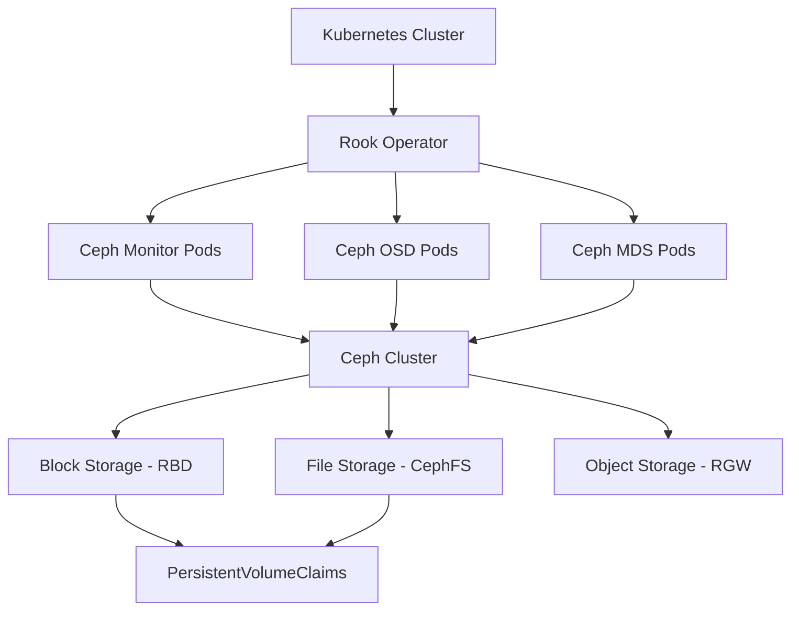
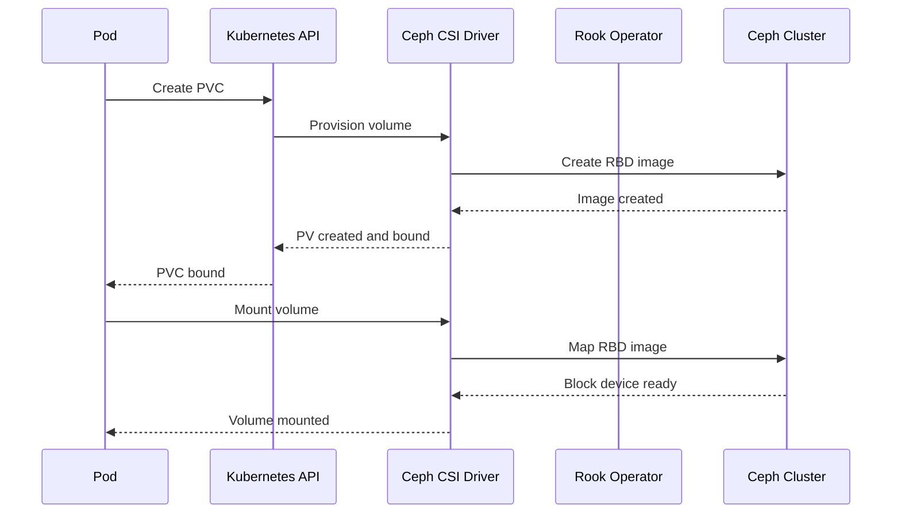

# How to Set Up Ceph Storage for Kubernetes with Rook

Author: [nawazdhandala](https://www.github.com/nawazdhandala)

Tags: Ceph, Kubernetes, Rook, Storage, Distributed

Description: Learn how to deploy Ceph distributed storage on Kubernetes using the Rook operator for persistent block and file storage.

---

Running stateful workloads on Kubernetes demands reliable persistent storage. Ceph is a battle-tested distributed storage system that provides block, object, and file storage in a single unified platform. Rook is the Kubernetes operator that makes deploying and managing Ceph on Kubernetes straightforward.

This guide walks through setting up Ceph on Kubernetes using Rook from start to finish.

## Architecture Overview

Before diving into the setup, let us look at how Rook and Ceph fit together in a Kubernetes cluster.



Rook runs as an operator inside your cluster. It deploys Ceph daemons as pods and manages their lifecycle automatically.

## Prerequisites

You need a Kubernetes cluster with at least three worker nodes. Each node should have an unformatted raw disk or partition available for Ceph OSDs (Object Storage Daemons).

```bash
# Verify your cluster nodes are ready
kubectl get nodes -o wide

# Check for available raw disks on each node
# SSH into each node and run:
lsblk -f
# Look for disks without a filesystem (FSTYPE column empty)
```

## Step 1: Deploy the Rook Operator

Start by deploying the Rook operator using the official Helm chart.

```bash
# Add the Rook Helm repository
helm repo add rook-release https://charts.rook.io/release
helm repo update

# Create the rook-ceph namespace
kubectl create namespace rook-ceph

# Install the Rook operator
helm install --namespace rook-ceph rook-ceph rook-release/rook-ceph \
  --set csi.enableRbdDriver=true \
  --set csi.enableCephfsDriver=true

# Wait for the operator pod to be ready
kubectl -n rook-ceph wait --for=condition=ready pod \
  -l app=rook-ceph-operator --timeout=300s
```

## Step 2: Create the Ceph Cluster

With the operator running, create a CephCluster custom resource.

```yaml
# ceph-cluster.yaml
# Defines the Ceph cluster configuration for Rook
apiVersion: ceph.rook.io/v1
kind: CephCluster
metadata:
  name: rook-ceph
  namespace: rook-ceph
spec:
  cephVersion:
    # Use the latest stable Ceph release
    image: quay.io/ceph/ceph:v18.2
  dataDirHostPath: /var/lib/rook
  mon:
    # Run 3 monitors for high availability
    count: 3
    allowMultiplePerNode: false
  mgr:
    count: 2
    modules:
      - name: pg_autoscaler
        enabled: true
  dashboard:
    enabled: true
    port: 8443
    ssl: true
  storage:
    # Use all available devices on all nodes
    useAllNodes: true
    useAllDevices: true
    config:
      osdsPerDevice: "1"
  resources:
    mon:
      limits:
        memory: "2Gi"
      requests:
        memory: "1Gi"
        cpu: "500m"
    osd:
      limits:
        memory: "4Gi"
      requests:
        memory: "2Gi"
        cpu: "500m"
```

```bash
# Apply the cluster configuration
kubectl apply -f ceph-cluster.yaml

# Monitor the cluster creation progress
kubectl -n rook-ceph get pods -w
```

## Step 3: Create a Block Storage Pool and StorageClass

Block storage (RBD) is the most common storage type used with Kubernetes.

```yaml
# block-pool.yaml
# Creates a replicated pool with 3 copies of data
apiVersion: ceph.rook.io/v1
kind: CephBlockPool
metadata:
  name: replicapool
  namespace: rook-ceph
spec:
  failureDomain: host
  replicated:
    # Store 3 copies across different hosts
    size: 3
    requireSafeReplicaSize: true
---
# storage-class.yaml
# StorageClass that provisions RBD volumes from the pool
apiVersion: storage.k8s.io/v1
kind: StorageClass
metadata:
  name: rook-ceph-block
provisioner: rook-ceph.rbd.csi.ceph.com
parameters:
  clusterID: rook-ceph
  pool: replicapool
  imageFormat: "2"
  imageFeatures: layering
  csi.storage.k8s.io/provisioner-secret-name: rook-csi-rbd-provisioner
  csi.storage.k8s.io/provisioner-secret-namespace: rook-ceph
  csi.storage.k8s.io/node-stage-secret-name: rook-csi-rbd-node
  csi.storage.k8s.io/node-stage-secret-namespace: rook-ceph
  csi.storage.k8s.io/fstype: ext4
reclaimPolicy: Delete
allowVolumeExpansion: true
```

```bash
# Apply pool and storage class
kubectl apply -f block-pool.yaml
```

## Step 4: Create a CephFS Filesystem

CephFS provides shared file storage that multiple pods can mount simultaneously.

```yaml
# cephfs.yaml
# Shared filesystem accessible by multiple pods at once
apiVersion: ceph.rook.io/v1
kind: CephFilesystem
metadata:
  name: ceph-filesystem
  namespace: rook-ceph
spec:
  metadataPool:
    replicated:
      size: 3
  dataPools:
    - name: data0
      replicated:
        size: 3
  metadataServer:
    # Run 2 MDS instances for high availability
    activeCount: 1
    activeStandby: true
```

## Step 5: Test with a Sample Application

```yaml
# test-pvc.yaml
# Create a PVC to verify the storage is working
apiVersion: v1
kind: PersistentVolumeClaim
metadata:
  name: ceph-test-pvc
spec:
  accessModes:
    - ReadWriteOnce
  storageClassName: rook-ceph-block
  resources:
    requests:
      storage: 5Gi
---
# test-pod.yaml
# Pod that writes data to the Ceph volume
apiVersion: v1
kind: Pod
metadata:
  name: ceph-test-pod
spec:
  containers:
    - name: test
      image: busybox
      command: ["sh", "-c", "echo 'Ceph storage works' > /data/test.txt && cat /data/test.txt && sleep 3600"]
      volumeMounts:
        - name: ceph-vol
          mountPath: /data
  volumes:
    - name: ceph-vol
      persistentVolumeClaim:
        claimName: ceph-test-pvc
```

```bash
# Deploy the test workload
kubectl apply -f test-pvc.yaml

# Verify the PVC is bound
kubectl get pvc ceph-test-pvc

# Check the pod logs to confirm the write succeeded
kubectl logs ceph-test-pod
```

## Verifying Cluster Health

Use the Rook toolbox to run Ceph commands directly.

```bash
# Deploy the Rook toolbox pod
kubectl apply -f https://raw.githubusercontent.com/rook/rook/release-1.14/deploy/examples/toolbox.yaml

# Check overall cluster status
kubectl -n rook-ceph exec deploy/rook-ceph-tools -- ceph status

# View OSD status
kubectl -n rook-ceph exec deploy/rook-ceph-tools -- ceph osd status

# Check pool usage
kubectl -n rook-ceph exec deploy/rook-ceph-tools -- ceph df
```

## Data Flow

Here is how a pod request for storage flows through the system.



## Common Pitfalls

Watch out for these issues when running Ceph on Kubernetes:

- Make sure raw disks have no existing filesystem or partition table. Rook will skip disks that are already formatted.
- Set resource requests and limits appropriately. Ceph OSDs are memory-intensive and can get OOM-killed if limits are too low.
- Never run more monitors than you have failure domains. Three monitors across three nodes is the standard.
- Enable the pg_autoscaler module to avoid manual placement group tuning.

## Conclusion

Rook makes running Ceph on Kubernetes practical and manageable. You get enterprise-grade distributed storage without leaving the Kubernetes ecosystem. The combination of block storage for databases, shared filesystems for multi-pod workloads, and object storage for backups covers most storage needs.

For monitoring your Ceph cluster and the applications that depend on it, [OneUptime](https://oneuptime.com) provides unified observability with alerts, dashboards, and status pages so you can catch storage issues before they affect your users.
