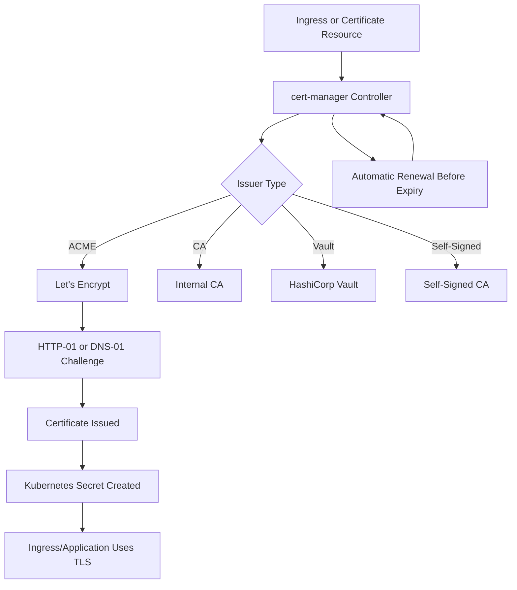
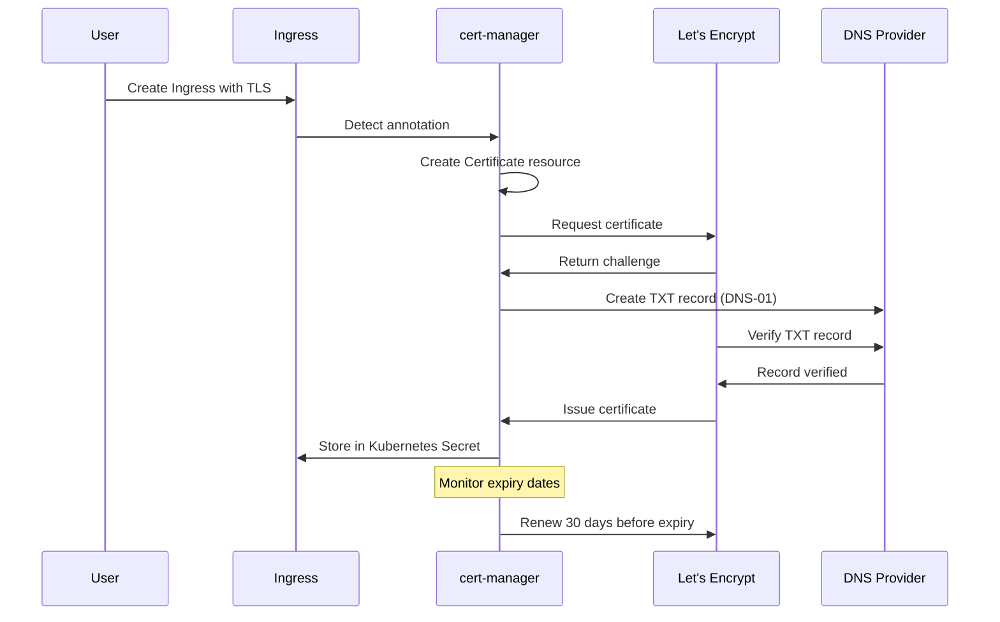

# How to Automate TLS Certificates with cert-manager on Kubernetes

Author: [nawazdhandala](https://www.github.com/nawazdhandala)

Tags: cert-manager, TLS, Kubernetes, Let's Encrypt, Certificates

Description: Step-by-step guide to automating TLS certificate management on Kubernetes with cert-manager and Let's Encrypt.

---

## Why Automate TLS Certificates?

Managing TLS certificates manually is error-prone and risky. Expired certificates cause outages. Manually renewing certificates across dozens of services does not scale. cert-manager is a Kubernetes-native solution that automates the issuance, renewal, and management of TLS certificates from various sources including Let's Encrypt, HashiCorp Vault, and self-signed CAs.

## How cert-manager Works



cert-manager watches for Certificate resources and Ingress annotations. When it detects a request for a certificate, it communicates with the configured issuer to obtain the certificate, stores it as a Kubernetes Secret, and renews it automatically before expiry.

## Installing cert-manager

```bash
# Install cert-manager using kubectl
# This installs the CRDs, controller, webhook, and cainjector
kubectl apply -f https://github.com/cert-manager/cert-manager/releases/download/v1.14.0/cert-manager.yaml

# Alternatively, install with Helm for more configuration options
helm repo add jetstack https://charts.jetstack.io
helm repo update

# Install cert-manager with CRDs included
helm install cert-manager jetstack/cert-manager \
  --namespace cert-manager \
  --create-namespace \
  --set crds.enabled=true \
  --set prometheus.enabled=true \
  --set webhook.timeoutSeconds=30

# Verify the installation
# All three pods should be running
kubectl get pods -n cert-manager

# Check that the CRDs are installed
kubectl get crds | grep cert-manager
```

## Creating a Let's Encrypt Issuer

```yaml
# letsencrypt-staging-issuer.yaml
# Start with the staging issuer for testing
# The staging server has higher rate limits and issues test certificates
apiVersion: cert-manager.io/v1
kind: ClusterIssuer
metadata:
  name: letsencrypt-staging
spec:
  acme:
    # The staging ACME server URL
    server: https://acme-staging-v02.api.letsencrypt.org/directory
    # Email address for certificate notifications
    email: admin@example.com
    # Secret to store the ACME account private key
    privateKeySecretRef:
      name: letsencrypt-staging-account-key
    # Use HTTP-01 challenge solver
    solvers:
      - http01:
          ingress:
            class: nginx                   # Your ingress controller class
---
# letsencrypt-production-issuer.yaml
# Use this for production certificates after testing with staging
apiVersion: cert-manager.io/v1
kind: ClusterIssuer
metadata:
  name: letsencrypt-production
spec:
  acme:
    # The production ACME server URL
    server: https://acme-v02.api.letsencrypt.org/directory
    email: admin@example.com
    privateKeySecretRef:
      name: letsencrypt-production-account-key
    solvers:
      - http01:
          ingress:
            class: nginx
```

```bash
# Apply the issuers
kubectl apply -f letsencrypt-staging-issuer.yaml
kubectl apply -f letsencrypt-production-issuer.yaml

# Check the issuer status
# The Ready condition should be True
kubectl get clusterissuer
kubectl describe clusterissuer letsencrypt-production
```

## Requesting a Certificate via Ingress Annotation

The simplest way to get TLS certificates is through Ingress annotations.

```yaml
# ingress-with-tls.yaml
# cert-manager automatically creates a Certificate resource
# when it sees the annotation on an Ingress
apiVersion: networking.k8s.io/v1
kind: Ingress
metadata:
  name: app-ingress
  namespace: default
  annotations:
    # Tell cert-manager which issuer to use
    cert-manager.io/cluster-issuer: letsencrypt-production
    # Optional: force HTTPS redirect
    nginx.ingress.kubernetes.io/ssl-redirect: "true"
spec:
  ingressClassName: nginx
  tls:
    - hosts:
        - app.example.com                  # Domain for the certificate
        - api.example.com                  # Multiple domains supported
      secretName: app-tls-secret           # Secret to store the certificate
  rules:
    - host: app.example.com
      http:
        paths:
          - path: /
            pathType: Prefix
            backend:
              service:
                name: app-service
                port:
                  number: 80
    - host: api.example.com
      http:
        paths:
          - path: /
            pathType: Prefix
            backend:
              service:
                name: api-service
                port:
                  number: 80
```

## Requesting a Certificate Directly

For more control, create a Certificate resource explicitly.

```yaml
# certificate.yaml
# Explicitly request a certificate with custom options
apiVersion: cert-manager.io/v1
kind: Certificate
metadata:
  name: app-certificate
  namespace: default
spec:
  # Secret where the certificate will be stored
  secretName: app-tls-secret
  # Certificate duration (default is 90 days for Let's Encrypt)
  duration: 2160h                          # 90 days
  # Renew 30 days before expiry
  renewBefore: 720h                        # 30 days
  # Subject fields
  subject:
    organizations:
      - "My Organization"
  # Private key settings
  privateKey:
    algorithm: ECDSA                       # Use ECDSA for smaller, faster keys
    size: 256
  # DNS names for the certificate
  dnsNames:
    - app.example.com
    - api.example.com
    - "*.staging.example.com"              # Wildcard requires DNS-01 challenge
  # Which issuer to use
  issuerRef:
    name: letsencrypt-production
    kind: ClusterIssuer
    group: cert-manager.io
```

## DNS-01 Challenge for Wildcard Certificates

Wildcard certificates require the DNS-01 challenge type. This involves creating a DNS TXT record to prove domain ownership.

```yaml
# dns01-issuer.yaml
# ClusterIssuer with DNS-01 challenge using Cloudflare
apiVersion: cert-manager.io/v1
kind: ClusterIssuer
metadata:
  name: letsencrypt-dns
spec:
  acme:
    server: https://acme-v02.api.letsencrypt.org/directory
    email: admin@example.com
    privateKeySecretRef:
      name: letsencrypt-dns-account-key
    solvers:
      - dns01:
          cloudflare:
            email: admin@example.com
            # API token stored in a Kubernetes Secret
            apiTokenSecretRef:
              name: cloudflare-api-token
              key: api-token
---
# Secret containing the Cloudflare API token
apiVersion: v1
kind: Secret
metadata:
  name: cloudflare-api-token
  namespace: cert-manager
type: Opaque
stringData:
  # Create a Cloudflare API token with DNS edit permissions
  api-token: "your-cloudflare-api-token-here"
```

## Certificate Lifecycle



## Troubleshooting

```bash
# Check certificate status
# Look for the Ready condition and any events
kubectl get certificate -A
kubectl describe certificate app-certificate

# Check the certificate request
kubectl get certificaterequest -A
kubectl describe certificaterequest <name>

# Check the ACME order and challenges
kubectl get order -A
kubectl get challenge -A

# View cert-manager logs for debugging
kubectl logs -n cert-manager deploy/cert-manager -f

# Verify the generated certificate
kubectl get secret app-tls-secret -o jsonpath='{.data.tls\.crt}' | \
  base64 -d | openssl x509 -text -noout

# Check certificate expiry dates across all namespaces
kubectl get certificates -A -o custom-columns=\
  'NAMESPACE:.metadata.namespace,NAME:.metadata.name,READY:.status.conditions[0].status,EXPIRY:.status.notAfter'
```

## Best Practices

- Always start with the Let's Encrypt staging server to avoid rate limits during testing.
- Use ClusterIssuers for organization-wide certificate issuance, and namespace-scoped Issuers for team-specific configurations.
- Set renewBefore to at least 30 days to give plenty of time for renewal.
- Monitor certificate expiry with Prometheus metrics exposed by cert-manager.
- Use ECDSA keys instead of RSA for better performance and smaller certificates.
- Keep the cert-manager webhook available at all times. It validates Certificate resources.

## Monitoring with OneUptime

Certificate expiration is one of the most common causes of outages. OneUptime (https://oneuptime.com) monitors your TLS certificates and alerts you before they expire. By combining cert-manager automation with OneUptime monitoring, you get a defense-in-depth approach to certificate management. Even if cert-manager fails to renew a certificate, OneUptime will catch the upcoming expiration and alert your team, preventing costly downtime.
