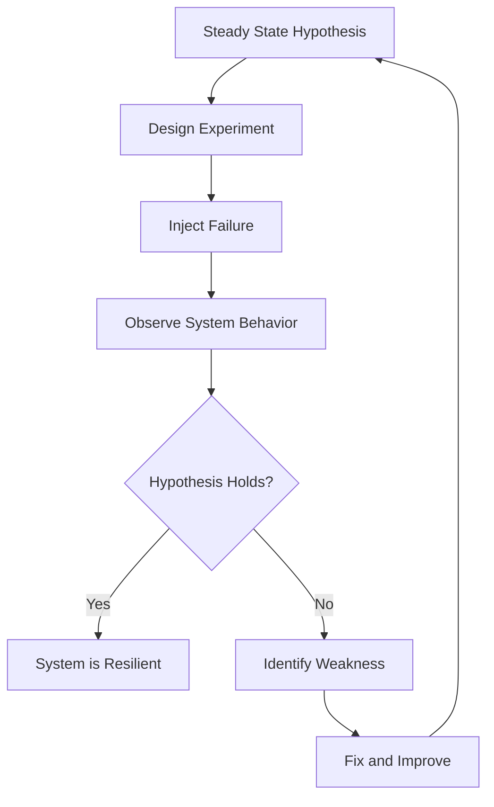
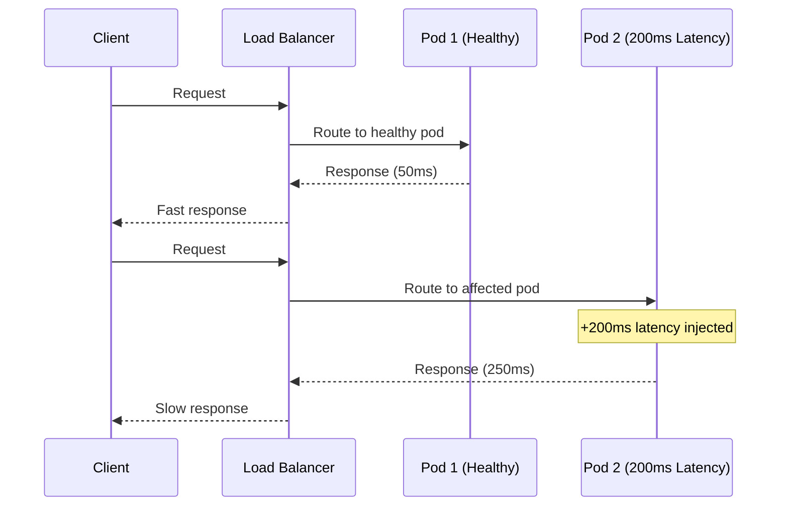
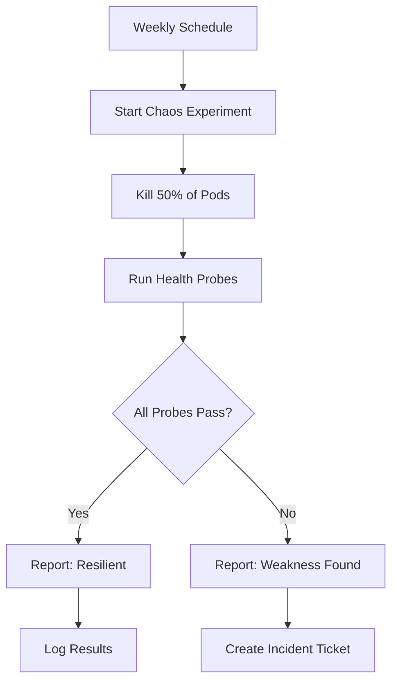

# How to Practice Chaos Engineering on Kubernetes

Author: [nawazdhandala](https://www.github.com/nawazdhandala)

Tags: Chaos Engineering, Kubernetes, Resilience, Litmus Chaos, Testing

Description: Learn how to practice chaos engineering on Kubernetes using Litmus Chaos to test and improve system resilience.

---

Chaos engineering is the practice of deliberately injecting failures into your system to find weaknesses before they cause outages. On Kubernetes, this means killing pods, introducing network latency, filling up disk space, and stressing CPU - all in a controlled way. This guide walks you through practicing chaos engineering with Litmus Chaos on Kubernetes.

## Why Chaos Engineering

You build redundancy into your systems, but do you know it actually works? Auto-scaling policies, health checks, retry logic, and circuit breakers all sound great on paper. Chaos engineering proves they work when things go wrong.



## The Chaos Engineering Process

1. **Define steady state**: What does "normal" look like? Response time under 200ms, error rate below 0.1%, all pods healthy.
2. **Form a hypothesis**: "If we kill one pod, the service will recover within 30 seconds with no user-facing errors."
3. **Inject failure**: Kill the pod, add network latency, or stress the CPU.
4. **Observe**: Watch metrics, logs, and alerts. Did the system behave as expected?
5. **Learn**: If the hypothesis held, increase the blast radius. If not, fix the weakness and re-test.

## Installing Litmus Chaos

Litmus Chaos is a Kubernetes-native chaos engineering framework. Install it with Helm.

```bash
# Add the Litmus Helm repository
helm repo add litmuschaos https://litmuschaos.github.io/litmus-helm/
helm repo update

# Install Litmus in its own namespace
kubectl create namespace litmus

helm install litmus litmuschaos/litmus \
  --namespace litmus \
  --set portal.frontend.service.type=ClusterIP
```

Install the chaos experiments for your target namespace:

```bash
# Install generic Kubernetes chaos experiments
kubectl apply -f https://hub.litmuschaos.io/api/chaos/3.0.0?file=charts/generic/experiments.yaml \
  -n your-app-namespace
```

## Pod Delete Experiment

The most basic chaos experiment: kill a pod and verify the service recovers.

```yaml
# pod-delete-experiment.yaml
# This ChaosEngine resource tells Litmus what to test and how

apiVersion: litmuschaos.io/v1alpha1
kind: ChaosEngine
metadata:
  name: pod-delete-test
  namespace: your-app-namespace
spec:
  # The deployment to target
  appinfo:
    appns: your-app-namespace
    applabel: "app=api-server"
    appkind: deployment

  # Run the experiment once
  engineState: active
  chaosServiceAccount: litmus-admin

  experiments:
    - name: pod-delete
      spec:
        components:
          env:
            # How many pods to kill
            - name: TOTAL_CHAOS_DURATION
              value: "30"

            # Kill pods every 10 seconds
            - name: CHAOS_INTERVAL
              value: "10"

            # Force kill without graceful shutdown
            - name: FORCE
              value: "false"

            # Number of pods to target
            - name: PODS_AFFECTED_PERC
              value: "50"
```

```bash
# Apply the experiment
kubectl apply -f pod-delete-experiment.yaml

# Watch the chaos engine status
kubectl get chaosengine pod-delete-test -n your-app-namespace -w

# Check the result
kubectl get chaosresult pod-delete-test-pod-delete -n your-app-namespace -o yaml
```

## Network Chaos Experiment

Simulate network issues: latency, packet loss, and DNS failures.

```yaml
# network-chaos-experiment.yaml
# Inject network latency into pods matching the label selector

apiVersion: litmuschaos.io/v1alpha1
kind: ChaosEngine
metadata:
  name: network-latency-test
  namespace: your-app-namespace
spec:
  appinfo:
    appns: your-app-namespace
    applabel: "app=api-server"
    appkind: deployment
  engineState: active
  chaosServiceAccount: litmus-admin

  experiments:
    - name: pod-network-latency
      spec:
        components:
          env:
            # Add 200ms of latency to all network traffic
            - name: NETWORK_LATENCY
              value: "200"

            # Duration of the chaos experiment
            - name: TOTAL_CHAOS_DURATION
              value: "60"

            # Target container name within the pod
            - name: TARGET_CONTAINER
              value: "api-server"

            # Network interface to target
            - name: NETWORK_INTERFACE
              value: "eth0"

            # Optional: only affect traffic to specific destinations
            - name: DESTINATION_IPS
              value: ""
```



## CPU Stress Experiment

Test how your application behaves when CPU is constrained.

```yaml
# cpu-stress-experiment.yaml
# Stress the CPU of target pods to test resource limits and autoscaling

apiVersion: litmuschaos.io/v1alpha1
kind: ChaosEngine
metadata:
  name: cpu-stress-test
  namespace: your-app-namespace
spec:
  appinfo:
    appns: your-app-namespace
    applabel: "app=api-server"
    appkind: deployment
  engineState: active
  chaosServiceAccount: litmus-admin

  experiments:
    - name: pod-cpu-hog
      spec:
        components:
          env:
            # Number of CPU cores to consume
            - name: CPU_CORES
              value: "2"

            # Duration in seconds
            - name: TOTAL_CHAOS_DURATION
              value: "60"

            # CPU load percentage per core
            - name: CPU_LOAD
              value: "80"

            # Percentage of matching pods to target
            - name: PODS_AFFECTED_PERC
              value: "50"
```

## Defining Probes for Validation

Probes let you automatically validate your steady state hypothesis during and after chaos experiments.

```yaml
# experiment-with-probes.yaml
# Pod delete experiment with automated validation probes

apiVersion: litmuschaos.io/v1alpha1
kind: ChaosEngine
metadata:
  name: pod-delete-with-probes
  namespace: your-app-namespace
spec:
  appinfo:
    appns: your-app-namespace
    applabel: "app=api-server"
    appkind: deployment
  engineState: active
  chaosServiceAccount: litmus-admin

  experiments:
    - name: pod-delete
      spec:
        # Probes validate the system during chaos
        probe:
          # HTTP probe checks that the API is responding
          - name: api-health-check
            type: httpProbe
            mode: Continuous
            httpProbe/inputs:
              url: "http://api-server.your-app-namespace.svc:8080/health"
              method:
                get:
                  criteria: "=="
                  responseCode: "200"
            runProperties:
              probeTimeout: 5
              interval: 5
              retry: 3

          # Command probe checks pod count
          - name: pod-count-check
            type: cmdProbe
            mode: Edge
            cmdProbe/inputs:
              command: "kubectl get pods -l app=api-server -n your-app-namespace --no-headers | grep Running | wc -l"
              comparator:
                type: int
                criteria: ">="
                value: "2"
            runProperties:
              probeTimeout: 10
              interval: 10
              retry: 3
```

## Scheduling Recurring Chaos

Run chaos experiments on a schedule to continuously validate resilience.

```yaml
# scheduled-chaos.yaml
# CronWorkflow for recurring chaos experiments

apiVersion: argoproj.io/v1alpha1
kind: CronWorkflow
metadata:
  name: weekly-pod-delete
  namespace: litmus
spec:
  # Run every Wednesday at 10 AM UTC
  schedule: "0 10 * * 3"
  timezone: "UTC"
  concurrencyPolicy: Forbid

  workflowSpec:
    entrypoint: chaos-test
    templates:
      - name: chaos-test
        steps:
          - - name: run-pod-delete
              template: pod-delete-step

      - name: pod-delete-step
        container:
          image: litmuschaos/litmus-checker:latest
          command: ["./checker"]
          args:
            - "-name=pod-delete"
            - "-namespace=your-app-namespace"
```



## Best Practices

1. **Start small**: Kill one pod before killing half your fleet.
2. **Run in staging first**: Validate experiments before running in production.
3. **Have a rollback plan**: Know how to stop the experiment instantly.
4. **Monitor during experiments**: Watch dashboards and alerts in real time.
5. **Schedule regular experiments**: Resilience is not a one-time test.
6. **Increase blast radius gradually**: Build confidence before testing larger failures.

## Summary

Chaos engineering proves that your Kubernetes infrastructure handles failure the way you expect. Start with simple pod deletions, add network and CPU chaos, and use probes to validate your hypotheses automatically. Schedule experiments regularly to catch regressions.

Use [OneUptime](https://oneuptime.com) to monitor your Kubernetes services during chaos experiments. Its alerting and incident management features help you track exactly how your system responds to injected failures and identify areas that need improvement.
