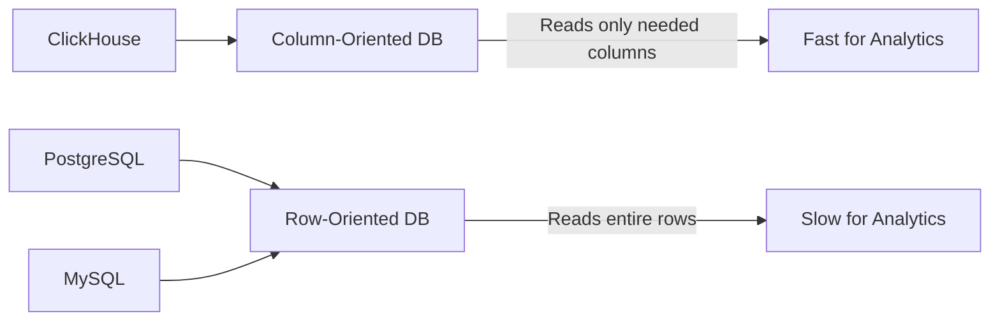
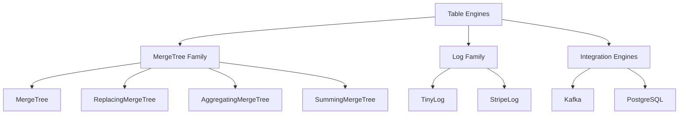
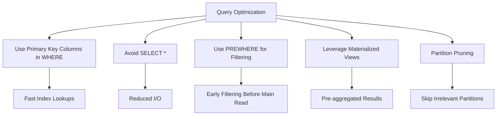

# How to Get Started with ClickHouse for Analytics

Author: [nawazdhandala](https://www.github.com/nawazdhandala)

Tags: ClickHouse, Analytics, OLAP, Database, Performance

Description: A beginner's guide to ClickHouse for analytics including table engines, data types, and query optimization.

---

## What is ClickHouse?

ClickHouse is a column-oriented analytical database management system (DBMS) designed for online analytical processing (OLAP). It was originally developed at Yandex and is now open source. ClickHouse can process billions of rows per second, making it one of the fastest analytical databases available.

Unlike traditional row-oriented databases such as PostgreSQL or MySQL, ClickHouse stores data by columns. This means that when you run a query that touches only a few columns out of many, ClickHouse reads only the data it needs. This design makes it exceptionally fast for analytical queries.

## How ClickHouse Differs from Traditional Databases



Column-oriented storage has several advantages for analytics:

- **Compression**: Similar values in a column compress much better than mixed values in a row.
- **Vectorized execution**: ClickHouse processes data in batches (vectors) rather than row by row.
- **Reduced I/O**: Only the columns referenced in the query are read from disk.

## Installing ClickHouse

You can install ClickHouse on most Linux distributions. Here is the quickest way to get started:

```bash
# Install ClickHouse on Ubuntu/Debian
# Add the official ClickHouse repository
sudo apt-get install -y apt-transport-https ca-certificates curl gnupg

# Add the GPG key for the repository
curl -fsSL https://packages.clickhouse.com/rpm/lts/repodata/repomd.xml.key | \
  sudo gpg --dearmor -o /usr/share/keyrings/clickhouse-keyring.gpg

# Add the repository to apt sources
echo "deb [signed-by=/usr/share/keyrings/clickhouse-keyring.gpg] \
  https://packages.clickhouse.com/deb stable main" | \
  sudo tee /etc/apt/sources.list.d/clickhouse.list

# Update and install ClickHouse server and client
sudo apt-get update
sudo apt-get install -y clickhouse-server clickhouse-client

# Start the ClickHouse server
sudo systemctl start clickhouse-server

# Verify the server is running
sudo systemctl status clickhouse-server
```

You can also run ClickHouse using Docker:

```bash
# Pull and run ClickHouse in Docker
# This maps port 8123 (HTTP) and 9000 (native) to the host
docker run -d \
  --name clickhouse-server \
  -p 8123:8123 \
  -p 9000:9000 \
  -v clickhouse-data:/var/lib/clickhouse \
  clickhouse/clickhouse-server:latest
```

## Understanding Table Engines

ClickHouse uses a concept called "table engines" that determine how data is stored, indexed, and queried. Choosing the right engine is critical for performance.



The **MergeTree** engine is the most commonly used. It supports:

- Primary key indexing for fast lookups
- Data partitioning for efficient data management
- Data replication for high availability
- Sampling for approximate query processing

## Creating Your First Table

```sql
-- Create a database for our analytics data
CREATE DATABASE IF NOT EXISTS analytics;

-- Create a table to store web events
-- Using MergeTree engine with partitioning by month
CREATE TABLE analytics.web_events
(
    event_id UUID DEFAULT generateUUIDv4(),    -- Unique event identifier
    event_time DateTime DEFAULT now(),          -- When the event occurred
    user_id UInt64,                             -- User identifier
    event_type String,                          -- Type of event (click, view, etc.)
    page_url String,                            -- URL of the page
    referrer String DEFAULT '',                 -- Referring URL
    country_code FixedString(2),                -- Two-letter country code
    device_type Enum8('desktop' = 1,            -- Device type enumeration
                      'mobile' = 2,
                      'tablet' = 3),
    session_duration UInt32,                    -- Session duration in seconds
    is_bounce UInt8 DEFAULT 0                   -- Whether the session was a bounce
)
ENGINE = MergeTree()                            -- Use the MergeTree engine
PARTITION BY toYYYYMM(event_time)               -- Partition data by month
ORDER BY (event_time, user_id)                  -- Sort data for fast range queries
TTL event_time + INTERVAL 12 MONTH             -- Auto-delete data after 12 months
SETTINGS index_granularity = 8192;              -- Number of rows per index entry
```

## Inserting Data

```sql
-- Insert sample data into the web_events table
INSERT INTO analytics.web_events
    (user_id, event_type, page_url, country_code, device_type, session_duration, is_bounce)
VALUES
    (1001, 'page_view', '/home', 'US', 'desktop', 120, 0),
    (1002, 'click', '/products', 'UK', 'mobile', 45, 0),
    (1003, 'page_view', '/about', 'DE', 'tablet', 10, 1),
    (1004, 'purchase', '/checkout', 'US', 'desktop', 300, 0),
    (1005, 'page_view', '/home', 'FR', 'mobile', 5, 1);

-- Insert data from a CSV file
-- ClickHouse supports many input formats
INSERT INTO analytics.web_events FORMAT CSVWithNames
-- (paste CSV data here or use clickhouse-client with --query and stdin)
```

## Running Analytical Queries

```sql
-- Count events by type in the last 7 days
-- ClickHouse processes this extremely fast due to columnar storage
SELECT
    event_type,
    count() AS event_count,
    uniq(user_id) AS unique_users
FROM analytics.web_events
WHERE event_time >= now() - INTERVAL 7 DAY
GROUP BY event_type
ORDER BY event_count DESC;

-- Calculate bounce rate by country
-- Using conditional aggregation for clean results
SELECT
    country_code,
    count() AS total_sessions,
    sum(is_bounce) AS bounced_sessions,
    round(sum(is_bounce) / count() * 100, 2) AS bounce_rate_pct
FROM analytics.web_events
GROUP BY country_code
HAVING total_sessions > 100
ORDER BY bounce_rate_pct DESC;

-- Get the 95th percentile of session duration by device type
-- ClickHouse has built-in quantile functions
SELECT
    device_type,
    quantile(0.5)(session_duration) AS median_duration,
    quantile(0.95)(session_duration) AS p95_duration,
    quantile(0.99)(session_duration) AS p99_duration
FROM analytics.web_events
GROUP BY device_type;
```

## Query Optimization Tips



Here are some practical optimization strategies:

1. **Always filter on primary key columns first.** ClickHouse can skip large blocks of data when filters match the primary key order.
2. **Use PREWHERE instead of WHERE for selective filters.** PREWHERE reads only the filter columns first, then reads remaining columns only for matching rows.
3. **Avoid SELECT * in production queries.** Always specify only the columns you need.
4. **Use approximate functions when exact results are not required.** Functions like `uniqHLL12` are much faster than exact `uniq`.

```sql
-- Example: Using PREWHERE for better performance
-- PREWHERE reads country_code first, then reads other columns
-- only for rows that match
SELECT
    event_type,
    count() AS cnt
FROM analytics.web_events
PREWHERE country_code = 'US'
WHERE event_time >= '2026-01-01'
GROUP BY event_type;
```

## Data Types Reference

| Data Type | Description | Example |
|-----------|-------------|---------|
| UInt8, UInt16, UInt32, UInt64 | Unsigned integers | 255, 65535 |
| Int8, Int16, Int32, Int64 | Signed integers | -128 to 127 |
| Float32, Float64 | Floating point numbers | 3.14 |
| String | Variable-length string | 'hello' |
| FixedString(N) | Fixed-length string | 'US' |
| DateTime | Date and time (second precision) | '2026-02-20 12:00:00' |
| DateTime64(3) | Date and time (millisecond precision) | '2026-02-20 12:00:00.123' |
| UUID | Universally unique identifier | generateUUIDv4() |
| Enum8/Enum16 | Enumerated types | 'desktop', 'mobile' |
| Array(T) | Array of type T | [1, 2, 3] |
| Map(K, V) | Key-value map | {'key': 'value'} |

## Monitoring with OneUptime

When running ClickHouse in production, monitoring query performance, replication lag, and resource utilization is critical. OneUptime (https://oneuptime.com) provides comprehensive infrastructure monitoring that can track your ClickHouse cluster health, alert you when query latency exceeds thresholds, and help you maintain high availability for your analytical workloads. By integrating ClickHouse metrics with OneUptime, you get a single pane of glass for your entire observability stack.
