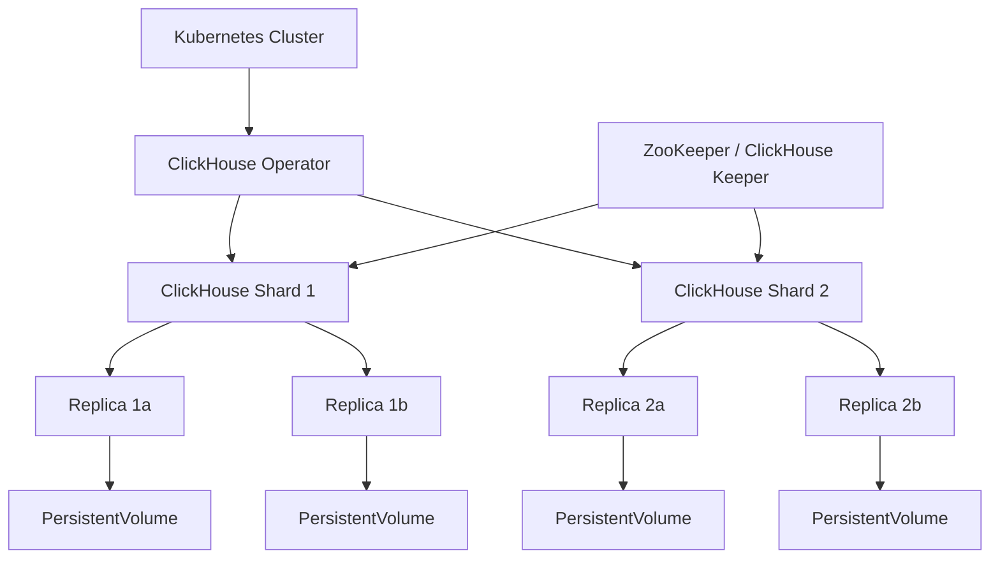
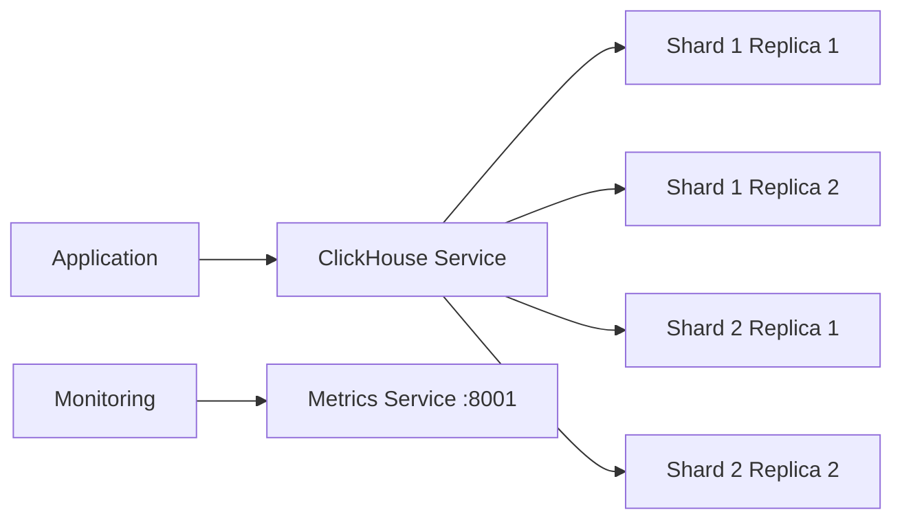

# How to Deploy ClickHouse on Kubernetes

Author: [nawazdhandala](https://www.github.com/nawazdhandala)

Tags: ClickHouse, Kubernetes, Deployment, StatefulSet, Analytics

Description: Learn how to deploy ClickHouse on Kubernetes using the ClickHouse Operator for scalable analytical workloads.

---

## Why Run ClickHouse on Kubernetes?

Running ClickHouse on Kubernetes gives you the ability to scale your analytical database alongside your application workloads. Kubernetes provides automated scheduling, self-healing, and declarative configuration that simplify ClickHouse operations. However, deploying a stateful system like ClickHouse requires careful planning around storage, networking, and resource allocation.

## Architecture Overview



The ClickHouse Operator manages the lifecycle of ClickHouse clusters on Kubernetes. It handles:

- Creating and scaling shards and replicas
- Managing configuration changes
- Rolling updates without downtime
- Automatic schema propagation

## Prerequisites

Before deploying ClickHouse on Kubernetes, make sure you have:

- A Kubernetes cluster (v1.25 or later)
- kubectl configured to access your cluster
- A StorageClass that supports dynamic provisioning
- At least 8 GB of RAM per ClickHouse node

```bash
# Verify your cluster is ready
# Check that nodes are in Ready state
kubectl get nodes

# Verify a StorageClass is available
# You need dynamic provisioning for PersistentVolumeClaims
kubectl get storageclass
```

## Installing the ClickHouse Operator

The Altinity ClickHouse Operator is the most mature operator for running ClickHouse on Kubernetes.

```bash
# Create a namespace for ClickHouse
kubectl create namespace clickhouse

# Install the ClickHouse Operator
# This deploys the operator CRDs and controller
kubectl apply -f https://raw.githubusercontent.com/Altinity/clickhouse-operator/master/deploy/operator/clickhouse-operator-install-bundle.yaml

# Verify the operator is running
kubectl get pods -n kube-system | grep clickhouse-operator
```

## Deploying ClickHouse Keeper

ClickHouse Keeper is a lightweight alternative to ZooKeeper for coordinating replicated tables.

```yaml
# clickhouse-keeper.yaml
# Deploys a 3-node ClickHouse Keeper ensemble for coordination
apiVersion: apps/v1
kind: StatefulSet
metadata:
  name: clickhouse-keeper
  namespace: clickhouse
spec:
  serviceName: clickhouse-keeper
  replicas: 3                              # 3 nodes for quorum
  selector:
    matchLabels:
      app: clickhouse-keeper
  template:
    metadata:
      labels:
        app: clickhouse-keeper
    spec:
      containers:
        - name: clickhouse-keeper
          image: clickhouse/clickhouse-keeper:latest
          ports:
            - containerPort: 9181           # Keeper client port
              name: client
            - containerPort: 9234           # Keeper raft port
              name: raft
          volumeMounts:
            - name: keeper-data
              mountPath: /var/lib/clickhouse-keeper
          resources:
            requests:
              memory: "512Mi"              # Minimum memory for Keeper
              cpu: "250m"
            limits:
              memory: "1Gi"
              cpu: "500m"
  volumeClaimTemplates:
    - metadata:
        name: keeper-data
      spec:
        accessModes: ["ReadWriteOnce"]
        storageClassName: standard          # Use your StorageClass
        resources:
          requests:
            storage: 10Gi                   # Storage for coordination logs
---
# Headless service for Keeper pod discovery
apiVersion: v1
kind: Service
metadata:
  name: clickhouse-keeper
  namespace: clickhouse
spec:
  clusterIP: None                           # Headless for StatefulSet DNS
  ports:
    - port: 9181
      name: client
    - port: 9234
      name: raft
  selector:
    app: clickhouse-keeper
```

```bash
# Apply the Keeper configuration
kubectl apply -f clickhouse-keeper.yaml

# Wait for all Keeper pods to be ready
kubectl rollout status statefulset/clickhouse-keeper -n clickhouse
```

## Deploying the ClickHouse Cluster

```yaml
# clickhouse-cluster.yaml
# Defines a 2-shard, 2-replica ClickHouse cluster
apiVersion: "clickhouse.altinity.com/v1"
kind: "ClickHouseInstallation"
metadata:
  name: analytics-cluster
  namespace: clickhouse
spec:
  configuration:
    zookeeper:
      nodes:
        - host: clickhouse-keeper-0.clickhouse-keeper.clickhouse.svc.cluster.local
          port: 9181
        - host: clickhouse-keeper-1.clickhouse-keeper.clickhouse.svc.cluster.local
          port: 9181
        - host: clickhouse-keeper-2.clickhouse-keeper.clickhouse.svc.cluster.local
          port: 9181
    clusters:
      - name: analytics
        layout:
          shardsCount: 2                    # 2 shards for horizontal scaling
          replicasCount: 2                  # 2 replicas per shard for HA
    settings:
      max_memory_usage: "4000000000"        # 4 GB max memory per query
      max_threads: "4"                      # Max threads per query
      max_execution_time: "60"              # Max query execution time in seconds
    profiles:
      default/max_memory_usage: "4000000000"
      default/max_execution_time: "60"
    users:
      analytics/password: "secure-password" # Create an analytics user
      analytics/networks/ip: "::/0"         # Allow connections from anywhere
      analytics/profile: "default"
  defaults:
    templates:
      podTemplate: clickhouse-pod
      dataVolumeClaimTemplate: data-volume
  templates:
    podTemplates:
      - name: clickhouse-pod
        spec:
          containers:
            - name: clickhouse
              image: clickhouse/clickhouse-server:latest
              resources:
                requests:
                  memory: "4Gi"             # Minimum memory per pod
                  cpu: "1"
                limits:
                  memory: "8Gi"             # Maximum memory per pod
                  cpu: "2"
    volumeClaimTemplates:
      - name: data-volume
        spec:
          accessModes: ["ReadWriteOnce"]
          storageClassName: standard        # Use your StorageClass
          resources:
            requests:
              storage: 100Gi               # Storage per ClickHouse pod
```

```bash
# Deploy the ClickHouse cluster
kubectl apply -f clickhouse-cluster.yaml

# Watch the cluster come up
# The operator creates StatefulSets for each shard-replica combination
kubectl get pods -n clickhouse -w

# Check the ClickHouseInstallation status
kubectl get chi -n clickhouse
```

## Service and Networking



The operator automatically creates services for accessing the cluster:

```bash
# List all services created by the operator
kubectl get svc -n clickhouse

# The main service for client connections
# Format: clickhouse-<installation-name>
# This load-balances across all replicas
kubectl get svc clickhouse-analytics-cluster -n clickhouse

# Connect to ClickHouse using the client
kubectl exec -it chi-analytics-cluster-analytics-0-0-0 -n clickhouse -- \
  clickhouse-client --query "SELECT version()"
```

## Creating a Distributed Table

```sql
-- Create a local table on each shard
-- This table stores data physically on each node
CREATE TABLE analytics.events_local ON CLUSTER analytics
(
    event_time DateTime,
    event_type String,
    user_id UInt64,
    payload String
)
ENGINE = ReplicatedMergeTree(
    '/clickhouse/tables/{shard}/events',    -- ZooKeeper path with shard macro
    '{replica}'                              -- Replica identifier macro
)
PARTITION BY toYYYYMM(event_time)
ORDER BY (event_time, user_id);

-- Create a distributed table that spans all shards
-- Queries on this table are automatically distributed
CREATE TABLE analytics.events ON CLUSTER analytics
(
    event_time DateTime,
    event_type String,
    user_id UInt64,
    payload String
)
ENGINE = Distributed(
    'analytics',                             -- Cluster name
    'analytics',                             -- Database name
    'events_local',                          -- Local table name
    rand()                                   -- Sharding key (random distribution)
);
```

## Health Checks and Monitoring

```bash
# Check cluster health by querying system tables
kubectl exec -it chi-analytics-cluster-analytics-0-0-0 -n clickhouse -- \
  clickhouse-client --query "
    SELECT
        hostname() AS host,
        uptime() AS uptime_seconds,
        formatReadableSize(totalBytesOfMergeTreeTables()) AS total_data
  "

# Check replication status across the cluster
kubectl exec -it chi-analytics-cluster-analytics-0-0-0 -n clickhouse -- \
  clickhouse-client --query "
    SELECT
        database,
        table,
        is_leader,
        total_replicas,
        active_replicas
    FROM system.replicas
    FORMAT Pretty
  "
```

## Scaling the Cluster

```bash
# To add more shards, update the ClickHouseInstallation spec
# Change shardsCount from 2 to 3 and reapply
kubectl edit chi analytics-cluster -n clickhouse

# The operator handles:
# 1. Creating new StatefulSets for new shards
# 2. Creating new PersistentVolumeClaims
# 3. Updating the cluster configuration
# 4. Restarting pods with new settings

# Monitor the scaling process
kubectl get pods -n clickhouse -w
```

## Production Considerations

When running ClickHouse on Kubernetes in production, keep these points in mind:

- **Use dedicated nodes** for ClickHouse pods with node affinity rules to avoid noisy neighbors.
- **Set resource requests and limits carefully.** ClickHouse is memory-intensive and can consume all available RAM.
- **Use local SSDs or high-IOPS storage classes.** ClickHouse performance depends heavily on disk I/O.
- **Configure pod disruption budgets** to prevent too many replicas from going down during maintenance.
- **Enable monitoring** through Prometheus metrics endpoints exposed by ClickHouse.

## Monitoring with OneUptime

Running ClickHouse on Kubernetes adds operational complexity that requires robust monitoring. OneUptime (https://oneuptime.com) provides end-to-end observability for your ClickHouse clusters on Kubernetes. You can monitor pod health, query latency, replication lag, and storage utilization from a single dashboard. OneUptime alerts help you catch issues like slow queries, disk pressure, or replica drift before they impact your analytical workloads.
