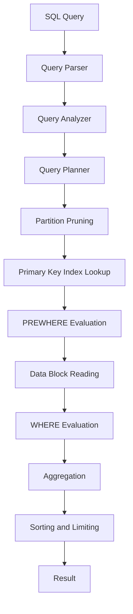
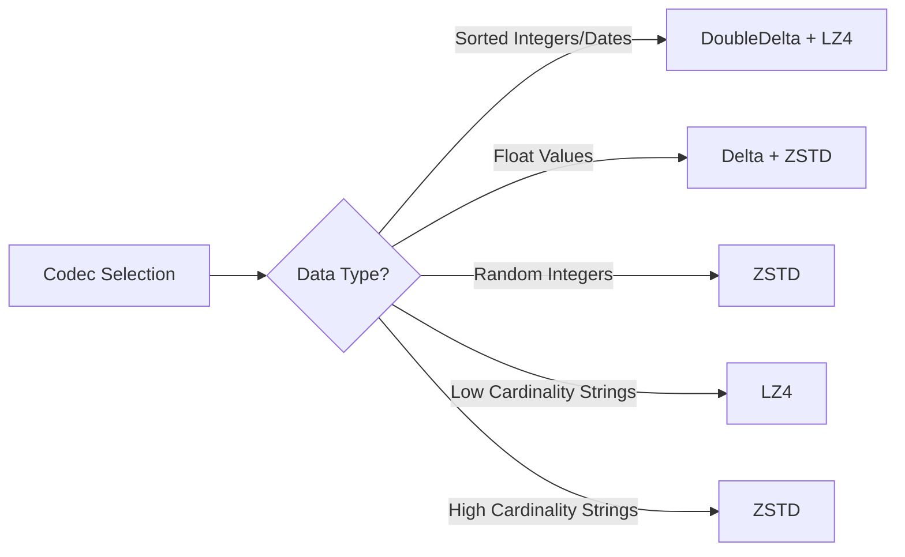

# How to Tune ClickHouse for Maximum Query Performance

Author: [nawazdhandala](https://www.github.com/nawazdhandala)

Tags: ClickHouse, Performance, Tuning, Optimization, Query

Description: Learn how to tune ClickHouse for maximum query performance including table design, compression, and materialized views.

---

## Why Performance Tuning Matters

ClickHouse is already one of the fastest analytical databases available. However, without proper tuning, you can leave significant performance on the table. The difference between a well-tuned and a poorly-tuned ClickHouse deployment can be orders of magnitude in query speed and storage efficiency. This guide covers practical techniques to squeeze maximum performance from your ClickHouse installation.

## The ClickHouse Query Pipeline

Understanding how ClickHouse processes a query helps you identify optimization opportunities.



Each stage in this pipeline offers tuning opportunities. Let us walk through them.

## Choosing the Right Primary Key

The primary key in ClickHouse is not a unique constraint. It defines the sort order of data on disk and determines how efficiently ClickHouse can skip data blocks during queries.

```sql
-- Bad: Primary key does not match common query patterns
-- If most queries filter by user_id first, this key is inefficient
CREATE TABLE events_bad
(
    event_time DateTime,
    user_id UInt64,
    event_type String,
    value Float64
)
ENGINE = MergeTree()
ORDER BY (event_time);                     -- Only event_time in key

-- Good: Primary key matches the most common query patterns
-- Queries filtering by user_id and time range will be fast
CREATE TABLE events_good
(
    event_time DateTime,
    user_id UInt64,
    event_type String,
    value Float64
)
ENGINE = MergeTree()
ORDER BY (user_id, event_time);            -- Matches query patterns

-- Even better: Use a compound key with low-cardinality columns first
-- This improves compression and index efficiency
CREATE TABLE events_best
(
    event_time DateTime,
    user_id UInt64,
    event_type LowCardinality(String),     -- Low cardinality optimization
    country LowCardinality(String),
    value Float64
)
ENGINE = MergeTree()
ORDER BY (country, event_type, user_id, event_time);
```

## Using LowCardinality for String Columns

LowCardinality is one of the most impactful optimizations in ClickHouse. It replaces string values with dictionary-encoded integers internally.

```sql
-- Compare storage and query performance
-- Without LowCardinality
CREATE TABLE logs_regular
(
    timestamp DateTime,
    level String,                          -- Stored as raw strings
    service String,
    message String
)
ENGINE = MergeTree()
ORDER BY timestamp;

-- With LowCardinality for columns with fewer than ~10,000 unique values
CREATE TABLE logs_optimized
(
    timestamp DateTime,
    level LowCardinality(String),          -- Only a few values: INFO, WARN, ERROR
    service LowCardinality(String),        -- Tens to hundreds of services
    message String                         -- High cardinality, keep as String
)
ENGINE = MergeTree()
ORDER BY (level, service, timestamp);

-- Check the compression improvement
SELECT
    column,
    formatReadableSize(data_compressed_bytes) AS compressed,
    formatReadableSize(data_uncompressed_bytes) AS uncompressed,
    round(data_uncompressed_bytes / data_compressed_bytes, 2) AS ratio
FROM system.columns
WHERE table = 'logs_optimized'
ORDER BY data_compressed_bytes DESC;
```

## Compression Codecs

ClickHouse supports multiple compression codecs. Choosing the right one for each column can dramatically reduce storage and improve query speed.

```sql
-- Apply different codecs based on data characteristics
CREATE TABLE metrics
(
    -- Timestamps are monotonically increasing within a partition
    -- DoubleDelta works great for sorted sequences
    timestamp DateTime CODEC(DoubleDelta, LZ4),

    -- Metric values often have small deltas between consecutive rows
    -- Delta encoding reduces the data before compression
    value Float64 CODEC(Delta, ZSTD(1)),

    -- Integer IDs with no particular pattern
    -- ZSTD provides good general compression
    metric_id UInt32 CODEC(ZSTD(3)),

    -- Low-cardinality strings are already dictionary-encoded
    -- LZ4 is fast and sufficient here
    host LowCardinality(String) CODEC(LZ4),

    -- High-cardinality strings benefit from ZSTD
    tags String CODEC(ZSTD(1))
)
ENGINE = MergeTree()
ORDER BY (metric_id, timestamp);
```



## Materialized Views for Pre-Aggregation

Materialized views in ClickHouse incrementally aggregate data as it is inserted. This avoids expensive full-table scans at query time.

```sql
-- Source table: raw page view events
CREATE TABLE page_views
(
    event_time DateTime,
    page_url String,
    user_id UInt64,
    load_time_ms UInt32
)
ENGINE = MergeTree()
ORDER BY (event_time);

-- Target table: stores pre-aggregated hourly statistics
CREATE TABLE page_views_hourly
(
    hour DateTime,                         -- Truncated to hour
    page_url String,
    view_count AggregateFunction(count),   -- Aggregate state for count
    unique_users AggregateFunction(uniq, UInt64),  -- Aggregate state for uniq
    avg_load_time AggregateFunction(avg, UInt32)   -- Aggregate state for avg
)
ENGINE = AggregatingMergeTree()            -- Engine that merges aggregate states
ORDER BY (hour, page_url);

-- Materialized view: automatically populates the target table
-- Every INSERT into page_views triggers this aggregation
CREATE MATERIALIZED VIEW page_views_hourly_mv
TO page_views_hourly
AS SELECT
    toStartOfHour(event_time) AS hour,
    page_url,
    countState() AS view_count,            -- Store aggregate state, not final value
    uniqState(user_id) AS unique_users,
    avgState(load_time_ms) AS avg_load_time
FROM page_views
GROUP BY hour, page_url;

-- Query the pre-aggregated data
-- Use *Merge combinators to finalize the aggregate states
SELECT
    hour,
    page_url,
    countMerge(view_count) AS views,
    uniqMerge(unique_users) AS users,
    avgMerge(avg_load_time) AS avg_load_ms
FROM page_views_hourly
WHERE hour >= now() - INTERVAL 24 HOUR
GROUP BY hour, page_url
ORDER BY views DESC;
```

## Partitioning Strategy

Choosing the right partition key affects both query performance and data management.

```sql
-- Monthly partitions work well for most time-series data
-- Each partition is stored as a separate directory on disk
CREATE TABLE events_monthly
(
    event_time DateTime,
    data String
)
ENGINE = MergeTree()
PARTITION BY toYYYYMM(event_time)          -- Monthly partitions
ORDER BY event_time;

-- For very high-volume tables, daily partitions may be better
-- This makes TTL cleanup and backups more granular
CREATE TABLE events_daily
(
    event_time DateTime,
    data String
)
ENGINE = MergeTree()
PARTITION BY toYYYYMMDD(event_time)        -- Daily partitions
ORDER BY event_time
TTL event_time + INTERVAL 30 DAY;          -- Auto-delete after 30 days

-- Check partition sizes to verify your strategy
SELECT
    partition,
    count() AS parts,
    formatReadableSize(sum(bytes_on_disk)) AS size,
    sum(rows) AS total_rows
FROM system.parts
WHERE table = 'events_monthly' AND active
GROUP BY partition
ORDER BY partition;
```

## Query-Level Tuning

```sql
-- Use PREWHERE for selective filters
-- PREWHERE reads filter columns first, reducing I/O
SELECT count()
FROM events
PREWHERE event_type = 'error'              -- Read event_type column first
WHERE event_time >= '2026-01-01';          -- Then filter on time

-- Use FINAL sparingly on ReplacingMergeTree tables
-- It forces deduplication at query time which is slow
-- Instead, use GROUP BY with argMax for better performance
SELECT
    user_id,
    argMax(email, updated_at) AS latest_email,
    argMax(name, updated_at) AS latest_name
FROM users
GROUP BY user_id;

-- Limit memory usage for large queries
-- This prevents a single query from consuming all RAM
SET max_memory_usage = 10000000000;        -- 10 GB limit
SET max_bytes_before_external_sort = 5000000000;  -- Spill to disk after 5 GB
```

## System Settings for Production

```xml
<!-- config.xml tuning for production deployments -->
<clickhouse>
    <profiles>
        <default>
            <!-- Maximum memory per query: 8 GB -->
            <max_memory_usage>8000000000</max_memory_usage>

            <!-- Number of threads per query -->
            <max_threads>8</max_threads>

            <!-- Enable query result caching -->
            <use_uncompressed_cache>1</use_uncompressed_cache>

            <!-- Background merge settings -->
            <background_pool_size>16</background_pool_size>

            <!-- Maximum query execution time -->
            <max_execution_time>300</max_execution_time>
        </default>
    </profiles>
</clickhouse>
```

## Performance Monitoring Queries

```sql
-- Find the slowest queries in the last hour
SELECT
    query,
    query_duration_ms,
    read_rows,
    formatReadableSize(read_bytes) AS data_read,
    formatReadableSize(memory_usage) AS memory
FROM system.query_log
WHERE event_time >= now() - INTERVAL 1 HOUR
    AND type = 'QueryFinish'
ORDER BY query_duration_ms DESC
LIMIT 10;

-- Check merge performance
-- Slow merges can indicate storage bottlenecks
SELECT
    table,
    count() AS active_parts,
    sum(rows) AS total_rows,
    formatReadableSize(sum(bytes_on_disk)) AS total_size
FROM system.parts
WHERE active
GROUP BY table
ORDER BY active_parts DESC;
```

## Monitoring with OneUptime

Performance tuning is an ongoing process that requires continuous monitoring. OneUptime (https://oneuptime.com) helps you track ClickHouse query performance over time with custom metrics and dashboards. You can set up alerts for slow queries, high memory usage, or excessive part counts. By integrating ClickHouse system metrics with OneUptime, you can proactively identify performance regressions before they affect your users.
