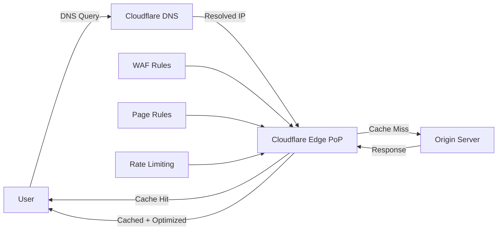
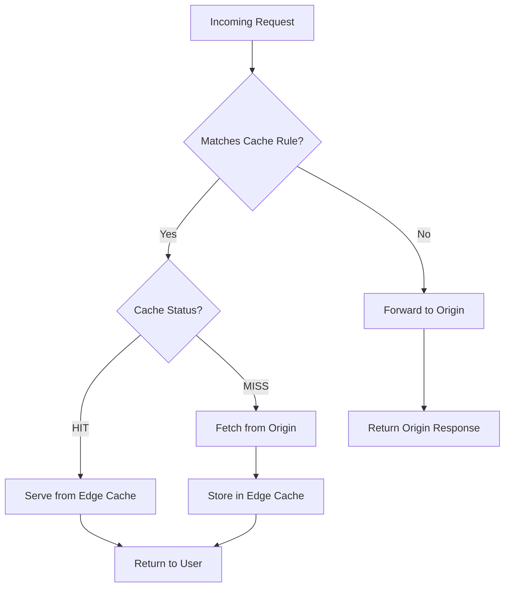
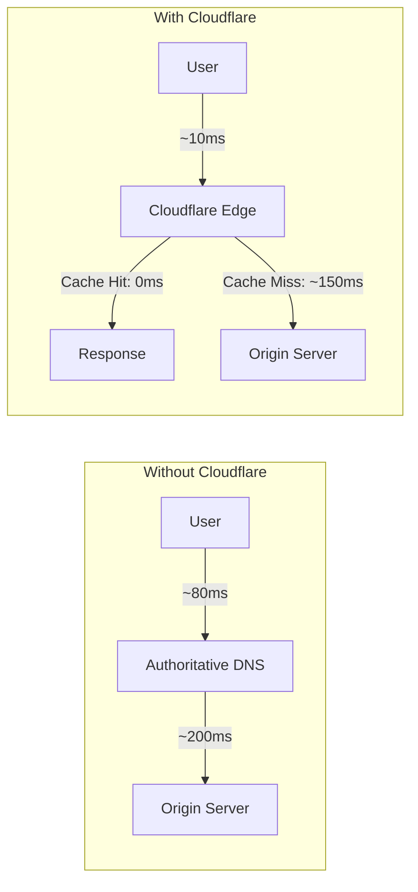

# How to Optimize DNS and CDN with Cloudflare

Author: [nawazdhandala](https://www.github.com/nawazdhandala)

Tags: Cloudflare, DNS, CDN, Performance, Security

Description: Learn how to optimize DNS resolution and content delivery with Cloudflare including caching, page rules, and WAF.

---

DNS resolution speed and content delivery performance directly impact user experience and search engine rankings. Cloudflare provides a powerful combination of DNS, CDN, security, and performance optimization tools that can dramatically improve your web application's speed and reliability.

This guide covers practical techniques for optimizing DNS, caching, page rules, and Web Application Firewall (WAF) configurations with Cloudflare.

## How Cloudflare Fits Into Your Stack



## Step 1: Configure DNS Records

Start by adding your domain to Cloudflare and configuring DNS records. The orange cloud icon means traffic is proxied through Cloudflare (benefiting from CDN and security). The grey cloud means DNS-only.

```bash
# Using the Cloudflare API to add DNS records
# Replace with your actual zone ID and API token

ZONE_ID="your-zone-id"
API_TOKEN="your-api-token"

# Add an A record for the root domain (proxied through Cloudflare)
curl -X POST \
  "https://api.cloudflare.com/client/v4/zones/$ZONE_ID/dns_records" \
  -H "Authorization: Bearer $API_TOKEN" \
  -H "Content-Type: application/json" \
  -d '{
    "type": "A",
    "name": "@",
    "content": "203.0.113.50",
    "proxied": true,
    "ttl": 1
  }'

# Add a CNAME record for www (proxied)
curl -X POST \
  "https://api.cloudflare.com/client/v4/zones/$ZONE_ID/dns_records" \
  -H "Authorization: Bearer $API_TOKEN" \
  -H "Content-Type: application/json" \
  -d '{
    "type": "CNAME",
    "name": "www",
    "content": "example.com",
    "proxied": true,
    "ttl": 1
  }'

# Add an MX record for email (cannot be proxied)
curl -X POST \
  "https://api.cloudflare.com/client/v4/zones/$ZONE_ID/dns_records" \
  -H "Authorization: Bearer $API_TOKEN" \
  -H "Content-Type: application/json" \
  -d '{
    "type": "MX",
    "name": "@",
    "content": "mail.example.com",
    "priority": 10,
    "proxied": false,
    "ttl": 3600
  }'
```

## Step 2: Optimize Caching with Cache Rules

Caching is where Cloudflare delivers the biggest performance wins. Configure cache rules to control what gets cached and for how long.



```bash
# Create a cache rule for static assets with a long TTL
# This caches images, CSS, JS, and fonts for 30 days at the edge
curl -X POST \
  "https://api.cloudflare.com/client/v4/zones/$ZONE_ID/rulesets" \
  -H "Authorization: Bearer $API_TOKEN" \
  -H "Content-Type: application/json" \
  -d '{
    "name": "Static Asset Caching",
    "kind": "zone",
    "phase": "http_request_cache_settings",
    "rules": [
      {
        "expression": "(http.request.uri.path.extension in {\"jpg\" \"jpeg\" \"png\" \"gif\" \"webp\" \"svg\" \"css\" \"js\" \"woff2\" \"woff\" \"ttf\"})",
        "action": "set_cache_settings",
        "action_parameters": {
          "cache": true,
          "edge_ttl": {
            "mode": "override_origin",
            "default": 2592000
          },
          "browser_ttl": {
            "mode": "override_origin",
            "default": 86400
          }
        },
        "description": "Cache static assets for 30 days at edge, 1 day in browser"
      }
    ]
  }'
```

## Step 3: Configure Page Rules

Page rules let you apply specific Cloudflare settings to URL patterns. While Cloudflare is moving toward more granular rules, page rules remain useful for many configurations.

```bash
# Redirect www to non-www with a page rule
curl -X POST \
  "https://api.cloudflare.com/client/v4/zones/$ZONE_ID/pagerules" \
  -H "Authorization: Bearer $API_TOKEN" \
  -H "Content-Type: application/json" \
  -d '{
    "targets": [
      {
        "target": "url",
        "constraint": {
          "operator": "matches",
          "value": "www.example.com/*"
        }
      }
    ],
    "actions": [
      {
        "id": "forwarding_url",
        "value": {
          "url": "https://example.com/$1",
          "status_code": 301
        }
      }
    ],
    "status": "active",
    "priority": 1
  }'

# Force HTTPS on all pages
curl -X POST \
  "https://api.cloudflare.com/client/v4/zones/$ZONE_ID/pagerules" \
  -H "Authorization: Bearer $API_TOKEN" \
  -H "Content-Type: application/json" \
  -d '{
    "targets": [
      {
        "target": "url",
        "constraint": {
          "operator": "matches",
          "value": "http://example.com/*"
        }
      }
    ],
    "actions": [
      {
        "id": "always_use_https"
      }
    ],
    "status": "active",
    "priority": 2
  }'
```

## Step 4: Set Up WAF Rules

The Web Application Firewall protects your application from common attacks like SQL injection, XSS, and bot abuse.

```bash
# Create a custom WAF rule to block known bad user agents
curl -X POST \
  "https://api.cloudflare.com/client/v4/zones/$ZONE_ID/rulesets" \
  -H "Authorization: Bearer $API_TOKEN" \
  -H "Content-Type: application/json" \
  -d '{
    "name": "Custom WAF Rules",
    "kind": "zone",
    "phase": "http_request_firewall_custom",
    "rules": [
      {
        "expression": "(http.user_agent contains \"sqlmap\") or (http.user_agent contains \"nikto\") or (http.user_agent contains \"havij\")",
        "action": "block",
        "description": "Block known malicious scanning tools"
      },
      {
        "expression": "(http.request.uri.query contains \"union+select\") or (http.request.uri.query contains \"1=1\")",
        "action": "block",
        "description": "Block basic SQL injection attempts in query strings"
      }
    ]
  }'
```

## Step 5: Enable Performance Optimizations

```bash
# Enable Auto Minify for HTML, CSS, and JS
curl -X PATCH \
  "https://api.cloudflare.com/client/v4/zones/$ZONE_ID/settings/minify" \
  -H "Authorization: Bearer $API_TOKEN" \
  -H "Content-Type: application/json" \
  -d '{
    "value": {
      "css": "on",
      "html": "on",
      "js": "on"
    }
  }'

# Enable Brotli compression for smaller payloads
curl -X PATCH \
  "https://api.cloudflare.com/client/v4/zones/$ZONE_ID/settings/brotli" \
  -H "Authorization: Bearer $API_TOKEN" \
  -H "Content-Type: application/json" \
  -d '{"value": "on"}'

# Enable Early Hints for faster page loads
curl -X PATCH \
  "https://api.cloudflare.com/client/v4/zones/$ZONE_ID/settings/early_hints" \
  -H "Authorization: Bearer $API_TOKEN" \
  -H "Content-Type: application/json" \
  -d '{"value": "on"}'

# Enable HTTP/3 (QUIC) for faster connections
curl -X PATCH \
  "https://api.cloudflare.com/client/v4/zones/$ZONE_ID/settings/http3" \
  -H "Authorization: Bearer $API_TOKEN" \
  -H "Content-Type: application/json" \
  -d '{"value": "on"}'
```

## Step 6: Set Up Rate Limiting

Rate limiting protects your origin server from abuse and ensures fair usage.

```bash
# Create a rate limiting rule for the login endpoint
# Allows 5 requests per minute per IP to prevent brute force
curl -X POST \
  "https://api.cloudflare.com/client/v4/zones/$ZONE_ID/rulesets" \
  -H "Authorization: Bearer $API_TOKEN" \
  -H "Content-Type: application/json" \
  -d '{
    "name": "Rate Limiting Rules",
    "kind": "zone",
    "phase": "http_ratelimit",
    "rules": [
      {
        "expression": "(http.request.uri.path eq \"/api/login\")",
        "action": "block",
        "ratelimit": {
          "characteristics": ["ip.src"],
          "period": 60,
          "requests_per_period": 5,
          "mitigation_timeout": 600
        },
        "description": "Rate limit login endpoint to 5 requests per minute"
      }
    ]
  }'
```

## DNS Performance Comparison



## Step 7: Monitor with Cloudflare Analytics

Cloudflare provides built-in analytics, but for end-to-end monitoring of your application's availability and performance beyond what Cloudflare shows, you should pair it with a dedicated monitoring solution.

[OneUptime](https://oneuptime.com) complements Cloudflare by monitoring your origin server health, tracking uptime from multiple global locations, and alerting you when your services degrade. While Cloudflare handles edge caching and security, OneUptime ensures your origin infrastructure stays healthy and gives you a single dashboard for all your monitoring needs including incident management, status pages, and on-call scheduling.
