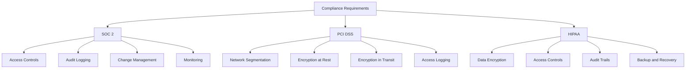
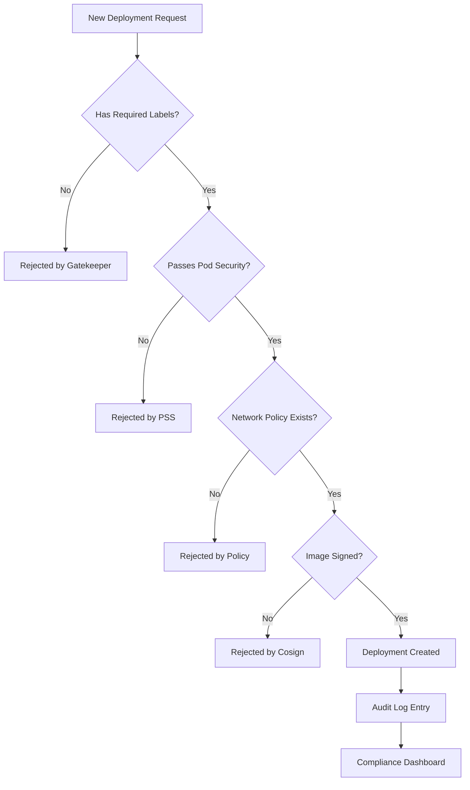

# How to Implement Compliance Controls in Kubernetes

Author: [nawazdhandala](https://www.github.com/nawazdhandala)

Tags: Compliance, Kubernetes, Security, SOC2, PCI DSS

Description: Learn how to implement compliance controls in Kubernetes for SOC2, PCI DSS, and HIPAA including audit logging and policies.

---

Running workloads on Kubernetes does not exempt you from compliance requirements. Whether you need to meet SOC 2, PCI DSS, HIPAA, or other regulatory standards, you must implement specific controls around access management, audit logging, encryption, and network segmentation within your Kubernetes clusters.

This guide covers practical steps to implement compliance controls in Kubernetes.

## Compliance Controls Mapping



## Step 1: Enable and Configure Audit Logging

Kubernetes audit logging records all API server requests. This is required for almost every compliance framework.

```yaml
# audit-policy.yaml
# Defines what API events to log and at what detail level
apiVersion: audit.k8s.io/v1
kind: Policy
rules:
  # Log all authentication failures at the Metadata level
  - level: Metadata
    stages:
      - ResponseComplete
    verbs: ["create"]
    resources:
      - group: "authentication.k8s.io"
        resources: ["tokenreviews"]

  # Log all changes to Secrets at the Metadata level (not the content)
  - level: Metadata
    verbs: ["create", "update", "patch", "delete"]
    resources:
      - group: ""
        resources: ["secrets"]

  # Log all RBAC changes with full request and response bodies
  - level: RequestResponse
    verbs: ["create", "update", "patch", "delete"]
    resources:
      - group: "rbac.authorization.k8s.io"
        resources: ["clusterroles", "clusterrolebindings", "roles", "rolebindings"]

  # Log pod exec and attach at the Request level
  - level: Request
    verbs: ["create"]
    resources:
      - group: ""
        resources: ["pods/exec", "pods/attach", "pods/portforward"]

  # Log all changes to deployments, statefulsets, and daemonsets
  - level: RequestResponse
    verbs: ["create", "update", "patch", "delete"]
    resources:
      - group: "apps"
        resources: ["deployments", "statefulsets", "daemonsets"]

  # Log namespace creation and deletion
  - level: Metadata
    verbs: ["create", "delete"]
    resources:
      - group: ""
        resources: ["namespaces"]

  # Catch-all: log everything else at the Metadata level
  - level: Metadata
    stages:
      - ResponseComplete
```

```bash
# Add these flags to the kube-apiserver configuration
# to enable audit logging with the policy above

# --audit-policy-file=/etc/kubernetes/audit-policy.yaml
# --audit-log-path=/var/log/kubernetes/audit.log
# --audit-log-maxage=90        # Keep audit logs for 90 days
# --audit-log-maxsize=100      # Rotate after 100 MB
# --audit-log-maxbackup=10     # Keep 10 rotated files
```

## Step 2: Implement RBAC with Least Privilege

```yaml
# rbac-controls.yaml
# Fine-grained RBAC roles following the principle of least privilege

# Role for developers: can view and manage deployments in their namespace
apiVersion: rbac.authorization.k8s.io/v1
kind: Role
metadata:
  name: developer-role
  namespace: production
rules:
  # Allow viewing pods and their logs
  - apiGroups: [""]
    resources: ["pods", "pods/log"]
    verbs: ["get", "list", "watch"]
  # Allow managing deployments
  - apiGroups: ["apps"]
    resources: ["deployments"]
    verbs: ["get", "list", "watch", "create", "update", "patch"]
  # Allow viewing configmaps but not secrets
  - apiGroups: [""]
    resources: ["configmaps"]
    verbs: ["get", "list", "watch"]
  # Allow viewing services
  - apiGroups: [""]
    resources: ["services"]
    verbs: ["get", "list", "watch"]
---
# Role for SREs: broader access with some restrictions
apiVersion: rbac.authorization.k8s.io/v1
kind: ClusterRole
metadata:
  name: sre-role
rules:
  - apiGroups: [""]
    resources: ["pods", "services", "configmaps", "persistentvolumeclaims"]
    verbs: ["get", "list", "watch", "create", "update", "patch", "delete"]
  - apiGroups: ["apps"]
    resources: ["deployments", "statefulsets", "daemonsets"]
    verbs: ["get", "list", "watch", "create", "update", "patch", "delete"]
  # SREs can view secrets but not create or modify them
  - apiGroups: [""]
    resources: ["secrets"]
    verbs: ["get", "list", "watch"]
  # Allow exec into pods for debugging
  - apiGroups: [""]
    resources: ["pods/exec"]
    verbs: ["create"]
```

## Step 3: Enforce Pod Security Standards

```yaml
# pod-security-policy.yaml
# Enforce restrictive pod security standards at the namespace level
apiVersion: v1
kind: Namespace
metadata:
  name: production
  labels:
    # Enforce the restricted pod security standard
    pod-security.kubernetes.io/enforce: restricted
    pod-security.kubernetes.io/enforce-version: latest
    # Warn on baseline violations
    pod-security.kubernetes.io/warn: restricted
    pod-security.kubernetes.io/warn-version: latest
    # Audit all violations
    pod-security.kubernetes.io/audit: restricted
    pod-security.kubernetes.io/audit-version: latest
```

```yaml
# compliant-deployment.yaml
# A deployment that meets restricted pod security standards
apiVersion: apps/v1
kind: Deployment
metadata:
  name: compliant-app
  namespace: production
spec:
  replicas: 3
  selector:
    matchLabels:
      app: compliant-app
  template:
    metadata:
      labels:
        app: compliant-app
    spec:
      # Use a non-root security context
      securityContext:
        runAsNonRoot: true
        seccompProfile:
          type: RuntimeDefault
      containers:
        - name: app
          image: myapp:1.0.0
          # Container-level security settings
          securityContext:
            allowPrivilegeEscalation: false
            readOnlyRootFilesystem: true
            runAsUser: 1000
            runAsGroup: 1000
            capabilities:
              drop:
                - ALL
          ports:
            - containerPort: 8080
          # Writable temp directory since root filesystem is read-only
          volumeMounts:
            - name: tmp
              mountPath: /tmp
      volumes:
        - name: tmp
          emptyDir: {}
```

## Step 4: Network Segmentation with Network Policies

```yaml
# network-policies.yaml
# PCI DSS requires network segmentation for cardholder data environments

# Default deny all ingress and egress in the PCI namespace
apiVersion: networking.k8s.io/v1
kind: NetworkPolicy
metadata:
  name: default-deny-all
  namespace: pci-environment
spec:
  podSelector: {}
  policyTypes:
    - Ingress
    - Egress
---
# Allow only the payment service to talk to the database
apiVersion: networking.k8s.io/v1
kind: NetworkPolicy
metadata:
  name: allow-payment-to-db
  namespace: pci-environment
spec:
  podSelector:
    matchLabels:
      app: payment-database
  policyTypes:
    - Ingress
  ingress:
    - from:
        - podSelector:
            matchLabels:
              app: payment-service
      ports:
        - protocol: TCP
          port: 5432
---
# Allow the payment service to receive traffic only from the API gateway
apiVersion: networking.k8s.io/v1
kind: NetworkPolicy
metadata:
  name: allow-gateway-to-payment
  namespace: pci-environment
spec:
  podSelector:
    matchLabels:
      app: payment-service
  policyTypes:
    - Ingress
  ingress:
    - from:
        - namespaceSelector:
            matchLabels:
              name: api-gateway
        - podSelector:
            matchLabels:
              app: api-gateway
      ports:
        - protocol: TCP
          port: 8443
```

## Compliance Control Flow



## Step 5: Encrypt Secrets at Rest

```yaml
# encryption-config.yaml
# Configures encryption for Kubernetes secrets stored in etcd
apiVersion: apiserver.config.k8s.io/v1
kind: EncryptionConfiguration
resources:
  - resources:
      - secrets
    providers:
      # Use AES-CBC encryption with a 32-byte key
      - aescbc:
          keys:
            - name: key1
              secret: <base64-encoded-32-byte-key>
      # Fallback to identity (unencrypted) for reading old secrets
      - identity: {}
```

## Step 6: Image Security and Supply Chain

```bash
# Sign container images with cosign for supply chain security
# This ensures only verified images run in your cluster

# Generate a signing key pair
cosign generate-key-pair

# Sign an image after building it
cosign sign --key cosign.key myregistry.com/myapp:1.0.0

# Verify an image signature
cosign verify --key cosign.pub myregistry.com/myapp:1.0.0
```

## Continuous Compliance Monitoring

Compliance is not a one-time checkbox. You need continuous monitoring to ensure controls remain effective and to detect violations in real time.

[OneUptime](https://oneuptime.com) supports your compliance posture by providing continuous monitoring, audit-ready incident logs, and status pages that demonstrate transparency to auditors. Track your API server health, monitor audit log pipeline availability, and set up alerts for security-critical events. OneUptime's incident management with detailed timelines provides the documentation trail that compliance auditors require, and its on-call scheduling ensures that security incidents are addressed within your SLA requirements.
