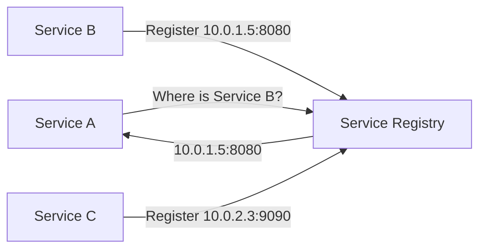
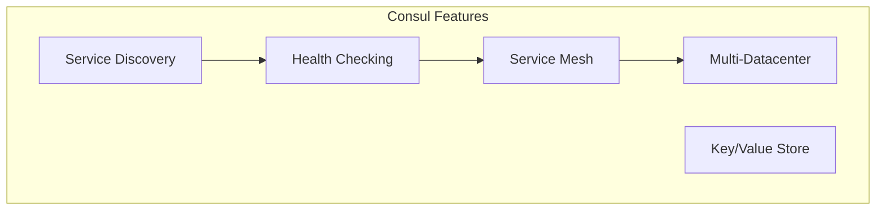
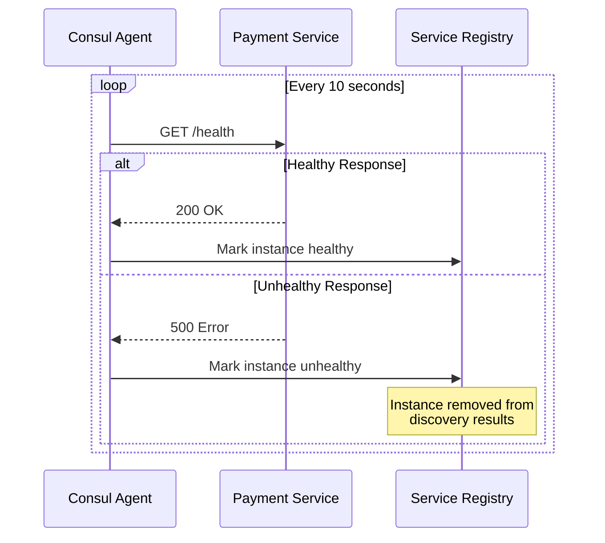
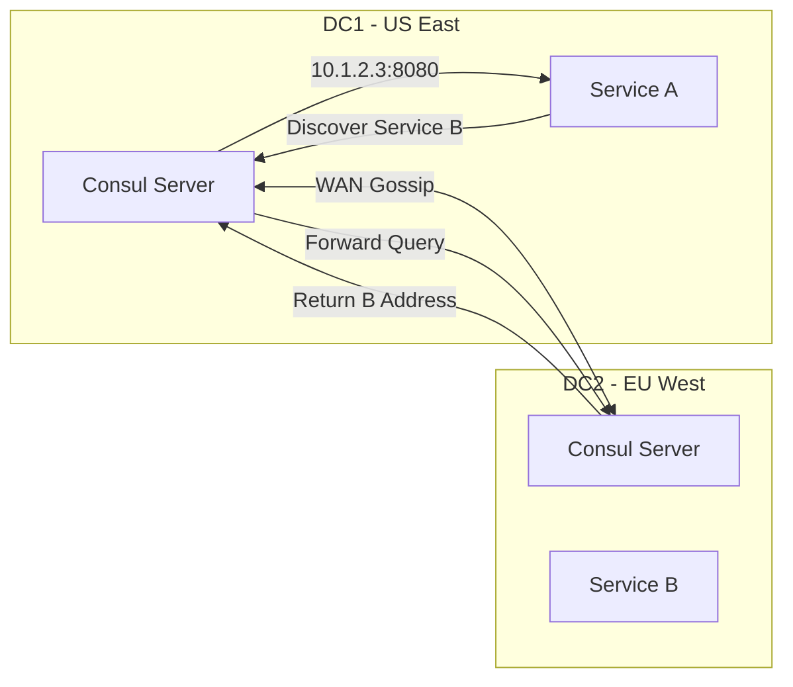

# How to Use HashiCorp Consul for Service Discovery

Author: [nawazdhandala](https://www.github.com/nawazdhandala)

Tags: Consul, Service Discovery, HashiCorp, Kubernetes, Networking

Description: Learn how to use HashiCorp Consul for service discovery in Kubernetes and multi-datacenter environments.

---

As applications grow into distributed microservices, knowing where each service lives and whether it is healthy becomes a real challenge. HashiCorp Consul solves this with a robust service discovery and service mesh solution. This guide walks you through setting up Consul for service discovery in Kubernetes.

## What Is Service Discovery?

Service discovery is the process by which services locate each other on a network. Instead of hardcoding IP addresses, services register themselves and query a registry to find dependencies.



## Why Consul?

Consul provides more than just a service registry. It includes health checking, key-value storage, multi-datacenter support, and a full service mesh with mTLS.



## Installing Consul on Kubernetes

Use the official Helm chart to deploy Consul to your Kubernetes cluster.

```bash
# Add the HashiCorp Helm repository
helm repo add hashicorp https://helm.releases.hashicorp.com

# Update the local Helm chart cache
helm repo update

# Install Consul with default configuration
# This deploys Consul servers and clients as a DaemonSet
helm install consul hashicorp/consul \
  --create-namespace \
  --namespace consul \
  --values consul-values.yaml
```

```yaml
# consul-values.yaml
# Configuration for the Consul Helm chart.
# Enables the service mesh, UI, and metrics collection.
global:
  name: consul
  # Use the latest stable Consul image
  image: hashicorp/consul:1.18.0
  # Enable TLS for all internal Consul communication
  tls:
    enabled: true
  metrics:
    enabled: true

server:
  # Run 3 server replicas for high availability
  replicas: 3
  storage: 10Gi
  # Enable the Consul UI for visual inspection
  ui:
    enabled: true

connectInject:
  # Automatically inject Consul sidecars into pods
  enabled: true
  default: false

controller:
  enabled: true
```

## Registering a Service

In Kubernetes, Consul can automatically discover services through its connect injector. Annotate your pods to register them.

```yaml
# deployment.yaml
# Deploy a payment service and register it with Consul.
# The connect-inject annotation tells Consul to add a sidecar proxy.
apiVersion: apps/v1
kind: Deployment
metadata:
  name: payment-service
  namespace: default
spec:
  replicas: 2
  selector:
    matchLabels:
      app: payment-service
  template:
    metadata:
      labels:
        app: payment-service
      annotations:
        # This annotation registers the pod with Consul
        "consul.hashicorp.com/connect-inject": "true"
        # Define upstream dependencies for this service
        "consul.hashicorp.com/connect-service-upstreams": "database:5432"
    spec:
      containers:
        - name: payment-service
          image: registry.example.com/payment:v1.2.0
          ports:
            - containerPort: 8080
          env:
            # Connect to the database through the local Consul proxy
            # Consul handles routing and mTLS automatically
            - name: DATABASE_URL
              value: "postgresql://localhost:5432/payments"
```

## Health Checks

Consul uses health checks to determine if a service instance is available. Unhealthy instances are removed from the registry.

```yaml
# service-defaults.yaml
# Configure health check behavior for the payment service.
apiVersion: consul.hashicorp.com/v1alpha1
kind: ServiceDefaults
metadata:
  name: payment-service
spec:
  protocol: http
  # Expose health check endpoint through the mesh
  expose:
    paths:
      - path: /health
        localPathPort: 8080
        listenerPort: 21500
        protocol: http
```



## Querying Services with DNS

Consul exposes a DNS interface that services can use to discover other services by name.

```bash
# Query Consul DNS for the payment service
# Returns all healthy instances of the service
dig @127.0.0.1 -p 8600 payment-service.service.consul SRV

# Query for a specific datacenter
# Useful in multi-datacenter deployments
dig @127.0.0.1 -p 8600 payment-service.service.dc2.consul SRV
```

## Querying Services with the HTTP API

For more control, use the Consul HTTP API to discover services programmatically.

```python
# discover.py
# Query Consul HTTP API to find healthy service instances.
# This is useful when DNS-based discovery is not available.

import requests

# Consul agent runs on localhost by default
CONSUL_ADDR = "http://localhost:8500"

def discover_service(service_name: str) -> list:
    """
    Fetch all healthy instances of a given service from Consul.
    Returns a list of (address, port) tuples.
    """
    url = f"{CONSUL_ADDR}/v1/health/service/{service_name}"
    params = {
        # Only return instances that are passing health checks
        "passing": "true"
    }

    response = requests.get(url, params=params)
    response.raise_for_status()

    instances = []
    for entry in response.json():
        address = entry["Service"]["Address"]
        port = entry["Service"]["Port"]
        instances.append((address, port))

    return instances


if __name__ == "__main__":
    # Discover all healthy payment-service instances
    services = discover_service("payment-service")
    for addr, port in services:
        print(f"Found instance at {addr}:{port}")
```

## Multi-Datacenter Service Discovery

Consul supports federated service discovery across multiple datacenters. Services in one datacenter can discover services in another.



```yaml
# consul-values-dc2.yaml
# Helm values for the second datacenter.
# Joins the WAN pool of the first datacenter for federation.
global:
  name: consul
  datacenter: dc2
  tls:
    enabled: true

server:
  replicas: 3
  # Join the WAN pool of the primary datacenter
  extraConfig: |
    {
      "retry_join_wan": ["consul-server.dc1.consul:8302"]
    }
```

## Service Intentions

Consul intentions define which services are allowed to communicate. This acts as a layer 4/7 firewall.

```yaml
# service-intentions.yaml
# Allow the API gateway to talk to the payment service.
# Deny all other traffic to payment service by default.
apiVersion: consul.hashicorp.com/v1alpha1
kind: ServiceIntentions
metadata:
  name: payment-service
spec:
  destination:
    name: payment-service
  sources:
    # Allow traffic from the API gateway
    - name: api-gateway
      action: allow
    # Allow traffic from the order service
    - name: order-service
      action: allow
    # Deny all other traffic by default
    - name: "*"
      action: deny
```

## Monitoring Consul

Track the health of your Consul cluster and registered services. Monitor agent availability, leadership elections, and service registration counts.

OneUptime (https://oneuptime.com) can monitor your Consul cluster health endpoints, alert when agents go down or services become unhealthy, and provide status pages to communicate service availability. Pair Consul's service discovery with OneUptime's monitoring to get full visibility into your distributed infrastructure.
