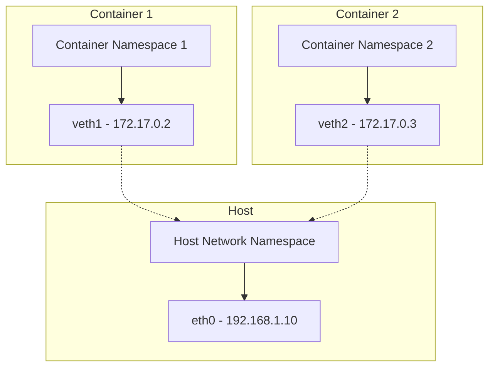
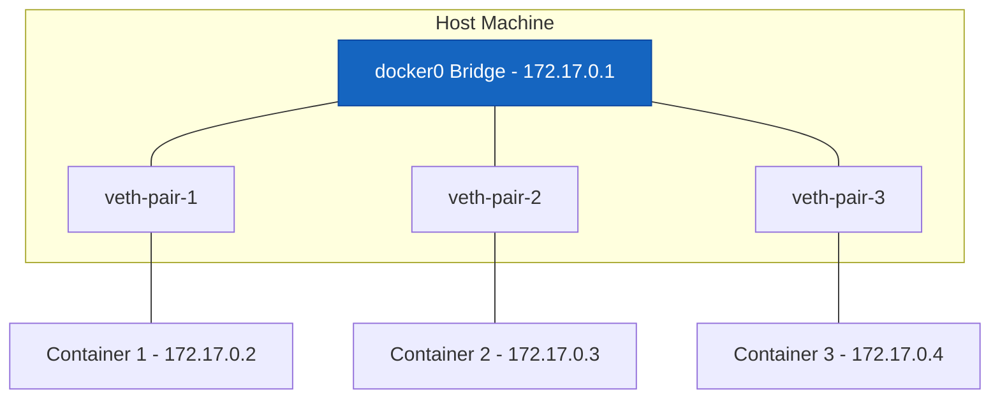
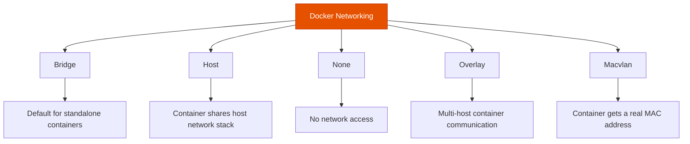
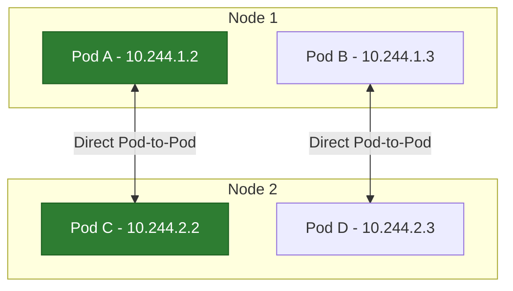
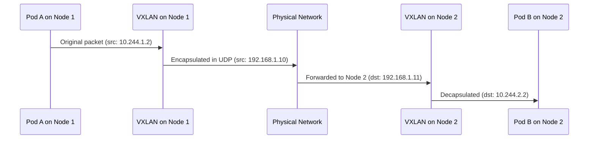

# Container Networking Deep Dive: From Namespaces to Overlay Networks

Author: [nawazdhandala](https://www.github.com/nawazdhandala)

Tags: Container Networking, Linux Namespaces, Overlay Networks, Docker, Kubernetes

Description: A deep dive into container networking from Linux network namespaces to overlay networks and container-to-container communication.

---

Container networking can feel like magic. You spin up containers, and they can talk to each other, to the host, and to the internet. But underneath, it is built on well-understood Linux networking primitives. This guide breaks down container networking layer by layer, from Linux namespaces to Kubernetes overlay networks.

## Linux Network Namespaces

At the foundation of container networking is the Linux network namespace. A network namespace provides an isolated copy of the network stack - its own interfaces, routing tables, firewall rules, and sockets.



### Creating Network Namespaces Manually

```bash
#!/bin/bash
# Demonstrates how container networking works under the hood
# by manually creating network namespaces and connecting them

# Step 1: Create two network namespaces (simulating two containers)
sudo ip netns add container1
sudo ip netns add container2

# Step 2: Create a virtual ethernet (veth) pair
# veth pairs are like a virtual cable connecting two network stacks
sudo ip link add veth0 type veth peer name veth1

# Step 3: Move each end of the veth pair into a namespace
sudo ip link set veth0 netns container1
sudo ip link set veth1 netns container2

# Step 4: Assign IP addresses inside each namespace
sudo ip netns exec container1 ip addr add 10.0.0.1/24 dev veth0
sudo ip netns exec container2 ip addr add 10.0.0.2/24 dev veth1

# Step 5: Bring the interfaces up
sudo ip netns exec container1 ip link set veth0 up
sudo ip netns exec container2 ip link set veth1 up

# Step 6: Test connectivity - container1 can now reach container2
sudo ip netns exec container1 ping -c 3 10.0.0.2
```

## The Bridge Network

When you have more than two containers, veth pairs alone are not enough. A Linux bridge acts like a virtual switch, connecting multiple containers on the same host.



### Setting Up a Bridge Network

```bash
#!/bin/bash
# Create a bridge network similar to Docker's default bridge

# Create the bridge interface
sudo ip link add name br0 type bridge
sudo ip addr add 172.18.0.1/16 dev br0
sudo ip link set br0 up

# Create a namespace and connect it to the bridge
sudo ip netns add webapp

# Create a veth pair
sudo ip link add veth-host type veth peer name veth-container

# Connect host end to the bridge
sudo ip link set veth-host master br0
sudo ip link set veth-host up

# Move container end into the namespace
sudo ip link set veth-container netns webapp
sudo ip netns exec webapp ip addr add 172.18.0.2/16 dev veth-container
sudo ip netns exec webapp ip link set veth-container up

# Add a default route inside the namespace pointing to the bridge
sudo ip netns exec webapp ip route add default via 172.18.0.1

# Enable IP forwarding on the host so containers can reach the internet
sudo sysctl -w net.ipv4.ip_forward=1

# Add NAT rules so containers can access external networks
sudo iptables -t nat -A POSTROUTING -s 172.18.0.0/16 ! -o br0 -j MASQUERADE
```

## Docker Networking Models

Docker provides several networking drivers. Each one serves a different use case.



### Docker Bridge Networking in Practice

```bash
# Create a custom bridge network with specific configuration
docker network create \
    --driver bridge \
    --subnet 10.10.0.0/16 \
    --gateway 10.10.0.1 \
    --opt com.docker.network.bridge.name=custom-br \
    my-network

# Run containers on the custom network
# Containers on the same bridge can reach each other by name
docker run -d --name api --network my-network nginx
docker run -d --name db --network my-network postgres

# The API container can reach the DB container by hostname "db"
docker exec api ping -c 3 db
```

## Kubernetes Networking Model

Kubernetes networking has three strict requirements:

1. Every Pod gets its own IP address
2. Pods on any node can communicate with pods on any other node without NAT
3. The IP that a pod sees for itself is the same IP that other pods see



## Overlay Networks

Overlay networks enable pod-to-pod communication across nodes. They encapsulate pod traffic inside packets that can be routed between hosts.

### VXLAN - The Most Common Overlay

VXLAN (Virtual Extensible LAN) encapsulates Layer 2 Ethernet frames inside Layer 4 UDP packets. This lets you create a virtual Layer 2 network on top of a Layer 3 network.



## CNI Plugins Compared

Container Network Interface (CNI) plugins implement the Kubernetes networking model. Here is how the popular options compare:

| CNI Plugin | Overlay | Network Policy | Performance | Complexity |
|-----------|---------|---------------|-------------|-----------|
| Flannel | VXLAN | No | Good | Low |
| Calico | VXLAN or BGP | Yes | Excellent | Medium |
| Cilium | eBPF | Yes | Excellent | Medium |
| Weave | VXLAN | Yes | Good | Low |
| Canal | VXLAN | Yes | Good | Low |

## Debugging Container Networking

When container networking goes wrong, these tools help you diagnose issues:

```bash
# Check which network namespace a container is in
docker inspect --format '{{.NetworkSettings.SandboxKey}}' container_name

# List all network namespaces
ip netns list

# Execute commands inside a container's network namespace
nsenter --net=/proc/$(docker inspect --format '{{.State.Pid}}' container_name)/ns/net \
    ip addr show

# Capture packets on a container's interface
nsenter --net=/proc/$(docker inspect --format '{{.State.Pid}}' container_name)/ns/net \
    tcpdump -i eth0 -nn -c 100

# Check iptables rules affecting container traffic
sudo iptables -t nat -L -n -v

# Trace packet path through the network stack
sudo ip route get 10.244.2.5
```

## Network Policies

Kubernetes Network Policies act as a firewall for pod-to-pod traffic:

```yaml
# network-policy.yaml
# Allow the API pods to receive traffic only from frontend pods
apiVersion: networking.k8s.io/v1
kind: NetworkPolicy
metadata:
  name: api-allow-frontend
spec:
  podSelector:
    matchLabels:
      app: api
  policyTypes:
    - Ingress
  ingress:
    - from:
        - podSelector:
            matchLabels:
              app: frontend
      ports:
        - protocol: TCP
          port: 8080
```

## Performance Considerations

Overlay networks add overhead due to encapsulation. Key factors that affect performance:

- **MTU settings** - VXLAN adds 50 bytes of overhead; reduce the inner MTU accordingly
- **Encryption** - encrypting overlay traffic adds CPU overhead
- **eBPF-based networking** - tools like Cilium bypass iptables for better performance
- **Direct routing** - BGP-based routing (Calico) avoids encapsulation overhead entirely

OneUptime helps you monitor container networking performance and connectivity. Track packet loss, latency between pods across nodes, DNS resolution times, and network policy violations. Set up alerts when network latency between services exceeds thresholds or when connectivity drops between critical paths. Visit [https://oneuptime.com](https://oneuptime.com) to get full visibility into your container network.
