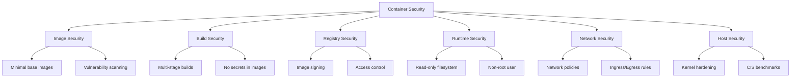
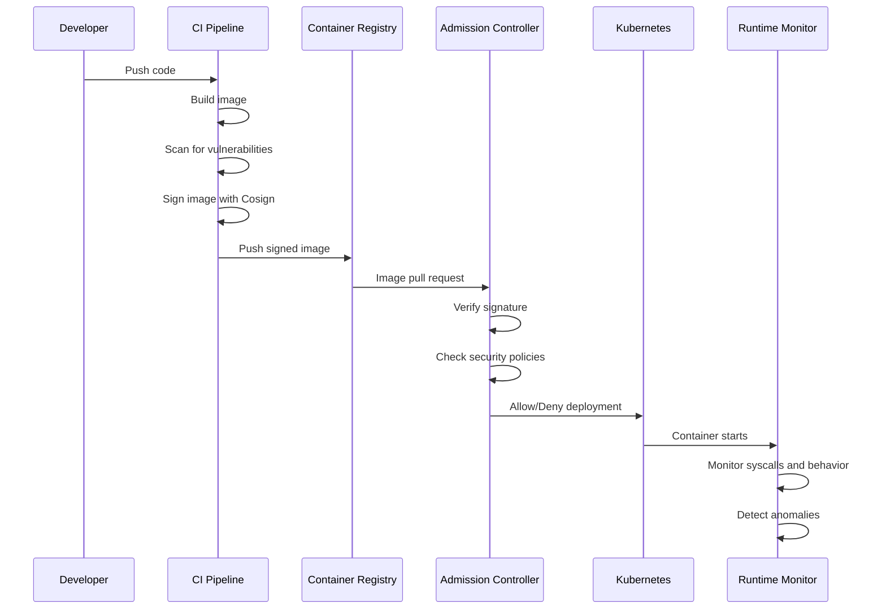
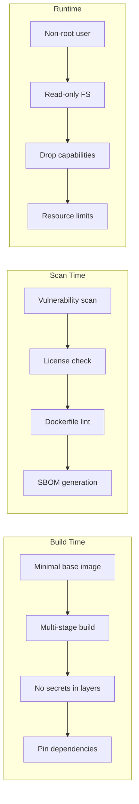

# Container Security Best Practices for Production Workloads

Author: [nawazdhandala](https://www.github.com/nawazdhandala)

Tags: Container Security, Docker, Kubernetes, Security, Best Practices

Description: Comprehensive guide to container security best practices covering image scanning, runtime security, and network policies.

---

## Introduction

Containers have become the standard for deploying applications, but they also introduce new security challenges. From vulnerable base images to misconfigured runtime permissions, every layer of the container stack requires attention. This guide covers best practices across the entire container lifecycle.

## Container Security Layers



## Secure Dockerfile Practices

### Multi-Stage Build with Minimal Image

```dockerfile
# Stage 1: Build stage - uses full SDK image
FROM python:3.12-slim AS builder

# Set working directory
WORKDIR /app

# Install dependencies in a virtual environment
# This keeps dependencies isolated and makes the final image smaller
RUN python -m venv /opt/venv
ENV PATH="/opt/venv/bin:$PATH"

# Copy and install requirements first for better layer caching
COPY requirements.txt .
RUN pip install --no-cache-dir -r requirements.txt

# Copy application source code
COPY . .

# Stage 2: Production stage - uses distroless image
FROM gcr.io/distroless/python3-debian12

# Copy only the virtual environment and application code
COPY --from=builder /opt/venv /opt/venv
COPY --from=builder /app /app

# Set environment variables
ENV PATH="/opt/venv/bin:$PATH"
WORKDIR /app

# Run as non-root user (distroless default is nonroot)
USER nonroot

# Use exec form for proper signal handling
ENTRYPOINT ["python", "main.py"]
```

### Dockerfile Security Linting

```yaml
# .hadolint.yaml - Hadolint configuration for Dockerfile linting
ignored:
  - DL3008  # Allow unpinned apt versions (for flexibility)

trustedRegistries:
  - docker.io
  - gcr.io
  - ghcr.io

override:
  error:
    - DL3000  # Use absolute WORKDIR
    - DL3002  # Last user should not be root
    - DL3003  # Use WORKDIR to switch directories
    - DL3006  # Always tag the version of an image
    - DL3007  # Using latest is prone to errors
    - DL3009  # Delete apt lists after installing
    - DL3018  # Pin versions in apk add
    - DL3025  # Use JSON form of CMD/ENTRYPOINT
```

## Image Vulnerability Scanning

### Trivy Scanner in CI/CD

```yaml
# GitHub Actions workflow for container image scanning
name: Container Security Scan

on:
  push:
    branches: [main]
  pull_request:
    branches: [main]

jobs:
  scan:
    runs-on: ubuntu-latest
    steps:
      - name: Checkout code
        uses: actions/checkout@v4

      - name: Build Docker image
        run: docker build -t myapp:${{ github.sha }} .

      - name: Run Trivy vulnerability scanner
        uses: aquasecurity/trivy-action@master
        with:
          image-ref: "myapp:${{ github.sha }}"
          format: "sarif"
          output: "trivy-results.sarif"
          severity: "CRITICAL,HIGH"  # Only fail on critical and high
          exit-code: "1"             # Fail the build if vulnerabilities found

      - name: Upload scan results to GitHub Security
        uses: github/codeql-action/upload-sarif@v3
        with:
          sarif_file: "trivy-results.sarif"
```

## Kubernetes Security Context

### Pod Security Configuration

```yaml
# Secure pod specification with comprehensive security context
apiVersion: apps/v1
kind: Deployment
metadata:
  name: secure-app
  namespace: production
spec:
  replicas: 3
  selector:
    matchLabels:
      app: secure-app
  template:
    metadata:
      labels:
        app: secure-app
    spec:
      # Use a non-default service account with minimal permissions
      serviceAccountName: secure-app-sa
      automountServiceAccountToken: false  # Disable unless needed

      # Pod-level security context
      securityContext:
        runAsNonRoot: true           # Enforce non-root execution
        runAsUser: 10001             # Specific non-root UID
        runAsGroup: 10001            # Specific non-root GID
        fsGroup: 10001              # File system group
        seccompProfile:
          type: RuntimeDefault       # Apply default seccomp profile

      containers:
        - name: app
          image: myregistry.io/myapp:v1.2.3@sha256:abc123...  # Pin by digest
          ports:
            - containerPort: 8080
              protocol: TCP

          # Container-level security context
          securityContext:
            allowPrivilegeEscalation: false  # Block privilege escalation
            readOnlyRootFilesystem: true     # Immutable filesystem
            capabilities:
              drop:
                - ALL                         # Drop all Linux capabilities
            privileged: false                 # Never run privileged

          # Resource limits prevent denial-of-service
          resources:
            requests:
              cpu: 100m
              memory: 128Mi
            limits:
              cpu: 500m
              memory: 512Mi

          # Writable directories via volumes only
          volumeMounts:
            - name: tmp-dir
              mountPath: /tmp
            - name: cache-dir
              mountPath: /app/cache

      volumes:
        - name: tmp-dir
          emptyDir:
            sizeLimit: 100Mi  # Limit temp directory size
        - name: cache-dir
          emptyDir:
            sizeLimit: 200Mi
```

## Network Policies

### Default Deny and Selective Allow

```yaml
# Default deny all ingress and egress traffic
apiVersion: networking.k8s.io/v1
kind: NetworkPolicy
metadata:
  name: default-deny-all
  namespace: production
spec:
  podSelector: {}  # Apply to all pods in the namespace
  policyTypes:
    - Ingress
    - Egress

---

# Allow specific ingress and egress for the application
apiVersion: networking.k8s.io/v1
kind: NetworkPolicy
metadata:
  name: allow-app-traffic
  namespace: production
spec:
  podSelector:
    matchLabels:
      app: secure-app
  policyTypes:
    - Ingress
    - Egress
  ingress:
    - from:
        # Only allow traffic from the ingress controller
        - namespaceSelector:
            matchLabels:
              name: ingress-nginx
          podSelector:
            matchLabels:
              app: ingress-nginx
      ports:
        - protocol: TCP
          port: 8080
  egress:
    - to:
        # Allow traffic to the database
        - podSelector:
            matchLabels:
              app: postgresql
      ports:
        - protocol: TCP
          port: 5432
    - to:
        # Allow DNS resolution
        - namespaceSelector: {}
          podSelector:
            matchLabels:
              k8s-app: kube-dns
      ports:
        - protocol: UDP
          port: 53
        - protocol: TCP
          port: 53
```

## Runtime Security Flow



## Pod Security Standards

```yaml
# Enforce Pod Security Standards at the namespace level
apiVersion: v1
kind: Namespace
metadata:
  name: production
  labels:
    # Enforce restricted profile (strictest)
    pod-security.kubernetes.io/enforce: restricted
    pod-security.kubernetes.io/enforce-version: latest

    # Warn on baseline violations in staging
    pod-security.kubernetes.io/warn: restricted
    pod-security.kubernetes.io/warn-version: latest

    # Audit all violations for logging
    pod-security.kubernetes.io/audit: restricted
    pod-security.kubernetes.io/audit-version: latest
```

## Secrets Management

```yaml
# Use external secrets operator instead of plain Kubernetes secrets
apiVersion: external-secrets.io/v1beta1
kind: ExternalSecret
metadata:
  name: app-secrets
  namespace: production
spec:
  refreshInterval: 1h  # Sync secrets every hour
  secretStoreRef:
    name: vault-backend
    kind: ClusterSecretStore
  target:
    name: app-secrets
    creationPolicy: Owner
  data:
    - secretKey: database-url
      remoteRef:
        key: production/database
        property: connection_string
    - secretKey: api-key
      remoteRef:
        key: production/api
        property: key
```

## Container Security Checklist



## Conclusion

Container security requires defense in depth across the entire lifecycle. Start with minimal, scanned images, enforce strict security contexts at runtime, and segment traffic with network policies. Automate these checks in your CI/CD pipeline so security is built in, not bolted on.

For monitoring your containerized workloads and getting alerted when security policies are violated, check out [OneUptime](https://oneuptime.com) for Kubernetes monitoring, incident management, and observability.
