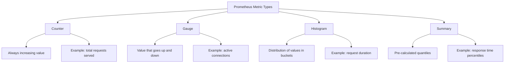

# How to Create and Expose Custom Prometheus Metrics

Author: [nawazdhandala](https://www.github.com/nawazdhandala)

Tags: Prometheus, Custom Metrics, Instrumentation, Monitoring, Observability

Description: Learn how to create and expose custom Prometheus metrics from your applications for business and operational monitoring.

---

Prometheus is the standard for metrics collection in cloud-native environments. While infrastructure metrics are useful, custom application metrics give you insight into what your code is actually doing. This guide walks through creating, exposing, and using custom Prometheus metrics in your applications.

## Prometheus Metric Types

Prometheus supports four core metric types, each designed for different use cases.



## Counters: Tracking Totals

Counters are monotonically increasing values. They only go up (or reset to zero on restart). Use them for totals like requests served, errors encountered, or bytes processed.

```python
# counters.py
# Track total events with Prometheus counters

from prometheus_client import Counter

# Count total orders processed, labeled by status and payment method
orders_processed = Counter(
    "orders_processed_total",
    "Total number of orders processed",
    ["status", "payment_method"]
)

# Count total revenue in cents to avoid floating point issues
revenue_cents = Counter(
    "revenue_cents_total",
    "Total revenue in cents",
    ["currency", "product_category"]
)

# Count authentication events
auth_events = Counter(
    "auth_events_total",
    "Total authentication events",
    ["event_type", "provider"]
)


def process_order(order):
    """Process an order and record metrics."""
    try:
        # Process the order logic here
        charge_payment(order)
        fulfill_order(order)

        # Record successful order
        orders_processed.labels(
            status="success",
            payment_method=order.payment_method
        ).inc()

        # Record revenue
        revenue_cents.labels(
            currency=order.currency,
            product_category=order.category
        ).inc(order.amount_cents)

    except PaymentError:
        # Record failed payment
        orders_processed.labels(
            status="payment_failed",
            payment_method=order.payment_method
        ).inc()

    except Exception:
        # Record other failures
        orders_processed.labels(
            status="error",
            payment_method=order.payment_method
        ).inc()


def record_login(user, provider, success):
    """Record a login event."""
    event_type = "login_success" if success else "login_failure"
    auth_events.labels(
        event_type=event_type,
        provider=provider
    ).inc()
```

## Gauges: Tracking Current Values

Gauges represent values that can go up and down. Use them for things like current queue depth, active connections, or temperature.

```python
# gauges.py
# Track current values with Prometheus gauges

from prometheus_client import Gauge
import threading

# Current number of items in each queue
queue_depth = Gauge(
    "queue_depth",
    "Current number of items in the queue",
    ["queue_name"]
)

# Currently active user sessions
active_sessions = Gauge(
    "active_sessions",
    "Number of active user sessions",
    ["session_type"]
)

# Current cache hit ratio (updated periodically)
cache_hit_ratio = Gauge(
    "cache_hit_ratio",
    "Current cache hit ratio",
    ["cache_name"]
)

# In-progress operations (using inc/dec pattern)
in_progress_operations = Gauge(
    "operations_in_progress",
    "Number of operations currently in progress",
    ["operation_type"]
)


class QueueMonitor:
    """Monitor queue depths and update metrics."""

    def __init__(self, queues):
        # Map of queue name to queue object
        self.queues = queues

    def update_metrics(self):
        """Update gauge values from current queue state."""
        for name, q in self.queues.items():
            queue_depth.labels(queue_name=name).set(q.qsize())


def process_with_tracking(operation_type, func, *args):
    """Execute a function while tracking it as in-progress."""
    # Increment when starting
    in_progress_operations.labels(operation_type=operation_type).inc()
    try:
        return func(*args)
    finally:
        # Decrement when done, regardless of success or failure
        in_progress_operations.labels(operation_type=operation_type).dec()
```

## Histograms: Tracking Distributions

Histograms sample observations and count them in configurable buckets. They are ideal for measuring request durations or response sizes.

```python
# histograms.py
# Track value distributions with Prometheus histograms

from prometheus_client import Histogram
import time
from functools import wraps

# Request duration with custom buckets suited for web requests
request_duration = Histogram(
    "http_request_duration_seconds",
    "HTTP request duration in seconds",
    ["method", "endpoint", "status"],
    # Buckets from 5ms to 10s
    buckets=[0.005, 0.01, 0.025, 0.05, 0.1, 0.25, 0.5, 1.0, 2.5, 5.0, 10.0]
)

# Database query duration with finer-grained buckets
db_query_duration = Histogram(
    "db_query_duration_seconds",
    "Database query execution time",
    ["query_type", "table"],
    # Buckets from 1ms to 30s for database queries
    buckets=[0.001, 0.005, 0.01, 0.025, 0.05, 0.1, 0.5, 1.0, 5.0, 30.0]
)

# Response payload size
response_size = Histogram(
    "http_response_size_bytes",
    "HTTP response size in bytes",
    ["endpoint"],
    # Size buckets from 100B to 10MB
    buckets=[100, 500, 1000, 5000, 10000, 50000, 100000, 500000, 1000000, 10000000]
)


def track_request(endpoint):
    """Decorator to automatically track request duration."""
    def decorator(func):
        @wraps(func)
        async def wrapper(request, *args, **kwargs):
            start = time.perf_counter()
            status = "500"
            try:
                response = await func(request, *args, **kwargs)
                status = str(response.status_code)
                return response
            finally:
                duration = time.perf_counter() - start
                request_duration.labels(
                    method=request.method,
                    endpoint=endpoint,
                    status=status
                ).observe(duration)
        return wrapper
    return decorator


def track_db_query(query_type, table):
    """Context manager to track database query duration."""
    class QueryTimer:
        def __enter__(self):
            self.start = time.perf_counter()
            return self

        def __exit__(self, exc_type, exc_val, exc_tb):
            duration = time.perf_counter() - self.start
            db_query_duration.labels(
                query_type=query_type,
                table=table
            ).observe(duration)
            return False

    return QueryTimer()
```

## Exposing Metrics

Expose your metrics via an HTTP endpoint that Prometheus can scrape.

```python
# metrics_server.py
# Expose Prometheus metrics via FastAPI

from fastapi import FastAPI, Response
from prometheus_client import (
    generate_latest,
    CONTENT_TYPE_LATEST,
    CollectorRegistry,
    multiprocess
)
import os

app = FastAPI()

@app.get("/metrics")
async def metrics():
    """Prometheus metrics endpoint."""
    # Check if running in multiprocess mode (e.g., with gunicorn)
    if "PROMETHEUS_MULTIPROC_DIR" in os.environ:
        registry = CollectorRegistry()
        multiprocess.MultiProcessCollector(registry)
        data = generate_latest(registry)
    else:
        data = generate_latest()

    return Response(
        content=data,
        media_type=CONTENT_TYPE_LATEST
    )
```

## Business Metrics

Custom metrics are not just for technical operations. Track business KPIs alongside system metrics.

```python
# business_metrics.py
# Track business-level metrics

from prometheus_client import Counter, Histogram, Gauge

# User signup funnel metrics
signups_started = Counter(
    "signup_started_total",
    "Users who started the signup process",
    ["source"]
)

signups_completed = Counter(
    "signup_completed_total",
    "Users who completed signup",
    ["source", "plan"]
)

# Feature usage tracking
feature_usage = Counter(
    "feature_usage_total",
    "Feature usage events",
    ["feature_name", "user_tier"]
)

# Checkout funnel timing
checkout_duration = Histogram(
    "checkout_duration_seconds",
    "Time from cart to completed checkout",
    ["payment_method"],
    buckets=[10, 30, 60, 120, 300, 600]
)

# Active subscriptions by plan
active_subscriptions = Gauge(
    "active_subscriptions",
    "Currently active subscriptions",
    ["plan", "billing_cycle"]
)
```

## Prometheus Scrape Configuration

```yaml
# prometheus.yml
# Configure Prometheus to scrape your custom metrics

scrape_configs:
  # Scrape your application metrics
  - job_name: "my-application"
    scrape_interval: 15s
    metrics_path: /metrics
    static_configs:
      - targets:
          - "app-server-1:8000"
          - "app-server-2:8000"

  # Kubernetes service discovery for dynamic targets
  - job_name: "kubernetes-pods"
    kubernetes_sd_configs:
      - role: pod
    relabel_configs:
      # Only scrape pods with the annotation prometheus.io/scrape: "true"
      - source_labels: [__meta_kubernetes_pod_annotation_prometheus_io_scrape]
        action: keep
        regex: true
      # Use the annotation for the metrics path
      - source_labels: [__meta_kubernetes_pod_annotation_prometheus_io_path]
        action: replace
        target_label: __metrics_path__
        regex: (.+)
```

## Querying Custom Metrics

```promql
# Rate of orders per second over the last 5 minutes
rate(orders_processed_total[5m])

# Error rate as a percentage
sum(rate(orders_processed_total{status!="success"}[5m]))
/
sum(rate(orders_processed_total[5m]))
* 100

# P95 request duration
histogram_quantile(0.95, rate(http_request_duration_seconds_bucket[5m]))

# Signup conversion rate
sum(rate(signup_completed_total[1h]))
/
sum(rate(signup_started_total[1h]))
* 100
```

With **OneUptime**, you can ingest and visualize custom Prometheus metrics alongside your traces and logs. Create unified dashboards that combine business metrics with operational data, and set up alerts on any custom metric to stay on top of both technical and business health.
