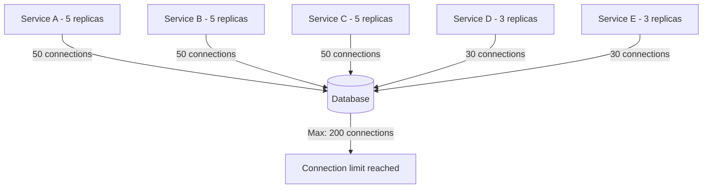
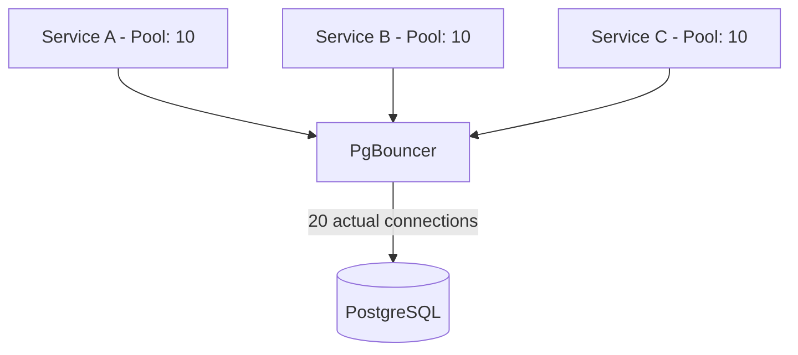

# How to Manage Database Connections in Microservices

Author: [nawazdhandala](https://www.github.com/nawazdhandala)

Tags: Database, Connection Pooling, Microservices, Performance, Best Practices

Description: Best practices for managing database connections in microservices including pooling, timeouts, and connection lifecycle.

---

In microservices architectures, database connection management becomes critical. Each service instance opens its own connections, and without proper management, you can exhaust your database connection limit or create performance bottlenecks. This guide covers practical strategies for managing connections effectively.

## The Connection Problem in Microservices

When you have dozens of microservices, each with multiple replicas, the total number of database connections can grow quickly. A database with a 200-connection limit can be overwhelmed when 10 services each run 5 replicas with pools of 10 connections.



## Connection Pooling Basics

A connection pool maintains a set of reusable database connections. Instead of opening and closing connections for each query, the application borrows a connection from the pool and returns it when done.

```python
# connection_pool.py
# A basic connection pool implementation showing core concepts

import queue
import psycopg2
import threading
import time
import logging

logger = logging.getLogger(__name__)

class ConnectionPool:
    def __init__(self, dsn, min_size=2, max_size=10, max_idle_seconds=300):
        # Database connection string
        self.dsn = dsn
        # Minimum connections to keep open
        self.min_size = min_size
        # Maximum connections allowed
        self.max_size = max_size
        # Close idle connections after this duration
        self.max_idle_seconds = max_idle_seconds
        # Thread-safe queue for available connections
        self._pool = queue.Queue(maxsize=max_size)
        # Track total connections created
        self._total_connections = 0
        # Lock for thread-safe connection creation
        self._lock = threading.Lock()

        # Pre-create minimum connections
        for _ in range(min_size):
            conn = self._create_connection()
            self._pool.put((conn, time.time()))

    def _create_connection(self):
        """Create a new database connection."""
        conn = psycopg2.connect(self.dsn)
        conn.autocommit = False
        with self._lock:
            self._total_connections += 1
        logger.info(f"Created connection. Total: {self._total_connections}")
        return conn

    def get_connection(self, timeout=5):
        """Borrow a connection from the pool."""
        try:
            # Try to get an existing connection
            conn, last_used = self._pool.get(timeout=timeout)

            # Check if connection is still alive
            if self._is_connection_healthy(conn):
                return conn

            # Connection is dead, create a new one
            logger.warning("Stale connection detected, creating new one")
            conn.close()
            with self._lock:
                self._total_connections -= 1
            return self._create_connection()

        except queue.Empty:
            # No connections available, try to create one
            with self._lock:
                if self._total_connections < self.max_size:
                    return self._create_connection()
            raise Exception("Connection pool exhausted")

    def return_connection(self, conn):
        """Return a connection to the pool."""
        try:
            # Roll back any uncommitted transaction
            conn.rollback()
            # Put it back with current timestamp
            self._pool.put_nowait((conn, time.time()))
        except queue.Full:
            # Pool is full, close the extra connection
            conn.close()
            with self._lock:
                self._total_connections -= 1

    def _is_connection_healthy(self, conn):
        """Check if a connection is still usable."""
        try:
            cursor = conn.cursor()
            cursor.execute("SELECT 1")
            cursor.close()
            return True
        except Exception:
            return False
```

## Using PgBouncer as a Connection Proxy

PgBouncer sits between your services and PostgreSQL, pooling connections at the infrastructure level. This is more efficient than per-service pooling because it shares connections across all services.



```ini
; pgbouncer.ini
; Configuration for PgBouncer connection pooler

[databases]
; Map database names to actual PostgreSQL servers
myapp = host=postgres-primary.internal port=5432 dbname=myapp

[pgbouncer]
; Listen on all interfaces
listen_addr = 0.0.0.0
listen_port = 6432

; Pool mode: transaction gives best connection reuse
; - session: connection assigned for entire client session
; - transaction: connection returned after each transaction
; - statement: connection returned after each statement
pool_mode = transaction

; Maximum client connections PgBouncer will accept
max_client_conn = 500

; Maximum connections PgBouncer opens to PostgreSQL
default_pool_size = 20

; Extra connections allowed during traffic spikes
reserve_pool_size = 5

; How long a client waits for a connection before timeout
reserve_pool_timeout = 3

; Close server connections that have been idle this long
server_idle_timeout = 300

; Log connections and disconnections for debugging
log_connections = 1
log_disconnections = 1
```

## Timeout Configuration

Proper timeout configuration prevents connections from being held indefinitely and protects against slow queries consuming all connections.

```python
# timeout_config.py
# Database connection with proper timeout settings

import psycopg2

def create_connection_with_timeouts():
    """Create a database connection with safety timeouts."""
    conn = psycopg2.connect(
        host="db.example.com",
        dbname="myapp",
        user="app_user",
        password="secret",
        # Connection timeout: max time to establish connection
        connect_timeout=5,
        # These are set via options parameter
        options="-c statement_timeout=30000 "   # 30s max query time
                "-c idle_in_transaction_session_timeout=60000 "  # 60s idle tx
                "-c lock_timeout=10000"  # 10s max wait for locks
    )
    return conn


def execute_with_timeout(pool, query, params=None, timeout_ms=5000):
    """Execute a query with a per-query timeout."""
    conn = pool.get_connection()
    try:
        cursor = conn.cursor()
        # Set timeout for this specific query
        cursor.execute(f"SET LOCAL statement_timeout = {timeout_ms}")
        cursor.execute(query, params)
        result = cursor.fetchall()
        conn.commit()
        return result
    except psycopg2.extensions.QueryCanceledError:
        conn.rollback()
        raise TimeoutError(f"Query exceeded {timeout_ms}ms timeout")
    finally:
        pool.return_connection(conn)
```

## Connection Health Checks

Implement health checks that verify database connectivity. This helps your orchestrator (Kubernetes, ECS) detect when a service has lost its database connection.

```python
# health_check.py
# Health check endpoint that verifies database connectivity

from fastapi import FastAPI, Response
import time

app = FastAPI()

# Reference to the connection pool (initialized at startup)
db_pool = None

@app.get("/health/ready")
async def readiness_check():
    """Check if the service can serve requests."""
    try:
        conn = db_pool.get_connection(timeout=2)
        try:
            cursor = conn.cursor()
            # Simple query to verify database is responsive
            cursor.execute("SELECT 1")
            cursor.close()
            return {"status": "ready", "database": "connected"}
        finally:
            db_pool.return_connection(conn)
    except Exception as e:
        return Response(
            content=f'{{"status": "not ready", "error": "{str(e)}"}}',
            status_code=503,
            media_type="application/json"
        )

@app.get("/health/live")
async def liveness_check():
    """Check if the service process is alive."""
    # Liveness only checks if the process is running
    return {"status": "alive", "uptime": time.process_time()}
```

## Connection Pool Metrics

Track pool usage metrics to right-size your pools and detect connection leaks.

```python
# pool_metrics.py
# Expose connection pool metrics for monitoring

from prometheus_client import Gauge, Counter, Histogram

# Current number of connections in use
pool_active = Gauge(
    "db_pool_active_connections",
    "Number of connections currently in use",
    ["service", "database"]
)

# Current number of idle connections in the pool
pool_idle = Gauge(
    "db_pool_idle_connections",
    "Number of idle connections in pool",
    ["service", "database"]
)

# Total connection creation events
pool_created = Counter(
    "db_pool_connections_created_total",
    "Total connections created",
    ["service", "database"]
)

# Time spent waiting for a connection from the pool
pool_wait_time = Histogram(
    "db_pool_wait_seconds",
    "Time spent waiting for a pool connection",
    ["service", "database"],
    buckets=[0.001, 0.005, 0.01, 0.05, 0.1, 0.5, 1.0]
)
```

## Best Practices Summary

1. Use connection pooling at the application level and consider a proxy like PgBouncer
2. Set timeouts on connections, queries, and idle transactions
3. Monitor pool usage and set alerts for pool exhaustion
4. Implement health checks that verify database connectivity
5. Right-size pools based on actual usage patterns, not guesses

With **OneUptime**, you can monitor your database connection pools across all your microservices. Track active connections, pool wait times, and connection errors from a unified dashboard to ensure your services always have the database connectivity they need.
