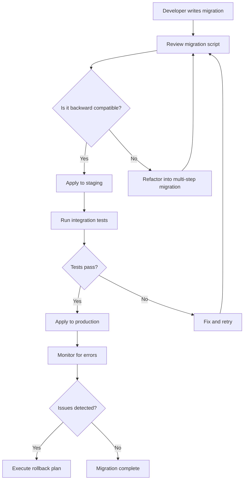
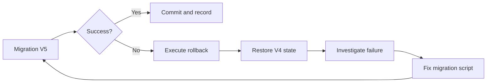

# How to Plan and Execute Database Migrations Safely

Author: [nawazdhandala](https://www.github.com/nawazdhandala)

Tags: Database, Migration, Schema, Flyway, Liquibase

Description: Learn strategies for safe database migrations including zero-downtime schema changes, rollback plans, and migration tools.

---

Database migrations are one of the riskiest operations in production systems. A poorly planned migration can cause downtime, data loss, or corrupt your schema. This guide covers strategies to make your migrations safe, repeatable, and reversible.

## Why Migrations Are Risky

Schema changes interact directly with live data. A simple column rename can break running queries, and a table lock during an ALTER can block all writes for minutes or hours.



## Strategy 1: Expand and Contract Pattern

The expand-and-contract pattern splits breaking changes into non-breaking steps. Instead of renaming a column in one step, you add the new column, migrate data, update code, then drop the old column.

```sql
-- Step 1: Expand - Add the new column (non-breaking)
ALTER TABLE users ADD COLUMN full_name VARCHAR(255);

-- Step 2: Backfill data from old column to new column
UPDATE users SET full_name = name WHERE full_name IS NULL;

-- Step 3: Update application code to write to both columns
-- (done in application deployment between migrations)

-- Step 4: Contract - Drop the old column (after all code uses new column)
ALTER TABLE users DROP COLUMN name;
```

## Strategy 2: Online Schema Changes

For large tables, standard ALTER TABLE can lock the table. Tools like `pt-online-schema-change` or `gh-ost` perform changes without long locks.

```bash
# Using gh-ost for MySQL online schema change
# This creates a shadow table, copies data, then swaps
gh-ost \
  --host=db-primary.example.com \
  --database=myapp \
  --table=orders \
  --alter="ADD COLUMN status_code INT DEFAULT 0" \
  --allow-on-master \
  --execute

# For PostgreSQL, use pg_repack or native features
# PostgreSQL supports many ALTERs without full table locks
psql -c "ALTER TABLE orders ADD COLUMN status_code INT DEFAULT 0;"
```

## Strategy 3: Migration Versioning with Flyway

Flyway uses versioned SQL files to track and apply migrations in order.

```sql
-- V1__create_users_table.sql
-- Creates the initial users table with core fields
CREATE TABLE users (
    id SERIAL PRIMARY KEY,
    email VARCHAR(255) NOT NULL UNIQUE,
    created_at TIMESTAMP DEFAULT CURRENT_TIMESTAMP
);

-- V2__add_user_profile_fields.sql
-- Adds profile fields without breaking existing queries
ALTER TABLE users ADD COLUMN display_name VARCHAR(100);
ALTER TABLE users ADD COLUMN avatar_url VARCHAR(500);

-- V3__create_audit_log.sql
-- Creates an audit log for tracking user changes
CREATE TABLE user_audit_log (
    id SERIAL PRIMARY KEY,
    user_id INT REFERENCES users(id),
    action VARCHAR(50) NOT NULL,
    changed_fields JSONB,
    performed_at TIMESTAMP DEFAULT CURRENT_TIMESTAMP
);
```

```yaml
# Flyway configuration - flyway.conf
flyway.url=jdbc:postgresql://localhost:5432/myapp
flyway.user=migration_user
flyway.password=${DB_MIGRATION_PASSWORD}
flyway.locations=filesystem:./migrations
flyway.baselineOnMigrate=true
flyway.outOfOrder=false
flyway.validateOnMigrate=true
```

## Strategy 4: Liquibase Changesets

Liquibase uses XML or YAML changesets with built-in rollback support.

```yaml
# changelog.yaml
databaseChangeLog:
  # Changeset 1: Create the products table
  - changeSet:
      id: 1
      author: nawazdhandala
      changes:
        - createTable:
            tableName: products
            columns:
              - column:
                  name: id
                  type: BIGINT
                  autoIncrement: true
                  constraints:
                    primaryKey: true
              - column:
                  name: name
                  type: VARCHAR(255)
                  constraints:
                    nullable: false
              - column:
                  name: price_cents
                  type: INT
                  constraints:
                    nullable: false
      rollback:
        - dropTable:
            tableName: products

  # Changeset 2: Add index for product lookups
  - changeSet:
      id: 2
      author: nawazdhandala
      changes:
        - createIndex:
            tableName: products
            indexName: idx_products_name
            columns:
              - column:
                  name: name
      rollback:
        - dropIndex:
            tableName: products
            indexName: idx_products_name
```

## Rollback Planning

Every migration needs a rollback plan. Document the rollback steps before you apply the migration.



```python
# rollback_manager.py
# A simple rollback manager that tracks migration state

import psycopg2
import logging
from datetime import datetime

logger = logging.getLogger(__name__)

class MigrationRollbackManager:
    def __init__(self, connection_string):
        # Store the connection string for database access
        self.conn = psycopg2.connect(connection_string)
        self.conn.autocommit = False

    def apply_migration(self, version, forward_sql, rollback_sql):
        """Apply a migration with rollback tracking."""
        cursor = self.conn.cursor()
        try:
            # Execute the forward migration
            cursor.execute(forward_sql)

            # Record the migration and its rollback script
            cursor.execute(
                """INSERT INTO migration_history
                   (version, applied_at, rollback_sql, status)
                   VALUES (%s, %s, %s, 'applied')""",
                (version, datetime.utcnow(), rollback_sql)
            )

            # Commit both the migration and the history record
            self.conn.commit()
            logger.info(f"Migration {version} applied successfully")

        except Exception as e:
            # Roll back on any error
            self.conn.rollback()
            logger.error(f"Migration {version} failed: {e}")
            raise

    def rollback_migration(self, version):
        """Roll back a specific migration version."""
        cursor = self.conn.cursor()

        # Fetch the rollback SQL for this version
        cursor.execute(
            "SELECT rollback_sql FROM migration_history WHERE version = %s",
            (version,)
        )
        row = cursor.fetchone()

        if not row:
            raise ValueError(f"No rollback found for version {version}")

        try:
            # Execute the rollback SQL
            cursor.execute(row[0])

            # Update the migration history status
            cursor.execute(
                "UPDATE migration_history SET status = 'rolled_back' WHERE version = %s",
                (version,)
            )
            self.conn.commit()
            logger.info(f"Migration {version} rolled back successfully")

        except Exception as e:
            self.conn.rollback()
            logger.error(f"Rollback of {version} failed: {e}")
            raise
```

## Pre-Migration Checklist

Before running any migration in production, verify these items:

1. The migration has been tested on a staging environment with production-like data
2. A rollback script exists and has been tested
3. A database backup has been taken
4. The migration is backward compatible with the currently deployed code
5. You have monitoring in place to detect issues after the migration

```bash
#!/bin/bash
# pre_migration_check.sh
# Run this before applying any production migration

set -e

echo "=== Pre-Migration Checklist ==="

# Check that a recent backup exists
BACKUP_AGE=$(find /backups -name "*.sql.gz" -mmin -60 | wc -l)
if [ "$BACKUP_AGE" -eq 0 ]; then
    echo "ERROR: No backup found within the last 60 minutes"
    exit 1
fi
echo "[OK] Recent backup exists"

# Verify staging migration was successful
STAGING_STATUS=$(psql -h staging-db -c \
    "SELECT status FROM migration_history ORDER BY applied_at DESC LIMIT 1;" -t)
if [ "$STAGING_STATUS" != " applied" ]; then
    echo "ERROR: Latest staging migration status is not 'applied'"
    exit 1
fi
echo "[OK] Staging migration verified"

# Check current database connections
CONN_COUNT=$(psql -h prod-db -c "SELECT count(*) FROM pg_stat_activity;" -t)
echo "[INFO] Current active connections: $CONN_COUNT"

echo "=== All checks passed. Safe to proceed. ==="
```

## Monitoring Migrations

After applying a migration, watch for query errors, slow queries, and connection issues. Set up alerts for error rate spikes and latency increases.

With **OneUptime**, you can monitor your database health during and after migrations. Set up custom metrics to track query latency, error rates, and connection pool usage so you catch migration issues before they affect users.
