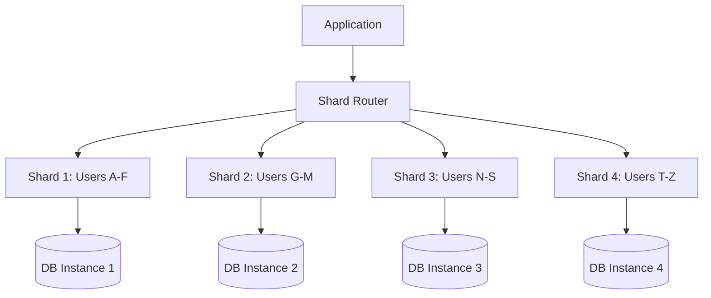
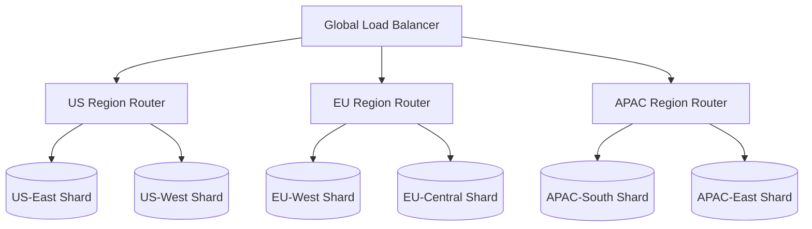
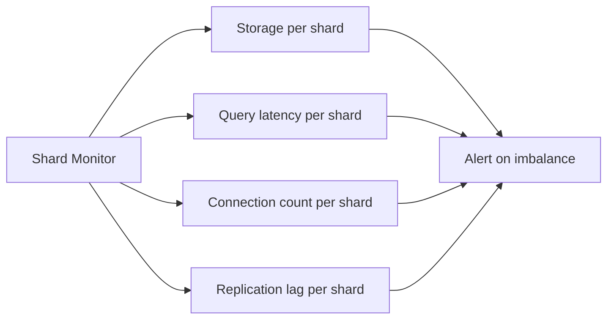

# Understanding Database Sharding Patterns and Strategies

Author: [nawazdhandala](https://www.github.com/nawazdhandala)

Tags: Database, Sharding, Scaling, Distributed, Patterns

Description: A guide to database sharding patterns including hash-based, range-based, and geo-based sharding strategies.

---

When a single database server can no longer handle your workload, sharding is one of the most effective scaling strategies. Sharding splits your data across multiple database instances, distributing both the storage and the query load. This guide walks through the most common sharding patterns and their tradeoffs.

## What Is Sharding?

Sharding is horizontal partitioning of data across multiple database instances. Each instance (shard) holds a subset of the total data, and a routing layer directs queries to the correct shard.



## Pattern 1: Hash-Based Sharding

Hash-based sharding applies a hash function to the shard key and uses the result to determine which shard holds the data. This distributes data evenly across shards.

```python
# hash_shard_router.py
# Routes queries to the correct shard using consistent hashing

import hashlib

class HashShardRouter:
    def __init__(self, shard_count):
        # Total number of shards in the cluster
        self.shard_count = shard_count
        # Map shard index to database connection config
        self.shard_configs = {}

    def register_shard(self, shard_index, config):
        """Register a shard with its connection configuration."""
        self.shard_configs[shard_index] = config

    def get_shard(self, shard_key):
        """Determine which shard holds data for the given key."""
        # Compute MD5 hash of the shard key
        hash_value = hashlib.md5(str(shard_key).encode()).hexdigest()

        # Convert first 8 hex chars to integer
        numeric_hash = int(hash_value[:8], 16)

        # Modulo by shard count to get shard index
        shard_index = numeric_hash % self.shard_count

        return shard_index, self.shard_configs[shard_index]

    def route_query(self, shard_key, query, params=None):
        """Route a query to the appropriate shard."""
        shard_index, config = self.get_shard(shard_key)
        print(f"Routing to shard {shard_index} for key {shard_key}")
        # In production, execute query against the shard connection
        return shard_index


# Example usage
router = HashShardRouter(shard_count=4)
router.register_shard(0, {"host": "shard-0.db.example.com"})
router.register_shard(1, {"host": "shard-1.db.example.com"})
router.register_shard(2, {"host": "shard-2.db.example.com"})
router.register_shard(3, {"host": "shard-3.db.example.com"})

# Route queries for different user IDs
for user_id in [1001, 1002, 1003, 1004, 1005]:
    shard = router.route_query(user_id, "SELECT * FROM users WHERE id = %s")
```

## Pattern 2: Range-Based Sharding

Range-based sharding assigns data to shards based on value ranges of the shard key. This works well when queries frequently access contiguous ranges of data.

```python
# range_shard_router.py
# Routes queries based on value ranges

class RangeShardRouter:
    def __init__(self):
        # Each range maps to a shard configuration
        # Format: (lower_bound, upper_bound, shard_config)
        self.ranges = []

    def add_range(self, lower, upper, shard_name, config):
        """Add a range-to-shard mapping."""
        self.ranges.append({
            "lower": lower,
            "upper": upper,
            "shard_name": shard_name,
            "config": config
        })

    def get_shard(self, value):
        """Find the shard for a given value."""
        for r in self.ranges:
            # Check if value falls within this range
            if r["lower"] <= value < r["upper"]:
                return r["shard_name"], r["config"]

        raise ValueError(f"No shard found for value {value}")


# Set up date-based range sharding for time-series data
router = RangeShardRouter()

# Each year of data goes to a different shard
router.add_range(2023_01, 2024_01, "shard_2023", {"host": "ts-2023.db.example.com"})
router.add_range(2024_01, 2025_01, "shard_2024", {"host": "ts-2024.db.example.com"})
router.add_range(2025_01, 2026_01, "shard_2025", {"host": "ts-2025.db.example.com"})
router.add_range(2026_01, 2027_01, "shard_2026", {"host": "ts-2026.db.example.com"})
```

## Pattern 3: Geo-Based Sharding

Geo-based sharding routes data to shards based on geographic location. This reduces latency for users by keeping their data close to them.



```python
# geo_shard_router.py
# Routes data based on geographic region

class GeoShardRouter:
    def __init__(self):
        # Map country codes to region shards
        self.country_to_region = {}
        # Map regions to shard configs
        self.region_configs = {}

    def register_region(self, region, config, countries):
        """Register a region shard with its countries."""
        self.region_configs[region] = config
        for country in countries:
            self.country_to_region[country] = region

    def get_shard(self, country_code):
        """Get the shard for a given country code."""
        region = self.country_to_region.get(country_code)
        if not region:
            # Fall back to a default region for unknown countries
            region = "us-east"
        return region, self.region_configs[region]


# Configure geo-based routing
router = GeoShardRouter()

router.register_region(
    "us-east",
    {"host": "us-east.db.example.com", "port": 5432},
    ["US", "CA", "MX", "BR"]
)

router.register_region(
    "eu-west",
    {"host": "eu-west.db.example.com", "port": 5432},
    ["GB", "FR", "DE", "ES", "IT"]
)

router.register_region(
    "apac-east",
    {"host": "apac-east.db.example.com", "port": 5432},
    ["JP", "KR", "AU", "SG", "IN"]
)
```

## Handling Cross-Shard Queries

One of the biggest challenges with sharding is handling queries that span multiple shards. A scatter-gather pattern sends the query to all relevant shards and merges the results.

```python
# scatter_gather.py
# Execute queries across multiple shards and merge results

import asyncio
from typing import List, Dict, Any

async def query_shard(shard_config, query, params):
    """Execute a query against a single shard."""
    # Simulate async database query
    # In production, use an async database driver
    print(f"Querying shard at {shard_config['host']}")
    await asyncio.sleep(0.1)  # Simulated latency
    return [{"id": 1, "count": 42}]  # Simulated result

async def scatter_gather_query(shard_configs, query, params=None):
    """Send query to all shards and gather results."""
    # Create tasks for all shards in parallel
    tasks = [
        query_shard(config, query, params)
        for config in shard_configs
    ]

    # Wait for all shards to respond
    results = await asyncio.gather(*tasks, return_exceptions=True)

    # Merge results from all shards
    merged = []
    for i, result in enumerate(results):
        if isinstance(result, Exception):
            print(f"Shard {i} failed: {result}")
            continue
        merged.extend(result)

    return merged
```

## Choosing a Shard Key

The shard key determines how evenly data is distributed and how efficiently queries can be routed.

| Criteria | Hash-Based | Range-Based | Geo-Based |
|----------|-----------|-------------|-----------|
| Data distribution | Even | Can be uneven | Varies by region |
| Range queries | Requires scatter | Efficient | Regional only |
| Hotspot risk | Low | High | Medium |
| Data locality | None | Temporal | Geographic |
| Rebalancing | Difficult | Add new ranges | Add new regions |

## Monitoring Sharded Databases

Monitor each shard individually for storage usage, query latency, and connection count. Watch for shard imbalance where one shard gets significantly more traffic than others.



With **OneUptime**, you can set up per-shard monitoring dashboards and alerts. Track query latency, storage growth, and replication lag across all your shards from a single observability platform to catch imbalances before they cause performance issues.
