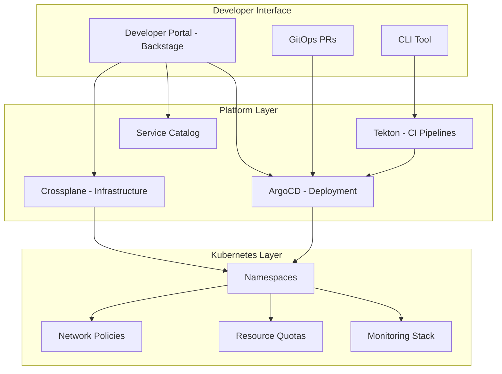
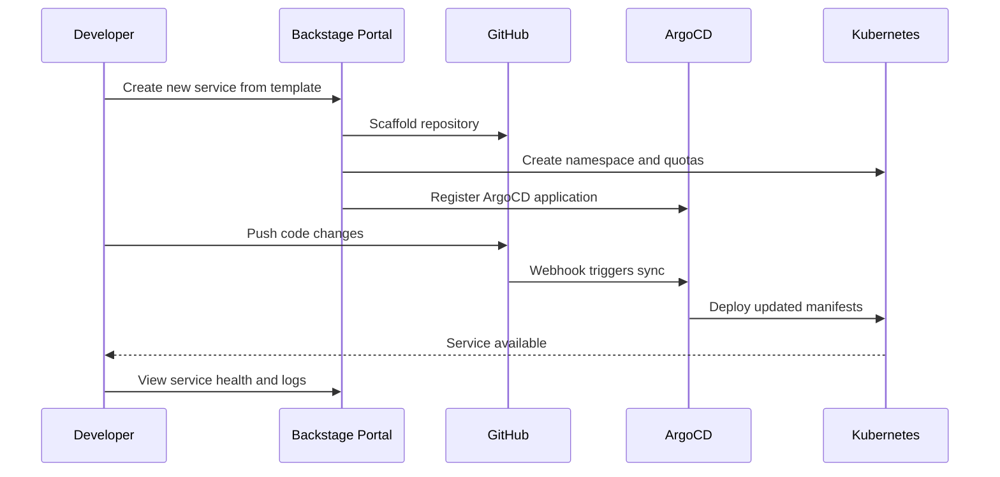

# How to Build an Internal Developer Platform on Kubernetes

Author: [nawazdhandala](https://www.github.com/nawazdhandala)

Tags: Developer Experience, Platform Engineering, Kubernetes, IDP, DevOps

Description: Learn how to build an internal developer platform on Kubernetes to improve developer productivity and reduce cognitive load.

---

Platform engineering is about building self-service capabilities that let developers deploy, manage, and observe their applications without needing deep infrastructure expertise. An Internal Developer Platform (IDP) abstracts away Kubernetes complexity and provides golden paths - opinionated, well-supported workflows that make the right thing the easy thing.

This guide shows you how to build an IDP on Kubernetes using open-source tools.

## Platform Architecture



## Step 1: Set Up Backstage as the Developer Portal

Backstage is the developer portal that acts as the single pane of glass for your platform.

```bash
# Create a new Backstage app
npx @backstage/create-app@latest --path my-developer-portal
cd my-developer-portal

# Install the Kubernetes plugin for viewing cluster resources
yarn --cwd packages/backend add @backstage/plugin-kubernetes-backend
yarn --cwd packages/app add @backstage/plugin-kubernetes
```

```yaml
# app-config.yaml (Backstage configuration)
# Configure Backstage to connect to your Kubernetes cluster
app:
  title: "Engineering Platform"
  baseUrl: http://localhost:3000

kubernetes:
  serviceLocatorMethod:
    type: multiTenant
  clusterLocatorMethods:
    - type: config
      clusters:
        - url: https://kubernetes.default.svc
          name: production
          authProvider: serviceAccount
          # Token for Backstage to read cluster resources
          serviceAccountToken: ${K8S_SA_TOKEN}
          skipTLSVerify: false

catalog:
  # Define where to discover service catalog entries
  locations:
    - type: url
      target: https://github.com/myorg/service-catalog/blob/main/catalog-info.yaml
      rules:
        - allow: [Component, System, API, Resource, Template]
```

## Step 2: Create Software Templates

Software templates let developers scaffold new services with best practices baked in.

```yaml
# template.yaml
# A Backstage template for creating a new Python microservice
apiVersion: scaffolder.backstage.io/v1beta3
kind: Template
metadata:
  name: python-microservice
  title: Python Microservice
  description: Create a new Python microservice with FastAPI, Docker, and Kubernetes manifests
  tags:
    - python
    - fastapi
    - recommended
spec:
  owner: platform-team
  type: service
  parameters:
    - title: Service Information
      required:
        - name
        - team
      properties:
        name:
          title: Service Name
          type: string
          description: Unique name for the service (lowercase, hyphens allowed)
          pattern: "^[a-z][a-z0-9-]*$"
        team:
          title: Owning Team
          type: string
          enum:
            - backend
            - frontend
            - data
            - platform
        description:
          title: Description
          type: string
    - title: Configuration
      properties:
        port:
          title: Service Port
          type: number
          default: 8080
        database:
          title: Needs Database?
          type: boolean
          default: false
        replicas:
          title: Replica Count
          type: number
          default: 2
          enum: [1, 2, 3, 5]
  steps:
    # Step 1: Scaffold the project from a template repository
    - id: fetch
      name: Fetch Template
      action: fetch:template
      input:
        url: ./skeleton
        values:
          name: ${{ parameters.name }}
          team: ${{ parameters.team }}
          port: ${{ parameters.port }}
          database: ${{ parameters.database }}
          replicas: ${{ parameters.replicas }}
    # Step 2: Create a GitHub repository
    - id: publish
      name: Create Repository
      action: publish:github
      input:
        repoUrl: github.com?owner=myorg&repo=${{ parameters.name }}
        description: ${{ parameters.description }}
        defaultBranch: main
    # Step 3: Create the Kubernetes namespace
    - id: create-namespace
      name: Create Namespace
      action: kubernetes:apply
      input:
        manifest:
          apiVersion: v1
          kind: Namespace
          metadata:
            name: ${{ parameters.name }}
            labels:
              team: ${{ parameters.team }}
              managed-by: backstage
    # Step 4: Register the service in the catalog
    - id: register
      name: Register in Catalog
      action: catalog:register
      input:
        repoContentsUrl: ${{ steps.publish.output.repoContentsUrl }}
        catalogInfoPath: /catalog-info.yaml
```

## Step 3: Set Up GitOps with ArgoCD

```yaml
# argocd-app-of-apps.yaml
# An ArgoCD Application that manages all team applications
apiVersion: argoproj.io/v1alpha1
kind: ApplicationSet
metadata:
  name: team-services
  namespace: argocd
spec:
  generators:
    # Automatically create ArgoCD Applications for each directory
    # in the deployments repository
    - git:
        repoURL: https://github.com/myorg/deployments.git
        revision: main
        directories:
          - path: "teams/*/services/*"
  template:
    metadata:
      name: "{{path.basename}}"
    spec:
      project: default
      source:
        repoURL: https://github.com/myorg/deployments.git
        targetRevision: main
        path: "{{path}}"
      destination:
        server: https://kubernetes.default.svc
        namespace: "{{path.basename}}"
      syncPolicy:
        automated:
          prune: true
          selfHeal: true
        syncOptions:
          - CreateNamespace=true
```

## Step 4: Self-Service Infrastructure with Crossplane

```yaml
# crossplane-composition.yaml
# Allows developers to request a PostgreSQL database through Kubernetes
apiVersion: apiextensions.crossplane.io/v1
kind: CompositeResourceDefinition
metadata:
  name: xdatabases.platform.example.com
spec:
  group: platform.example.com
  names:
    kind: XDatabase
    plural: xdatabases
  claimNames:
    kind: Database
    plural: databases
  versions:
    - name: v1alpha1
      served: true
      referenceable: true
      schema:
        openAPIV3Schema:
          type: object
          properties:
            spec:
              type: object
              properties:
                # Developers only need to specify size and engine
                size:
                  type: string
                  enum: ["small", "medium", "large"]
                engine:
                  type: string
                  enum: ["postgresql", "mysql"]
              required:
                - size
                - engine
---
# Composition that maps developer-friendly sizes to actual resources
apiVersion: apiextensions.crossplane.io/v1
kind: Composition
metadata:
  name: database-postgresql
spec:
  compositeTypeRef:
    apiVersion: platform.example.com/v1alpha1
    kind: XDatabase
  resources:
    - name: postgresql-instance
      base:
        apiVersion: database.aws.crossplane.io/v1beta1
        kind: RDSInstance
        spec:
          forProvider:
            engine: postgres
            engineVersion: "16"
            dbInstanceClass: db.t3.medium
            masterUsername: admin
            allocatedStorage: 20
            skipFinalSnapshotBeforeDeletion: true
```

Developers can then request a database with a simple claim:

```yaml
# database-claim.yaml
# A developer requests a database for their service
apiVersion: platform.example.com/v1alpha1
kind: Database
metadata:
  name: user-service-db
  namespace: user-service
spec:
  size: small
  engine: postgresql
```

## Developer Workflow



## Step 5: Build a Platform CLI

```python
#!/usr/bin/env python3
# platform-cli.py
# A CLI tool for common developer tasks on the platform
import subprocess
import sys
import json

def create_service(name, team, port=8080):
    """Scaffold a new service using the Backstage template."""
    print(f"Creating service '{name}' for team '{team}'...")

    # Apply the namespace with standard labels
    namespace_manifest = {
        "apiVersion": "v1",
        "kind": "Namespace",
        "metadata": {
            "name": name,
            "labels": {
                "team": team,
                "managed-by": "platform-cli",
            },
        },
    }

    # Write and apply the manifest
    manifest_json = json.dumps(namespace_manifest)
    result = subprocess.run(
        ["kubectl", "apply", "-f", "-"],
        input=manifest_json,
        capture_output=True,
        text=True,
    )

    if result.returncode == 0:
        print(f"Namespace '{name}' created successfully")
    else:
        print(f"Error: {result.stderr}")
        sys.exit(1)

def get_service_status(name):
    """Check the health of a deployed service."""
    # Get pods in the service namespace
    result = subprocess.run(
        ["kubectl", "get", "pods", "-n", name, "-o", "json"],
        capture_output=True,
        text=True,
    )

    if result.returncode != 0:
        print(f"Service '{name}' not found")
        return

    pods = json.loads(result.stdout)
    total = len(pods.get("items", []))
    ready = sum(
        1
        for pod in pods.get("items", [])
        if all(
            cs.get("ready", False)
            for cs in pod.get("status", {}).get("containerStatuses", [])
        )
    )
    print(f"Service: {name}")
    print(f"Pods: {ready}/{total} ready")

if __name__ == "__main__":
    if len(sys.argv) < 2:
        print("Usage: platform-cli.py [create|status] ...")
        sys.exit(1)

    command = sys.argv[1]
    if command == "create":
        create_service(sys.argv[2], sys.argv[3])
    elif command == "status":
        get_service_status(sys.argv[2])
```

## Measuring Platform Success

An IDP is only valuable if it actually improves developer productivity. Track metrics like deployment frequency, lead time for changes, time to onboard a new service, and developer satisfaction.

For monitoring the platform itself and the services running on it, [OneUptime](https://oneuptime.com) provides a complete observability solution. Integrate it into your Backstage portal to give developers visibility into service health, uptime, and incident history. OneUptime's status pages can be embedded into Backstage so that every team has a single place to check service reliability. Combined with OpenTelemetry tracing and on-call scheduling, OneUptime ensures that your platform team can support developers effectively while maintaining high service availability.
