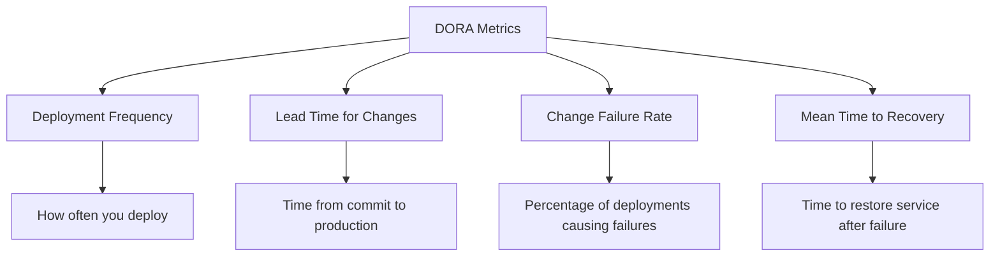
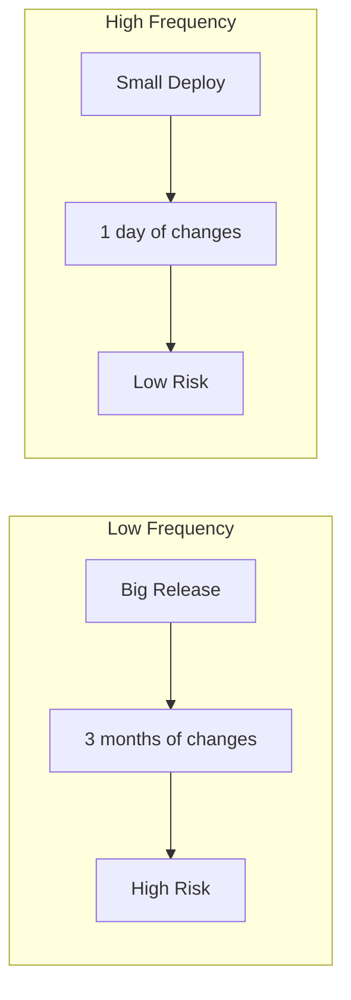
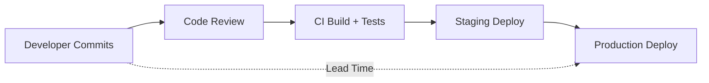
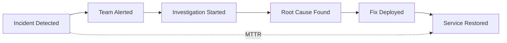
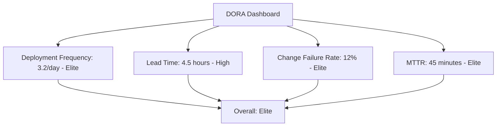

# Understanding DORA Metrics for DevOps Performance

Author: [nawazdhandala](https://www.github.com/nawazdhandala)

Tags: DevOps, DORA Metrics, Performance, Deployment Frequency, Lead Time

Description: A guide to DORA metrics including deployment frequency, lead time, MTTR, and change failure rate for measuring DevOps performance.

---

DORA (DevOps Research and Assessment) metrics are the industry standard for measuring software delivery performance. They tell you how fast you ship, how often you break things, and how quickly you recover. This guide explains each metric, how to measure it, and how to improve it.

## The Four Key Metrics

The DORA team identified four metrics that separate high-performing teams from low-performing ones:



## Performance Levels

| Metric | Elite | High | Medium | Low |
|---|---|---|---|---|
| Deployment Frequency | On-demand, multiple per day | Weekly to monthly | Monthly to every 6 months | Less than once every 6 months |
| Lead Time for Changes | Less than 1 hour | 1 day to 1 week | 1 week to 1 month | More than 6 months |
| Change Failure Rate | 0-15% | 16-30% | 16-30% | 46-60% |
| Mean Time to Recovery | Less than 1 hour | Less than 1 day | 1 day to 1 week | More than 6 months |

## Metric 1: Deployment Frequency

Deployment frequency measures how often your team deploys code to production. Higher frequency means smaller changes, which means lower risk per deployment.



### How to Measure

```python
# deployment_frequency.py
# Calculate deployment frequency from your CI/CD pipeline data

from datetime import datetime, timedelta
from collections import defaultdict

def calculate_deployment_frequency(deployments: list[dict]) -> dict:
    """
    Calculate deployment frequency from a list of deployment records.

    Each deployment record should have:
    - timestamp: ISO format datetime string
    - service: Name of the deployed service
    - environment: Target environment (production, staging, etc.)
    """
    # Filter to production deployments only
    prod_deployments = [
        d for d in deployments
        if d["environment"] == "production"
    ]

    if not prod_deployments:
        return {"frequency": "none", "deploys_per_day": 0}

    # Sort by timestamp
    prod_deployments.sort(key=lambda d: d["timestamp"])

    # Calculate the time span
    first = datetime.fromisoformat(prod_deployments[0]["timestamp"])
    last = datetime.fromisoformat(prod_deployments[-1]["timestamp"])
    days = max((last - first).days, 1)

    # Calculate frequency
    total_deploys = len(prod_deployments)
    deploys_per_day = total_deploys / days

    # Classify the performance level
    if deploys_per_day >= 1:
        level = "elite"
    elif deploys_per_day >= 1 / 7:
        level = "high"
    elif deploys_per_day >= 1 / 30:
        level = "medium"
    else:
        level = "low"

    # Group by day for trend analysis
    daily_counts = defaultdict(int)
    for d in prod_deployments:
        day = d["timestamp"][:10]  # Extract YYYY-MM-DD
        daily_counts[day] += 1

    return {
        "total_deployments": total_deploys,
        "days_measured": days,
        "deploys_per_day": round(deploys_per_day, 2),
        "level": level,
        "daily_breakdown": dict(daily_counts),
    }
```

### How to Improve

- Automate your deployment pipeline end-to-end.
- Reduce manual approval gates.
- Use feature flags to decouple deployment from release.
- Break monoliths into independently deployable services.

## Metric 2: Lead Time for Changes

Lead time measures the time from when a developer commits code to when that code is running in production.



### How to Measure

```python
# lead_time.py
# Calculate lead time from commit to production deployment

from datetime import datetime

def calculate_lead_time(changes: list[dict]) -> dict:
    """
    Calculate lead time for changes.

    Each change record should have:
    - commit_timestamp: When the code was committed
    - deploy_timestamp: When it reached production
    - pull_request_id: The PR that included this change
    """
    if not changes:
        return {"median_hours": 0, "level": "none"}

    lead_times = []

    for change in changes:
        commit_time = datetime.fromisoformat(change["commit_timestamp"])
        deploy_time = datetime.fromisoformat(change["deploy_timestamp"])

        # Calculate the difference in hours
        diff = deploy_time - commit_time
        hours = diff.total_seconds() / 3600
        lead_times.append(hours)

    # Sort and find the median
    lead_times.sort()
    median_index = len(lead_times) // 2
    median_hours = lead_times[median_index]

    # Classify the performance level
    if median_hours < 1:
        level = "elite"
    elif median_hours < 24 * 7:
        level = "high"
    elif median_hours < 24 * 30:
        level = "medium"
    else:
        level = "low"

    return {
        "median_hours": round(median_hours, 1),
        "p90_hours": round(lead_times[int(len(lead_times) * 0.9)], 1),
        "min_hours": round(min(lead_times), 1),
        "max_hours": round(max(lead_times), 1),
        "total_changes": len(changes),
        "level": level,
    }
```

### How to Improve

- Keep pull requests small (under 400 lines).
- Automate code review checks with linters and static analysis.
- Run tests in parallel to speed up CI.
- Use trunk-based development instead of long-lived branches.

## Metric 3: Change Failure Rate

Change failure rate is the percentage of deployments that cause a failure in production. This includes outages, degraded service, rollbacks, and hotfixes.

```python
# change_failure_rate.py
# Calculate the percentage of deployments that cause failures

def calculate_change_failure_rate(deployments: list[dict]) -> dict:
    """
    Calculate the change failure rate.

    Each deployment record should have:
    - id: Unique deployment identifier
    - timestamp: When it was deployed
    - caused_incident: Boolean indicating if it caused a failure
    - rollback_required: Boolean if a rollback was needed
    """
    if not deployments:
        return {"rate": 0, "level": "none"}

    total = len(deployments)

    # Count deployments that caused any kind of failure
    failures = sum(
        1 for d in deployments
        if d.get("caused_incident") or d.get("rollback_required")
    )

    rate = (failures / total) * 100

    # Classify the performance level
    if rate <= 15:
        level = "elite"
    elif rate <= 30:
        level = "high"
    elif rate <= 45:
        level = "medium"
    else:
        level = "low"

    return {
        "total_deployments": total,
        "failed_deployments": failures,
        "rate_percent": round(rate, 1),
        "level": level,
    }
```

### How to Improve

- Increase test coverage, especially integration and end-to-end tests.
- Use canary deployments to catch issues with a small percentage of traffic.
- Implement progressive rollouts with automated rollback triggers.
- Run chaos engineering experiments to find hidden failure modes.

## Metric 4: Mean Time to Recovery (MTTR)

MTTR measures how long it takes to restore service after a production failure. This is the most important metric for reliability.



```python
# mttr.py
# Calculate mean time to recovery from incident data

from datetime import datetime

def calculate_mttr(incidents: list[dict]) -> dict:
    """
    Calculate mean time to recovery.

    Each incident record should have:
    - detected_at: When the incident was first detected
    - resolved_at: When service was fully restored
    - severity: Severity level of the incident
    """
    if not incidents:
        return {"mean_hours": 0, "level": "none"}

    recovery_times = []

    for incident in incidents:
        detected = datetime.fromisoformat(incident["detected_at"])
        resolved = datetime.fromisoformat(incident["resolved_at"])

        hours = (resolved - detected).total_seconds() / 3600
        recovery_times.append(hours)

    # Calculate mean and median
    mean_hours = sum(recovery_times) / len(recovery_times)

    recovery_times.sort()
    median_index = len(recovery_times) // 2
    median_hours = recovery_times[median_index]

    # Classify the performance level
    if mean_hours < 1:
        level = "elite"
    elif mean_hours < 24:
        level = "high"
    elif mean_hours < 24 * 7:
        level = "medium"
    else:
        level = "low"

    return {
        "mean_hours": round(mean_hours, 1),
        "median_hours": round(median_hours, 1),
        "total_incidents": len(incidents),
        "level": level,
    }
```

### How to Improve

- Set up comprehensive monitoring and alerting.
- Maintain runbooks for common failure scenarios.
- Practice incident response with game days.
- Automate rollback procedures.
- Use feature flags to disable broken features without redeploying.

## Building a DORA Dashboard

```python
# dora_dashboard.py
# Combine all four metrics into a single dashboard view

def generate_dora_report(
    deployments: list[dict],
    changes: list[dict],
    incidents: list[dict],
) -> dict:
    """Generate a complete DORA metrics report."""

    freq = calculate_deployment_frequency(deployments)
    lead = calculate_lead_time(changes)
    cfr = calculate_change_failure_rate(deployments)
    mttr = calculate_mttr(incidents)

    # Determine overall performance level
    levels = [freq["level"], lead["level"], cfr["level"], mttr["level"]]
    level_scores = {"elite": 4, "high": 3, "medium": 2, "low": 1, "none": 0}
    avg_score = sum(level_scores[l] for l in levels) / len(levels)

    if avg_score >= 3.5:
        overall = "elite"
    elif avg_score >= 2.5:
        overall = "high"
    elif avg_score >= 1.5:
        overall = "medium"
    else:
        overall = "low"

    return {
        "overall_level": overall,
        "deployment_frequency": freq,
        "lead_time": lead,
        "change_failure_rate": cfr,
        "mttr": mttr,
    }
```



## Summary

DORA metrics give you an objective way to measure your DevOps performance. Track all four metrics together because they balance each other. Deploying fast means nothing if you break things constantly. Low failure rates do not matter if you only deploy once a quarter.

Use [OneUptime](https://oneuptime.com) to track your MTTR automatically. Its incident management and monitoring capabilities give you the data you need to measure recovery times and identify bottlenecks in your incident response process.
