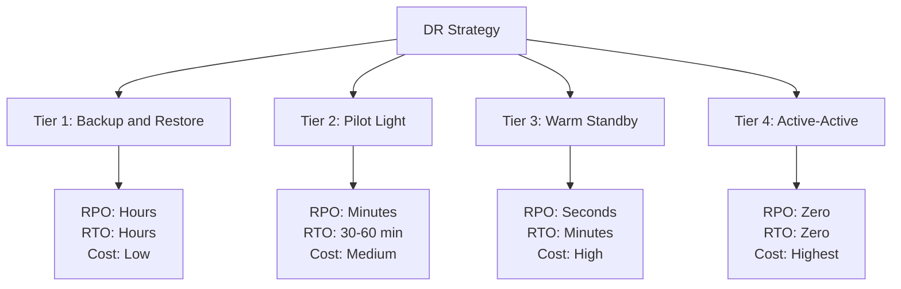
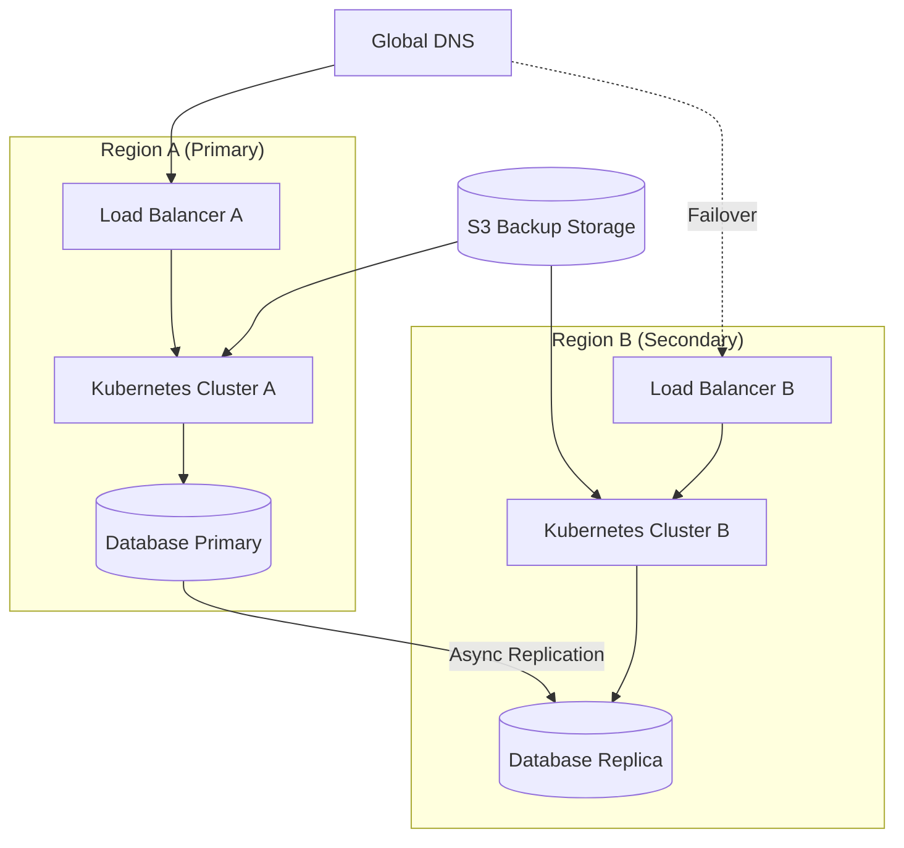
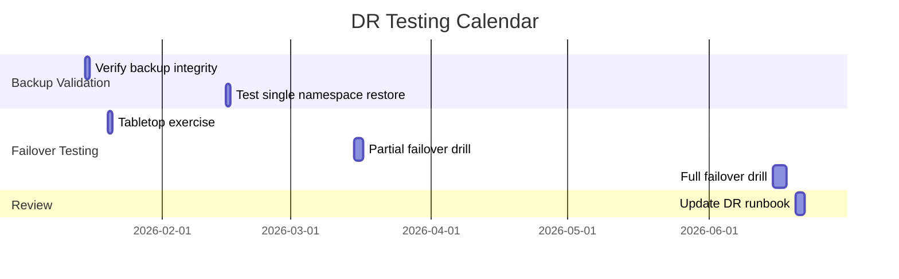

# How to Plan Disaster Recovery for Kubernetes Applications

Author: [nawazdhandala](https://www.github.com/nawazdhandala)

Tags: Disaster Recovery, Kubernetes, Backup, Multi-Region, Resilience

Description: A practical guide to planning disaster recovery for Kubernetes applications including backup strategies and multi-region setups.

---

Disaster recovery (DR) is not optional for production Kubernetes workloads. Hardware failures, network outages, data corruption, and even human errors can take down your applications. A well-planned DR strategy ensures that you can recover quickly and minimize data loss when the worst happens.

This guide covers backup strategies, multi-region architectures, and recovery procedures for Kubernetes applications.

## Disaster Recovery Tiers



RPO (Recovery Point Objective) is how much data you can afford to lose. RTO (Recovery Time Objective) is how long you can afford to be down. Choose your DR tier based on your business requirements and budget.

## Step 1: Back Up Kubernetes Resources with Velero

Velero is the standard tool for backing up Kubernetes cluster resources and persistent volumes.

```bash
# Install Velero with AWS S3 as the backup storage
velero install \
  --provider aws \
  --plugins velero/velero-plugin-for-aws:v1.9.0 \
  --bucket my-velero-backups \
  --backup-location-config region=us-east-1 \
  --snapshot-location-config region=us-east-1 \
  --secret-file ./credentials-velero

# Verify the installation
velero version
kubectl get pods -n velero
```

## Step 2: Create Backup Schedules

```yaml
# velero-schedules.yaml
# Automated backup schedules for different resource types
apiVersion: velero.io/v1
kind: Schedule
metadata:
  name: daily-full-backup
  namespace: velero
spec:
  # Run a full cluster backup every day at 2 AM UTC
  schedule: "0 2 * * *"
  template:
    # Include all namespaces except system namespaces
    excludedNamespaces:
      - kube-system
      - velero
    # Include persistent volume snapshots
    snapshotVolumes: true
    # Keep backups for 30 days
    ttl: 720h
    # Add metadata for tracking
    metadata:
      labels:
        backup-type: daily-full
---
apiVersion: velero.io/v1
kind: Schedule
metadata:
  name: hourly-critical-backup
  namespace: velero
spec:
  # Back up critical namespaces every hour
  schedule: "0 * * * *"
  template:
    includedNamespaces:
      - production
      - databases
    snapshotVolumes: true
    # Keep hourly backups for 7 days
    ttl: 168h
    metadata:
      labels:
        backup-type: hourly-critical
```

## Step 3: Back Up etcd

etcd stores all cluster state. Losing etcd without a backup means losing your entire cluster configuration.

```bash
#!/bin/bash
# etcd-backup.sh
# Creates an etcd snapshot and uploads it to S3

# Set the backup file name with a timestamp
BACKUP_FILE="etcd-snapshot-$(date +%Y%m%d-%H%M%S).db"
BACKUP_DIR="/var/backups/etcd"
S3_BUCKET="s3://my-etcd-backups"

# Create the backup directory if it does not exist
mkdir -p "$BACKUP_DIR"

# Take an etcd snapshot using the etcdctl tool
ETCDCTL_API=3 etcdctl snapshot save "$BACKUP_DIR/$BACKUP_FILE" \
  --endpoints=https://127.0.0.1:2379 \
  --cacert=/etc/kubernetes/pki/etcd/ca.crt \
  --cert=/etc/kubernetes/pki/etcd/server.crt \
  --key=/etc/kubernetes/pki/etcd/server.key

# Verify the snapshot is valid
ETCDCTL_API=3 etcdctl snapshot status "$BACKUP_DIR/$BACKUP_FILE" --write-out=table

# Upload the snapshot to S3 for off-site storage
aws s3 cp "$BACKUP_DIR/$BACKUP_FILE" "$S3_BUCKET/$BACKUP_FILE"

# Clean up local backups older than 7 days
find "$BACKUP_DIR" -name "etcd-snapshot-*" -mtime +7 -delete

echo "etcd backup completed: $BACKUP_FILE"
```

```yaml
# etcd-backup-cronjob.yaml
# Kubernetes CronJob to automate etcd backups
apiVersion: batch/v1
kind: CronJob
metadata:
  name: etcd-backup
  namespace: kube-system
spec:
  # Run every 6 hours
  schedule: "0 */6 * * *"
  jobTemplate:
    spec:
      template:
        spec:
          hostNetwork: true
          containers:
            - name: etcd-backup
              image: bitnami/etcd:3.5
              command: ["/bin/bash", "/scripts/etcd-backup.sh"]
              volumeMounts:
                - name: etcd-certs
                  mountPath: /etc/kubernetes/pki/etcd
                  readOnly: true
                - name: backup-script
                  mountPath: /scripts
          volumes:
            - name: etcd-certs
              hostPath:
                path: /etc/kubernetes/pki/etcd
            - name: backup-script
              configMap:
                name: etcd-backup-script
          restartPolicy: OnFailure
          nodeSelector:
            node-role.kubernetes.io/control-plane: ""
          tolerations:
            - key: node-role.kubernetes.io/control-plane
              effect: NoSchedule
```

## Multi-Region Architecture



## Step 4: Set Up Cross-Region Database Replication

```yaml
# postgres-replication.yaml
# PostgreSQL primary with streaming replication to a secondary region
apiVersion: postgresql.cnpg.io/v1
kind: Cluster
metadata:
  name: app-database
  namespace: databases
spec:
  instances: 3
  primaryUpdateStrategy: unsupervised
  storage:
    size: 100Gi
    storageClass: gp3-encrypted
  # Enable continuous archiving to S3
  backup:
    barmanObjectStore:
      destinationPath: "s3://my-db-backups/app-database"
      s3Credentials:
        accessKeyId:
          name: aws-creds
          key: ACCESS_KEY_ID
        secretAccessKey:
          name: aws-creds
          key: SECRET_ACCESS_KEY
      wal:
        compression: gzip
        # Archive WAL files every 5 minutes
        maxParallel: 2
    retentionPolicy: "30d"
  # External replica cluster in the secondary region
  replica:
    enabled: true
    source: app-database-primary
  externalClusters:
    - name: app-database-primary
      barmanObjectStore:
        destinationPath: "s3://my-db-backups/app-database"
        s3Credentials:
          accessKeyId:
            name: aws-creds
            key: ACCESS_KEY_ID
          secretAccessKey:
            name: aws-creds
            key: SECRET_ACCESS_KEY
```

## Step 5: Create a DR Runbook

```bash
#!/bin/bash
# dr-failover.sh
# Disaster recovery failover script

set -euo pipefail

SECONDARY_KUBECONFIG="/path/to/secondary-cluster-kubeconfig"
DNS_ZONE="example.com"
PRIMARY_REGION="us-east-1"
SECONDARY_REGION="us-west-2"

echo "Starting disaster recovery failover..."
echo "Time: $(date -u)"

# Step 1: Verify the secondary cluster is healthy
echo "Checking secondary cluster health..."
kubectl --kubeconfig="$SECONDARY_KUBECONFIG" get nodes
if [ $? -ne 0 ]; then
    echo "ERROR: Secondary cluster is not reachable"
    exit 1
fi

# Step 2: Restore from the latest Velero backup
echo "Restoring from latest backup..."
velero restore create dr-restore \
  --from-schedule daily-full-backup \
  --kubeconfig="$SECONDARY_KUBECONFIG"

# Wait for the restore to complete
velero restore wait dr-restore --kubeconfig="$SECONDARY_KUBECONFIG"

# Step 3: Promote the database replica to primary
echo "Promoting database replica..."
kubectl --kubeconfig="$SECONDARY_KUBECONFIG" \
  patch cluster app-database -n databases \
  --type merge \
  -p '{"spec":{"replica":{"enabled":false}}}'

# Step 4: Update DNS to point to the secondary region
echo "Updating DNS records..."
aws route53 change-resource-record-sets \
  --hosted-zone-id "$HOSTED_ZONE_ID" \
  --change-batch '{
    "Changes": [{
      "Action": "UPSERT",
      "ResourceRecordSet": {
        "Name": "app.example.com",
        "Type": "CNAME",
        "TTL": 60,
        "ResourceRecords": [{"Value": "lb-secondary.us-west-2.elb.amazonaws.com"}]
      }
    }]
  }'

# Step 5: Scale up workloads in the secondary region
echo "Scaling up workloads..."
kubectl --kubeconfig="$SECONDARY_KUBECONFIG" \
  scale deployment --all --replicas=3 -n production

echo "Failover complete. Verify application health manually."
```

## DR Testing Schedule



## Monitoring Your DR Readiness

Backups are useless if they are failing silently. You need to monitor backup job success rates, backup age, and restore test results continuously.

[OneUptime](https://oneuptime.com) helps you stay on top of disaster recovery readiness. Set up monitors for your Velero backup jobs and etcd snapshot CronJobs to ensure backups complete successfully. Use OneUptime's status pages to communicate outage status during a real disaster, and leverage on-call scheduling to ensure the right team members are notified immediately. With OpenTelemetry integration, you can also track recovery time metrics during DR drills to validate that your RTO targets are achievable.
