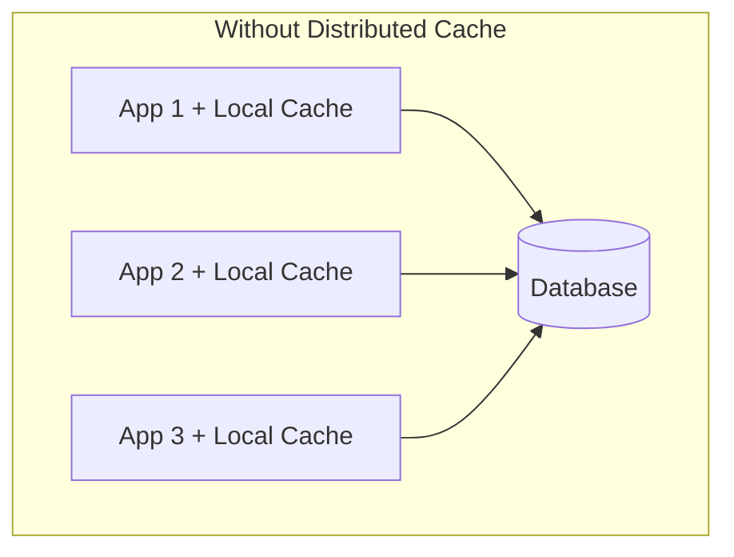
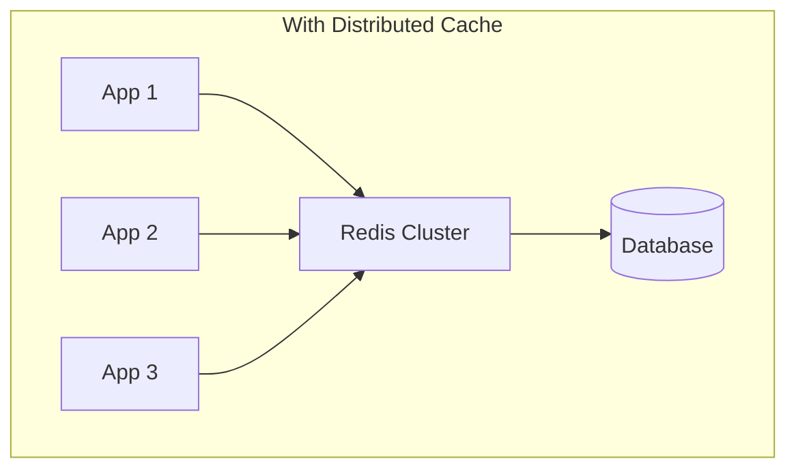
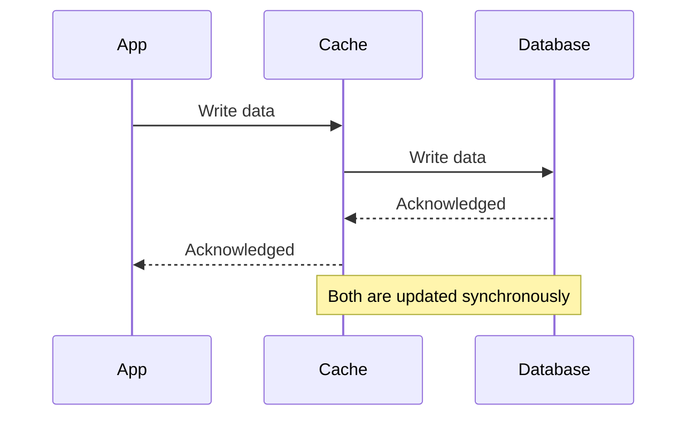
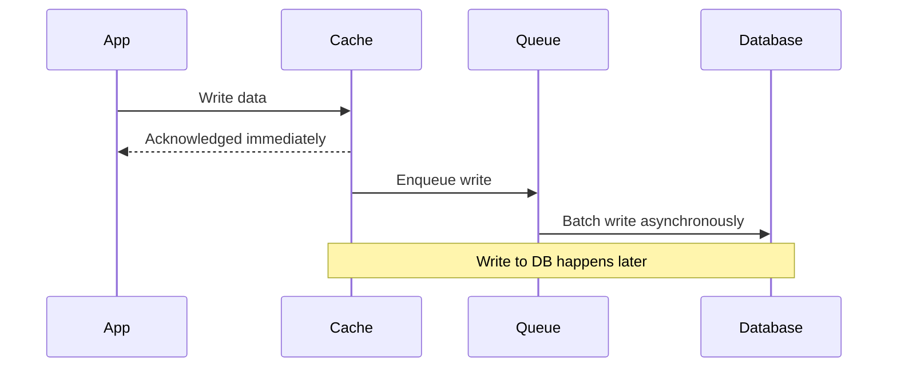

# How to Implement Distributed Caching Patterns

Author: [nawazdhandala](https://www.github.com/nawazdhandala)

Tags: Caching, Distributed Systems, Redis, Memcached, Performance

Description: Learn distributed caching patterns including cache invalidation, consistency, and strategies for multi-node deployments.

---

Caching is one of the most effective ways to improve application performance. But in distributed systems, caching becomes complex. You need to think about consistency, invalidation, replication, and failure modes. This guide covers the most important distributed caching patterns and when to use each one.

## Why Distributed Caching?

A local in-memory cache is fast but limited. When you run multiple application instances, each has its own cache with its own data. This leads to inconsistency and wasted memory. A distributed cache provides a shared cache layer that all instances access.





## Cache-Aside Pattern (Lazy Loading)

The most common caching pattern. The application checks the cache first. On a cache miss, it loads data from the database and stores it in the cache for future requests.

```python
import redis
import json
from typing import Optional

class CacheAsideRepository:
    """
    Implements the cache-aside pattern.
    The application manages cache reads and writes explicitly.
    """

    def __init__(self, redis_client: redis.Redis, db_connection):
        self.cache = redis_client
        self.db = db_connection
        # Default TTL of 5 minutes prevents stale data from living forever
        self.default_ttl = 300

    def get_user(self, user_id: str) -> Optional[dict]:
        cache_key = f"user:{user_id}"

        # Step 1: Check the cache first
        cached = self.cache.get(cache_key)
        if cached is not None:
            # Cache hit - return deserialized data
            return json.loads(cached)

        # Step 2: Cache miss - load from database
        user = self.db.query("SELECT * FROM users WHERE id = %s", (user_id,))
        if user is None:
            return None

        # Step 3: Store in cache for future requests
        self.cache.setex(
            cache_key,
            self.default_ttl,
            json.dumps(user)
        )

        return user

    def update_user(self, user_id: str, data: dict):
        # Update the database first (source of truth)
        self.db.execute(
            "UPDATE users SET name = %s WHERE id = %s",
            (data["name"], user_id)
        )

        # Invalidate the cache entry so the next read gets fresh data
        self.cache.delete(f"user:{user_id}")
```

## Write-Through Pattern

With write-through caching, every write goes to both the cache and the database synchronously. This ensures the cache is always up to date, at the cost of higher write latency.



```python
class WriteThroughCache:
    """
    Write-through pattern: writes go to both cache and database.
    The cache is always consistent with the database.
    """

    def __init__(self, redis_client, db_connection):
        self.cache = redis_client
        self.db = db_connection

    def save_product(self, product_id: str, product_data: dict):
        # Write to the database first
        self.db.execute(
            "INSERT INTO products (id, name, price) VALUES (%s, %s, %s) "
            "ON CONFLICT (id) DO UPDATE SET name = %s, price = %s",
            (product_id, product_data["name"], product_data["price"],
             product_data["name"], product_data["price"])
        )

        # Then write to the cache
        # If the cache write fails, the next read will repopulate it
        self.cache.setex(
            f"product:{product_id}",
            3600,  # 1 hour TTL as a safety net
            json.dumps(product_data)
        )

    def get_product(self, product_id: str) -> Optional[dict]:
        # Since writes always update the cache, reads are simple
        cached = self.cache.get(f"product:{product_id}")
        if cached:
            return json.loads(cached)

        # Fallback to database (cache may have expired or been evicted)
        product = self.db.query(
            "SELECT * FROM products WHERE id = %s", (product_id,)
        )
        if product:
            self.cache.setex(f"product:{product_id}", 3600, json.dumps(product))
        return product
```

## Write-Behind (Write-Back) Pattern

Writes go to the cache first and are asynchronously flushed to the database later. This provides very low write latency but risks data loss if the cache crashes before flushing.



## Cache Invalidation Strategies

Cache invalidation is famously one of the hardest problems in computer science. Here are the main strategies:

### TTL-Based Expiration

The simplest approach. Every cache entry has a time-to-live. After it expires, the next read fetches fresh data.

```python
# Simple TTL-based invalidation
# Good for data that can tolerate some staleness
redis_client.setex("config:feature_flags", 60, json.dumps(flags))  # 60 second TTL
```

### Event-Based Invalidation

When data changes, publish an event that tells all cache nodes to invalidate the affected entries.

```python
import redis

class EventBasedInvalidation:
    """
    Uses Redis Pub/Sub to notify all app instances
    when cached data becomes stale.
    """

    def __init__(self, redis_client: redis.Redis):
        self.cache = redis_client
        self.pubsub = redis_client.pubsub()

    def invalidate_and_notify(self, cache_key: str):
        """Delete the local entry and broadcast to other instances."""
        self.cache.delete(cache_key)
        # Publish the invalidation event to all subscribers
        self.cache.publish("cache:invalidation", cache_key)

    def listen_for_invalidations(self):
        """Background listener that processes invalidation events."""
        self.pubsub.subscribe("cache:invalidation")
        for message in self.pubsub.listen():
            if message["type"] == "message":
                key = message["data"].decode("utf-8")
                self.cache.delete(key)
```

### Version-Based Invalidation

Instead of deleting cache entries, change the cache key by incrementing a version number.

```python
class VersionedCache:
    """
    Uses version numbers in cache keys to invalidate
    entire groups of related cache entries at once.
    """

    def __init__(self, redis_client):
        self.cache = redis_client

    def get_version(self, namespace: str) -> int:
        """Get the current version for a cache namespace."""
        version = self.cache.get(f"version:{namespace}")
        return int(version) if version else 1

    def bump_version(self, namespace: str):
        """Increment version - all old cache entries become orphaned."""
        self.cache.incr(f"version:{namespace}")

    def cache_key(self, namespace: str, key: str) -> str:
        """Build a versioned cache key."""
        version = self.get_version(namespace)
        return f"{namespace}:v{version}:{key}"
```

## Cache Stampede Prevention

A cache stampede happens when many requests simultaneously miss the cache and all hit the database at once. This commonly occurs when a popular cache entry expires.

```python
import time
import threading

class StampedeProtectedCache:
    """
    Prevents cache stampedes using a lock mechanism.
    Only one request rebuilds the cache; others wait.
    """

    def __init__(self, redis_client, db_connection):
        self.cache = redis_client
        self.db = db_connection

    def get_with_lock(self, cache_key: str, query_fn, ttl: int = 300):
        # Try the cache first
        cached = self.cache.get(cache_key)
        if cached:
            return json.loads(cached)

        # Acquire a distributed lock to prevent stampede
        lock_key = f"lock:{cache_key}"
        acquired = self.cache.set(lock_key, "1", nx=True, ex=10)

        if acquired:
            # We got the lock - rebuild the cache
            try:
                data = query_fn()
                self.cache.setex(cache_key, ttl, json.dumps(data))
                return data
            finally:
                self.cache.delete(lock_key)
        else:
            # Another process is rebuilding - wait and retry
            time.sleep(0.1)
            return self.get_with_lock(cache_key, query_fn, ttl)
```

## Choosing a Caching Solution

| Feature | Redis | Memcached |
|---------|-------|-----------|
| Data structures | Rich (lists, sets, hashes) | Simple key-value |
| Persistence | Optional | None |
| Clustering | Built-in | Client-side |
| Memory efficiency | Good | Excellent |
| Pub/Sub | Yes | No |

## Monitoring Your Cache

Key metrics to track:

- **Hit ratio** - percentage of requests served from cache (target above 90%)
- **Eviction rate** - how often entries are removed due to memory pressure
- **Memory usage** - total cache memory consumption
- **Latency** - p50 and p99 cache operation times
- **Connection count** - active connections to the cache cluster

OneUptime makes it easy to monitor your distributed cache infrastructure. Track hit ratios, latency percentiles, eviction rates, and memory usage with custom dashboards. Set up alerts when your cache hit ratio drops or latency spikes, so you can address performance issues before users notice. Learn more at [https://oneuptime.com](https://oneuptime.com).
