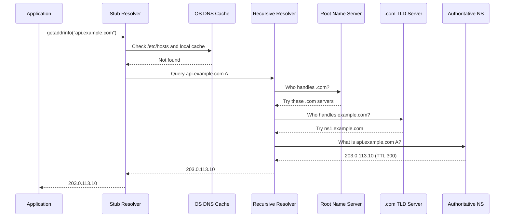
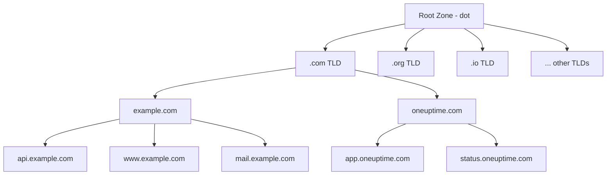
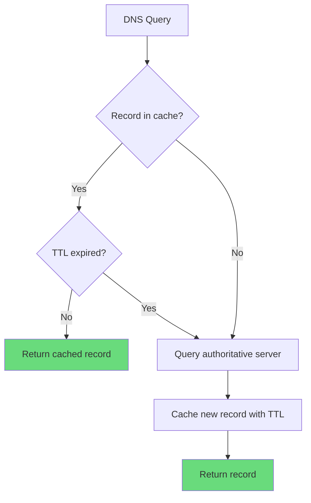
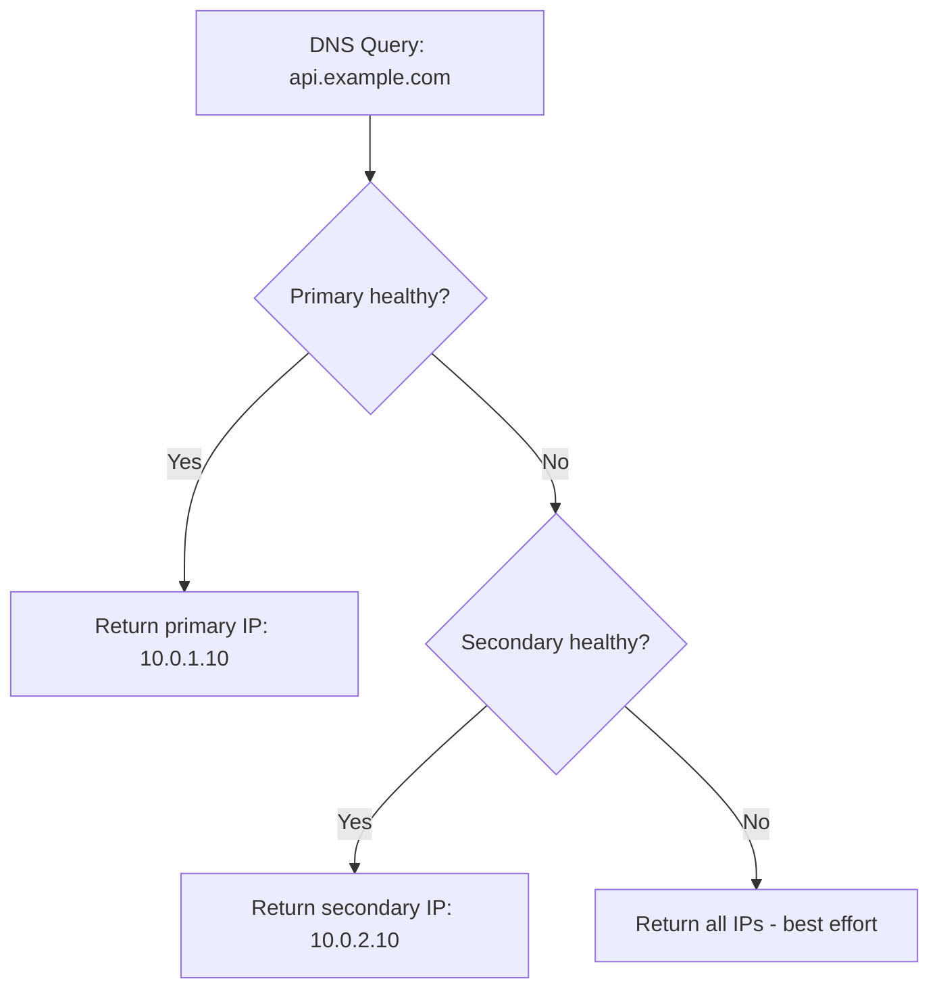

# DNS Fundamentals Every DevOps Engineer Should Know

Author: [nawazdhandala](https://www.github.com/nawazdhandala)

Tags: DNS, DevOps, Networking, Domain Names, Troubleshooting

Description: Essential DNS knowledge for DevOps engineers including record types, resolution process, caching, and common DNS issues.

---

DNS is one of those things that works silently until it breaks, and then everything breaks. As a DevOps engineer, understanding DNS deeply is essential. Misconfigured DNS causes outages, email delivery failures, certificate validation problems, and service discovery issues. This guide covers the DNS fundamentals you need for daily operations.

## How DNS Resolution Works

When your application makes a request to `api.example.com`, here is what happens behind the scenes.



## The DNS Hierarchy



## DNS Record Types

Understanding record types is fundamental to managing DNS correctly.

```bash
# A Record - Maps a hostname to an IPv4 address
# This is the most common record type
dig +short example.com A
# Output: 93.184.216.34

# AAAA Record - Maps a hostname to an IPv6 address
dig +short example.com AAAA
# Output: 2606:2800:220:1:248:1893:25c8:1946

# CNAME Record - Alias that points to another hostname
# IMPORTANT: CNAMEs cannot coexist with other records for the same name
# IMPORTANT: CNAMEs cannot be used at the zone apex (naked domain)
dig +short www.example.com CNAME
# Output: example.com.

# MX Record - Mail exchange servers with priority
# Lower priority number = higher preference
dig +short example.com MX
# Output: 10 mail1.example.com.
#         20 mail2.example.com.

# TXT Record - Text data used for verification and policies
# Common uses: SPF, DKIM, DMARC, domain verification
dig +short example.com TXT
# Output: "v=spf1 include:_spf.google.com ~all"

# NS Record - Authoritative name servers for a domain
dig +short example.com NS
# Output: ns1.example.com.
#         ns2.example.com.

# SOA Record - Start of Authority with zone metadata
dig +short example.com SOA
# Contains: primary NS, admin email, serial, refresh, retry, expire, minimum TTL

# SRV Record - Service location with port and priority
# Format: _service._protocol.domain
dig +short _http._tcp.example.com SRV
# Output: 10 60 80 web.example.com.

# PTR Record - Reverse DNS (IP to hostname)
dig +short -x 93.184.216.34
# Output: example.com.

# CAA Record - Certificate Authority Authorization
# Controls which CAs can issue certificates for your domain
dig +short example.com CAA
# Output: 0 issue "letsencrypt.org"
```

## TTL and Caching

TTL (Time To Live) controls how long DNS records are cached. Getting TTL right is critical for both performance and change management.



```bash
# Check the current TTL of a record
dig example.com | grep -E "^example" | awk '{print "TTL:", $2, "seconds"}'

# Common TTL values and their use cases:
# 300 (5 min)   - Good default for most records
# 60 (1 min)    - Records that change frequently
# 3600 (1 hr)   - Stable records like MX
# 86400 (1 day) - Very stable records like NS

# Before making a DNS change:
# 1. Lower the TTL well in advance (at least the old TTL duration before)
# 2. Wait for the old TTL to expire
# 3. Make the change
# 4. Verify the change has propagated
# 5. Raise the TTL back to normal
```

## Zone Files

A zone file defines all the DNS records for a domain. Understanding the format helps when managing DNS directly.

```
; Zone file for example.com
; SOA record defines zone authority and timing
$TTL 300
@   IN  SOA   ns1.example.com. admin.example.com. (
                2026022001  ; Serial number (YYYYMMDDNN)
                3600        ; Refresh interval (1 hour)
                900         ; Retry interval (15 minutes)
                604800      ; Expire time (7 days)
                300         ; Minimum TTL (5 minutes)
            )

; Name servers for this zone
@       IN  NS    ns1.example.com.
@       IN  NS    ns2.example.com.

; A records for the name servers themselves (glue records)
ns1     IN  A     203.0.113.1
ns2     IN  A     203.0.113.2

; Main domain records
@       IN  A     203.0.113.10
@       IN  AAAA  2001:db8::10

; Subdomains
www     IN  CNAME example.com.
api     IN  A     203.0.113.20
staging IN  A     203.0.113.30

; Mail records
@       IN  MX    10 mail1.example.com.
@       IN  MX    20 mail2.example.com.
mail1   IN  A     203.0.113.40
mail2   IN  A     203.0.113.41

; TXT records for email authentication
@       IN  TXT   "v=spf1 include:_spf.google.com ~all"

; CAA record to restrict certificate issuance
@       IN  CAA   0 issue "letsencrypt.org"
```

## Common DNS Patterns for DevOps

### Blue-Green Deployments with DNS

```bash
# Blue environment is live
# api.example.com -> 10.0.1.10 (blue)

# Deploy to green environment
# Test green at green-api.example.com -> 10.0.2.10

# Switch traffic by updating the DNS record
# api.example.com -> 10.0.2.10 (green)

# Use low TTL (60s) before the switch
# so old records expire quickly
```

### Weighted DNS for Gradual Rollouts

```
; Route 90% of traffic to stable, 10% to canary
; Using weighted routing (supported by Route53, Cloudflare, etc.)
api     IN  A     10.0.1.10  ; weight: 90
api     IN  A     10.0.2.10  ; weight: 10
```

### Health-Checked DNS Failover



## Troubleshooting DNS Issues

```bash
# Problem: DNS resolution is failing
# Step 1: Check if the resolver is reachable
dig @8.8.8.8 example.com

# Step 2: Check your configured resolvers
cat /etc/resolv.conf

# Step 3: Check if systemd-resolved is causing issues
resolvectl status

# Step 4: Trace the full resolution path
dig +trace example.com

# Problem: DNS changes are not propagating
# Step 1: Query the authoritative server directly
dig @ns1.example.com example.com

# Step 2: Check from multiple public resolvers
for dns in 8.8.8.8 1.1.1.1 9.9.9.9 208.67.222.222; do
    echo "=== $dns ==="
    dig @$dns +short example.com
done

# Step 3: Check the SOA serial number (must increment for changes to propagate)
dig example.com SOA +short

# Problem: CNAME and other records conflicting
# CNAMEs cannot coexist with any other record type
# This is INVALID:
# example.com  IN  CNAME  other.com.
# example.com  IN  MX     10 mail.example.com.
# Use an ALIAS or ANAME record at the zone apex instead (provider-specific)

# Problem: Slow DNS resolution
# Measure DNS lookup time
dig example.com | grep "Query time"

# Check if DNSSEC validation is causing delays
dig +dnssec example.com

# Check for DNS amplification or misconfiguration
dig +short example.com ANY
```

## DNS Security Basics

```bash
# DNSSEC - Verify a domain has DNSSEC enabled
dig +dnssec example.com

# Check DNSSEC chain of trust
dig +trace +dnssec example.com

# CAA Records - Restrict which CAs can issue certificates
dig example.com CAA +short

# SPF, DKIM, DMARC - Email authentication records
dig example.com TXT +short        # SPF
dig _dmarc.example.com TXT +short # DMARC
dig selector._domainkey.example.com TXT +short  # DKIM
```

## DNS Resolution on Linux

Understanding how Linux resolves DNS helps debug application-level issues.

```bash
# Resolution order is defined in /etc/nsswitch.conf
grep hosts /etc/nsswitch.conf
# Output: hosts: files dns
# This means: check /etc/hosts first, then DNS

# Check /etc/hosts for static entries
cat /etc/hosts

# Check resolver configuration
cat /etc/resolv.conf

# On systemd-based systems, check resolved config
resolvectl status
resolvectl query example.com

# Flush DNS cache on systemd-resolved
sudo resolvectl flush-caches

# Check if a specific application is using the expected resolver
strace -e trace=network -p <PID> 2>&1 | grep -i dns
```

## Conclusion

DNS is deceptively simple on the surface but complex in practice. The key takeaways are: understand your record types, plan TTL changes before DNS migrations, always test from multiple resolvers, and never put a CNAME at the zone apex. When DNS works well, nobody notices. When it breaks, everything breaks.

For monitoring your DNS infrastructure and catching resolution failures before your users do, [OneUptime](https://oneuptime.com) provides DNS monitors, uptime tracking, and instant alerting so you are always the first to know when something goes wrong.
