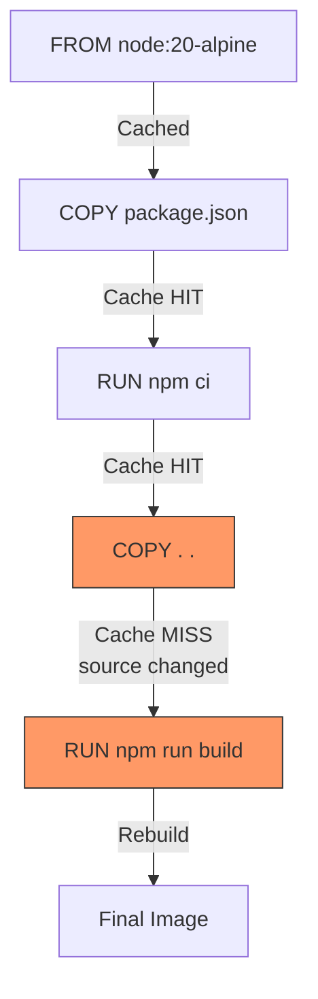
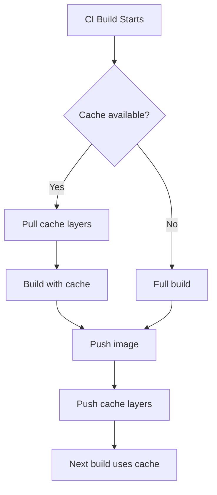
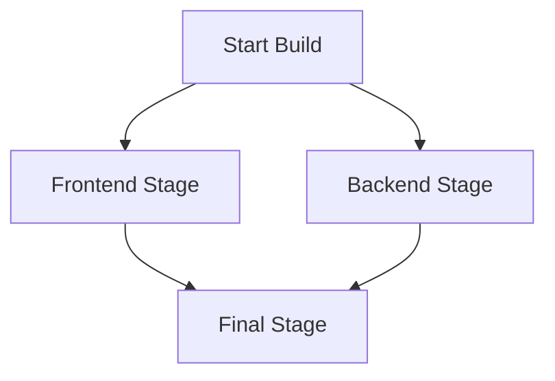

# How to Optimize Docker Build Cache for Faster CI/CD Pipelines

Author: [nawazdhandala](https://www.github.com/nawazdhandala)

Tags: Docker, Build Cache, CI/CD, Optimization, Performance

Description: Learn techniques for optimizing Docker build cache including layer ordering, cache mounts, and BuildKit features.

---

A Docker build that takes 15 minutes in CI can often be reduced to under 2 minutes with proper cache optimization. Since CI/CD pipelines run builds on every commit, those saved minutes add up to hours of developer productivity every week.

This guide covers practical techniques to make your Docker builds as fast as possible.

## How Docker Build Cache Works

Docker caches each layer (each instruction in a Dockerfile). If the instruction and its inputs have not changed since the last build, Docker reuses the cached layer instead of rebuilding it.



**The critical rule:** When a layer's cache is invalidated, all subsequent layers are also invalidated. This means layer ordering matters enormously.

## Rule 1: Order Instructions by Change Frequency

Put instructions that change rarely at the top and those that change often at the bottom:

```dockerfile
# GOOD: Optimal layer ordering
FROM node:20-alpine
WORKDIR /app

# Layer 1: System dependencies (changes rarely)
RUN apk add --no-cache curl

# Layer 2: Package manifest (changes occasionally)
COPY package.json package-lock.json ./

# Layer 3: Dependencies (changes when packages change)
RUN npm ci

# Layer 4: Source code (changes on every commit)
COPY . .

# Layer 5: Build (invalidated by source changes)
RUN npm run build
```

```dockerfile
# BAD: Everything invalidates on every change
FROM node:20-alpine
WORKDIR /app

# Copying everything first means ANY file change
# invalidates npm install and the build
COPY . .
RUN npm install
RUN npm run build
```

## Rule 2: Separate Dependency Installation from Code

```dockerfile
# Python example: Separate requirements from code
FROM python:3.12-slim

WORKDIR /app

# Copy only requirements first
COPY requirements.txt .

# This layer is cached unless requirements.txt changes
RUN pip install --no-cache-dir -r requirements.txt

# Source code changes do not invalidate the pip install layer
COPY . .

CMD ["python", "app.py"]
```

```dockerfile
# Go example: Separate go.mod from source
FROM golang:1.22-alpine

WORKDIR /app

# Copy and download dependencies first
COPY go.mod go.sum ./
RUN go mod download

# Source changes only rebuild from here
COPY . .
RUN go build -o /app/server ./cmd/server
```

## Rule 3: Use BuildKit Cache Mounts

BuildKit cache mounts persist caches between builds without adding them to image layers:

```dockerfile
# syntax=docker/dockerfile:1

FROM node:20-alpine
WORKDIR /app

COPY package.json package-lock.json ./

# Mount npm cache between builds
# The cache persists across builds but is not in the final image
RUN --mount=type=cache,target=/root/.npm \
    npm ci

COPY . .
RUN npm run build
```

```dockerfile
# syntax=docker/dockerfile:1

# Python with pip cache mount
FROM python:3.12-slim
WORKDIR /app

COPY requirements.txt .

# Pip cache persists between builds
RUN --mount=type=cache,target=/root/.cache/pip \
    pip install -r requirements.txt

COPY . .
```

```dockerfile
# syntax=docker/dockerfile:1

# Go with module cache mount
FROM golang:1.22-alpine
WORKDIR /app

COPY go.mod go.sum ./

# Go module cache and build cache persist between builds
RUN --mount=type=cache,target=/go/pkg/mod \
    --mount=type=cache,target=/root/.cache/go-build \
    go mod download

COPY . .

RUN --mount=type=cache,target=/go/pkg/mod \
    --mount=type=cache,target=/root/.cache/go-build \
    go build -o /app/server ./cmd/server
```

## Rule 4: Use .dockerignore

Prevent unnecessary files from invalidating the cache:

```
# .dockerignore
# Version control
.git
.gitignore

# Dependencies (installed in the container)
node_modules
vendor
__pycache__

# Build outputs
dist
build
*.pyc

# Development files
.env
.env.*
docker-compose*.yml
Dockerfile*
*.md
LICENSE

# IDE files
.vscode
.idea

# Test files
tests/
test/
coverage/
.pytest_cache
```

## Rule 5: Combine and Clean in the Same Layer

```dockerfile
# BAD: Leaves package manager cache in a layer
RUN apt-get update
RUN apt-get install -y curl wget git
RUN rm -rf /var/lib/apt/lists/*    # Too late, the cache is in previous layers

# GOOD: Install and clean up in one layer
RUN apt-get update \
    && apt-get install -y --no-install-recommends \
        curl \
        wget \
    && rm -rf /var/lib/apt/lists/*
```

## CI/CD Cache Strategies

### GitHub Actions with Docker Layer Caching

```yaml
# .github/workflows/build.yml
name: Build and Push
on:
  push:
    branches: [main]

jobs:
  build:
    runs-on: ubuntu-latest
    steps:
      - uses: actions/checkout@v4

      # Set up BuildKit with cache support
      - uses: docker/setup-buildx-action@v3

      - uses: docker/login-action@v3
        with:
          registry: ghcr.io
          username: ${{ github.actor }}
          password: ${{ secrets.GITHUB_TOKEN }}

      # Build with GitHub Actions cache backend
      - uses: docker/build-push-action@v5
        with:
          context: .
          push: true
          tags: ghcr.io/myorg/myapp:${{ github.sha }}
          # Cache layers in GitHub Actions cache
          cache-from: type=gha
          cache-to: type=gha,mode=max
```

### Registry-Based Caching

```bash
# Build with registry cache (works in any CI system)
docker buildx build \
  --cache-from type=registry,ref=registry.example.com/myapp:cache \
  --cache-to type=registry,ref=registry.example.com/myapp:cache,mode=max \
  --push \
  -t registry.example.com/myapp:latest \
  .
```



### GitLab CI with Docker Caching

```yaml
# .gitlab-ci.yml
build:
  image: docker:24
  services:
    - docker:24-dind
  variables:
    DOCKER_BUILDKIT: 1
  script:
    # Use the previous image as cache source
    - docker pull $CI_REGISTRY_IMAGE:latest || true

    - docker build
        --cache-from $CI_REGISTRY_IMAGE:latest
        --tag $CI_REGISTRY_IMAGE:$CI_COMMIT_SHA
        --tag $CI_REGISTRY_IMAGE:latest
        .

    - docker push $CI_REGISTRY_IMAGE:$CI_COMMIT_SHA
    - docker push $CI_REGISTRY_IMAGE:latest
```

## Measuring Build Performance

```bash
# Enable BuildKit for better performance output
export DOCKER_BUILDKIT=1

# Time the build
time docker build -t myapp .

# See detailed timing for each step
docker build -t myapp --progress=plain . 2>&1 | grep -E "^#[0-9]+"

# Compare cached vs uncached build time
docker builder prune -f                      # Clear cache
time docker build -t myapp .                 # Uncached: ~5 min
time docker build -t myapp .                 # Cached: ~10 sec
```

## Advanced: Parallel Build Stages

BuildKit builds independent stages in parallel:

```dockerfile
# syntax=docker/dockerfile:1

# These two stages build in parallel
FROM node:20-alpine AS frontend
WORKDIR /frontend
COPY frontend/package.json frontend/package-lock.json ./
RUN npm ci
COPY frontend/ .
RUN npm run build

FROM golang:1.22-alpine AS backend
WORKDIR /backend
COPY go.mod go.sum ./
RUN go mod download
COPY . .
RUN go build -o /backend/server ./cmd/server

# Final stage combines both outputs
FROM alpine:3.19
COPY --from=frontend /frontend/dist /app/static
COPY --from=backend /backend/server /app/server
EXPOSE 8080
CMD ["/app/server"]
```



## Conclusion

Docker build cache optimization is one of the highest-return investments you can make in your CI/CD pipeline. Order your layers correctly, use BuildKit cache mounts, maintain a proper `.dockerignore`, and configure CI-level caching to keep builds fast.

To monitor your CI/CD pipelines and containerized deployments, [OneUptime](https://oneuptime.com) provides infrastructure monitoring, alerting, and incident management that helps you catch deployment issues before they impact your users.
