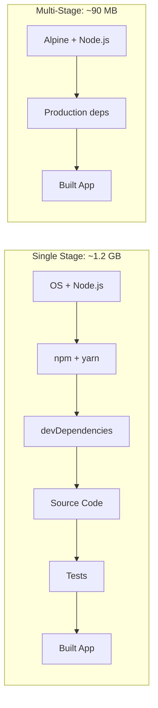
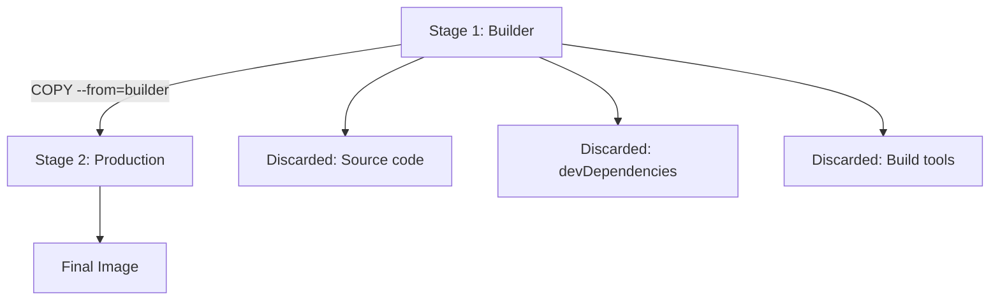
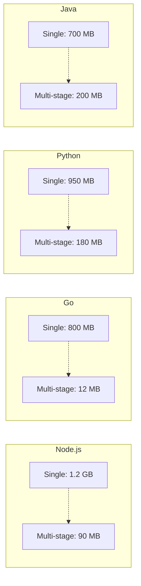

# How to Optimize Docker Images with Multi-Stage Builds

Author: [nawazdhandala](https://www.github.com/nawazdhandala)

Tags: Docker, Multi-Stage Builds, Optimization, Container Images, Best Practices

Description: Learn how to use Docker multi-stage builds to create smaller, more secure container images for production.

---

A typical Node.js Docker image built the naive way can be over 1 GB. The same application built with multi-stage builds can be under 100 MB. Smaller images mean faster pulls, less storage cost, reduced attack surface, and quicker container startup.

This guide shows you how to use multi-stage builds for real-world applications in multiple languages.

## The Problem with Single-Stage Builds

```dockerfile
# Bad example: Single-stage build (do not use in production)
FROM node:20

WORKDIR /app

# Copy everything including dev dependencies and source
COPY . .

# Install ALL dependencies including devDependencies
RUN npm install

# Build the application
RUN npm run build

# The final image contains:
# - Full Node.js runtime with npm
# - All devDependencies (TypeScript, ESLint, test frameworks)
# - Source code, test files, documentation
# - Build tools and compilers
# Result: ~1.2 GB image
CMD ["node", "dist/index.js"]
```



## How Multi-Stage Builds Work

Multi-stage builds use multiple `FROM` statements. Each `FROM` starts a new build stage. You can selectively copy artifacts from one stage to the next, leaving behind everything you do not need.



## Node.js Multi-Stage Build

```dockerfile
# Stage 1: Install dependencies
FROM node:20-alpine AS deps
WORKDIR /app

# Copy only package files first for better cache utilization
COPY package.json package-lock.json ./

# Install all dependencies (including devDependencies for build)
RUN npm ci

# Stage 2: Build the application
FROM node:20-alpine AS builder
WORKDIR /app

# Copy dependencies from the deps stage
COPY --from=deps /app/node_modules ./node_modules

# Copy source code
COPY . .

# Build the TypeScript/React application
RUN npm run build

# Stage 3: Production image
FROM node:20-alpine AS production
WORKDIR /app

# Set NODE_ENV to production
ENV NODE_ENV=production

# Create a non-root user for security
RUN addgroup -S appgroup && adduser -S appuser -G appgroup

# Copy only the production dependencies
COPY --from=deps /app/node_modules ./node_modules

# Copy only the built output
COPY --from=builder /app/dist ./dist
COPY --from=builder /app/package.json ./

# Remove devDependencies from node_modules
RUN npm prune --production

# Switch to non-root user
USER appuser

# Expose the application port
EXPOSE 3000

# Start the application
CMD ["node", "dist/index.js"]
```

## Go Multi-Stage Build

Go produces static binaries, making it ideal for tiny images:

```dockerfile
# Stage 1: Build the Go binary
FROM golang:1.22-alpine AS builder
WORKDIR /app

# Download dependencies first for cache efficiency
COPY go.mod go.sum ./
RUN go mod download

# Copy source code
COPY . .

# Build a static binary with all optimizations
# CGO_ENABLED=0 produces a static binary (no C dependencies)
# -ldflags="-s -w" strips debug info to reduce binary size
RUN CGO_ENABLED=0 GOOS=linux go build \
    -ldflags="-s -w" \
    -o /app/server \
    ./cmd/server

# Stage 2: Minimal production image
FROM scratch

# Copy SSL certificates for HTTPS support
COPY --from=builder /etc/ssl/certs/ca-certificates.crt /etc/ssl/certs/

# Copy the compiled binary
COPY --from=builder /app/server /server

# Expose port
EXPOSE 8080

# Run the binary
ENTRYPOINT ["/server"]
```

The final image is typically 10-15 MB because `scratch` contains absolutely nothing except your binary.

## Python Multi-Stage Build

```dockerfile
# Stage 1: Build dependencies with compilation tools
FROM python:3.12-slim AS builder
WORKDIR /app

# Install build dependencies needed to compile Python packages
RUN apt-get update && apt-get install -y --no-install-recommends \
    gcc \
    libpq-dev \
    && rm -rf /var/lib/apt/lists/*

# Create a virtual environment
RUN python -m venv /opt/venv
ENV PATH="/opt/venv/bin:$PATH"

# Install Python dependencies
COPY requirements.txt .
RUN pip install --no-cache-dir -r requirements.txt

# Stage 2: Production image without build tools
FROM python:3.12-slim AS production
WORKDIR /app

# Install only runtime dependencies (no compilers)
RUN apt-get update && apt-get install -y --no-install-recommends \
    libpq5 \
    && rm -rf /var/lib/apt/lists/*

# Copy the virtual environment from builder
COPY --from=builder /opt/venv /opt/venv
ENV PATH="/opt/venv/bin:$PATH"

# Create non-root user
RUN useradd --create-home appuser
USER appuser

# Copy application code
COPY --chown=appuser:appuser . .

EXPOSE 8000

CMD ["gunicorn", "app:create_app()", "--bind", "0.0.0.0:8000"]
```

## Java Multi-Stage Build

```dockerfile
# Stage 1: Build with Maven
FROM maven:3.9-eclipse-temurin-21 AS builder
WORKDIR /app

# Copy pom.xml first for dependency caching
COPY pom.xml .
RUN mvn dependency:go-offline -B

# Copy source and build
COPY src ./src
RUN mvn package -DskipTests -B

# Extract layers for Spring Boot (optional optimization)
RUN java -Djarmode=layertools -jar target/*.jar extract

# Stage 2: Minimal JRE image
FROM eclipse-temurin:21-jre-alpine AS production
WORKDIR /app

# Create non-root user
RUN addgroup -S spring && adduser -S spring -G spring
USER spring

# Copy Spring Boot layers in order of change frequency
# (least likely to change first for better caching)
COPY --from=builder /app/dependencies/ ./
COPY --from=builder /app/spring-boot-loader/ ./
COPY --from=builder /app/snapshot-dependencies/ ./
COPY --from=builder /app/application/ ./

EXPOSE 8080

ENTRYPOINT ["java", "org.springframework.boot.loader.launch.JarLauncher"]
```

## Size Comparison



## Verify Image Size

```bash
# Build the multi-stage image
docker build -t myapp:optimized .

# Compare with a single-stage build
docker build -t myapp:naive -f Dockerfile.naive .

# Check image sizes
docker images | grep myapp
# myapp   optimized   abc123   90MB
# myapp   naive       def456   1.2GB

# Inspect the layers of the optimized image
docker history myapp:optimized

# Dive deeper with dive tool
dive myapp:optimized
```

## Tips for Smaller Images

```bash
# Use Alpine-based images when possible
FROM node:20-alpine    # ~180 MB base
# Instead of
FROM node:20           # ~1 GB base

# Use distroless for even smaller images
FROM gcr.io/distroless/nodejs20-debian12

# Use scratch for Go static binaries
FROM scratch           # 0 MB base
```

1. **Order COPY commands by change frequency** - Put rarely-changing files (package.json) before frequently-changing files (source code)
2. **Use .dockerignore** to exclude unnecessary files
3. **Combine RUN commands** to reduce layer count
4. **Clean up in the same layer** where you install packages

```
# .dockerignore
node_modules
.git
*.md
tests/
.env
docker-compose*.yml
```

## Conclusion

Multi-stage builds are the single most impactful optimization for Docker images. They separate build-time concerns from runtime concerns, producing images that are smaller, faster to deploy, and more secure.

To monitor your containerized applications after deployment, [OneUptime](https://oneuptime.com) offers comprehensive container monitoring, uptime checks, and automated incident management to keep your services running reliably.
