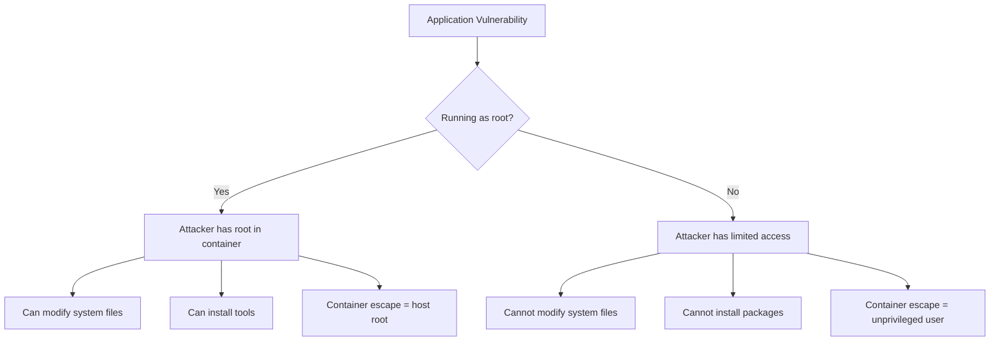
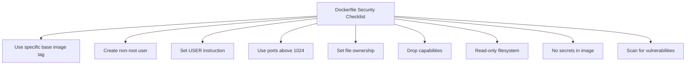

# How to Run Docker Containers as Non-Root for Security

Author: [nawazdhandala](https://www.github.com/nawazdhandala)

Tags: Docker, Security, Non-Root, Container Security, Best Practices

Description: Learn how to run Docker containers as non-root users to improve security and follow container security best practices.

---

By default, Docker containers run as root. This means if an attacker exploits a vulnerability in your application, they have root access inside the container. Combined with a container escape vulnerability, this could mean root access to the host machine.

Running containers as non-root is one of the most effective security measures you can implement, and it is simpler than you might think.

## Why Non-Root Matters



## Method 1: USER Instruction in Dockerfile

The simplest approach is adding a `USER` instruction to your Dockerfile:

```dockerfile
# Node.js example with non-root user
FROM node:20-alpine

WORKDIR /app

# Copy and install dependencies as root (needed for npm install)
COPY package.json package-lock.json ./
RUN npm ci --production

# Copy application code
COPY . .

# Create a non-root user and group
# -S creates a system user (no password, no home by default)
# -G assigns the user to the group
RUN addgroup -S appgroup && adduser -S appuser -G appgroup

# Change ownership of the application directory
RUN chown -R appuser:appgroup /app

# Switch to the non-root user
# All subsequent commands and the container entrypoint run as this user
USER appuser

EXPOSE 3000

CMD ["node", "src/index.js"]
```

## Method 2: Using Built-in Non-Root Users

Many base images already include non-root users:

```dockerfile
# Node.js images include a "node" user (UID 1000)
FROM node:20-alpine
WORKDIR /app

COPY package.json package-lock.json ./
RUN npm ci --production
COPY . .

# Change ownership to the built-in node user
RUN chown -R node:node /app

# Use the built-in user
USER node

CMD ["node", "src/index.js"]
```

```dockerfile
# Python slim images - create your own user
FROM python:3.12-slim
WORKDIR /app

COPY requirements.txt .
RUN pip install --no-cache-dir -r requirements.txt

COPY . .

# Create user with specific UID/GID for consistency
RUN groupadd -r -g 1001 appgroup \
    && useradd -r -u 1001 -g appgroup -d /app -s /sbin/nologin appuser \
    && chown -R appuser:appgroup /app

USER appuser

CMD ["gunicorn", "app:app", "--bind", "0.0.0.0:8000"]
```

## Method 3: Distroless Images

Google's distroless images run as non-root by default and contain no shell or package manager:

```dockerfile
# Multi-stage build with distroless final image
FROM golang:1.22-alpine AS builder
WORKDIR /app

COPY go.mod go.sum ./
RUN go mod download

COPY . .
RUN CGO_ENABLED=0 go build -ldflags="-s -w" -o /server ./cmd/server

# Distroless image runs as nonroot (UID 65532) by default
FROM gcr.io/distroless/static-debian12:nonroot

# Copy the binary
COPY --from=builder /server /server

# Port must be > 1024 since we are not root
EXPOSE 8080

ENTRYPOINT ["/server"]
```

```dockerfile
# Node.js with distroless
FROM node:20-alpine AS builder
WORKDIR /app
COPY package.json package-lock.json ./
RUN npm ci --production
COPY . .

FROM gcr.io/distroless/nodejs20-debian12:nonroot
WORKDIR /app
COPY --from=builder /app /app
EXPOSE 3000
CMD ["src/index.js"]
```

## Handling File Permissions

The most common issue with non-root containers is file permission errors. Here is how to handle them:

```dockerfile
FROM node:20-alpine

WORKDIR /app

# Install dependencies as root
COPY package.json package-lock.json ./
RUN npm ci --production

# Create directories that the app needs to write to
RUN mkdir -p /app/logs /app/uploads /app/tmp

# Copy application code
COPY . .

# Create user and set permissions BEFORE switching
RUN addgroup -S appgroup && adduser -S appuser -G appgroup

# Set ownership on the entire app directory
RUN chown -R appuser:appgroup /app

# Set specific permissions on writable directories
RUN chmod 755 /app/logs /app/uploads /app/tmp

USER appuser

CMD ["node", "src/index.js"]
```

## Handling Ports Below 1024

Non-root users cannot bind to ports below 1024. Use a high port instead:

```dockerfile
FROM node:20-alpine

WORKDIR /app
COPY . .
RUN npm ci --production

RUN addgroup -S appgroup && adduser -S appuser -G appgroup
RUN chown -R appuser:appgroup /app

USER appuser

# Use port 8080 instead of 80
# Map it in docker run: -p 80:8080
EXPOSE 8080

CMD ["node", "src/index.js"]
```

```bash
# Map the high port to port 80 on the host
docker run -p 80:8080 myapp:latest
```

```yaml
# In Kubernetes, the Service handles port mapping
apiVersion: v1
kind: Service
metadata:
  name: myapp
spec:
  ports:
    - port: 80           # External port
      targetPort: 8080   # Container port (non-privileged)
  selector:
    app: myapp
```

## Kubernetes Security Context

Enforce non-root at the Kubernetes level as a second layer of defense:

```yaml
# deployment.yaml
apiVersion: apps/v1
kind: Deployment
metadata:
  name: myapp
spec:
  template:
    spec:
      # Pod-level security context
      securityContext:
        # Run all containers as this UID
        runAsUser: 1001
        runAsGroup: 1001
        fsGroup: 1001
        # Prevent running as root even if the image allows it
        runAsNonRoot: true
        # Use a read-only root filesystem
        seccompProfile:
          type: RuntimeDefault
      containers:
        - name: myapp
          image: myapp:latest
          # Container-level security context
          securityContext:
            # Prevent privilege escalation
            allowPrivilegeEscalation: false
            # Drop all Linux capabilities
            capabilities:
              drop:
                - ALL
            # Read-only root filesystem
            readOnlyRootFilesystem: true
          # Mount writable directories as volumes
          volumeMounts:
            - name: tmp
              mountPath: /tmp
            - name: logs
              mountPath: /app/logs
      volumes:
        - name: tmp
          emptyDir: {}
        - name: logs
          emptyDir: {}
```

## Pod Security Standards

Use Kubernetes Pod Security Standards to enforce non-root cluster-wide:

```yaml
# Enforce restricted security standard on a namespace
apiVersion: v1
kind: Namespace
metadata:
  name: production
  labels:
    # Enforce: reject pods that violate the policy
    pod-security.kubernetes.io/enforce: restricted
    # Warn: show warnings for violations
    pod-security.kubernetes.io/warn: restricted
    # Audit: log violations
    pod-security.kubernetes.io/audit: restricted
```

## Testing Non-Root Configuration

```bash
# Verify the container is running as non-root
docker run --rm myapp:latest whoami
# Output: appuser (not root)

# Check the user ID
docker run --rm myapp:latest id
# Output: uid=1001(appuser) gid=1001(appgroup)

# Verify root operations fail
docker run --rm myapp:latest apt-get update
# Output: Permission denied

# Test file write permissions
docker run --rm myapp:latest touch /app/logs/test.log
# Should succeed (writable directory)

docker run --rm myapp:latest touch /etc/test
# Should fail (system directory, read-only)
```

## Security Checklist



1. **Always specify a USER** in your Dockerfile
2. **Use specific image tags** instead of `latest`
3. **Drop all capabilities** in Kubernetes security context
4. **Use read-only root filesystem** and mount writable volumes
5. **Set runAsNonRoot: true** in your Pod security context
6. **Use ports above 1024** for non-root containers
7. **Scan images** for vulnerabilities before deployment
8. **Use distroless or scratch** base images when possible

## Common Issues and Fixes

```bash
# Issue: "Permission denied" when writing files
# Fix: Ensure the user owns the directory
RUN chown -R appuser:appgroup /app/data

# Issue: "EACCES: permission denied, open '/app/node_modules/...'"
# Fix: Install modules before switching user
RUN npm ci --production
USER appuser

# Issue: npm/pip tries to write to global cache
# Fix: Set cache directory to a writable location
ENV npm_config_cache=/tmp/.npm
ENV PIP_CACHE_DIR=/tmp/.pip
```

## Conclusion

Running containers as non-root is a fundamental security practice that requires minimal effort but provides significant protection. By combining non-root users in Dockerfiles with Kubernetes security contexts, you create multiple layers of defense against container exploits.

To monitor the security and availability of your containerized applications, [OneUptime](https://oneuptime.com) provides comprehensive monitoring, incident management, and alerting that helps your team respond quickly to security events and downtime.
