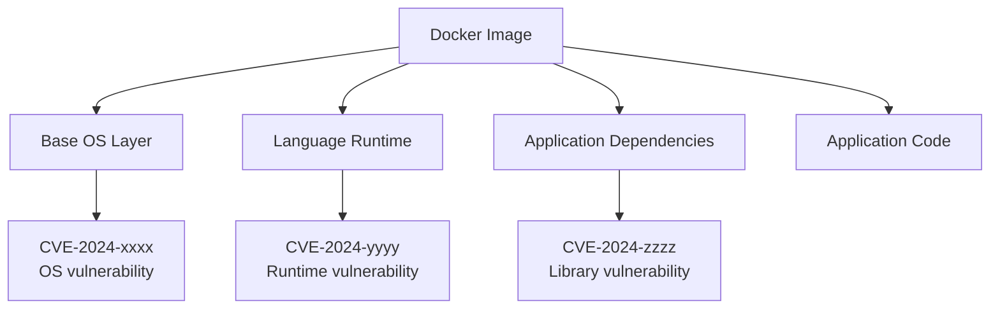
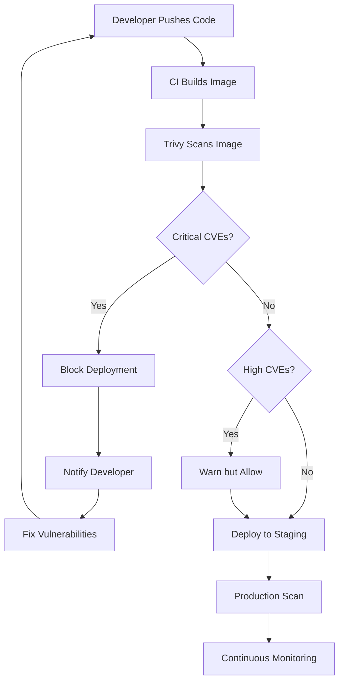

# How to Scan Docker Images for Vulnerabilities

Author: [nawazdhandala](https://www.github.com/nawazdhandala)

Tags: Docker, Security, Vulnerability Scanning, Trivy, Container Security

Description: Learn how to scan Docker images for vulnerabilities using Trivy, Grype, and Docker Scout in your CI/CD pipeline.

---

Every Docker image you deploy is built on layers of dependencies: base OS packages, language runtimes, and third-party libraries. Any of these can contain known vulnerabilities. Scanning your images before deployment is not optional; it is a critical part of your security posture.

This guide covers the most popular scanning tools, how to integrate them into CI/CD, and how to act on the results.

## Why Scan Docker Images?



A single container image can have hundreds of packages. Each package version may have known CVEs (Common Vulnerabilities and Exposures) that attackers can exploit.

## Tool 1: Trivy

Trivy is the most popular open-source container scanner. It is fast, comprehensive, and easy to use.

### Install Trivy

```bash
# macOS
brew install trivy

# Linux (Debian/Ubuntu)
sudo apt-get install -y wget apt-transport-https gnupg lsb-release
wget -qO - https://aquasecurity.github.io/trivy-repo/deb/public.key | sudo apt-key add -
echo "deb https://aquasecurity.github.io/trivy-repo/deb $(lsb_release -sc) main" \
  | sudo tee /etc/apt/sources.list.d/trivy.list
sudo apt-get update && sudo apt-get install -y trivy

# Docker (no install needed)
docker run aquasec/trivy image myapp:latest
```

### Scan an Image

```bash
# Basic scan
trivy image myapp:latest

# Scan with severity filter (only HIGH and CRITICAL)
trivy image --severity HIGH,CRITICAL myapp:latest

# Scan and fail if critical vulnerabilities found
trivy image --exit-code 1 --severity CRITICAL myapp:latest

# Output in JSON format for automation
trivy image --format json --output results.json myapp:latest

# Scan a local Dockerfile without building
trivy config ./Dockerfile
```

### Trivy Output

```
myapp:latest (alpine 3.19.1)

Total: 3 (HIGH: 2, CRITICAL: 1)

+-----------+------------------+----------+-------------------+
| LIBRARY   | VULNERABILITY ID | SEVERITY | INSTALLED VERSION |
+-----------+------------------+----------+-------------------+
| libcrypto | CVE-2024-0727    | HIGH     | 3.1.4-r2          |
| libssl    | CVE-2024-0727    | HIGH     | 3.1.4-r2          |
| curl      | CVE-2024-2398    | CRITICAL | 8.5.0-r0          |
+-----------+------------------+----------+-------------------+
```

### Scan the Filesystem

```bash
# Scan application dependencies without building an image
trivy fs --scanners vuln .

# Scan a specific lock file
trivy fs --scanners vuln package-lock.json

# Scan for misconfigurations in Dockerfiles and Kubernetes YAML
trivy config .
```

## Tool 2: Grype

Grype is another excellent scanner from the Anchore project:

```bash
# Install Grype
brew install grype    # macOS
# or
curl -sSfL https://raw.githubusercontent.com/anchore/grype/main/install.sh | sh -s

# Scan an image
grype myapp:latest

# Only show high and critical vulnerabilities
grype myapp:latest --only-fixed --fail-on high

# Output as JSON
grype myapp:latest -o json > grype-results.json

# Scan a directory
grype dir:./

# Generate an SBOM first, then scan it
syft myapp:latest -o spdx-json > sbom.json
grype sbom:sbom.json
```

## Tool 3: Docker Scout

Docker Scout is Docker's built-in scanning solution:

```bash
# Enable Docker Scout
docker scout quickview myapp:latest

# Detailed CVE listing
docker scout cves myapp:latest

# Compare two images
docker scout compare myapp:v1 --to myapp:v2

# Get fix recommendations
docker scout recommendations myapp:latest
```

## CI/CD Integration

### GitHub Actions with Trivy

```yaml
# .github/workflows/security-scan.yml
name: Security Scan
on:
  push:
    branches: [main]
  pull_request:
    branches: [main]

jobs:
  scan:
    runs-on: ubuntu-latest
    steps:
      - uses: actions/checkout@v4

      # Build the image
      - name: Build Docker image
        run: docker build -t myapp:${{ github.sha }} .

      # Scan with Trivy
      - name: Run Trivy vulnerability scanner
        uses: aquasecurity/trivy-action@master
        with:
          image-ref: myapp:${{ github.sha }}
          format: 'sarif'
          output: 'trivy-results.sarif'
          severity: 'CRITICAL,HIGH'
          # Fail the pipeline on critical vulnerabilities
          exit-code: '1'

      # Upload results to GitHub Security tab
      - name: Upload Trivy scan results
        uses: github/codeql-action/upload-sarif@v3
        if: always()
        with:
          sarif_file: 'trivy-results.sarif'
```

### GitLab CI with Trivy

```yaml
# .gitlab-ci.yml
security_scan:
  stage: test
  image:
    name: aquasec/trivy:latest
    entrypoint: [""]
  script:
    # Scan the built image
    - trivy image
        --exit-code 1
        --severity CRITICAL
        --format template
        --template "@/contrib/gitlab.tpl"
        --output gl-container-scanning-report.json
        $CI_REGISTRY_IMAGE:$CI_COMMIT_SHA
  artifacts:
    reports:
      container_scanning: gl-container-scanning-report.json
  allow_failure: false
```

## Scanning Workflow



## Creating a Scan Policy

Define which vulnerabilities block deployments:

```bash
# .trivyignore - Suppress known false positives or accepted risks
# Each line is a CVE ID with an optional comment

# Accepted risk: low-impact vulnerability in test dependency
CVE-2024-1234

# False positive: not exploitable in our configuration
CVE-2024-5678

# Temporary exception until vendor provides fix (expires 2026-03-01)
CVE-2024-9012
```

```yaml
# trivy.yaml - Trivy configuration file
severity:
  - CRITICAL
  - HIGH

# Ignore unfixed vulnerabilities (no patch available yet)
ignore-unfixed: true

# Skip scanning dev dependencies
skip-dirs:
  - test
  - docs

# Set a timeout for large images
timeout: 10m
```

## Fixing Vulnerabilities

```bash
# Step 1: Identify the source of the vulnerability
trivy image --severity CRITICAL myapp:latest

# Step 2: Update the base image
# Change FROM node:20-alpine3.18 to FROM node:20-alpine3.19

# Step 3: Update application dependencies
npm audit fix
pip install --upgrade package-name

# Step 4: Rebuild and rescan
docker build -t myapp:fixed .
trivy image --severity CRITICAL myapp:fixed
```

## Best Practices

1. **Scan on every build** in your CI/CD pipeline
2. **Block deployments** on CRITICAL vulnerabilities
3. **Update base images regularly** to pick up OS-level patches
4. **Use minimal base images** (Alpine, distroless, scratch) to reduce attack surface
5. **Generate SBOMs** (Software Bill of Materials) for audit trails
6. **Monitor continuously** because new CVEs are published daily
7. **Set up automated alerts** for newly discovered vulnerabilities

```bash
# Generate an SBOM for your image
syft myapp:latest -o spdx-json > sbom.json

# Rescan the SBOM later when new CVEs are published
grype sbom:sbom.json
```

## Conclusion

Container vulnerability scanning is a non-negotiable part of modern software delivery. By integrating Trivy, Grype, or Docker Scout into your CI/CD pipeline, you catch security issues before they reach production.

For ongoing security monitoring of your deployed applications, [OneUptime](https://oneuptime.com) provides continuous uptime monitoring, real-time alerting, and incident management to help you respond quickly when security or availability issues arise.
