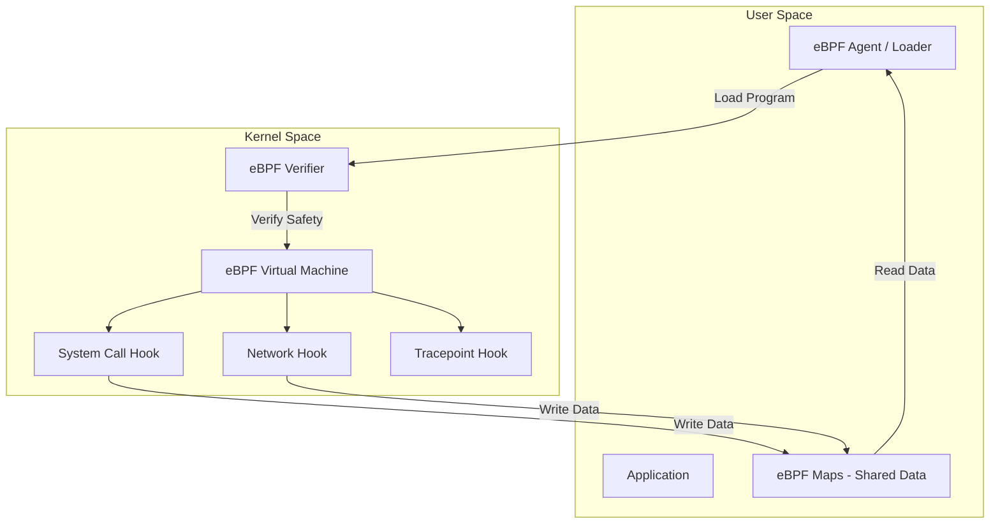
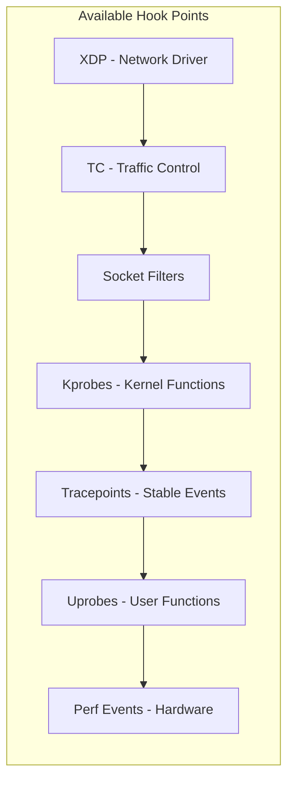
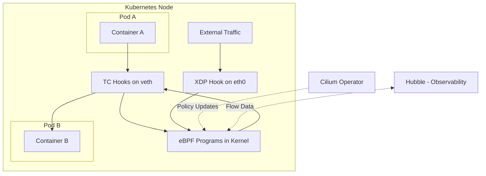
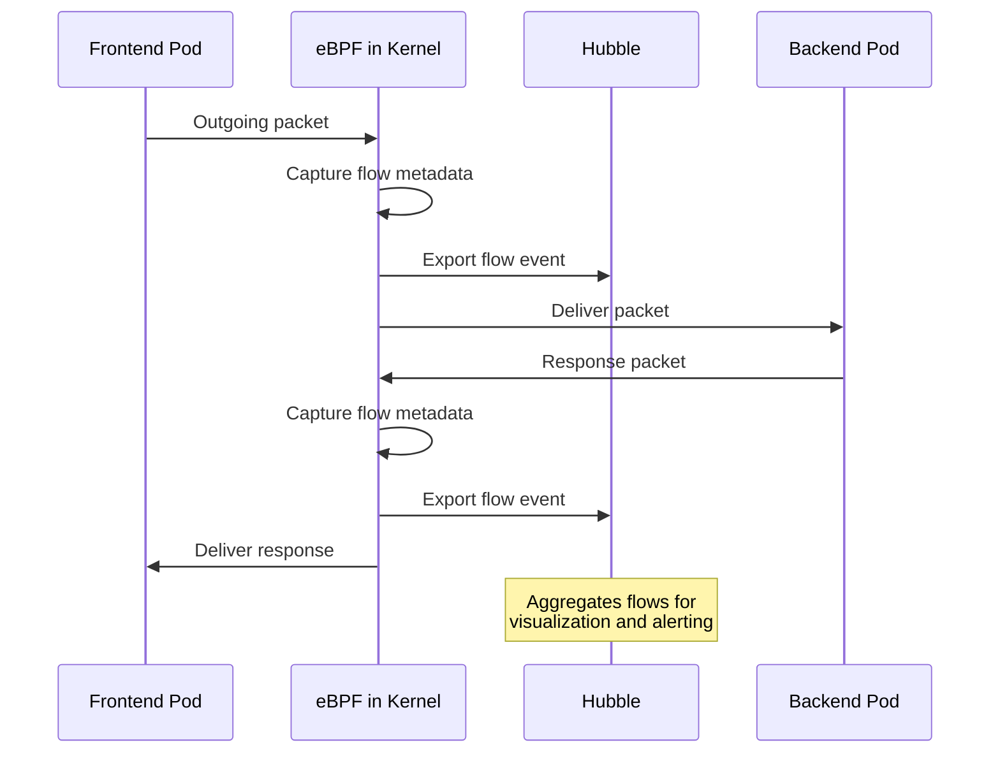
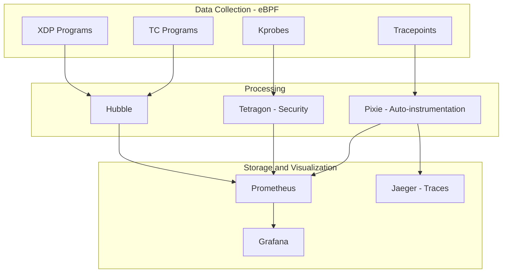
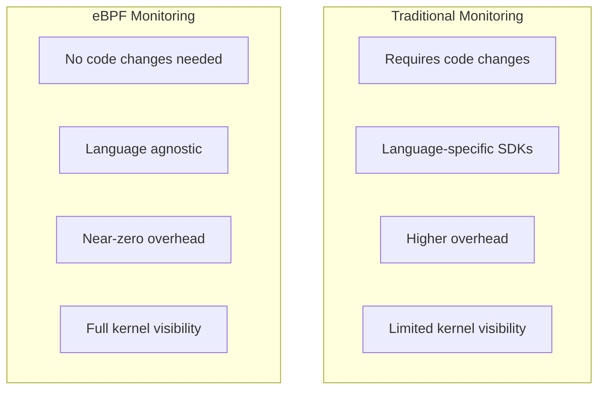

# How to Use eBPF for Kubernetes Observability

Author: [nawazdhandala](https://www.github.com/nawazdhandala)

Tags: eBPF, Kubernetes, Observability, Networking, Security

Description: Learn how eBPF enables deep Kubernetes observability for networking, security, and performance monitoring without code changes.

---

## Introduction

eBPF (extended Berkeley Packet Filter) is a revolutionary technology that lets you run sandboxed programs inside the Linux kernel without modifying kernel source code or loading kernel modules. For Kubernetes, eBPF enables deep observability into networking, security, and performance without any application code changes. This guide explores how eBPF works and how to use it for Kubernetes observability.

## What is eBPF?

eBPF allows you to attach small programs to kernel events like system calls, network packets, and function calls. These programs run in a safe virtual machine inside the kernel and can collect data, modify behavior, and export metrics.



## eBPF Hook Points



- **XDP (eXpress Data Path)**: Earliest point in the network stack. Ideal for DDoS mitigation and packet filtering.
- **TC (Traffic Control)**: Attach to network interfaces for traffic shaping and policy enforcement.
- **Kprobes**: Attach to any kernel function for dynamic tracing.
- **Tracepoints**: Attach to stable kernel instrumentation points.
- **Uprobes**: Attach to user-space application functions.

## Cilium for Kubernetes Networking

Cilium is the most popular eBPF-based networking solution for Kubernetes. It replaces kube-proxy and provides advanced networking, security, and observability.

### Installing Cilium

```bash
# Install Cilium CLI
curl -L --remote-name-all https://github.com/cilium/cilium-cli/releases/latest/download/cilium-linux-amd64.tar.gz
tar xzvf cilium-linux-amd64.tar.gz
sudo mv cilium /usr/local/bin/

# Install Cilium on your Kubernetes cluster
cilium install --version 1.16.0

# Wait for Cilium to be ready
cilium status --wait

# Run connectivity tests to verify installation
cilium connectivity test
```

### Cilium Architecture in Kubernetes



## Hubble for Network Observability

Hubble is Cilium's observability layer. It provides deep visibility into network flows, DNS queries, and HTTP requests using eBPF.

### Installing Hubble

```bash
# Enable Hubble on an existing Cilium installation
cilium hubble enable --ui

# Wait for Hubble to be ready
cilium hubble port-forward &

# Verify Hubble is working
hubble status

# Open the Hubble UI
cilium hubble ui
```

### Observing Network Flows

```bash
# Watch all network flows in real-time
hubble observe

# Filter flows by namespace
hubble observe --namespace production

# Filter by source and destination
hubble observe \
  --from-pod production/frontend \
  --to-pod production/backend

# Filter by HTTP method and status code
hubble observe \
  --protocol http \
  --http-method GET \
  --http-status 500

# Filter DNS queries
hubble observe --protocol dns

# Export flows as JSON for analysis
hubble observe --namespace production -o json > flows.json
```

### Hubble Flow Visualization



## eBPF-Based Network Policies

```yaml
# Cilium Network Policy - L7 aware policy using eBPF
apiVersion: cilium.io/v2
kind: CiliumNetworkPolicy
metadata:
  name: restrict-backend-access
  namespace: production
spec:
  endpointSelector:
    matchLabels:
      app: backend
  ingress:
    - fromEndpoints:
        - matchLabels:
            app: frontend
      toPorts:
        - ports:
            - port: "8080"
              protocol: TCP
          rules:
            # L7 HTTP rules - only possible with eBPF
            http:
              - method: GET
                path: "/api/v1/products"
              - method: GET
                path: "/api/v1/products/[0-9]+"
              - method: POST
                path: "/api/v1/orders"
  egress:
    - toEndpoints:
        - matchLabels:
            app: database
      toPorts:
        - ports:
            - port: "5432"
              protocol: TCP
    # Allow DNS resolution
    - toEndpoints:
        - matchLabels:
            k8s:io.kubernetes.pod.namespace: kube-system
            k8s-app: kube-dns
      toPorts:
        - ports:
            - port: "53"
              protocol: ANY
          rules:
            dns:
              - matchPattern: "*.production.svc.cluster.local"
```

## Performance Monitoring with eBPF

### Using bpftrace for Kernel Tracing

```bash
# Trace all system calls made by a specific container
# First, find the container's PID
CONTAINER_PID=$(kubectl exec -n production deploy/web-api -- cat /proc/1/status | grep "^Pid:" | awk '{print $2}')

# Trace syscalls with latency
bpftrace -e '
tracepoint:raw_syscalls:sys_enter /pid == '"$CONTAINER_PID"'/ {
    @start[tid] = nsecs;
    @syscall[args->id] = count();
}

tracepoint:raw_syscalls:sys_exit /pid == '"$CONTAINER_PID"' && @start[tid]/ {
    @latency_ns = hist(nsecs - @start[tid]);
    delete(@start[tid]);
}
'

# Trace TCP connections
bpftrace -e '
kprobe:tcp_v4_connect {
    printf("PID %d connecting to %s\n", pid, comm);
}

kretprobe:tcp_v4_connect /retval == 0/ {
    printf("PID %d connection established\n", pid);
}
'
```

### TCP Latency Monitoring

```python
# Python script using bcc to monitor TCP latency per Kubernetes pod
from bcc import BPF
import ctypes

# eBPF program to trace TCP round-trip time
bpf_program = """
#include <uapi/linux/ptrace.h>
#include <net/sock.h>
#include <bcc/proto.h>

// Structure to hold connection latency data
struct conn_info_t {
    u32 pid;
    u32 saddr;
    u32 daddr;
    u16 dport;
    u64 ts;
};

// Hash map to track connection start times
BPF_HASH(conn_start, u32, struct conn_info_t);

// Histogram of latencies in microseconds
BPF_HISTOGRAM(latency_us, u64);

// Trace when a TCP connect starts
int trace_connect_entry(struct pt_regs *ctx, struct sock *sk) {
    u32 tid = bpf_get_current_pid_tgid();

    struct conn_info_t info = {};
    info.pid = bpf_get_current_pid_tgid() >> 32;
    info.ts = bpf_ktime_get_ns();

    // Store the start time
    conn_start.update(&tid, &info);
    return 0;
}

// Trace when a TCP connect completes
int trace_connect_return(struct pt_regs *ctx) {
    u32 tid = bpf_get_current_pid_tgid();

    struct conn_info_t *info = conn_start.lookup(&tid);
    if (info == 0) {
        return 0;  // No matching connect entry
    }

    // Calculate latency in microseconds
    u64 delta = (bpf_ktime_get_ns() - info->ts) / 1000;
    latency_us.increment(bpf_log2l(delta));

    conn_start.delete(&tid);
    return 0;
}
"""

# Load and attach the eBPF program
b = BPF(text=bpf_program)
b.attach_kprobe(event="tcp_v4_connect", fn_name="trace_connect_entry")
b.attach_kretprobe(event="tcp_v4_connect", fn_name="trace_connect_return")

print("Tracing TCP connection latency... Press Ctrl+C to stop.")

try:
    while True:
        # Sleep and then print the histogram
        import time
        time.sleep(5)
        print("\nTCP Connect Latency (microseconds):")
        b["latency_us"].print_log2_hist("us")
        b["latency_us"].clear()
except KeyboardInterrupt:
    print("\nDone.")
```

## eBPF Observability Stack



## Security Observability with Tetragon

```yaml
# Tetragon TracingPolicy to monitor sensitive file access
apiVersion: cilium.io/v1alpha1
kind: TracingPolicy
metadata:
  name: monitor-sensitive-files
spec:
  kprobes:
    - call: "security_file_open"
      syscall: false
      args:
        - index: 0
          type: "file"
      selectors:
        - matchArgs:
            - index: 0
              operator: "Prefix"
              values:
                - "/etc/shadow"
                - "/etc/passwd"
                - "/etc/kubernetes"
                - "/var/run/secrets"
          matchActions:
            - action: Sigkill  # Kill process accessing sensitive files
```

```bash
# Install Tetragon for security observability
helm repo add cilium https://helm.cilium.io
helm install tetragon cilium/tetragon -n kube-system

# Watch security events in real-time
kubectl logs -n kube-system -l app.kubernetes.io/name=tetragon -c export-stdout -f | \
  tetra getevents -o compact

# Filter for process execution events
kubectl logs -n kube-system -l app.kubernetes.io/name=tetragon -c export-stdout -f | \
  tetra getevents -o compact --process-type exec
```

## Advantages of eBPF Over Traditional Monitoring



## Conclusion

eBPF is transforming Kubernetes observability by providing deep visibility into networking, security, and performance at the kernel level. Tools like Cilium, Hubble, and Tetragon make it practical to use eBPF in production without writing kernel code yourself. Start with Cilium for networking, enable Hubble for flow observability, and add Tetragon for security monitoring.

For comprehensive Kubernetes monitoring that complements your eBPF observability stack, check out [OneUptime](https://oneuptime.com) for uptime monitoring, incident management, and alerting across your entire infrastructure.
