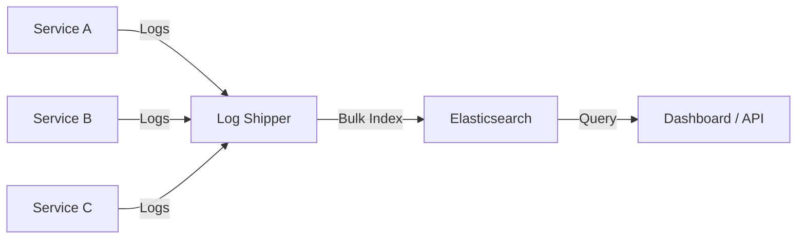
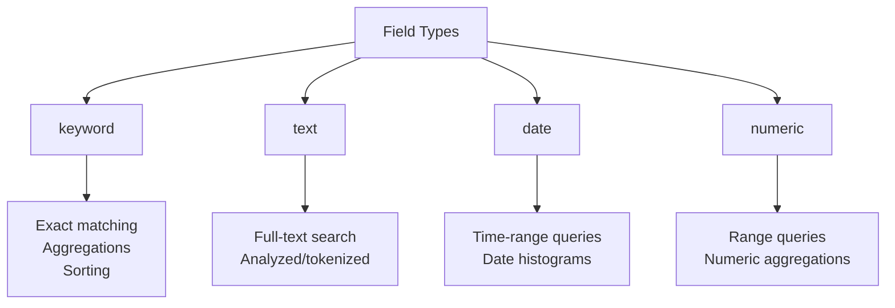
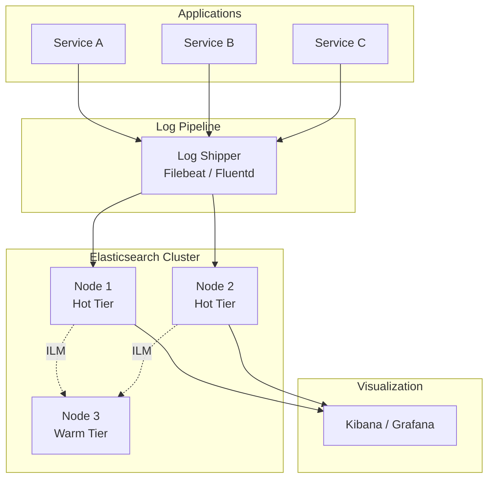

# How to Get Started with Elasticsearch for Log Search

Author: [nawazdhandala](https://www.github.com/nawazdhandala)

Tags: Elasticsearch, Search, Logs, Full-Text Search, Observability

Description: A practical guide to getting started with Elasticsearch for log search including index management, mappings, and queries.

---

Elasticsearch is a distributed search and analytics engine built on Apache Lucene. It is the most popular choice for log search, full-text search, and observability data. If you need to search through millions of log entries in milliseconds, Elasticsearch is the tool for the job.

This post covers the essentials: setting up Elasticsearch, creating indexes with proper mappings, ingesting logs, and writing queries to find what you need.

## Why Elasticsearch for Logs

Traditional databases struggle with log data because logs are:
- High volume (millions of entries per day)
- Semi-structured (different services produce different formats)
- Searched by text content, not just exact fields

Elasticsearch handles all of these well because it indexes every word in every field by default.



## Step 1: Running Elasticsearch

The quickest way to start is with Docker.

```yaml
# docker-compose.yml
version: "3.8"

services:
  elasticsearch:
    image: docker.elastic.co/elasticsearch/elasticsearch:8.12.0
    environment:
      # Single-node mode for development
      - discovery.type=single-node
      # Disable security for local development only
      - xpack.security.enabled=false
      # JVM heap size - set to 50% of available RAM (max 32GB)
      - "ES_JAVA_OPTS=-Xms1g -Xmx1g"
    ports:
      - "9200:9200"
    volumes:
      - es-data:/usr/share/elasticsearch/data

volumes:
  es-data:
```

```bash
# Start Elasticsearch
docker compose up -d

# Verify it is running
curl -s http://localhost:9200 | python3 -m json.tool
```

## Step 2: Create an Index with Mappings

Mappings define the data types for each field. Without explicit mappings, Elasticsearch guesses the types, which often leads to suboptimal indexing.

```python
from elasticsearch import Elasticsearch
from datetime import datetime

# Connect to Elasticsearch
es = Elasticsearch("http://localhost:9200")

# Define the index mapping for application logs
log_mapping = {
    "settings": {
        # Number of primary shards
        "number_of_shards": 1,
        # Number of replica shards
        "number_of_replicas": 1,
        # Refresh interval - how often new data becomes searchable
        "refresh_interval": "5s"
    },
    "mappings": {
        "properties": {
            # Timestamp field - used for time-range queries
            "timestamp": {
                "type": "date",
                "format": "strict_date_optional_time||epoch_millis"
            },
            # Log level - keyword type for exact matching and aggregations
            "level": {
                "type": "keyword"
            },
            # Service name - keyword for filtering
            "service": {
                "type": "keyword"
            },
            # Log message - text type for full-text search
            "message": {
                "type": "text",
                "analyzer": "standard"
            },
            # Trace ID for correlating logs with traces
            "trace_id": {
                "type": "keyword"
            },
            # Request metadata
            "request": {
                "properties": {
                    "method": {"type": "keyword"},
                    "path": {"type": "keyword"},
                    "status_code": {"type": "integer"},
                    "duration_ms": {"type": "float"}
                }
            },
            # Host information
            "host": {
                "type": "keyword"
            }
        }
    }
}

# Create the index
# Use date-based index names for easy lifecycle management
index_name = f"logs-{datetime.utcnow().strftime('%Y.%m.%d')}"
es.indices.create(index=index_name, body=log_mapping)
print(f"Created index: {index_name}")
```

### Understanding Field Types



## Step 3: Indexing Log Data

```python
import json
from datetime import datetime, timedelta
import random

def index_log_entry(service: str, level: str, message: str,
                    request_data: dict = None):
    """
    Index a single log entry into Elasticsearch.
    Uses date-based index naming for lifecycle management.
    """
    doc = {
        "timestamp": datetime.utcnow().isoformat(),
        "level": level,
        "service": service,
        "message": message,
        "host": f"{service}-pod-{random.randint(1, 5)}"
    }

    if request_data:
        doc["request"] = request_data

    # Index name based on today's date
    index = f"logs-{datetime.utcnow().strftime('%Y.%m.%d')}"

    # Index the document
    result = es.index(index=index, document=doc)
    return result["_id"]


def bulk_index_logs(logs: list):
    """
    Index multiple log entries in a single bulk request.
    Bulk indexing is much faster than indexing one at a time.
    """
    from elasticsearch.helpers import bulk

    actions = []
    for log in logs:
        action = {
            "_index": f"logs-{datetime.utcnow().strftime('%Y.%m.%d')}",
            "_source": log
        }
        actions.append(action)

    # Bulk index - processes entries in batches
    success, errors = bulk(es, actions, chunk_size=500)
    print(f"Indexed {success} documents, {len(errors)} errors")
    return success


# Index some sample logs
index_log_entry(
    "api-gateway", "INFO",
    "Request processed successfully",
    {"method": "GET", "path": "/api/users", "status_code": 200, "duration_ms": 45.2}
)

index_log_entry(
    "auth-service", "ERROR",
    "Failed to validate JWT token: token expired",
    {"method": "POST", "path": "/api/login", "status_code": 401, "duration_ms": 12.8}
)

index_log_entry(
    "order-service", "WARN",
    "Database connection pool running low: 2 connections remaining"
)
```

## Step 4: Querying Logs

### Simple Queries

```python
def search_logs(query_text: str, level: str = None,
                service: str = None, hours: int = 24):
    """
    Search logs with full-text search, filtering, and time range.
    """
    # Build the query
    must_clauses = []
    filter_clauses = []

    # Full-text search on the message field
    if query_text:
        must_clauses.append({
            "match": {
                "message": {
                    "query": query_text,
                    "operator": "and"  # All words must match
                }
            }
        })

    # Filter by log level (exact match)
    if level:
        filter_clauses.append({
            "term": {"level": level}
        })

    # Filter by service (exact match)
    if service:
        filter_clauses.append({
            "term": {"service": service}
        })

    # Time range filter
    filter_clauses.append({
        "range": {
            "timestamp": {
                "gte": f"now-{hours}h",
                "lte": "now"
            }
        }
    })

    query = {
        "query": {
            "bool": {
                "must": must_clauses,
                "filter": filter_clauses
            }
        },
        "sort": [
            {"timestamp": {"order": "desc"}}
        ],
        "size": 50
    }

    # Search across all log indexes
    result = es.search(index="logs-*", body=query)

    print(f"Found {result['hits']['total']['value']} logs")
    for hit in result["hits"]["hits"]:
        src = hit["_source"]
        print(f"[{src['timestamp']}] [{src['level']}] "
              f"{src['service']}: {src['message']}")

    return result


# Search for error logs
search_logs("token expired", level="ERROR")

# Search for slow requests
search_logs("", service="api-gateway", hours=1)
```

### Aggregation Queries

```python
def log_level_distribution(hours: int = 24):
    """
    Get the count of logs per level over the last N hours.
    Useful for dashboards showing error rates.
    """
    query = {
        "query": {
            "range": {
                "timestamp": {"gte": f"now-{hours}h"}
            }
        },
        "aggs": {
            # Group by log level
            "by_level": {
                "terms": {
                    "field": "level",
                    "size": 10
                }
            },
            # Group by service
            "by_service": {
                "terms": {
                    "field": "service",
                    "size": 20
                }
            },
            # Time histogram - logs per hour
            "over_time": {
                "date_histogram": {
                    "field": "timestamp",
                    "fixed_interval": "1h"
                },
                "aggs": {
                    "error_count": {
                        "filter": {
                            "term": {"level": "ERROR"}
                        }
                    }
                }
            }
        },
        "size": 0  # We only want aggregation results, not documents
    }

    result = es.search(index="logs-*", body=query)
    aggs = result["aggregations"]

    print("Logs by level:")
    for bucket in aggs["by_level"]["buckets"]:
        print(f"  {bucket['key']}: {bucket['doc_count']}")

    print("\nLogs by service:")
    for bucket in aggs["by_service"]["buckets"]:
        print(f"  {bucket['key']}: {bucket['doc_count']}")

    return aggs
```

## Step 5: Index Lifecycle Management

Logs should be automatically rolled over and deleted based on age.

```python
def setup_index_lifecycle(es):
    """
    Set up Index Lifecycle Management (ILM) to automatically
    manage log index retention.
    """
    # Create a lifecycle policy
    policy = {
        "policy": {
            "phases": {
                "hot": {
                    "actions": {
                        # Roll over when the index gets too large or old
                        "rollover": {
                            "max_primary_shard_size": "50gb",
                            "max_age": "1d"
                        }
                    }
                },
                "warm": {
                    # Move to warm tier after 7 days
                    "min_age": "7d",
                    "actions": {
                        # Force merge to reduce segments
                        "forcemerge": {
                            "max_num_segments": 1
                        },
                        # Shrink to fewer shards
                        "shrink": {
                            "number_of_shards": 1
                        }
                    }
                },
                "delete": {
                    # Delete indexes older than 30 days
                    "min_age": "30d",
                    "actions": {
                        "delete": {}
                    }
                }
            }
        }
    }

    es.ilm.put_lifecycle(name="logs-policy", body=policy)
    print("ILM policy 'logs-policy' created")
```

## Architecture Overview



## Conclusion

Elasticsearch is powerful for log search, but it needs proper setup to work well. Define explicit mappings, use bulk indexing for performance, and set up ILM to manage index retention. Structure your queries with bool queries for flexible filtering and use aggregations for dashboards.

For a complete log management and observability solution, [OneUptime](https://oneuptime.com) integrates with Elasticsearch and OpenTelemetry to provide log search, metrics, traces, and alerting in a single open-source platform. It helps you go from raw logs to actionable insights without managing multiple tools.
