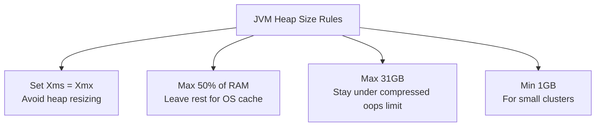
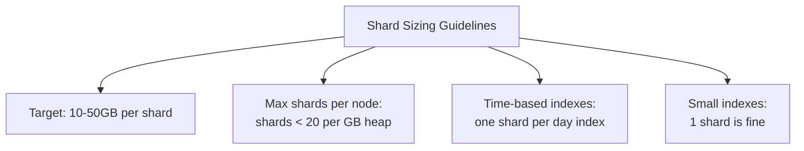
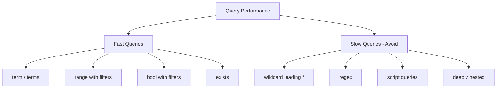

# How to Tune Elasticsearch for Production Performance

Author: [nawazdhandala](https://www.github.com/nawazdhandala)

Tags: Elasticsearch, Performance, Tuning, JVM, Production

Description: Learn how to tune Elasticsearch for production including JVM settings, shard sizing, mapping optimization, and query performance.

---

Elasticsearch works out of the box for development, but the default settings are not suitable for production workloads. Without tuning, you will hit slow queries, out-of-memory errors, and cluster instability under load.

This post covers the most impactful tuning areas: JVM configuration, shard sizing, mapping optimization, and query performance techniques.

## JVM Settings

Elasticsearch runs on the JVM, and heap configuration is the single most important tuning decision.

### Heap Size Rules



```bash
# jvm.options - located at /etc/elasticsearch/jvm.options

# Set initial and maximum heap to the same value
# This prevents the JVM from wasting time resizing the heap
-Xms16g
-Xmx16g

# If your machine has 64GB RAM:
#   - Set heap to 31GB (stay under compressed oops threshold)
#   - The remaining 33GB is used by the OS for file system cache
#   - Lucene (the search engine inside Elasticsearch) relies heavily
#     on the OS file cache for performance

# For machines with less RAM:
# 8GB RAM  -> -Xms4g -Xmx4g
# 16GB RAM -> -Xms8g -Xmx8g
# 32GB RAM -> -Xms16g -Xmx16g
# 64GB RAM -> -Xms31g -Xmx31g
```

### Garbage Collection

```bash
# Elasticsearch 8.x uses G1GC by default
# These settings are good starting points for most workloads

# Use G1 garbage collector
-XX:+UseG1GC

# Set the pause time target (in milliseconds)
# Lower values mean shorter GC pauses but more frequent collections
-XX:MaxGCPauseMillis=200

# Initial and min percentage of heap free after GC
-XX:G1HeapRegionSize=16m

# Log GC activity for troubleshooting
-Xlog:gc*,gc+age=trace,safepoint:file=/var/log/elasticsearch/gc.log:utctime,pid,tags:filecount=32,filesize=64m
```

## Shard Sizing

Shard configuration directly affects cluster performance and stability. Too many small shards waste resources. Too few large shards make rebalancing difficult.



### Calculating Shard Count

```python
def calculate_shards(
    daily_data_gb: float,
    retention_days: int,
    target_shard_size_gb: float = 30.0
) -> dict:
    """
    Calculate the optimal shard configuration for time-based indexes.
    """
    total_data_gb = daily_data_gb * retention_days

    # For daily indexes
    shards_per_day = max(1, int(daily_data_gb / target_shard_size_gb) + 1)
    total_shards = shards_per_day * retention_days

    # Each shard has overhead - estimate memory needed
    # Rule of thumb: each shard uses about 25MB of heap
    heap_overhead_gb = (total_shards * 25) / 1024

    return {
        "daily_data_gb": daily_data_gb,
        "retention_days": retention_days,
        "total_data_gb": total_data_gb,
        "shards_per_daily_index": shards_per_day,
        "total_shards": total_shards,
        "estimated_heap_overhead_gb": round(heap_overhead_gb, 2),
    }

# Example: 20GB of logs per day, 30 days retention
config = calculate_shards(20, 30)
print(f"Shards per daily index: {config['shards_per_daily_index']}")
print(f"Total shards: {config['total_shards']}")
print(f"Heap overhead: {config['estimated_heap_overhead_gb']} GB")
```

### Index Template for Optimal Shards

```python
from elasticsearch import Elasticsearch

es = Elasticsearch("http://localhost:9200")

def create_optimized_template(es):
    """
    Create an index template with optimized settings
    for production log ingestion.
    """
    template = {
        "index_patterns": ["logs-*"],
        "template": {
            "settings": {
                # One primary shard for daily indexes under 50GB
                "number_of_shards": 1,
                # One replica for high availability
                "number_of_replicas": 1,
                # Increase refresh interval for write-heavy workloads
                # Default is 1s, which creates too many small segments
                "refresh_interval": "30s",
                # Transaction log settings for durability vs speed
                "translog": {
                    # async flush is faster but risks losing last 5s of data
                    "durability": "async",
                    "sync_interval": "5s",
                    "flush_threshold_size": "512mb"
                },
                # Merge policy - reduce merge overhead
                "merge": {
                    "scheduler": {
                        "max_thread_count": 1  # Use 1 thread for HDD, more for SSD
                    }
                },
                # Codec - use best_compression for cold data
                "codec": "best_compression"
            },
            "mappings": {
                # Disable dynamic mapping to prevent mapping explosions
                "dynamic": "strict",
                "properties": {
                    "timestamp": {"type": "date"},
                    "level": {"type": "keyword"},
                    "service": {"type": "keyword"},
                    "message": {"type": "text"},
                    "host": {"type": "keyword"},
                    "trace_id": {"type": "keyword"}
                }
            }
        }
    }

    es.indices.put_index_template(
        name="logs-template",
        body=template
    )
    print("Index template 'logs-template' created")
```

## Mapping Optimization

Bad mappings are a common source of performance problems.

### Disable Features You Do Not Need

```python
def create_optimized_mapping():
    """
    Optimized mapping that disables unnecessary features
    to reduce indexing overhead and storage.
    """
    return {
        "mappings": {
            # Disable _source for metrics data (saves storage)
            # WARNING: you cannot reindex without _source
            # "_source": {"enabled": False},

            "properties": {
                "timestamp": {
                    "type": "date",
                    # Disable doc_values if you never aggregate on this field
                    # "doc_values": False
                },
                "level": {
                    "type": "keyword",
                    # Disable norms - saves memory if you do not score by this field
                    "norms": False
                },
                "message": {
                    "type": "text",
                    # Disable norms on text fields you only filter on
                    "norms": False,
                    # Store only positions, not offsets
                    "index_options": "positions"
                },
                "request_id": {
                    "type": "keyword",
                    # If you only need to filter (not aggregate), disable doc_values
                    # "doc_values": False,
                    "norms": False
                },
                # Use flattened type for dynamic JSON objects
                # This avoids mapping explosions from nested keys
                "metadata": {
                    "type": "flattened"
                }
            }
        }
    }
```

## Query Performance

### Use Filters Instead of Queries

Filters are faster because they do not calculate relevance scores and can be cached.

```python
def efficient_search(es, service: str, level: str, hours: int = 24):
    """
    Use filter context for exact matches (no scoring needed).
    Use query context only for full-text search where scoring matters.
    """
    body = {
        "query": {
            "bool": {
                # Filters: cached, no scoring, faster
                "filter": [
                    {"term": {"service": service}},
                    {"term": {"level": level}},
                    {"range": {
                        "timestamp": {"gte": f"now-{hours}h"}
                    }}
                ]
                # Only add "must" for full-text search:
                # "must": [{"match": {"message": "error timeout"}}]
            }
        },
        "sort": [{"timestamp": "desc"}],
        "size": 100
    }

    return es.search(index="logs-*", body=body)
```

### Avoid Expensive Queries



```python
# BAD: Leading wildcard - scans every term in the index
bad_query = {"wildcard": {"message": "*timeout*"}}

# GOOD: Use match query instead - uses the inverted index
good_query = {"match": {"message": "timeout"}}

# BAD: Script query - runs script for every document
bad_script = {
    "script": {
        "script": "doc['duration_ms'].value > 1000"
    }
}

# GOOD: Use range filter - uses doc_values efficiently
good_range = {
    "range": {"duration_ms": {"gt": 1000}}
}
```

## Bulk Indexing Optimization

```python
from elasticsearch.helpers import bulk, parallel_bulk

def optimized_bulk_index(es, documents: list, index: str):
    """
    Optimized bulk indexing with tuned parameters.
    """
    # Temporarily increase refresh interval for bulk loads
    es.indices.put_settings(
        index=index,
        body={"index": {"refresh_interval": "-1"}}  # Disable refresh
    )

    try:
        # Use parallel_bulk for multi-threaded indexing
        successes = 0
        for ok, result in parallel_bulk(
            es,
            documents,
            index=index,
            chunk_size=1000,      # Documents per batch
            thread_count=4,       # Parallel threads
            queue_size=4,         # Queue size per thread
            raise_on_error=False
        ):
            if ok:
                successes += 1

        print(f"Indexed {successes} documents")
    finally:
        # Restore refresh interval
        es.indices.put_settings(
            index=index,
            body={"index": {"refresh_interval": "30s"}}
        )
        # Force a refresh to make data searchable
        es.indices.refresh(index=index)
```

## OS-Level Tuning

```bash
# 1. Disable swapping - critical for Elasticsearch
sudo swapoff -a

# Or set swappiness to minimum
sudo sysctl vm.swappiness=1

# 2. Increase file descriptor limit
# Add to /etc/security/limits.conf:
# elasticsearch  -  nofile  65535

# 3. Increase virtual memory areas
sudo sysctl -w vm.max_map_count=262144

# 4. For persistent setting, add to /etc/sysctl.conf:
# vm.max_map_count=262144

# 5. Use SSD storage for hot nodes
# Elasticsearch is heavily I/O bound
```

## Monitoring Cluster Health

```python
def check_cluster_health(es) -> dict:
    """
    Check cluster health and key performance indicators.
    """
    health = es.cluster.health()
    stats = es.cluster.stats()

    report = {
        "status": health["status"],  # green, yellow, or red
        "nodes": health["number_of_nodes"],
        "active_shards": health["active_shards"],
        "unassigned_shards": health["unassigned_shards"],
        "pending_tasks": health["number_of_pending_tasks"],
        "total_docs": stats["indices"]["docs"]["count"],
        "total_size_gb": round(
            stats["indices"]["store"]["size_in_bytes"] / 1024**3, 2
        ),
        "heap_used_pct": round(
            stats["nodes"]["jvm"]["mem"]["heap_used_in_bytes"] /
            stats["nodes"]["jvm"]["mem"]["heap_max_in_bytes"] * 100, 2
        ),
    }

    # Warnings
    if report["status"] == "red":
        print("CRITICAL: Cluster is RED - some data is unavailable")
    elif report["status"] == "yellow":
        print("WARNING: Cluster is YELLOW - replicas not assigned")

    if report["heap_used_pct"] > 85:
        print(f"WARNING: JVM heap at {report['heap_used_pct']}%")

    if report["unassigned_shards"] > 0:
        print(f"WARNING: {report['unassigned_shards']} unassigned shards")

    return report


# Run the health check
health = check_cluster_health(es)
for key, value in health.items():
    print(f"  {key}: {value}")
```

## Performance Tuning Checklist

| Setting | Development | Production |
|---------|------------|------------|
| Heap Size | 1GB | 50% RAM (max 31GB) |
| Refresh Interval | 1s | 30s for write-heavy |
| Replicas | 0 | 1-2 |
| Swapping | Default | Disabled |
| File Descriptors | Default | 65535 |
| vm.max_map_count | Default | 262144 |
| Translog Durability | request | async (if acceptable) |
| Dynamic Mapping | true | strict |

## Conclusion

Elasticsearch performance tuning is about matching your configuration to your workload. Set the JVM heap correctly, size your shards between 10-50GB, use strict mappings to prevent mapping explosions, and prefer filter context over query context for exact matches. Monitor heap usage, shard counts, and query latency continuously.

For complete Elasticsearch monitoring with cluster health dashboards, query performance tracking, and automated alerting, [OneUptime](https://oneuptime.com) provides an open-source observability platform that integrates with your Elasticsearch deployment. Track cluster status, heap usage, and indexing throughput - all with built-in incident management and on-call scheduling.
