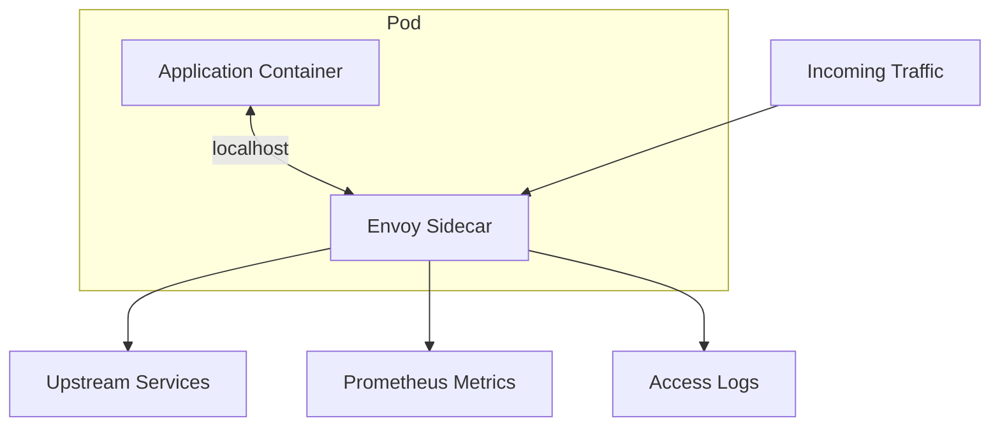
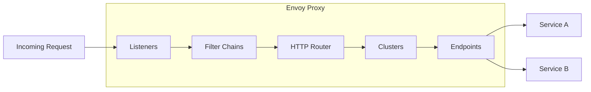
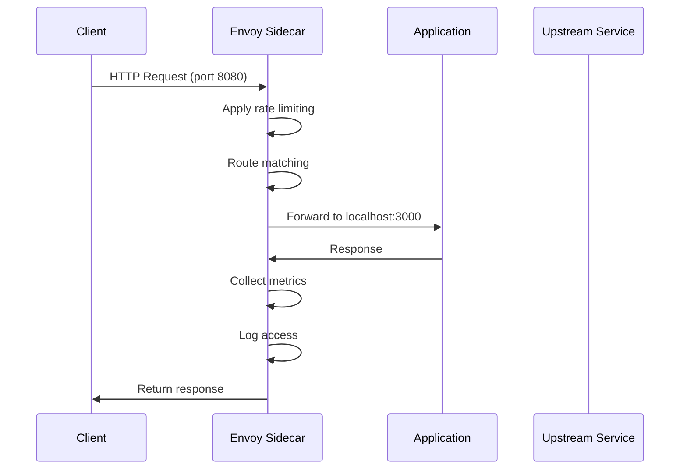

# How to Use Envoy Proxy as a Sidecar in Kubernetes

Author: [nawazdhandala](https://www.github.com/nawazdhandala)

Tags: Envoy, Proxy, Sidecar, Kubernetes, Traffic Management

Description: Learn how to use Envoy proxy as a sidecar in Kubernetes for load balancing, observability, and traffic management.

---

## Introduction

Envoy is a high-performance, programmable L4/L7 proxy originally built at Lyft. It powers service meshes like Istio and is widely used as a standalone sidecar proxy in Kubernetes. This guide shows you how to deploy and configure Envoy as a sidecar for load balancing, observability, and traffic management without a full service mesh.

## What is the Sidecar Pattern?

The sidecar pattern deploys a helper container alongside your application container in the same pod. The sidecar handles cross-cutting concerns like networking, security, and observability.



## Envoy Architecture



- **Listeners**: Define where Envoy accepts connections (port, protocol).
- **Filter Chains**: Process requests through a pipeline of filters.
- **Clusters**: Groups of upstream endpoints for load balancing.
- **Endpoints**: Individual instances of upstream services.

## Basic Envoy Configuration

```yaml
# envoy.yaml - Basic Envoy sidecar configuration
static_resources:
  listeners:
    # Inbound listener - receives traffic destined for the application
    - name: inbound_listener
      address:
        socket_address:
          address: 0.0.0.0
          port_value: 8080  # Envoy listens on this port
      filter_chains:
        - filters:
            - name: envoy.filters.network.http_connection_manager
              typed_config:
                "@type": type.googleapis.com/envoy.extensions.filters.network.http_connection_manager.v3.HttpConnectionManager
                stat_prefix: inbound_http
                # Enable access logging
                access_log:
                  - name: envoy.access_loggers.stdout
                    typed_config:
                      "@type": type.googleapis.com/envoy.extensions.access_loggers.stream.v3.StdoutAccessLog
                      log_format:
                        json_format:
                          timestamp: "%START_TIME%"
                          method: "%REQ(:METHOD)%"
                          path: "%REQ(X-ENVOY-ORIGINAL-PATH?:PATH)%"
                          status: "%RESPONSE_CODE%"
                          duration_ms: "%DURATION%"
                          upstream_host: "%UPSTREAM_HOST%"
                http_filters:
                  - name: envoy.filters.http.router
                    typed_config:
                      "@type": type.googleapis.com/envoy.extensions.filters.http.router.v3.Router
                route_config:
                  name: local_route
                  virtual_hosts:
                    - name: local_service
                      domains: ["*"]
                      routes:
                        - match:
                            prefix: "/"
                          route:
                            cluster: local_app
                            timeout: 30s

  clusters:
    # Local application cluster - forwards to the app container
    - name: local_app
      type: STATIC
      connect_timeout: 5s
      load_assignment:
        cluster_name: local_app
        endpoints:
          - lb_endpoints:
              - endpoint:
                  address:
                    socket_address:
                      address: 127.0.0.1
                      port_value: 3000  # Application port

admin:
  address:
    socket_address:
      address: 0.0.0.0
      port_value: 9901  # Admin interface for metrics and debugging
```

## Deploying Envoy as a Sidecar

```yaml
# Kubernetes deployment with Envoy sidecar
apiVersion: apps/v1
kind: Deployment
metadata:
  name: web-api
  namespace: production
spec:
  replicas: 3
  selector:
    matchLabels:
      app: web-api
  template:
    metadata:
      labels:
        app: web-api
      annotations:
        prometheus.io/scrape: "true"
        prometheus.io/port: "9901"
        prometheus.io/path: "/stats/prometheus"
    spec:
      containers:
        # Application container
        - name: web-api
          image: myregistry.io/web-api:v1.0.0
          ports:
            - containerPort: 3000
              name: app-port
          env:
            - name: PORT
              value: "3000"
          resources:
            requests:
              cpu: 100m
              memory: 128Mi
            limits:
              cpu: 500m
              memory: 256Mi

        # Envoy sidecar container
        - name: envoy
          image: envoyproxy/envoy:v1.31-latest
          ports:
            - containerPort: 8080
              name: envoy-http
            - containerPort: 9901
              name: envoy-admin
          volumeMounts:
            - name: envoy-config
              mountPath: /etc/envoy
              readOnly: true
          command: ["envoy"]
          args:
            - "-c"
            - "/etc/envoy/envoy.yaml"
            - "--service-cluster"
            - "web-api"
            - "--service-node"
            - "$(POD_NAME)"
          env:
            - name: POD_NAME
              valueFrom:
                fieldRef:
                  fieldPath: metadata.name
          resources:
            requests:
              cpu: 50m
              memory: 64Mi
            limits:
              cpu: 200m
              memory: 128Mi
          # Liveness probe on admin port
          livenessProbe:
            httpGet:
              path: /ready
              port: 9901
            initialDelaySeconds: 5
            periodSeconds: 10

      volumes:
        - name: envoy-config
          configMap:
            name: envoy-config

---

# Service routes traffic through the Envoy sidecar
apiVersion: v1
kind: Service
metadata:
  name: web-api
  namespace: production
spec:
  selector:
    app: web-api
  ports:
    - port: 80
      targetPort: 8080  # Route to Envoy, not directly to the app
      name: http
```

## Load Balancing Configuration

```yaml
# Envoy cluster with advanced load balancing
static_resources:
  clusters:
    - name: upstream_service
      type: STRICT_DNS
      connect_timeout: 5s
      # Round-robin load balancing (default)
      lb_policy: ROUND_ROBIN
      load_assignment:
        cluster_name: upstream_service
        endpoints:
          - lb_endpoints:
              - endpoint:
                  address:
                    socket_address:
                      address: orders-service.production.svc.cluster.local
                      port_value: 8080
      # Health checking for upstream endpoints
      health_checks:
        - timeout: 3s
          interval: 10s
          unhealthy_threshold: 3     # Remove after 3 consecutive failures
          healthy_threshold: 2       # Re-add after 2 consecutive successes
          http_health_check:
            path: /healthz
      # Circuit breaker settings
      circuit_breakers:
        thresholds:
          - priority: DEFAULT
            max_connections: 1024     # Max concurrent connections
            max_pending_requests: 1024
            max_requests: 1024        # Max concurrent requests
            max_retries: 3
```

## Rate Limiting with Envoy

```yaml
# Rate limiting filter configuration
static_resources:
  listeners:
    - name: inbound_listener
      address:
        socket_address:
          address: 0.0.0.0
          port_value: 8080
      filter_chains:
        - filters:
            - name: envoy.filters.network.http_connection_manager
              typed_config:
                "@type": type.googleapis.com/envoy.extensions.filters.network.http_connection_manager.v3.HttpConnectionManager
                stat_prefix: inbound_http
                http_filters:
                  # Local rate limiting filter
                  - name: envoy.filters.http.local_ratelimit
                    typed_config:
                      "@type": type.googleapis.com/envoy.extensions.filters.http.local_ratelimit.v3.LocalRateLimit
                      stat_prefix: http_local_rate_limiter
                      token_bucket:
                        max_tokens: 100        # Bucket capacity
                        tokens_per_fill: 50    # Tokens refilled per interval
                        fill_interval: 60s     # Refill every 60 seconds
                      filter_enabled:
                        runtime_key: local_rate_limit_enabled
                        default_value:
                          numerator: 100
                          denominator: HUNDRED
                      filter_enforced:
                        runtime_key: local_rate_limit_enforced
                        default_value:
                          numerator: 100
                          denominator: HUNDRED
                      response_headers_to_add:
                        - append_action: OVERWRITE_IF_EXISTS_OR_ADD
                          header:
                            key: x-rate-limit
                            value: "limited"
                  - name: envoy.filters.http.router
                    typed_config:
                      "@type": type.googleapis.com/envoy.extensions.filters.http.router.v3.Router
                route_config:
                  name: local_route
                  virtual_hosts:
                    - name: local_service
                      domains: ["*"]
                      routes:
                        - match:
                            prefix: "/"
                          route:
                            cluster: local_app
```

## Envoy Traffic Flow



## Observability with Envoy

```yaml
# ConfigMap with Envoy config for observability
apiVersion: v1
kind: ConfigMap
metadata:
  name: envoy-config
  namespace: production
data:
  envoy.yaml: |
    static_resources:
      listeners:
        - name: inbound_listener
          address:
            socket_address:
              address: 0.0.0.0
              port_value: 8080
          filter_chains:
            - filters:
                - name: envoy.filters.network.http_connection_manager
                  typed_config:
                    "@type": type.googleapis.com/envoy.extensions.filters.network.http_connection_manager.v3.HttpConnectionManager
                    stat_prefix: inbound_http
                    # Generate request IDs for tracing
                    generate_request_id: true
                    tracing:
                      provider:
                        name: envoy.tracers.opentelemetry
                        typed_config:
                          "@type": type.googleapis.com/envoy.config.trace.v3.OpenTelemetryConfig
                          grpc_service:
                            envoy_grpc:
                              cluster_name: otel_collector
                    http_filters:
                      - name: envoy.filters.http.router
                        typed_config:
                          "@type": type.googleapis.com/envoy.extensions.filters.http.router.v3.Router
                    route_config:
                      name: local_route
                      virtual_hosts:
                        - name: local_service
                          domains: ["*"]
                          routes:
                            - match:
                                prefix: "/"
                              route:
                                cluster: local_app

      clusters:
        - name: local_app
          type: STATIC
          connect_timeout: 5s
          load_assignment:
            cluster_name: local_app
            endpoints:
              - lb_endpoints:
                  - endpoint:
                      address:
                        socket_address:
                          address: 127.0.0.1
                          port_value: 3000

        - name: otel_collector
          type: STRICT_DNS
          connect_timeout: 5s
          typed_extension_protocol_options:
            envoy.extensions.upstreams.http.v3.HttpProtocolOptions:
              "@type": type.googleapis.com/envoy.extensions.upstreams.http.v3.HttpProtocolOptions
              explicit_http_config:
                http2_protocol_options: {}
          load_assignment:
            cluster_name: otel_collector
            endpoints:
              - lb_endpoints:
                  - endpoint:
                      address:
                        socket_address:
                          address: otel-collector.monitoring.svc.cluster.local
                          port_value: 4317

    admin:
      address:
        socket_address:
          address: 0.0.0.0
          port_value: 9901
```

## Debugging Envoy

```bash
# View Envoy admin dashboard
kubectl port-forward deploy/web-api 9901:9901

# Check cluster health
curl http://localhost:9901/clusters

# View active configuration
curl http://localhost:9901/config_dump

# Check listener status
curl http://localhost:9901/listeners

# View Prometheus metrics
curl http://localhost:9901/stats/prometheus | head -50

# Check server info
curl http://localhost:9901/server_info
```

## Conclusion

Envoy proxy is a powerful and flexible sidecar for Kubernetes workloads. It provides load balancing, rate limiting, circuit breaking, and observability without requiring a full service mesh. Use ConfigMaps to manage Envoy configuration and leverage its admin interface for debugging.

For monitoring your Envoy-proxied services and collecting metrics from your Kubernetes clusters, check out [OneUptime](https://oneuptime.com) for comprehensive observability, alerting, and incident management.
