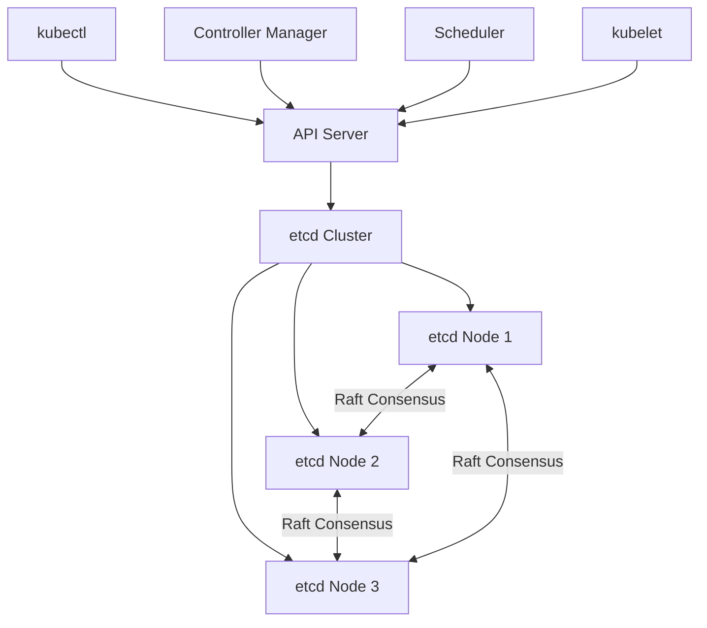
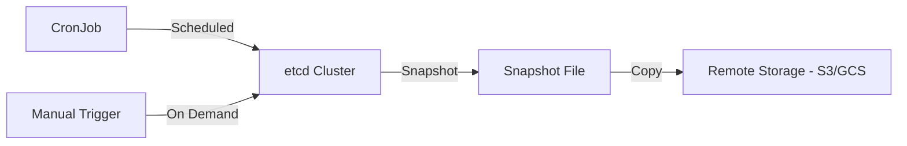
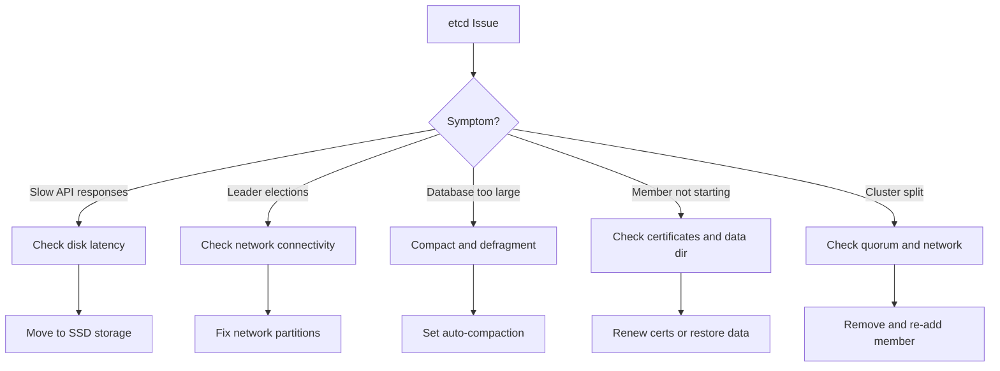

# How to Manage and Troubleshoot etcd in Kubernetes

Author: [nawazdhandala](https://www.github.com/nawazdhandala)

Tags: etcd, Kubernetes, Operations, Troubleshooting, Cluster

Description: Learn how to manage, backup, restore, and troubleshoot etcd in Kubernetes clusters for reliable control plane operations.

---

## What is etcd?

etcd is a distributed key-value store that serves as the backbone of Kubernetes. Every piece of cluster state - pods, services, deployments, secrets, config maps - is stored in etcd. If etcd goes down, your Kubernetes control plane stops working. If etcd data is lost, your entire cluster configuration is gone. Understanding how to manage, backup, and troubleshoot etcd is critical for any Kubernetes operator.

## etcd in the Kubernetes Architecture



etcd uses the Raft consensus algorithm to maintain consistency across nodes. A cluster of 3 etcd nodes can tolerate 1 node failure. A cluster of 5 nodes can tolerate 2 failures. Always deploy an odd number of etcd nodes.

## Checking etcd Health

```bash
# For kubeadm-based clusters, etcd runs as a static pod
# Find the etcd pod
kubectl get pods -n kube-system -l component=etcd

# Check etcd member list
# This shows all members of the etcd cluster and their status
kubectl exec -n kube-system etcd-master-1 -- etcdctl \
  --endpoints=https://127.0.0.1:2379 \
  --cacert=/etc/kubernetes/pki/etcd/ca.crt \
  --cert=/etc/kubernetes/pki/etcd/server.crt \
  --key=/etc/kubernetes/pki/etcd/server.key \
  member list -w table

# Check endpoint health
# All endpoints should report as healthy
kubectl exec -n kube-system etcd-master-1 -- etcdctl \
  --endpoints=https://127.0.0.1:2379 \
  --cacert=/etc/kubernetes/pki/etcd/ca.crt \
  --cert=/etc/kubernetes/pki/etcd/server.crt \
  --key=/etc/kubernetes/pki/etcd/server.key \
  endpoint health -w table

# Check endpoint status for detailed information
# This shows the leader, database size, and raft index
kubectl exec -n kube-system etcd-master-1 -- etcdctl \
  --endpoints=https://127.0.0.1:2379 \
  --cacert=/etc/kubernetes/pki/etcd/ca.crt \
  --cert=/etc/kubernetes/pki/etcd/server.crt \
  --key=/etc/kubernetes/pki/etcd/server.key \
  endpoint status -w table
```

## Setting Up an Alias for Convenience

```bash
# Create an alias to avoid typing the full etcdctl command every time
# Add this to your shell profile (.bashrc or .zshrc)
alias etcdctl_k8s='kubectl exec -n kube-system etcd-master-1 -- etcdctl \
  --endpoints=https://127.0.0.1:2379 \
  --cacert=/etc/kubernetes/pki/etcd/ca.crt \
  --cert=/etc/kubernetes/pki/etcd/server.crt \
  --key=/etc/kubernetes/pki/etcd/server.key'

# Now you can use it like this
etcdctl_k8s member list -w table
etcdctl_k8s endpoint health -w table
```

## Backing Up etcd



Regular backups are your safety net against data loss. Always back up etcd before any cluster upgrade or major change.

```bash
# Take a manual snapshot of etcd
# The snapshot captures the entire database state
kubectl exec -n kube-system etcd-master-1 -- etcdctl \
  --endpoints=https://127.0.0.1:2379 \
  --cacert=/etc/kubernetes/pki/etcd/ca.crt \
  --cert=/etc/kubernetes/pki/etcd/server.crt \
  --key=/etc/kubernetes/pki/etcd/server.key \
  snapshot save /var/lib/etcd/snapshot.db

# Copy the snapshot from the pod to your local machine
kubectl cp kube-system/etcd-master-1:/var/lib/etcd/snapshot.db ./etcd-snapshot.db

# Verify the snapshot integrity
# This checks that the snapshot is not corrupted
ETCDCTL_API=3 etcdctl snapshot status ./etcd-snapshot.db -w table
```

## Automated Backup with a CronJob

```yaml
# etcd-backup-cronjob.yaml
# Runs an etcd backup every 6 hours and uploads to S3
apiVersion: batch/v1
kind: CronJob
metadata:
  name: etcd-backup
  namespace: kube-system
spec:
  schedule: "0 */6 * * *"                  # Every 6 hours
  concurrencyPolicy: Forbid                # Do not run concurrent backups
  successfulJobsHistoryLimit: 3
  failedJobsHistoryLimit: 3
  jobTemplate:
    spec:
      template:
        spec:
          hostNetwork: true                # Access etcd on the host network
          nodeSelector:
            node-role.kubernetes.io/control-plane: ""
          tolerations:
            - key: node-role.kubernetes.io/control-plane
              effect: NoSchedule
          containers:
            - name: etcd-backup
              image: bitnami/etcd:latest
              command:
                - /bin/sh
                - -c
                - |
                  # Generate a timestamped snapshot filename
                  TIMESTAMP=$(date +%Y%m%d-%H%M%S)
                  SNAPSHOT_FILE="/backup/etcd-snapshot-${TIMESTAMP}.db"

                  # Take the snapshot
                  etcdctl snapshot save "${SNAPSHOT_FILE}" \
                    --endpoints=https://127.0.0.1:2379 \
                    --cacert=/etc/kubernetes/pki/etcd/ca.crt \
                    --cert=/etc/kubernetes/pki/etcd/server.crt \
                    --key=/etc/kubernetes/pki/etcd/server.key

                  # Verify the snapshot
                  etcdctl snapshot status "${SNAPSHOT_FILE}" -w table

                  echo "Backup completed: ${SNAPSHOT_FILE}"
              volumeMounts:
                - name: etcd-certs
                  mountPath: /etc/kubernetes/pki/etcd
                  readOnly: true
                - name: backup-volume
                  mountPath: /backup
          volumes:
            - name: etcd-certs
              hostPath:
                path: /etc/kubernetes/pki/etcd
            - name: backup-volume
              persistentVolumeClaim:
                claimName: etcd-backup-pvc
          restartPolicy: OnFailure
```

## Restoring etcd from a Snapshot

Restoring etcd is a critical operation. It should only be done when necessary, such as after data corruption or accidental deletion.

```bash
# Stop the API server and etcd on all control plane nodes
# For kubeadm clusters, move the static pod manifests
sudo mv /etc/kubernetes/manifests/kube-apiserver.yaml /tmp/
sudo mv /etc/kubernetes/manifests/etcd.yaml /tmp/

# Wait for the pods to stop
sleep 30

# Restore from the snapshot
# This creates a new data directory from the snapshot
sudo ETCDCTL_API=3 etcdctl snapshot restore ./etcd-snapshot.db \
  --data-dir=/var/lib/etcd-restored \
  --name=master-1 \
  --initial-cluster=master-1=https://10.0.0.1:2380 \
  --initial-advertise-peer-urls=https://10.0.0.1:2380

# Replace the old data directory with the restored one
sudo rm -rf /var/lib/etcd
sudo mv /var/lib/etcd-restored /var/lib/etcd
sudo chown -R etcd:etcd /var/lib/etcd

# Restart etcd and the API server
# Move the manifests back to restart the static pods
sudo mv /tmp/etcd.yaml /etc/kubernetes/manifests/
sudo mv /tmp/kube-apiserver.yaml /etc/kubernetes/manifests/

# Wait for the cluster to come back up
sleep 60
kubectl get nodes
```

## Compaction and Defragmentation

etcd keeps a history of all changes. Over time, this history grows and can consume significant disk space. Compaction removes old revisions, and defragmentation reclaims the freed space.

```bash
# Check the current database size
etcdctl_k8s endpoint status -w table

# Compact old revisions
# First, get the current revision number
REVISION=$(etcdctl_k8s endpoint status -w json | grep -o '"revision":[0-9]*' | head -1 | grep -o '[0-9]*')

# Compact all revisions before the current one
etcdctl_k8s compact $REVISION

# Defragment to reclaim disk space
# Run this on each etcd member one at a time
etcdctl_k8s defrag --endpoints=https://10.0.0.1:2379
etcdctl_k8s defrag --endpoints=https://10.0.0.2:2379
etcdctl_k8s defrag --endpoints=https://10.0.0.3:2379
```

## Common Troubleshooting Scenarios



```bash
# Check etcd logs for errors
kubectl logs -n kube-system etcd-master-1 --tail=100

# Monitor etcd performance metrics
# Watch for high fsync durations (should be under 10ms)
kubectl exec -n kube-system etcd-master-1 -- etcdctl \
  --endpoints=https://127.0.0.1:2379 \
  --cacert=/etc/kubernetes/pki/etcd/ca.crt \
  --cert=/etc/kubernetes/pki/etcd/server.crt \
  --key=/etc/kubernetes/pki/etcd/server.key \
  endpoint status -w table

# Check for alarms (e.g., NOSPACE alarm when disk is full)
etcdctl_k8s alarm list

# Clear alarms after fixing the underlying issue
etcdctl_k8s alarm disarm
```

## Performance Tuning

- **Use SSDs for etcd storage.** etcd is extremely sensitive to disk latency. Spinning disks will cause leader elections and cluster instability.
- **Separate etcd disks from other workloads.** etcd should have dedicated I/O bandwidth.
- **Set appropriate heartbeat and election timeouts.** The defaults (100ms heartbeat, 1000ms election) work for most environments.
- **Enable auto-compaction.** Set `--auto-compaction-retention=1` to automatically compact every hour.
- **Monitor the database size.** The default limit is 2 GB. If the database exceeds this, etcd stops accepting writes.

## Monitoring with OneUptime

etcd health directly determines Kubernetes control plane availability. OneUptime (https://oneuptime.com) can monitor etcd cluster health, track leader elections, alert on high disk latency, and watch database size growth. By setting up OneUptime alerts for etcd metrics, you can catch problems like disk space exhaustion, excessive leader elections, or certificate expiration before they cause a cluster outage.
