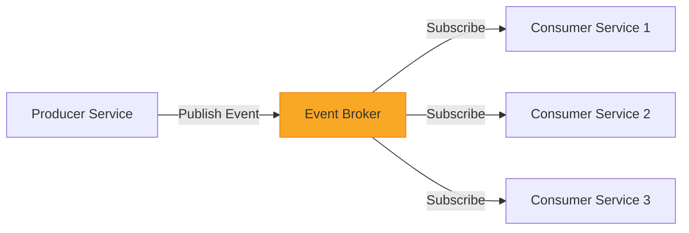
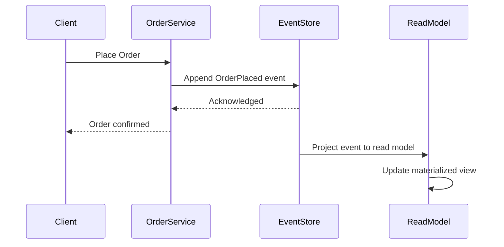
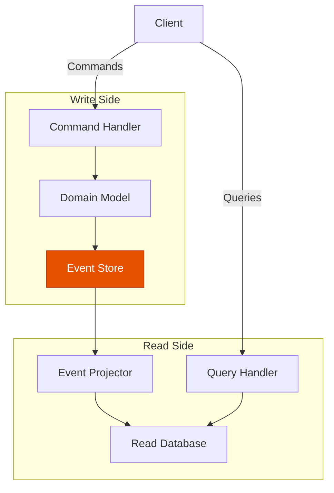

# How to Design Event-Driven Architecture for Microservices

Author: [nawazdhandala](https://www.github.com/nawazdhandala)

Tags: Event-Driven, Architecture, Microservices, CQRS, Event Sourcing

Description: A guide to designing event-driven architecture for microservices including CQRS, event sourcing, and eventual consistency.

---

Event-driven architecture (EDA) decouples services by letting them communicate through events rather than direct calls. Instead of Service A calling Service B synchronously, Service A publishes an event, and any interested service reacts to it. This pattern unlocks scalability, resilience, and flexibility in microservice systems.

## Why Event-Driven Architecture?

Traditional request-response communication creates tight coupling. When Service A calls Service B, it must wait for a response. If Service B is slow or unavailable, Service A suffers too. Events break this dependency chain.

Benefits include:

- **Loose coupling** - producers do not need to know about consumers
- **Scalability** - consumers can scale independently based on event volume
- **Resilience** - a failed consumer does not block the producer
- **Auditability** - events form a natural audit trail of what happened

## Core Concepts



### Events vs Commands vs Queries

Understanding the difference between these three message types is critical:

- **Event** - something that happened in the past (e.g., OrderPlaced)
- **Command** - a request to do something (e.g., PlaceOrder)
- **Query** - a request for data (e.g., GetOrderStatus)

## Designing Events

A well-designed event should be self-contained and immutable. Here is an example event schema:

```typescript
// Define a strongly-typed event interface
// Events are immutable records of things that happened
interface OrderPlacedEvent {
  // Unique identifier for this specific event instance
  eventId: string;

  // The type of event - used for routing and deserialization
  eventType: "OrderPlaced";

  // ISO 8601 timestamp of when the event occurred
  timestamp: string;

  // The aggregate or entity this event relates to
  aggregateId: string;

  // Version for schema evolution
  version: number;

  // The actual event data
  payload: {
    orderId: string;
    customerId: string;
    items: Array<{
      productId: string;
      quantity: number;
      price: number;
    }>;
    totalAmount: number;
  };

  // Metadata for tracing and debugging
  metadata: {
    correlationId: string;
    causationId: string;
    userId: string;
  };
}
```

## Event Sourcing

Event sourcing stores state as a sequence of events rather than as a single snapshot. Instead of updating a row in a database, you append an event to an event store. The current state is derived by replaying events.



Here is a simple event-sourced aggregate in Python:

```python
from dataclasses import dataclass, field
from typing import List
from datetime import datetime

@dataclass
class Event:
    """Base class for all domain events."""
    event_id: str
    timestamp: str = field(default_factory=lambda: datetime.utcnow().isoformat())

@dataclass
class OrderPlaced(Event):
    """Raised when a new order is created."""
    order_id: str = ""
    customer_id: str = ""
    total_amount: float = 0.0

@dataclass
class OrderShipped(Event):
    """Raised when an order is shipped."""
    order_id: str = ""
    tracking_number: str = ""

class OrderAggregate:
    """
    An event-sourced aggregate for orders.
    State is rebuilt by replaying events in sequence.
    """
    def __init__(self):
        self.order_id = None
        self.status = None
        self.events: List[Event] = []

    def place_order(self, order_id: str, customer_id: str, total: float):
        # Validate business rules before raising the event
        if self.status is not None:
            raise ValueError("Order already exists")

        # Create and apply the event
        event = OrderPlaced(
            event_id=f"evt-{order_id}-1",
            order_id=order_id,
            customer_id=customer_id,
            total_amount=total
        )
        self._apply(event)

    def ship_order(self, tracking_number: str):
        # Guard: order must exist and be in the right state
        if self.status != "placed":
            raise ValueError("Order cannot be shipped in current state")

        event = OrderShipped(
            event_id=f"evt-{self.order_id}-2",
            order_id=self.order_id,
            tracking_number=tracking_number
        )
        self._apply(event)

    def _apply(self, event: Event):
        """Apply an event to update internal state and record it."""
        if isinstance(event, OrderPlaced):
            self.order_id = event.order_id
            self.status = "placed"
        elif isinstance(event, OrderShipped):
            self.status = "shipped"

        # Append to the list of uncommitted events
        self.events.append(event)
```

## CQRS - Command Query Responsibility Segregation

CQRS separates the write model (commands) from the read model (queries). This lets you optimize each side independently.



The write side enforces business rules. The read side is optimized for fast queries. They communicate through events.

## Handling Eventual Consistency

In an event-driven system, data across services is eventually consistent. A consumer may not process an event immediately. You need strategies to handle this:

1. **Idempotent consumers** - processing the same event twice produces the same result
2. **Ordering guarantees** - use partition keys to ensure related events are processed in order
3. **Compensation events** - publish corrective events when something goes wrong
4. **Saga pattern** - coordinate multi-step transactions across services

```python
class IdempotentEventHandler:
    """
    Ensures each event is processed exactly once
    by tracking processed event IDs.
    """
    def __init__(self, redis_client):
        self.redis = redis_client

    def handle(self, event: dict):
        event_id = event["eventId"]

        # Check if we already processed this event
        # SET with NX returns True only if the key did not exist
        is_new = self.redis.set(
            f"processed:{event_id}",
            "1",
            nx=True,   # Only set if not exists
            ex=86400   # Expire after 24 hours
        )

        if not is_new:
            # Already processed - skip safely
            return

        # Process the event
        self._process(event)

    def _process(self, event: dict):
        """Actual event processing logic goes here."""
        print(f"Processing event: {event['eventType']}")
```

## Choosing an Event Broker

| Broker | Best For | Ordering | Retention |
|--------|----------|----------|-----------|
| Apache Kafka | High throughput, log-based | Per partition | Configurable |
| RabbitMQ | Flexible routing, low latency | Per queue | Until consumed |
| Amazon SNS/SQS | AWS-native, serverless | FIFO queues | 14 days max |
| NATS | Lightweight, cloud-native | Per subject | Configurable |

## Common Pitfalls

- **Event storms** - one event triggering a cascade of events that overwhelm the system
- **Schema evolution** - changing event schemas without breaking existing consumers
- **Lost events** - not persisting events before acknowledging to the producer
- **Debugging difficulty** - tracing a request across multiple asynchronous services

## Monitoring Event-Driven Systems

Observability is critical in event-driven architectures. You need to track:

- Event throughput and latency
- Consumer lag (how far behind consumers are)
- Dead letter queue depth
- Event processing error rates
- End-to-end correlation across services

OneUptime provides comprehensive monitoring for event-driven microservices. With distributed tracing, you can follow an event from producer through the broker to every consumer. Set up alerts on consumer lag, error rates, and processing latency to catch issues before they affect users. Visit [https://oneuptime.com](https://oneuptime.com) to start monitoring your event-driven architecture today.
