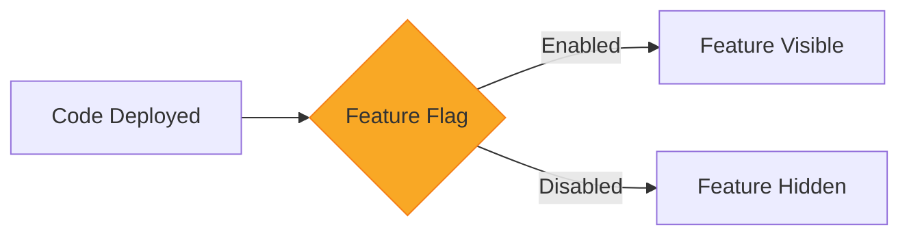
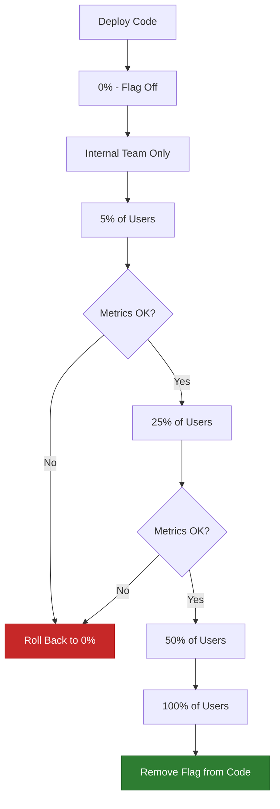

# How to Implement Feature Flags for Safe Deployments

Author: [nawazdhandala](https://www.github.com/nawazdhandala)

Tags: Feature Flags, Deployment, Progressive Delivery, Testing, DevOps

Description: Learn how to implement feature flags for safe deployments including progressive rollouts, A/B testing, and kill switches.

---

Feature flags let you separate code deployment from feature release. You can deploy code to production without exposing it to users, then toggle features on or off without redeploying. This gives you fine-grained control over who sees what, when they see it, and the ability to instantly disable a feature if something goes wrong.

## Why Feature Flags?

Without feature flags, deploying code and releasing features are the same action. This is risky. With feature flags, you can:

- Deploy code to production with features turned off
- Gradually roll out features to a percentage of users
- Run A/B tests by showing different variants to different groups
- Instantly disable a broken feature without a rollback
- Let non-engineers control feature releases



## Building a Simple Feature Flag System

Here is a straightforward feature flag implementation using a configuration store:

```python
import redis
import json
import hashlib
from typing import Optional

class FeatureFlagService:
    """
    A simple feature flag service backed by Redis.
    Supports boolean flags, percentage rollouts, and user targeting.
    """

    def __init__(self, redis_client: redis.Redis):
        self.redis = redis_client
        # Prefix all flag keys to avoid collisions
        self.prefix = "ff:"

    def create_flag(self, flag_name: str, config: dict):
        """
        Create or update a feature flag.
        Config example:
        {
            "enabled": True,
            "rollout_percentage": 50,
            "allowed_users": ["user-123", "user-456"],
            "blocked_users": []
        }
        """
        self.redis.set(
            f"{self.prefix}{flag_name}",
            json.dumps(config)
        )

    def is_enabled(self, flag_name: str, user_id: Optional[str] = None) -> bool:
        """
        Check if a feature flag is enabled for a given user.
        Evaluation order:
        1. Check if user is explicitly blocked
        2. Check if user is explicitly allowed
        3. Check percentage rollout
        4. Fall back to global enabled/disabled state
        """
        raw = self.redis.get(f"{self.prefix}{flag_name}")
        if raw is None:
            # Unknown flags default to disabled for safety
            return False

        config = json.loads(raw)

        # Global kill switch - if disabled, nobody gets the feature
        if not config.get("enabled", False):
            return False

        # If no user context, just return the global state
        if user_id is None:
            return config.get("enabled", False)

        # Check explicit block list first
        if user_id in config.get("blocked_users", []):
            return False

        # Check explicit allow list
        if user_id in config.get("allowed_users", []):
            return True

        # Percentage-based rollout using consistent hashing
        rollout = config.get("rollout_percentage", 100)
        return self._is_in_rollout(flag_name, user_id, rollout)

    def _is_in_rollout(self, flag_name: str, user_id: str, percentage: int) -> bool:
        """
        Deterministic percentage rollout using hashing.
        The same user always gets the same result for the same flag,
        ensuring a consistent experience.
        """
        # Hash the flag name + user ID for deterministic assignment
        hash_input = f"{flag_name}:{user_id}"
        hash_value = int(hashlib.sha256(hash_input.encode()).hexdigest(), 16)

        # Map to 0-99 range and compare against rollout percentage
        bucket = hash_value % 100
        return bucket < percentage
```

## Using Feature Flags in Application Code

```python
from fastapi import FastAPI, Request

app = FastAPI()
flags = FeatureFlagService(redis.Redis())

@app.get("/dashboard")
async def dashboard(request: Request):
    user_id = request.state.user_id
    response = {"widgets": ["status", "metrics"]}

    # Check if the new recommendations widget is enabled for this user
    if flags.is_enabled("new_recommendations_widget", user_id):
        response["widgets"].append("recommendations")

    # Check if the redesigned layout is enabled
    if flags.is_enabled("redesigned_layout", user_id):
        response["layout"] = "v2"
    else:
        response["layout"] = "v1"

    return response
```

## Progressive Rollout Strategy

A safe progressive rollout follows stages, increasing exposure at each step:



```python
class ProgressiveRollout:
    """
    Manages a staged rollout with automatic progression
    based on health metrics.
    """

    # Stages define the rollout percentage and observation duration
    STAGES = [
        {"percentage": 5, "observe_minutes": 30},
        {"percentage": 25, "observe_minutes": 60},
        {"percentage": 50, "observe_minutes": 120},
        {"percentage": 100, "observe_minutes": 0},
    ]

    def __init__(self, flag_service: FeatureFlagService, metrics_client):
        self.flags = flag_service
        self.metrics = metrics_client

    def advance_rollout(self, flag_name: str, current_stage: int):
        """Move to the next rollout stage if metrics are healthy."""
        if current_stage >= len(self.STAGES):
            print(f"Rollout of {flag_name} is already complete")
            return

        stage = self.STAGES[current_stage]

        # Check error rate for users with the flag enabled
        error_rate = self.metrics.get_error_rate(
            flag_name=flag_name,
            window_minutes=stage["observe_minutes"]
        )

        if error_rate > 0.01:  # More than 1% error rate
            print(f"Error rate too high ({error_rate:.2%}) - halting rollout")
            self._rollback(flag_name)
            return

        # Advance to the next stage
        next_stage = current_stage + 1
        next_percentage = self.STAGES[next_stage]["percentage"]
        print(f"Advancing {flag_name} to {next_percentage}%")

        self.flags.create_flag(flag_name, {
            "enabled": True,
            "rollout_percentage": next_percentage
        })

    def _rollback(self, flag_name: str):
        """Emergency rollback - disable the flag entirely."""
        self.flags.create_flag(flag_name, {
            "enabled": False,
            "rollout_percentage": 0
        })
        print(f"ROLLBACK: {flag_name} disabled")
```

## Kill Switches

A kill switch is a feature flag designed specifically for emergency shutdowns. When a downstream service is failing, you can instantly disable the code path that depends on it.

```python
class KillSwitch:
    """
    Emergency kill switches for critical code paths.
    When activated, the protected code path is bypassed entirely.
    """

    def __init__(self, flag_service: FeatureFlagService):
        self.flags = flag_service

    def is_active(self, switch_name: str) -> bool:
        """Check if a kill switch is active (feature should be disabled)."""
        return not self.flags.is_enabled(f"kill:{switch_name}")

    def activate(self, switch_name: str):
        """Activate kill switch - disable the feature immediately."""
        self.flags.create_flag(f"kill:{switch_name}", {
            "enabled": False,
            "rollout_percentage": 0
        })

    def deactivate(self, switch_name: str):
        """Deactivate kill switch - restore normal operation."""
        self.flags.create_flag(f"kill:{switch_name}", {
            "enabled": True,
            "rollout_percentage": 100
        })


# Usage in application code
kill_switch = KillSwitch(flag_service)

@app.get("/checkout")
async def checkout(request: Request):
    # If the payment service is down, show a maintenance page
    if kill_switch.is_active("payment_service"):
        return {"error": "Checkout temporarily unavailable"}

    # Normal checkout flow
    return process_checkout(request)
```

## Feature Flag Best Practices

1. **Name flags descriptively** - use names like `enable_new_search_algorithm` not `flag_42`
2. **Set expiration dates** - every flag should have a planned removal date
3. **Clean up old flags** - remove flags from code once fully rolled out
4. **Log flag evaluations** - track which users see which variants for debugging
5. **Use typed flags** - support booleans, strings, numbers, and JSON configurations
6. **Test both paths** - write tests for the feature-on and feature-off code paths

## Types of Feature Flags

| Type | Lifespan | Purpose | Example |
|------|----------|---------|---------|
| Release flag | Days to weeks | Control feature rollout | New dashboard |
| Experiment flag | Weeks to months | A/B testing | Button color test |
| Ops flag | Permanent | Operational control | Kill switches |
| Permission flag | Permanent | User entitlements | Premium features |

## Monitoring Feature Flags

Monitoring flag evaluations is critical for understanding impact:

- Track how many users are in each flag variant
- Compare error rates between flag-on and flag-off groups
- Monitor latency differences between variants
- Alert when a flag evaluation rate changes unexpectedly

OneUptime provides the monitoring backbone for feature flag deployments. Correlate feature flag changes with error rate spikes, latency increases, and infrastructure metrics. When you roll out a new feature to 10% of users and see a latency spike, OneUptime helps you identify the connection instantly. Start monitoring your progressive delivery pipeline at [https://oneuptime.com](https://oneuptime.com).
