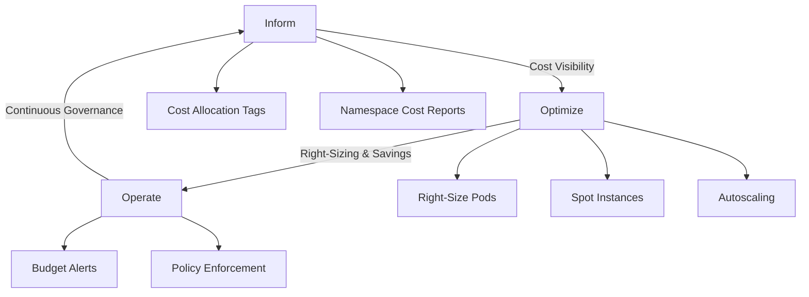
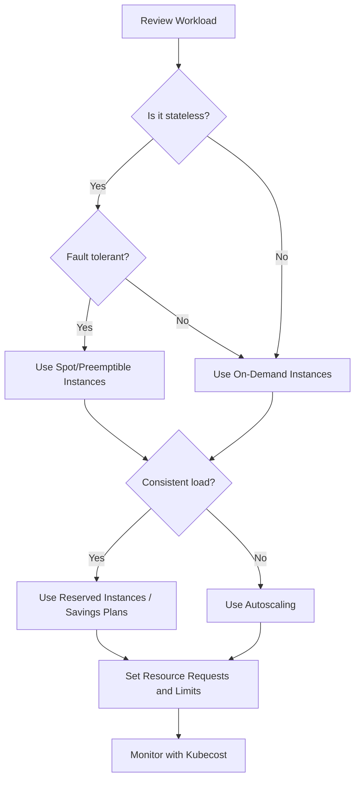
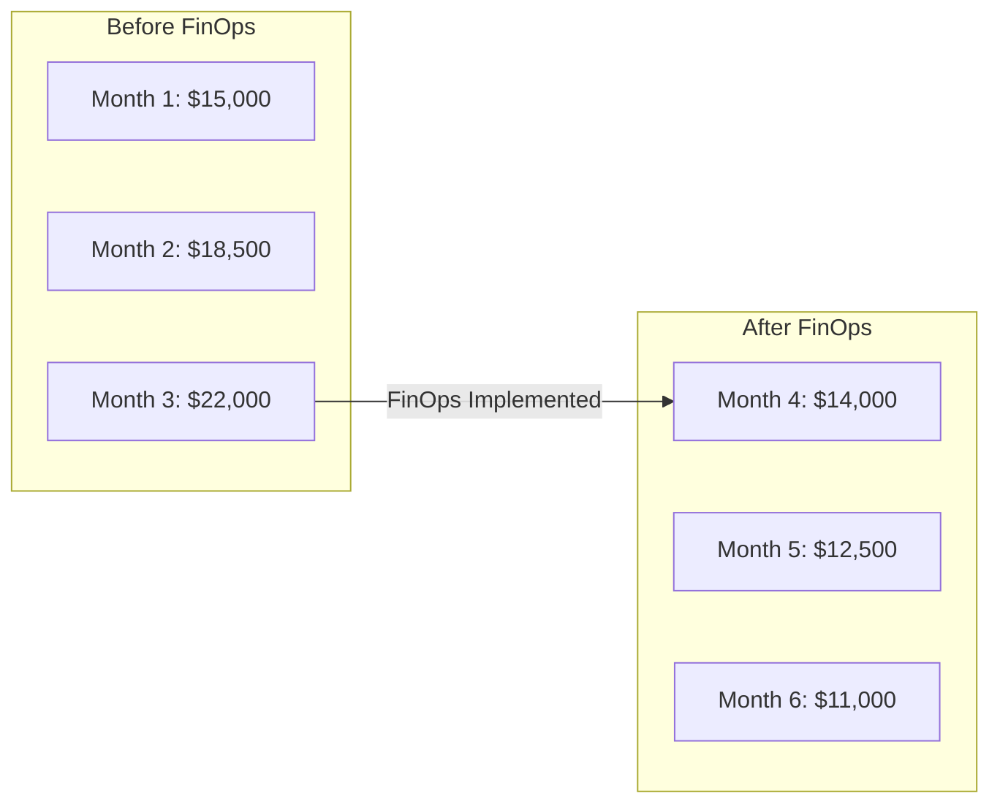

# How to Implement FinOps for Kubernetes Cost Optimization

Author: [nawazdhandala](https://www.github.com/nawazdhandala)

Tags: FinOps, Kubernetes, Cost Optimization, Cloud, Resource Management

Description: Learn how to implement FinOps practices for Kubernetes cost optimization including right-sizing, spot instances, and cost visibility.

---

Kubernetes makes it easy to deploy and scale applications, but without proper cost management, cloud bills can spiral out of control. FinOps brings financial accountability to cloud spending by combining engineering practices with financial discipline. When applied to Kubernetes, FinOps helps you right-size workloads, eliminate waste, and make informed decisions about resource allocation.

This guide covers practical strategies for implementing FinOps in your Kubernetes environment.

## The FinOps Lifecycle for Kubernetes



## Step 1: Set Up Cost Visibility with Kubecost

Kubecost gives you a per-namespace, per-deployment, and per-pod breakdown of your Kubernetes costs.

```bash
# Install Kubecost using Helm
helm repo add kubecost https://kubecost.github.io/cost-analyzer/
helm install kubecost kubecost/cost-analyzer \
  --namespace kubecost \
  --create-namespace \
  --set kubecostToken="your-token-here"

# Verify the installation
kubectl get pods -n kubecost
```

## Step 2: Implement Cost Allocation with Labels

Consistent labeling is the foundation of cost allocation. Every workload should have labels that map to teams, projects, and environments.

```yaml
# cost-labels-policy.yaml
# OPA Gatekeeper constraint template to enforce cost labels
apiVersion: templates.gatekeeper.sh/v1
kind: ConstraintTemplate
metadata:
  name: k8srequiredlabels
spec:
  crd:
    spec:
      names:
        kind: K8sRequiredLabels
      validation:
        openAPIV3Schema:
          type: object
          properties:
            labels:
              type: array
              items:
                type: string
  targets:
    - target: admission.k8s.gatekeeper.sh
      rego: |
        package k8srequiredlabels
        # Check that all required labels are present
        violation[{"msg": msg}] {
          provided := {label | input.review.object.metadata.labels[label]}
          required := {label | label := input.parameters.labels[_]}
          missing := required - provided
          count(missing) > 0
          msg := sprintf("Missing required labels: %v", [missing])
        }
---
# Enforce cost labels on all Deployments
apiVersion: constraints.gatekeeper.sh/v1beta1
kind: K8sRequiredLabels
metadata:
  name: require-cost-labels
spec:
  match:
    kinds:
      - apiGroups: ["apps"]
        kinds: ["Deployment"]
  parameters:
    labels:
      - "team"
      - "project"
      - "environment"
      - "cost-center"
```

## Step 3: Right-Size Your Workloads

Over-provisioned pods are one of the biggest sources of waste. Use the Vertical Pod Autoscaler (VPA) to get right-sizing recommendations.

```yaml
# vpa-recommendation.yaml
# Creates a VPA in recommendation mode to suggest optimal resource values
apiVersion: autoscaling.k8s.io/v1
kind: VerticalPodAutoscaler
metadata:
  name: api-server-vpa
  namespace: production
spec:
  targetRef:
    apiVersion: apps/v1
    kind: Deployment
    name: api-server
  # "Off" mode provides recommendations without auto-applying them
  updatePolicy:
    updateMode: "Off"
  resourcePolicy:
    containerPolicies:
      - containerName: api-server
        # Set minimum and maximum bounds for recommendations
        minAllowed:
          cpu: 50m
          memory: 64Mi
        maxAllowed:
          cpu: "4"
          memory: 8Gi
```

```bash
# Check VPA recommendations for all workloads
kubectl get vpa -A -o custom-columns=\
  NAMESPACE:.metadata.namespace,\
  NAME:.metadata.name,\
  CPU_REQUEST:.status.recommendation.containerRecommendations[0].target.cpu,\
  MEM_REQUEST:.status.recommendation.containerRecommendations[0].target.memory
```

## Step 4: Implement Pod Autoscaling

```yaml
# hpa-config.yaml
# Horizontal Pod Autoscaler to scale based on actual demand
apiVersion: autoscaling/v2
kind: HorizontalPodAutoscaler
metadata:
  name: api-server-hpa
  namespace: production
spec:
  scaleTargetRef:
    apiVersion: apps/v1
    kind: Deployment
    name: api-server
  # Scale between 2 and 20 replicas
  minReplicas: 2
  maxReplicas: 20
  metrics:
    # Scale based on average CPU utilization
    - type: Resource
      resource:
        name: cpu
        target:
          type: Utilization
          averageUtilization: 70
    # Also consider memory utilization
    - type: Resource
      resource:
        name: memory
        target:
          type: Utilization
          averageUtilization: 80
  behavior:
    # Scale up quickly when demand increases
    scaleUp:
      stabilizationWindowSeconds: 60
      policies:
        - type: Percent
          value: 50
          periodSeconds: 60
    # Scale down slowly to avoid thrashing
    scaleDown:
      stabilizationWindowSeconds: 300
      policies:
        - type: Percent
          value: 10
          periodSeconds: 120
```

## Cost Optimization Decision Flow



## Step 5: Use Spot Instances for Non-Critical Workloads

```yaml
# spot-node-pool.yaml
# Node affinity and tolerations for spot instance scheduling
apiVersion: apps/v1
kind: Deployment
metadata:
  name: batch-processor
  namespace: production
  labels:
    team: data-engineering
    project: etl-pipeline
    environment: production
    cost-center: DE-001
spec:
  replicas: 5
  selector:
    matchLabels:
      app: batch-processor
  template:
    metadata:
      labels:
        app: batch-processor
    spec:
      # Tolerate spot instance taints
      tolerations:
        - key: "cloud.google.com/gke-spot"
          operator: "Equal"
          value: "true"
          effect: "NoSchedule"
      # Prefer scheduling on spot nodes
      affinity:
        nodeAffinity:
          preferredDuringSchedulingIgnoredDuringExecution:
            - weight: 100
              preference:
                matchExpressions:
                  - key: cloud.google.com/gke-spot
                    operator: In
                    values:
                      - "true"
      containers:
        - name: batch-processor
          image: batch-processor:latest
          resources:
            requests:
              cpu: 250m
              memory: 512Mi
            limits:
              cpu: "1"
              memory: 1Gi
```

## Step 6: Set Up Resource Quotas and Limit Ranges

```yaml
# namespace-budget.yaml
# Enforce resource budgets at the namespace level
apiVersion: v1
kind: ResourceQuota
metadata:
  name: team-alpha-quota
  namespace: team-alpha
spec:
  hard:
    # Cap total CPU and memory for the namespace
    requests.cpu: "20"
    requests.memory: 40Gi
    limits.cpu: "40"
    limits.memory: 80Gi
    # Limit the number of pods
    pods: "50"
    # Limit PVC storage
    persistentvolumeclaims: "20"
    requests.storage: 200Gi
---
# Default resource limits for pods that do not specify them
apiVersion: v1
kind: LimitRange
metadata:
  name: default-limits
  namespace: team-alpha
spec:
  limits:
    - type: Container
      default:
        cpu: 500m
        memory: 512Mi
      defaultRequest:
        cpu: 100m
        memory: 128Mi
      max:
        cpu: "4"
        memory: 8Gi
      min:
        cpu: 50m
        memory: 64Mi
```

## Step 7: Create Cost Dashboards

```python
# cost_report.py
# Generates a weekly cost report from the Kubecost API
import requests
import json
from datetime import datetime, timedelta

# Kubecost API endpoint
KUBECOST_URL = "http://kubecost.kubecost.svc.cluster.local:9090"

def get_namespace_costs(days=7):
    """Fetch per-namespace cost data from Kubecost."""
    end = datetime.now()
    start = end - timedelta(days=days)

    # Query the allocation API for namespace-level costs
    response = requests.get(
        f"{KUBECOST_URL}/model/allocation",
        params={
            "window": f"{start.isoformat()}Z,{end.isoformat()}Z",
            "aggregate": "namespace",
            "accumulate": "true",
        },
    )
    return response.json()

def generate_report():
    """Generate and print a formatted cost report."""
    data = get_namespace_costs()
    allocations = data.get("data", [{}])[0]

    print(f"Kubernetes Cost Report - Last 7 Days")
    print(f"Generated: {datetime.now().strftime('%Y-%m-%d %H:%M')}")
    print("-" * 60)
    print(f"{'Namespace':<25} {'CPU Cost':>10} {'RAM Cost':>10} {'Total':>10}")
    print("-" * 60)

    total_cost = 0
    for ns, info in sorted(allocations.items()):
        cpu_cost = info.get("cpuCost", 0)
        ram_cost = info.get("ramCost", 0)
        ns_total = cpu_cost + ram_cost
        total_cost += ns_total
        # Print each namespace with its cost breakdown
        print(f"{ns:<25} ${cpu_cost:>9.2f} ${ram_cost:>9.2f} ${ns_total:>9.2f}")

    print("-" * 60)
    print(f"{'TOTAL':<25} {'':>10} {'':>10} ${total_cost:>9.2f}")

if __name__ == "__main__":
    generate_report()
```

## Monthly Cost Trend



## Continuous Cost Governance

FinOps is not a one-time effort. You need continuous monitoring and governance to keep costs under control.

For monitoring your Kubernetes infrastructure and tracking the impact of cost optimization changes, [OneUptime](https://oneuptime.com) provides comprehensive observability. You can set up monitors for your applications, track performance metrics before and after right-sizing, and create status pages to communicate service health to stakeholders. OneUptime's alerting ensures that aggressive cost-cutting does not compromise reliability by notifying you immediately when service degradation occurs.
