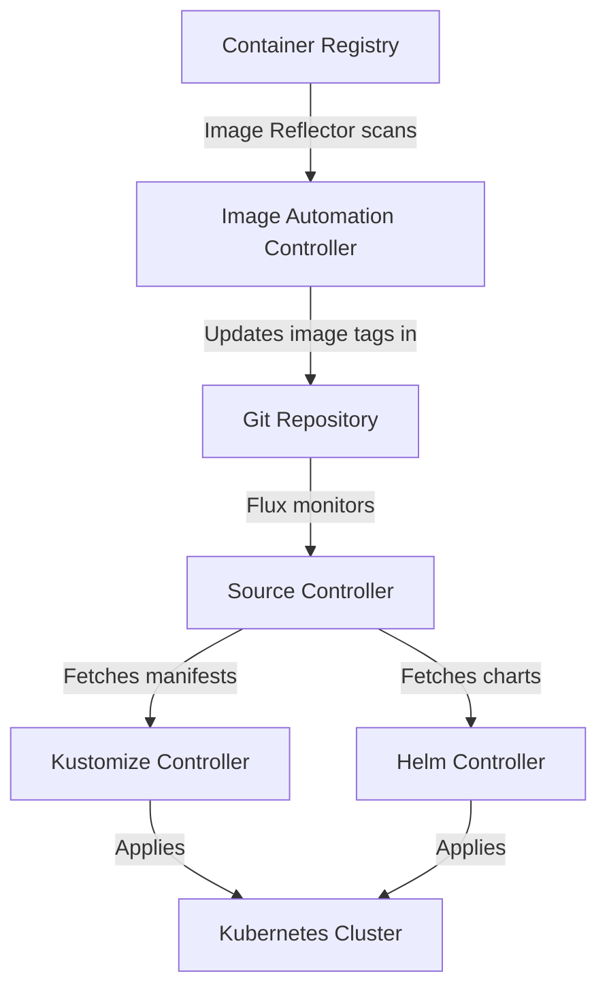
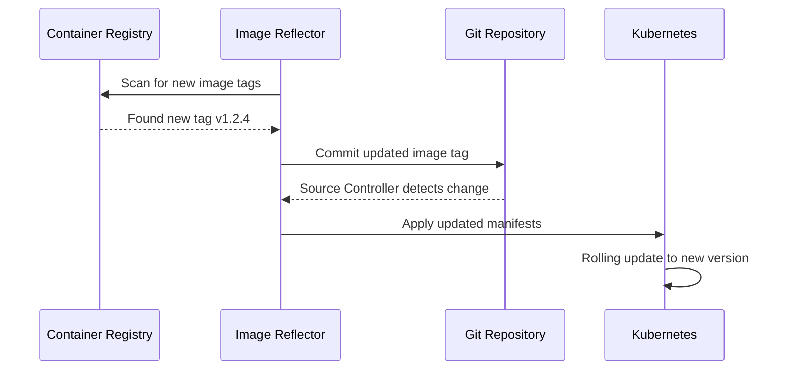
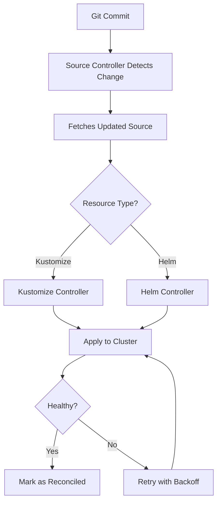

# How to Use FluxCD for GitOps Continuous Delivery

Author: [nawazdhandala](https://www.github.com/nawazdhandala)

Tags: FluxCD, GitOps, Kubernetes, Continuous Delivery, Automation

Description: Learn how to use FluxCD for GitOps-based continuous delivery with automated image updates and Helm chart management.

---

## Introduction

FluxCD is a GitOps toolkit for Kubernetes that keeps your clusters in sync with Git repositories. Unlike traditional CI/CD where a pipeline pushes changes to the cluster, Flux pulls changes from Git and applies them automatically. It also supports Helm charts, Kustomize overlays, and automated image updates out of the box.

This guide covers installing Flux, configuring Git sources, deploying applications, managing Helm releases, and setting up automated image updates.

## How FluxCD Works



Flux consists of several controllers, each responsible for a specific part of the GitOps workflow.

## Installing FluxCD

### Prerequisites

```bash
# Install the Flux CLI
brew install fluxcd/tap/flux

# Verify the installation
flux --version

# Check that your cluster meets the prerequisites
flux check --pre
```

### Bootstrap Flux

Bootstrapping installs Flux and connects it to your Git repository.

```bash
# Bootstrap Flux with GitHub
# This creates the flux-system namespace and connects to your repo
flux bootstrap github \
  --owner=myorg \
  --repository=gitops-repo \
  --branch=main \
  --path=clusters/production \
  --personal
```

This command does the following:

1. Creates the `flux-system` namespace
2. Installs Flux controllers
3. Creates a `GitRepository` source pointing to your repo
4. Commits Flux manifests back to the repository

## Repository Structure

```
gitops-repo/
  clusters/
    production/
      flux-system/           # Auto-generated by bootstrap
        gotk-components.yaml
        gotk-sync.yaml
        kustomization.yaml
      apps.yaml              # Points to the apps directory
      infrastructure.yaml    # Points to infrastructure
  apps/
    base/
      my-app/
        deployment.yaml
        service.yaml
        kustomization.yaml
    production/
      kustomization.yaml
  infrastructure/
    base/
      ingress-nginx/
      cert-manager/
    production/
      kustomization.yaml
```

## Configuring a Git Source

```yaml
# clusters/production/apps.yaml
# Tell Flux where to find application manifests
apiVersion: source.toolkit.fluxcd.io/v1
kind: GitRepository
metadata:
  name: apps
  namespace: flux-system
spec:
  interval: 1m
  url: https://github.com/myorg/gitops-repo
  ref:
    branch: main
---
# Tell Flux which path to reconcile
apiVersion: kustomize.toolkit.fluxcd.io/v1
kind: Kustomization
metadata:
  name: apps
  namespace: flux-system
spec:
  interval: 10m
  # Reference the GitRepository source
  sourceRef:
    kind: GitRepository
    name: apps
  # Path within the repository
  path: ./apps/production
  # Automatically clean up removed resources
  prune: true
  # Timeout for applying resources
  timeout: 5m
```

## Deploying an Application

### Base Manifests

```yaml
# apps/base/my-app/deployment.yaml
apiVersion: apps/v1
kind: Deployment
metadata:
  name: my-app
  labels:
    app: my-app
spec:
  replicas: 2
  selector:
    matchLabels:
      app: my-app
  template:
    metadata:
      labels:
        app: my-app
    spec:
      containers:
        - name: my-app
          image: ghcr.io/myorg/my-app:v1.0.0
          ports:
            - containerPort: 8080
          resources:
            requests:
              cpu: 100m
              memory: 128Mi
            limits:
              cpu: 500m
              memory: 256Mi
          # Liveness probe for health checking
          livenessProbe:
            httpGet:
              path: /healthz
              port: 8080
            initialDelaySeconds: 10
```

```yaml
# apps/base/my-app/service.yaml
apiVersion: v1
kind: Service
metadata:
  name: my-app
spec:
  selector:
    app: my-app
  ports:
    - port: 80
      targetPort: 8080
```

```yaml
# apps/base/my-app/kustomization.yaml
apiVersion: kustomize.config.k8s.io/v1beta1
kind: Kustomization
resources:
  - deployment.yaml
  - service.yaml
```

### Production Overlay

```yaml
# apps/production/kustomization.yaml
apiVersion: kustomize.config.k8s.io/v1beta1
kind: Kustomization
resources:
  - ../base/my-app
namespace: production
patches:
  - target:
      kind: Deployment
      name: my-app
    patch: |
      - op: replace
        path: /spec/replicas
        value: 3
```

## Managing Helm Releases

Flux can manage Helm charts from any Helm repository.

```yaml
# infrastructure/base/ingress-nginx/helmrepository.yaml
# Add the ingress-nginx Helm repository
apiVersion: source.toolkit.fluxcd.io/v1
kind: HelmRepository
metadata:
  name: ingress-nginx
  namespace: flux-system
spec:
  interval: 1h
  url: https://kubernetes.github.io/ingress-nginx
```

```yaml
# infrastructure/base/ingress-nginx/helmrelease.yaml
# Install ingress-nginx via Helm
apiVersion: helm.toolkit.fluxcd.io/v2
kind: HelmRelease
metadata:
  name: ingress-nginx
  namespace: ingress-nginx
spec:
  interval: 30m
  chart:
    spec:
      chart: ingress-nginx
      version: "4.8.x"
      sourceRef:
        kind: HelmRepository
        name: ingress-nginx
        namespace: flux-system
  # Helm values for customization
  values:
    controller:
      replicaCount: 2
      resources:
        requests:
          cpu: 100m
          memory: 128Mi
      metrics:
        enabled: true
```

## Automated Image Updates

One of Flux's most powerful features is automated image updates. Flux scans your container registry, detects new image tags, and commits the update back to Git.



### Configure Image Scanning

```yaml
# clusters/production/image-automation.yaml
# Scan the container registry for new images
apiVersion: image.toolkit.fluxcd.io/v1beta2
kind: ImageRepository
metadata:
  name: my-app
  namespace: flux-system
spec:
  image: ghcr.io/myorg/my-app
  interval: 5m
---
# Define which tags to track using a semver policy
apiVersion: image.toolkit.fluxcd.io/v1beta2
kind: ImagePolicy
metadata:
  name: my-app
  namespace: flux-system
spec:
  imageRepositoryRef:
    name: my-app
  policy:
    semver:
      # Track any version in the 1.x range
      range: "1.x"
---
# Automatically commit image updates back to Git
apiVersion: image.toolkit.fluxcd.io/v1beta2
kind: ImageUpdateAutomation
metadata:
  name: my-app
  namespace: flux-system
spec:
  interval: 30m
  sourceRef:
    kind: GitRepository
    name: apps
  git:
    checkout:
      ref:
        branch: main
    commit:
      author:
        name: fluxcdbot
        email: flux@myorg.com
      messageTemplate: "chore: update my-app to {{range .Changed.Changes}}{{.NewValue}}{{end}}"
    push:
      branch: main
  update:
    path: ./apps
    strategy: Setters
```

### Mark Images for Automation

Add a comment marker to the image field in your deployment.

```yaml
# apps/base/my-app/deployment.yaml
containers:
  - name: my-app
    image: ghcr.io/myorg/my-app:v1.0.0 # {"$imagepolicy": "flux-system:my-app"}
```

Flux uses this marker to know which image fields to update automatically.

## Monitoring Flux Status

```bash
# Check the overall Flux status
flux check

# View all Flux resources and their sync status
flux get all

# Check specific resource types
flux get sources git
flux get kustomizations
flux get helmreleases

# View events for a specific resource
flux events --for Kustomization/apps

# Suspend and resume reconciliation
flux suspend kustomization apps
flux resume kustomization apps
```

## Flux Reconciliation Flow



## Notifications and Alerts

Configure Flux to send alerts when deployments succeed or fail.

```yaml
# clusters/production/notifications.yaml
# Send alerts to Slack
apiVersion: notification.toolkit.fluxcd.io/v1beta3
kind: Provider
metadata:
  name: slack
  namespace: flux-system
spec:
  type: slack
  channel: deployments
  secretRef:
    name: slack-webhook
---
apiVersion: notification.toolkit.fluxcd.io/v1beta3
kind: Alert
metadata:
  name: deployment-alerts
  namespace: flux-system
spec:
  providerRef:
    name: slack
  eventSeverity: info
  eventSources:
    - kind: Kustomization
      name: "*"
    - kind: HelmRelease
      name: "*"
```

## Monitoring Your GitOps Pipeline

FluxCD automates deployment, but you still need to verify that deployed applications are healthy and performing well. OneUptime (https://oneuptime.com) provides the observability layer for your Flux-managed applications. Monitor uptime, track response times, and receive instant alerts when a Flux-deployed update causes issues. With OneUptime's status pages and incident management, your team can respond to problems quickly and keep stakeholders informed throughout the resolution process.
