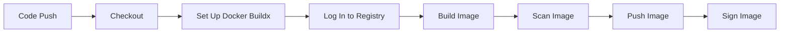
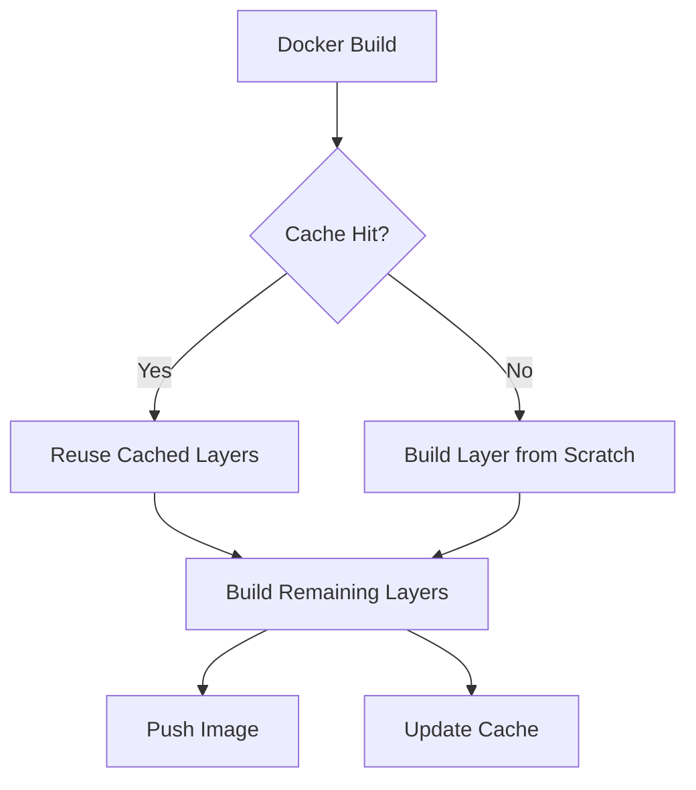
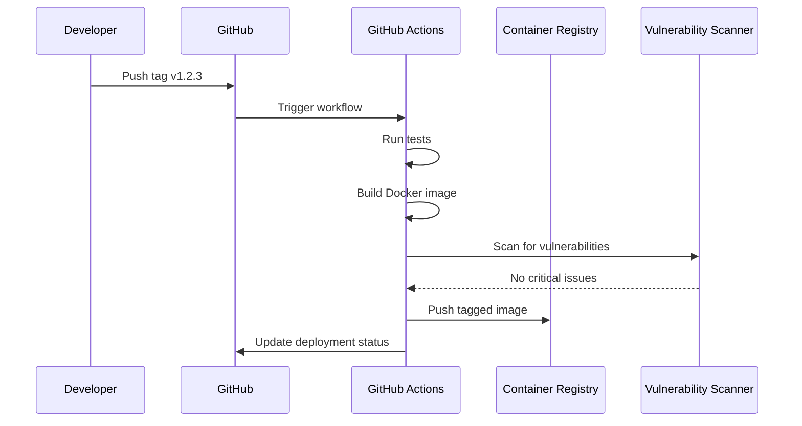

# How to Build and Push Docker Images with GitHub Actions

Author: [nawazdhandala](https://www.github.com/nawazdhandala)

Tags: GitHub Actions, Docker, CI/CD, Container Registry, Build

Description: Learn how to set up GitHub Actions workflows for building Docker images and pushing them to container registries.

---

## Introduction

Building and pushing Docker images is one of the most common CI/CD tasks. GitHub Actions makes this straightforward with excellent Docker support and integration with multiple container registries. Whether you use Docker Hub, GitHub Container Registry (GHCR), Amazon ECR, or Google Artifact Registry, the workflow pattern is the same.

This guide covers everything from a basic build-and-push workflow to advanced techniques like multi-platform builds, layer caching, and image scanning.

## Workflow Overview



## Basic Build and Push to GHCR

GitHub Container Registry is the simplest option since authentication uses the built-in `GITHUB_TOKEN`.

```yaml
# .github/workflows/docker.yml
name: Build and Push Docker Image

on:
  push:
    branches: [main]
    tags: ["v*"]
  pull_request:
    branches: [main]

# Set permissions for GITHUB_TOKEN
permissions:
  contents: read
  packages: write

jobs:
  build:
    runs-on: ubuntu-latest

    steps:
      # Step 1: Check out the repository code
      - name: Checkout
        uses: actions/checkout@v4

      # Step 2: Set up Docker Buildx for advanced features
      - name: Set up Docker Buildx
        uses: docker/setup-buildx-action@v3

      # Step 3: Log in to GitHub Container Registry
      - name: Log in to GHCR
        uses: docker/login-action@v3
        with:
          registry: ghcr.io
          username: ${{ github.actor }}
          password: ${{ secrets.GITHUB_TOKEN }}

      # Step 4: Generate tags and labels from Git metadata
      - name: Extract metadata
        id: meta
        uses: docker/metadata-action@v5
        with:
          images: ghcr.io/${{ github.repository }}
          tags: |
            # Tag with branch name
            type=ref,event=branch
            # Tag with PR number
            type=ref,event=pr
            # Tag with semver from git tag
            type=semver,pattern={{version}}
            type=semver,pattern={{major}}.{{minor}}
            # Tag with short SHA
            type=sha,prefix=

      # Step 5: Build and push the Docker image
      - name: Build and push
        uses: docker/build-push-action@v5
        with:
          context: .
          # Only push on main branch and tags, not PRs
          push: ${{ github.event_name != 'pull_request' }}
          tags: ${{ steps.meta.outputs.tags }}
          labels: ${{ steps.meta.outputs.labels }}
          # Enable build cache for faster builds
          cache-from: type=gha
          cache-to: type=gha,mode=max
```

## Pushing to Docker Hub

```yaml
# .github/workflows/docker-hub.yml
name: Push to Docker Hub

on:
  push:
    tags: ["v*"]

jobs:
  push:
    runs-on: ubuntu-latest

    steps:
      - name: Checkout
        uses: actions/checkout@v4

      - name: Set up Docker Buildx
        uses: docker/setup-buildx-action@v3

      # Log in using Docker Hub credentials stored as secrets
      - name: Log in to Docker Hub
        uses: docker/login-action@v3
        with:
          username: ${{ secrets.DOCKERHUB_USERNAME }}
          password: ${{ secrets.DOCKERHUB_TOKEN }}

      - name: Extract metadata
        id: meta
        uses: docker/metadata-action@v5
        with:
          images: myorg/myapp

      - name: Build and push
        uses: docker/build-push-action@v5
        with:
          context: .
          push: true
          tags: ${{ steps.meta.outputs.tags }}
          labels: ${{ steps.meta.outputs.labels }}
```

## Pushing to Amazon ECR

```yaml
# .github/workflows/ecr.yml
name: Push to Amazon ECR

on:
  push:
    branches: [main]

jobs:
  push:
    runs-on: ubuntu-latest

    steps:
      - name: Checkout
        uses: actions/checkout@v4

      # Configure AWS credentials for ECR access
      - name: Configure AWS credentials
        uses: aws-actions/configure-aws-credentials@v4
        with:
          aws-access-key-id: ${{ secrets.AWS_ACCESS_KEY_ID }}
          aws-secret-access-key: ${{ secrets.AWS_SECRET_ACCESS_KEY }}
          aws-region: us-east-1

      # Log in to Amazon ECR
      - name: Log in to Amazon ECR
        id: ecr-login
        uses: aws-actions/amazon-ecr-login@v2

      - name: Build and push to ECR
        uses: docker/build-push-action@v5
        with:
          context: .
          push: true
          tags: |
            ${{ steps.ecr-login.outputs.registry }}/myapp:${{ github.sha }}
            ${{ steps.ecr-login.outputs.registry }}/myapp:latest
```

## Multi-Platform Builds

Build images that run on both AMD64 and ARM64 architectures.

```yaml
# .github/workflows/multi-platform.yml
name: Multi-Platform Build

on:
  push:
    tags: ["v*"]

jobs:
  build:
    runs-on: ubuntu-latest

    steps:
      - name: Checkout
        uses: actions/checkout@v4

      # QEMU is needed for cross-platform emulation
      - name: Set up QEMU
        uses: docker/setup-qemu-action@v3

      - name: Set up Docker Buildx
        uses: docker/setup-buildx-action@v3

      - name: Log in to GHCR
        uses: docker/login-action@v3
        with:
          registry: ghcr.io
          username: ${{ github.actor }}
          password: ${{ secrets.GITHUB_TOKEN }}

      # Build for multiple platforms simultaneously
      - name: Build and push multi-platform
        uses: docker/build-push-action@v5
        with:
          context: .
          # Target both AMD64 and ARM64
          platforms: linux/amd64,linux/arm64
          push: true
          tags: ghcr.io/${{ github.repository }}:latest
```

## Build Caching Strategies

Efficient caching dramatically reduces build times.



```yaml
# Strategy 1: GitHub Actions cache (recommended)
- name: Build with GHA cache
  uses: docker/build-push-action@v5
  with:
    context: .
    push: true
    tags: ghcr.io/${{ github.repository }}:latest
    cache-from: type=gha
    cache-to: type=gha,mode=max

# Strategy 2: Registry cache
- name: Build with registry cache
  uses: docker/build-push-action@v5
  with:
    context: .
    push: true
    tags: ghcr.io/${{ github.repository }}:latest
    cache-from: type=registry,ref=ghcr.io/${{ github.repository }}:cache
    cache-to: type=registry,ref=ghcr.io/${{ github.repository }}:cache,mode=max
```

## Optimized Dockerfile

A well-structured Dockerfile makes builds faster and images smaller.

```dockerfile
# Dockerfile
# Stage 1: Install dependencies
FROM node:20-alpine AS deps
WORKDIR /app
# Copy only package files first for better cache utilization
COPY package.json package-lock.json ./
RUN npm ci --only=production

# Stage 2: Build the application
FROM node:20-alpine AS builder
WORKDIR /app
COPY package.json package-lock.json ./
RUN npm ci
# Copy source code after dependencies for cache efficiency
COPY . .
RUN npm run build

# Stage 3: Production image
FROM node:20-alpine AS runner
WORKDIR /app

# Run as non-root user for security
RUN addgroup --system app && adduser --system --ingroup app app

# Copy only what we need from previous stages
COPY --from=deps /app/node_modules ./node_modules
COPY --from=builder /app/dist ./dist
COPY --from=builder /app/package.json ./

# Switch to non-root user
USER app

# Expose the application port
EXPOSE 8080

# Start the application
CMD ["node", "dist/index.js"]
```

## Image Scanning

Scan images for vulnerabilities before pushing to production.

```yaml
# Add scanning step before pushing
- name: Build image for scanning
  uses: docker/build-push-action@v5
  with:
    context: .
    load: true
    tags: myapp:scan

# Scan with Trivy
- name: Run Trivy vulnerability scanner
  uses: aquasecurity/trivy-action@master
  with:
    image-ref: myapp:scan
    format: table
    exit-code: 1
    severity: CRITICAL,HIGH
```

## Tagging Strategy

| Tag Type | Example | Use Case |
|----------|---------|----------|
| SHA | `abc1234` | Unique per commit |
| Branch | `main` | Latest from branch |
| Semver | `v1.2.3` | Release versions |
| Latest | `latest` | Most recent release |
| PR | `pr-42` | Pull request builds |

## Complete Production Workflow



## Monitoring Your Container Pipeline

A broken Docker build pipeline means your team cannot ship. OneUptime (https://oneuptime.com) can monitor your CI/CD pipeline health, alert you when builds fail or take longer than expected, and track the availability of your container registries. Pair your GitHub Actions workflows with OneUptime's monitoring to ensure your delivery pipeline stays reliable.
