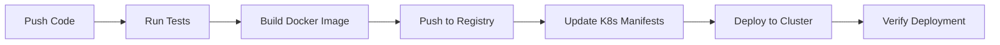
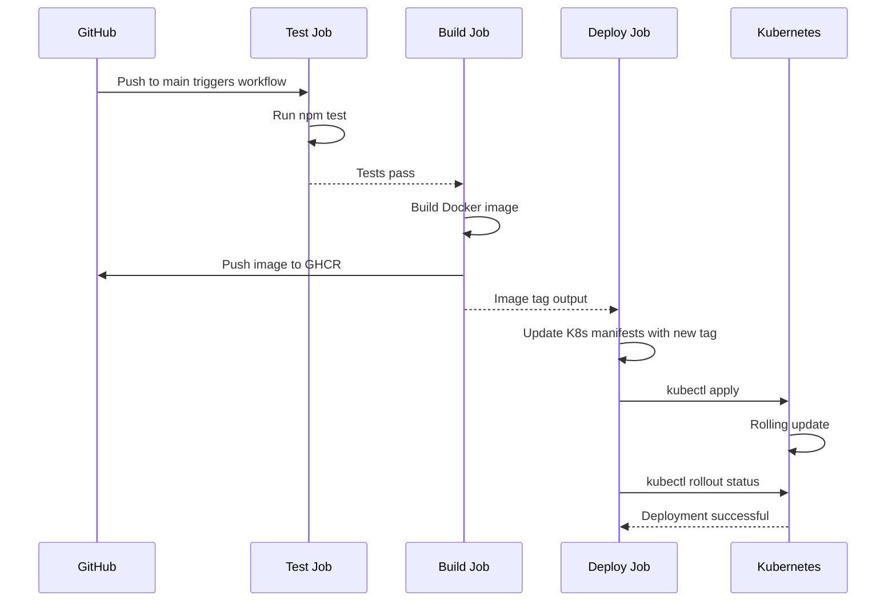

# How to Deploy to Kubernetes with GitHub Actions

Author: [nawazdhandala](https://www.github.com/nawazdhandala)

Tags: GitHub Actions, Kubernetes, CI/CD, Deployment, Automation

Description: Step-by-step guide to setting up GitHub Actions workflows for building, testing, and deploying applications to Kubernetes.

---

## Introduction

GitHub Actions provides a powerful CI/CD platform built directly into your GitHub repository. Deploying to Kubernetes from GitHub Actions lets you automate the full lifecycle from code push to production deployment without leaving the GitHub ecosystem.

This guide covers how to set up a complete GitHub Actions workflow that builds your application, creates a Docker image, pushes it to a container registry, and deploys it to a Kubernetes cluster.

## Deployment Pipeline Overview

Here is the full pipeline we will build.



## Prerequisites

Before setting up the workflow, you need:

- A Kubernetes cluster (EKS, GKE, AKS, or self-managed)
- A container registry (Docker Hub, ECR, GCR, or GHCR)
- Kubernetes manifests in your repository
- GitHub repository secrets configured

## Setting Up Repository Secrets

Add these secrets to your GitHub repository under Settings > Secrets and variables > Actions.

| Secret Name | Description |
|-------------|-------------|
| KUBE_CONFIG | Base64-encoded kubeconfig file |
| REGISTRY_USERNAME | Container registry username |
| REGISTRY_PASSWORD | Container registry password |
| REGISTRY_URL | Container registry URL |

```bash
# Encode your kubeconfig for use as a GitHub secret
cat ~/.kube/config | base64 | pbcopy
```

## Kubernetes Manifests

First, set up the Kubernetes manifests in your repository.

```yaml
# k8s/namespace.yaml
# Create a dedicated namespace for the application
apiVersion: v1
kind: Namespace
metadata:
  name: my-app
  labels:
    app: my-app
    managed-by: github-actions
```

```yaml
# k8s/deployment.yaml
# Application deployment with placeholder for image tag
apiVersion: apps/v1
kind: Deployment
metadata:
  name: my-app
  namespace: my-app
  labels:
    app: my-app
spec:
  replicas: 3
  selector:
    matchLabels:
      app: my-app
  template:
    metadata:
      labels:
        app: my-app
    spec:
      containers:
        - name: my-app
          # IMAGE_TAG will be replaced during deployment
          image: REGISTRY_URL/my-app:IMAGE_TAG
          ports:
            - containerPort: 8080
          resources:
            requests:
              cpu: 100m
              memory: 128Mi
            limits:
              cpu: 500m
              memory: 256Mi
          # Health check endpoints
          livenessProbe:
            httpGet:
              path: /healthz
              port: 8080
            initialDelaySeconds: 10
            periodSeconds: 5
          readinessProbe:
            httpGet:
              path: /ready
              port: 8080
            initialDelaySeconds: 5
            periodSeconds: 3
```

```yaml
# k8s/service.yaml
# Expose the application within the cluster
apiVersion: v1
kind: Service
metadata:
  name: my-app
  namespace: my-app
spec:
  selector:
    app: my-app
  ports:
    - protocol: TCP
      port: 80
      targetPort: 8080
  type: ClusterIP
```

## The Complete GitHub Actions Workflow

```yaml
# .github/workflows/deploy.yml
name: Build and Deploy to Kubernetes

# Trigger on pushes to main and pull requests
on:
  push:
    branches: [main]
  pull_request:
    branches: [main]

# Set environment variables used across jobs
env:
  IMAGE_NAME: my-app
  REGISTRY: ghcr.io

jobs:
  # Job 1: Run tests
  test:
    runs-on: ubuntu-latest
    steps:
      - name: Checkout code
        uses: actions/checkout@v4

      - name: Set up Node.js
        uses: actions/setup-node@v4
        with:
          node-version: "20"
          cache: "npm"

      # Install dependencies
      - name: Install dependencies
        run: npm ci

      # Run the test suite
      - name: Run tests
        run: npm test

  # Job 2: Build and push Docker image
  build:
    runs-on: ubuntu-latest
    needs: test
    # Only build on pushes to main, not on pull requests
    if: github.event_name == 'push'

    outputs:
      image_tag: ${{ steps.meta.outputs.version }}

    steps:
      - name: Checkout code
        uses: actions/checkout@v4

      # Log in to GitHub Container Registry
      - name: Log in to GHCR
        uses: docker/login-action@v3
        with:
          registry: ghcr.io
          username: ${{ github.actor }}
          password: ${{ secrets.GITHUB_TOKEN }}

      # Generate image tags and labels
      - name: Extract metadata
        id: meta
        uses: docker/metadata-action@v5
        with:
          images: ghcr.io/${{ github.repository }}
          tags: |
            type=sha,prefix=
            type=ref,event=branch

      # Build and push the Docker image
      - name: Build and push
        uses: docker/build-push-action@v5
        with:
          context: .
          push: true
          tags: ${{ steps.meta.outputs.tags }}
          labels: ${{ steps.meta.outputs.labels }}

  # Job 3: Deploy to Kubernetes
  deploy:
    runs-on: ubuntu-latest
    needs: build
    # Only deploy from the main branch
    if: github.ref == 'refs/heads/main'

    environment:
      name: production
      url: https://my-app.example.com

    steps:
      - name: Checkout code
        uses: actions/checkout@v4

      # Set up kubectl with the cluster credentials
      - name: Set up kubeconfig
        run: |
          mkdir -p $HOME/.kube
          echo "${{ secrets.KUBE_CONFIG }}" | base64 -d > $HOME/.kube/config

      # Replace the image tag placeholder in the deployment manifest
      - name: Update deployment image
        run: |
          sed -i "s|REGISTRY_URL/my-app:IMAGE_TAG|ghcr.io/${{ github.repository }}:${{ needs.build.outputs.image_tag }}|g" \
            k8s/deployment.yaml

      # Apply Kubernetes manifests
      - name: Deploy to Kubernetes
        run: |
          kubectl apply -f k8s/namespace.yaml
          kubectl apply -f k8s/deployment.yaml
          kubectl apply -f k8s/service.yaml

      # Wait for the deployment to complete
      - name: Verify deployment
        run: |
          kubectl rollout status deployment/my-app \
            -n my-app \
            --timeout=300s
```

## Deployment Flow Across Jobs



## Adding Deployment Environments

GitHub Actions environments add approval gates and environment-specific secrets.

```yaml
# Deploy to staging first, then production with approval
jobs:
  deploy-staging:
    runs-on: ubuntu-latest
    needs: build
    environment:
      name: staging

    steps:
      - name: Deploy to staging
        run: |
          kubectl apply -f k8s/ --context=staging-cluster

  deploy-production:
    runs-on: ubuntu-latest
    needs: deploy-staging
    environment:
      name: production
      # Requires manual approval in GitHub

    steps:
      - name: Deploy to production
        run: |
          kubectl apply -f k8s/ --context=production-cluster
```

## Rollback Strategy

Add a manual rollback workflow for emergencies.

```yaml
# .github/workflows/rollback.yml
name: Rollback Deployment

on:
  workflow_dispatch:
    inputs:
      revision:
        description: "Revision number to rollback to"
        required: true

jobs:
  rollback:
    runs-on: ubuntu-latest
    environment: production

    steps:
      - name: Set up kubeconfig
        run: |
          mkdir -p $HOME/.kube
          echo "${{ secrets.KUBE_CONFIG }}" | base64 -d > $HOME/.kube/config

      # Rollback to the specified revision
      - name: Rollback deployment
        run: |
          kubectl rollout undo deployment/my-app \
            -n my-app \
            --to-revision=${{ github.event.inputs.revision }}

      - name: Verify rollback
        run: |
          kubectl rollout status deployment/my-app \
            -n my-app \
            --timeout=300s
```

## Monitoring Your Deployments

Automated deployments need automated monitoring. OneUptime (https://oneuptime.com) monitors your Kubernetes deployments in real time, alerting you immediately if a deployment causes downtime or performance degradation. Integrate OneUptime's health check endpoints into your deployment verification step to automatically validate that your application is healthy after every deployment.
