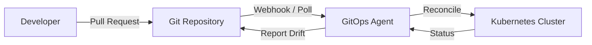
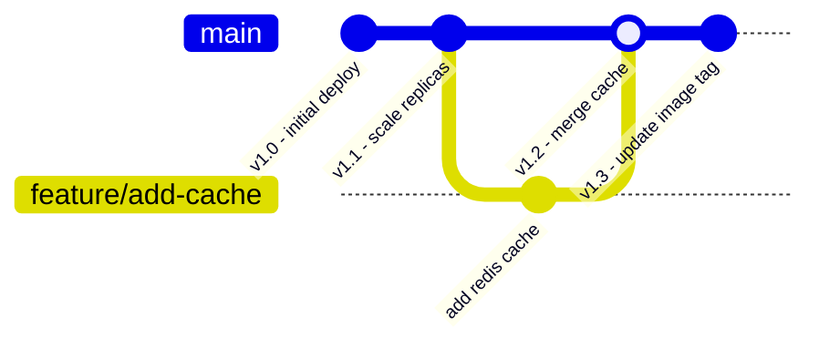
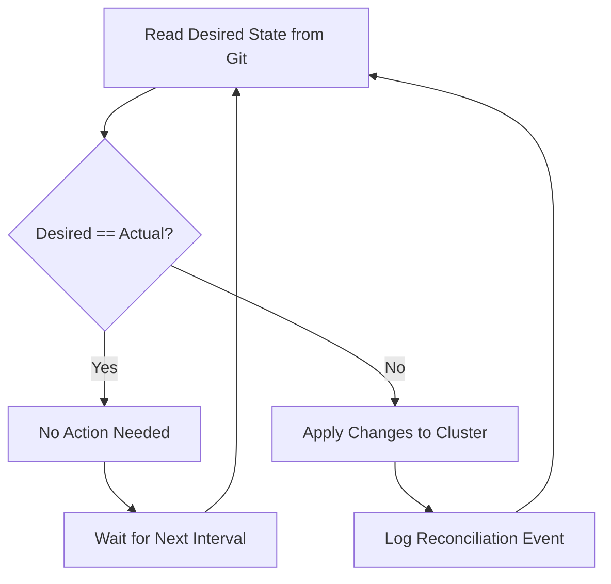
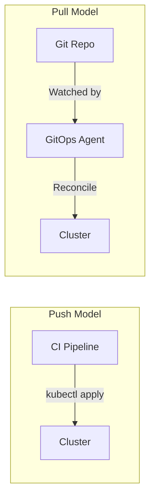
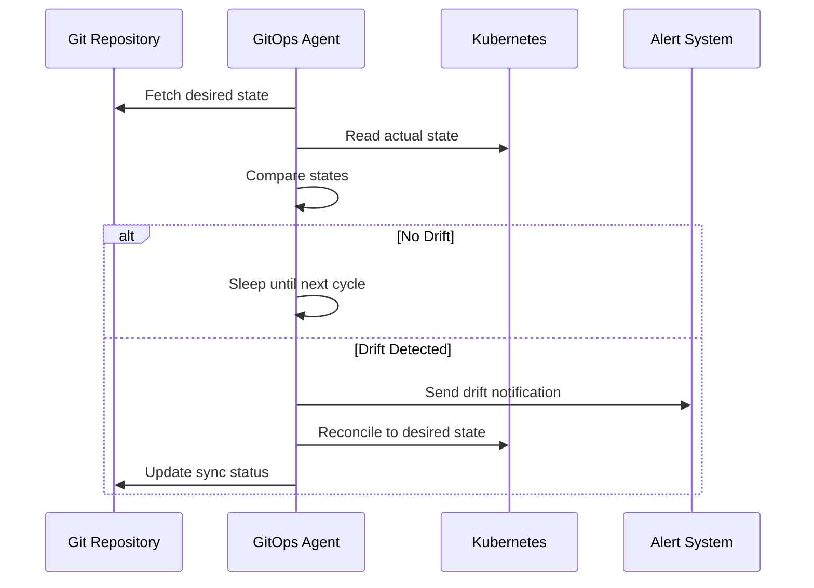

# Understanding GitOps Principles and Best Practices

Author: [nawazdhandala](https://www.github.com/nawazdhandala)

Tags: GitOps, Kubernetes, Continuous Delivery, Version Control, DevOps

Description: A comprehensive guide to GitOps principles including declarative infrastructure, version control, and automated reconciliation.

---

GitOps is an operational framework that applies DevOps best practices used for application development - such as version control, collaboration, compliance, and CI/CD - to infrastructure automation. This post breaks down the core principles, tooling, and best practices you need to adopt GitOps effectively.

## What Is GitOps?

GitOps uses Git repositories as the single source of truth for declarative infrastructure and application definitions. Changes to infrastructure are made through pull requests, and automated agents ensure the live environment matches the desired state stored in Git.



## The Four Principles of GitOps

GitOps is built on four foundational principles defined by the OpenGitOps working group.

### 1. Declarative Configuration

Everything about your system - infrastructure, networking, policies, and applications - must be expressed declaratively.

```yaml
# deployment.yaml
# Declares the desired state for the frontend service.
# The GitOps agent reads this file and applies it to the cluster.
apiVersion: apps/v1
kind: Deployment
metadata:
  name: frontend
  namespace: production
  labels:
    app: frontend
    # Labels help the GitOps agent track managed resources
    managed-by: argocd
spec:
  replicas: 3
  selector:
    matchLabels:
      app: frontend
  template:
    metadata:
      labels:
        app: frontend
    spec:
      containers:
        - name: frontend
          # Pin image tags to specific digests for reproducibility
          image: registry.example.com/frontend:v2.4.1
          ports:
            - containerPort: 8080
          resources:
            requests:
              cpu: "100m"
              memory: "128Mi"
            limits:
              cpu: "250m"
              memory: "256Mi"
```

### 2. Versioned and Immutable

All desired state is stored in a version control system. Every change produces a new, immutable version with a full audit trail.



### 3. Pulled Automatically

Agents inside the cluster pull the desired state from Git and apply it. This is a key difference from traditional CI/CD push-based models.

```yaml
# argocd-application.yaml
# Defines an Argo CD Application that watches a Git repo
# and automatically syncs changes to the cluster.
apiVersion: argoproj.io/v1alpha1
kind: Application
metadata:
  name: frontend-app
  namespace: argocd
spec:
  project: default
  source:
    # The Git repository holding the desired state
    repoURL: https://github.com/example/infra-config.git
    targetRevision: main
    path: apps/frontend
  destination:
    server: https://kubernetes.default.svc
    namespace: production
  syncPolicy:
    automated:
      # Automatically apply changes when Git state differs
      prune: true
      selfHeal: true
    syncOptions:
      - CreateNamespace=true
```

### 4. Continuously Reconciled

The system continuously compares the actual state with the desired state in Git and corrects any drift automatically.



## Push vs. Pull Model

Understanding the difference between push and pull deployment models is critical.



In the push model, external CI pipelines have credentials to modify the cluster directly. In the pull model, the agent lives inside the cluster and pulls changes from Git. The pull model is more secure because cluster credentials never leave the cluster.

## Repository Structure Best Practices

Organize your Git repository to support multiple environments and applications.

```bash
# Recommended mono-repo structure for GitOps
# Separate directories per environment keep configurations isolated
infra-config/
  base/                    # Shared base configurations
    frontend/
      deployment.yaml
      service.yaml
      kustomization.yaml
  overlays/
    staging/               # Staging-specific patches
      frontend/
        replicas-patch.yaml
        kustomization.yaml
    production/            # Production-specific patches
      frontend/
        replicas-patch.yaml
        hpa.yaml
        kustomization.yaml
  policies/                # OPA or Kyverno policies
    require-labels.yaml
    restrict-registries.yaml
```

```yaml
# overlays/production/frontend/kustomization.yaml
# Kustomize overlay that patches the base configuration
# for the production environment.
apiVersion: kustomize.config.k8s.io/v1beta1
kind: Kustomization
resources:
  - ../../../base/frontend
patchesStrategicMerge:
  # Override replicas for production workload
  - replicas-patch.yaml
  # Add horizontal pod autoscaler in production
  - hpa.yaml
```

## Handling Secrets in GitOps

Secrets must not be stored in plain text in Git. Use sealed secrets or external secret managers.

```yaml
# sealed-secret.yaml
# SealedSecret encrypts the secret value so it is safe to commit to Git.
# Only the controller running in the cluster can decrypt it.
apiVersion: bitnami.com/v1alpha1
kind: SealedSecret
metadata:
  name: database-credentials
  namespace: production
spec:
  encryptedData:
    # Encrypted using the cluster's public key
    username: AgBghJ8s...encrypted...data==
    password: AgCkxP2r...encrypted...data==
  template:
    metadata:
      name: database-credentials
      namespace: production
    type: Opaque
```

## Drift Detection and Alerts

When someone manually changes a resource in the cluster, the GitOps agent detects the drift and can either alert or auto-correct.



## Rollback Strategy

With GitOps, rollbacks are just Git reverts. The agent applies the previous known-good state automatically.

```bash
# Rolling back is as simple as reverting a commit in Git.
# The GitOps agent will detect the revert and apply the old state.
git revert HEAD --no-edit

# Push the revert commit to trigger reconciliation
git push origin main
```

## Best Practices Summary

- Store all configuration declaratively in Git
- Use separate repositories or directories for app code and infrastructure
- Automate image tag updates with tools like Argo CD Image Updater
- Encrypt secrets before committing with Sealed Secrets or SOPS
- Enable automated sync with self-healing to correct drift
- Use branch protection and code review for all changes
- Monitor reconciliation status and alert on failures

## Monitoring Your GitOps Pipeline

Visibility into the reconciliation loop is essential. Track sync status, drift frequency, and reconciliation duration. OneUptime (https://oneuptime.com) provides monitoring, alerting, and status pages that integrate with GitOps workflows. You can set up monitors for your GitOps agent health, track deployment frequency, and get alerted when drift is detected or reconciliation fails - keeping your declarative infrastructure reliable and observable.
