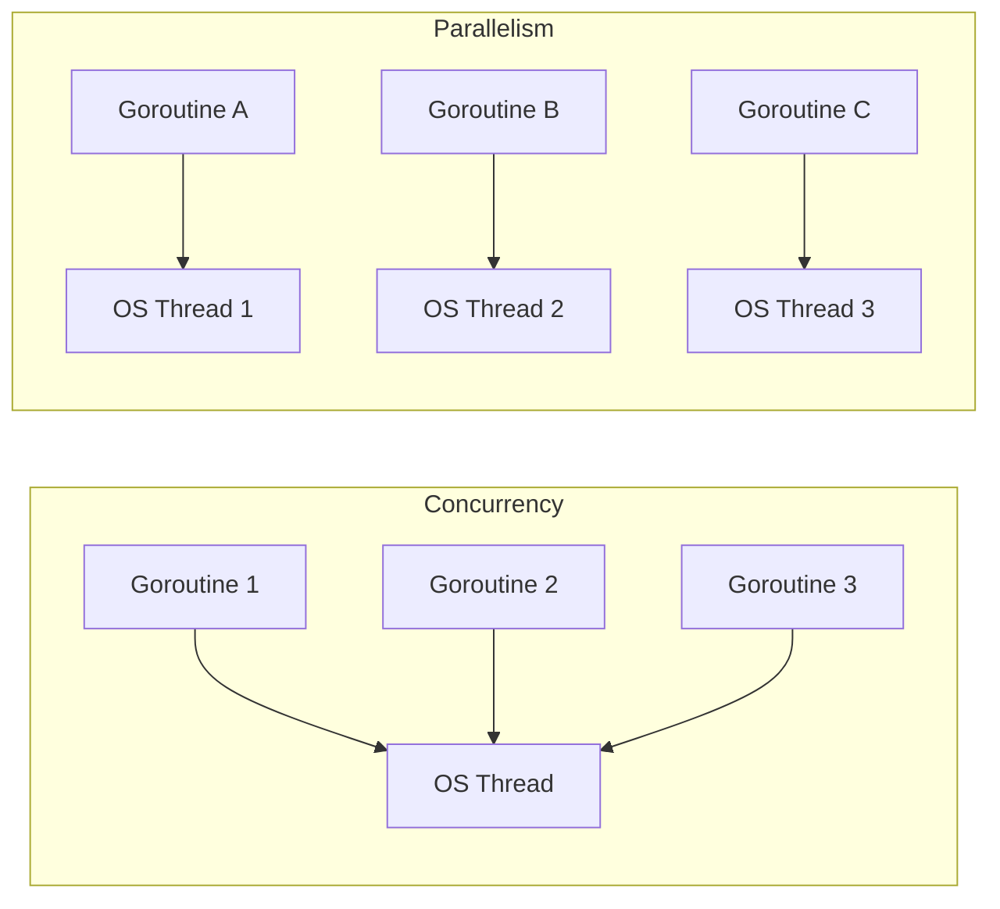
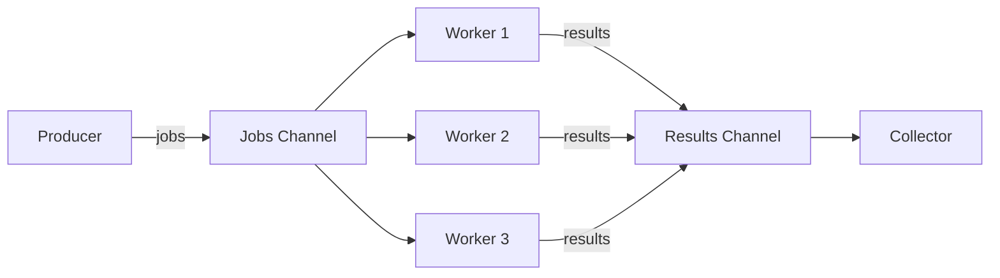

# How to Use Go Goroutines and Channels for Concurrency

Author: [nawazdhandala](https://www.github.com/nawazdhandala)

Tags: Go, Goroutines, Channels, Concurrency, Parallelism

Description: A practical guide to Go concurrency with goroutines, channels, select statements, and common concurrency patterns.

---

Go was designed with concurrency as a first-class feature. Goroutines and channels make it straightforward to write concurrent programs without the complexity of threads and locks. This guide covers the core primitives and shows you practical patterns for building concurrent systems.

## Concurrency vs Parallelism

Concurrency is about dealing with multiple things at once. Parallelism is about doing multiple things at once. Go's goroutines give you concurrency; the Go runtime maps them onto OS threads for parallelism when multiple CPU cores are available.



## Goroutines: Lightweight Threads

A goroutine is a function that runs concurrently with other goroutines. It costs about 2 KB of stack space (compared to 1 MB for an OS thread), so you can run millions of them.

```go
// goroutine_basic.go
// Demonstrates starting goroutines
package main

import (
	"fmt"
	"sync"
	"time"
)

func fetchURL(url string, wg *sync.WaitGroup) {
	// Ensure the WaitGroup counter is decremented when this goroutine finishes
	defer wg.Done()

	fmt.Printf("Fetching %s...\n", url)
	time.Sleep(1 * time.Second) // Simulate network request
	fmt.Printf("Done fetching %s\n", url)
}

func main() {
	urls := []string{
		"https://api.example.com/users",
		"https://api.example.com/orders",
		"https://api.example.com/products",
		"https://api.example.com/reviews",
	}

	// WaitGroup tracks when all goroutines have finished
	var wg sync.WaitGroup

	for _, url := range urls {
		wg.Add(1) // Increment the counter before launching the goroutine
		go fetchURL(url, &wg)
	}

	// Block until all goroutines have called wg.Done()
	wg.Wait()
	fmt.Println("All URLs fetched")
}
```

## Channels: Communication Between Goroutines

Channels are typed conduits that let goroutines send values to each other. They synchronize execution by blocking on send and receive operations.

```go
// channels_basic.go
// Demonstrates sending and receiving values through channels
package main

import (
	"fmt"
	"time"
)

// Result holds the output of a computation
type Result struct {
	URL    string
	Status int
	Error  error
}

func checkHealth(url string, results chan<- Result) {
	// Simulate an HTTP health check
	time.Sleep(500 * time.Millisecond)

	// Send the result through the channel
	results <- Result{
		URL:    url,
		Status: 200,
		Error:  nil,
	}
}

func main() {
	urls := []string{
		"https://service-a.internal",
		"https://service-b.internal",
		"https://service-c.internal",
	}

	// Create a buffered channel with capacity for all results
	results := make(chan Result, len(urls))

	// Launch a goroutine for each URL
	for _, url := range urls {
		go checkHealth(url, results)
	}

	// Collect results from all goroutines
	for i := 0; i < len(urls); i++ {
		result := <-results // Block until a result is available
		if result.Error != nil {
			fmt.Printf("FAIL: %s - %v\n", result.URL, result.Error)
		} else {
			fmt.Printf("OK: %s - status %d\n", result.URL, result.Status)
		}
	}
}
```

## Channel Direction and Types

```mermaid
graph LR
    subgraph Unbuffered Channel
        S1[Sender] -->|blocks until receiver ready| CH1[chan T]
        CH1 -->|blocks until sender ready| R1[Receiver]
    end

    subgraph Buffered Channel capacity=3
        S2[Sender] -->|blocks when full| CH2["chan T (cap 3)"]
        CH2 -->|blocks when empty| R2[Receiver]
    end
```

## The Select Statement

`select` lets a goroutine wait on multiple channel operations. It is like a `switch` statement but for channels.

```go
// select_example.go
// Demonstrates using select to handle multiple channels
package main

import (
	"context"
	"fmt"
	"math/rand"
	"time"
)

func fetchFromPrimary(ch chan<- string) {
	// Simulate a primary database query
	time.Sleep(time.Duration(rand.Intn(300)) * time.Millisecond)
	ch <- "data from primary"
}

func fetchFromReplica(ch chan<- string) {
	// Simulate a replica database query
	time.Sleep(time.Duration(rand.Intn(300)) * time.Millisecond)
	ch <- "data from replica"
}

func main() {
	primary := make(chan string, 1)
	replica := make(chan string, 1)

	// Race both data sources
	go fetchFromPrimary(primary)
	go fetchFromReplica(replica)

	// Create a timeout context
	ctx, cancel := context.WithTimeout(context.Background(), 200*time.Millisecond)
	defer cancel()

	// Use select to take the first result or timeout
	select {
	case data := <-primary:
		fmt.Println("Got response from primary:", data)
	case data := <-replica:
		fmt.Println("Got response from replica:", data)
	case <-ctx.Done():
		fmt.Println("Request timed out")
	}
}
```

## Pattern: Worker Pool

A worker pool distributes tasks across a fixed number of goroutines, preventing resource exhaustion.



```go
// worker_pool.go
// Implements a worker pool pattern for processing tasks concurrently
package main

import (
	"fmt"
	"sync"
	"time"
)

// Job represents a unit of work
type Job struct {
	ID      int
	Payload string
}

// JobResult represents the outcome of processing a job
type JobResult struct {
	JobID    int
	Output   string
	Duration time.Duration
}

func worker(id int, jobs <-chan Job, results chan<- JobResult, wg *sync.WaitGroup) {
	defer wg.Done()

	// Each worker processes jobs from the shared channel
	for job := range jobs {
		start := time.Now()

		// Simulate work
		time.Sleep(100 * time.Millisecond)
		output := fmt.Sprintf("worker-%d processed job-%d: %s", id, job.ID, job.Payload)

		// Send the result
		results <- JobResult{
			JobID:    job.ID,
			Output:   output,
			Duration: time.Since(start),
		}
	}
}

func main() {
	const numWorkers = 5
	const numJobs = 20

	// Create channels for jobs and results
	jobs := make(chan Job, numJobs)
	results := make(chan JobResult, numJobs)

	// Start the worker pool
	var wg sync.WaitGroup
	for i := 1; i <= numWorkers; i++ {
		wg.Add(1)
		go worker(i, jobs, results, &wg)
	}

	// Send jobs to the workers
	for i := 1; i <= numJobs; i++ {
		jobs <- Job{ID: i, Payload: fmt.Sprintf("task-%d", i)}
	}
	close(jobs) // Signal that no more jobs will be sent

	// Wait for all workers to finish, then close results
	go func() {
		wg.Wait()
		close(results)
	}()

	// Collect and print results
	for result := range results {
		fmt.Printf("Job %d completed in %v: %s\n", result.JobID, result.Duration, result.Output)
	}
}
```

## Pattern: Fan-Out, Fan-In

Fan-out distributes work across multiple goroutines. Fan-in merges multiple channels into one.

```go
// fan_out_fan_in.go
// Demonstrates the fan-out fan-in concurrency pattern
package main

import (
	"fmt"
	"sync"
)

// generator produces a stream of integers on a channel
func generator(nums ...int) <-chan int {
	out := make(chan int)
	go func() {
		for _, n := range nums {
			out <- n
		}
		close(out)
	}()
	return out
}

// square computes the square of each number from the input channel
func square(in <-chan int) <-chan int {
	out := make(chan int)
	go func() {
		for n := range in {
			out <- n * n
		}
		close(out)
	}()
	return out
}

// merge combines multiple channels into a single channel
func merge(channels ...<-chan int) <-chan int {
	out := make(chan int)
	var wg sync.WaitGroup

	// Start a goroutine for each input channel
	for _, ch := range channels {
		wg.Add(1)
		go func(c <-chan int) {
			defer wg.Done()
			for val := range c {
				out <- val
			}
		}(ch)
	}

	// Close the output channel when all inputs are done
	go func() {
		wg.Wait()
		close(out)
	}()

	return out
}

func main() {
	// Generate numbers
	nums := generator(1, 2, 3, 4, 5, 6, 7, 8)

	// Fan-out: distribute work across two goroutines
	sq1 := square(nums)
	sq2 := square(nums)

	// Fan-in: merge results into a single channel
	for result := range merge(sq1, sq2) {
		fmt.Println(result)
	}
}
```

## Pattern: Context for Cancellation

```go
// context_cancellation.go
// Shows how to use context to cancel long-running goroutines
package main

import (
	"context"
	"fmt"
	"time"
)

func longRunningTask(ctx context.Context, name string) {
	for i := 0; ; i++ {
		select {
		case <-ctx.Done():
			// Context was cancelled or timed out
			fmt.Printf("%s: stopped after %d iterations (reason: %v)\n", name, i, ctx.Err())
			return
		default:
			// Do some work
			fmt.Printf("%s: iteration %d\n", name, i)
			time.Sleep(200 * time.Millisecond)
		}
	}
}

func main() {
	// Create a context that cancels after 1 second
	ctx, cancel := context.WithTimeout(context.Background(), 1*time.Second)
	defer cancel()

	// Start two goroutines that respect cancellation
	go longRunningTask(ctx, "worker-A")
	go longRunningTask(ctx, "worker-B")

	// Wait for the context to expire
	<-ctx.Done()
	// Give goroutines a moment to print their exit messages
	time.Sleep(100 * time.Millisecond)
	fmt.Println("All workers stopped")
}
```

## Common Mistakes to Avoid

| Mistake | Solution |
|---------|----------|
| Goroutine leak | Always have a way for goroutines to exit (context, done channel) |
| Race condition | Use channels or sync.Mutex to protect shared state |
| Deadlock | Ensure sends and receives are paired; use buffered channels when appropriate |
| Forgetting WaitGroup | Use `defer wg.Done()` at the start of every goroutine |
| Closing a channel twice | Only close from the sender side, and only close once |

## Monitoring Concurrent Go Applications

Concurrency bugs are hard to reproduce and diagnose. [OneUptime](https://oneuptime.com) integrates with OpenTelemetry to give you distributed traces across your goroutines and services. When a worker pool backs up or a channel deadlocks in production, you will have the metrics and traces to identify the issue quickly and resolve it before users are affected.
