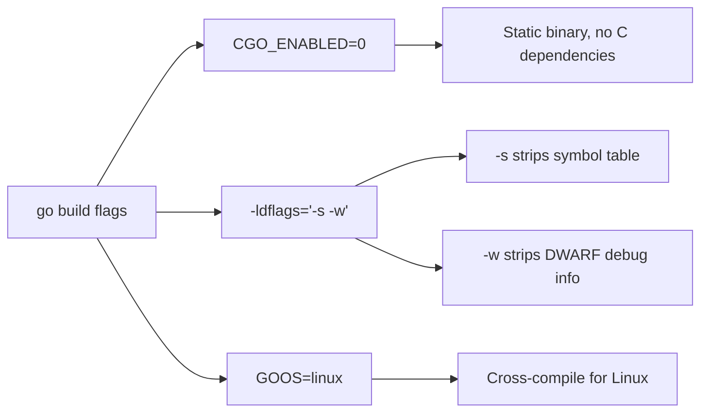
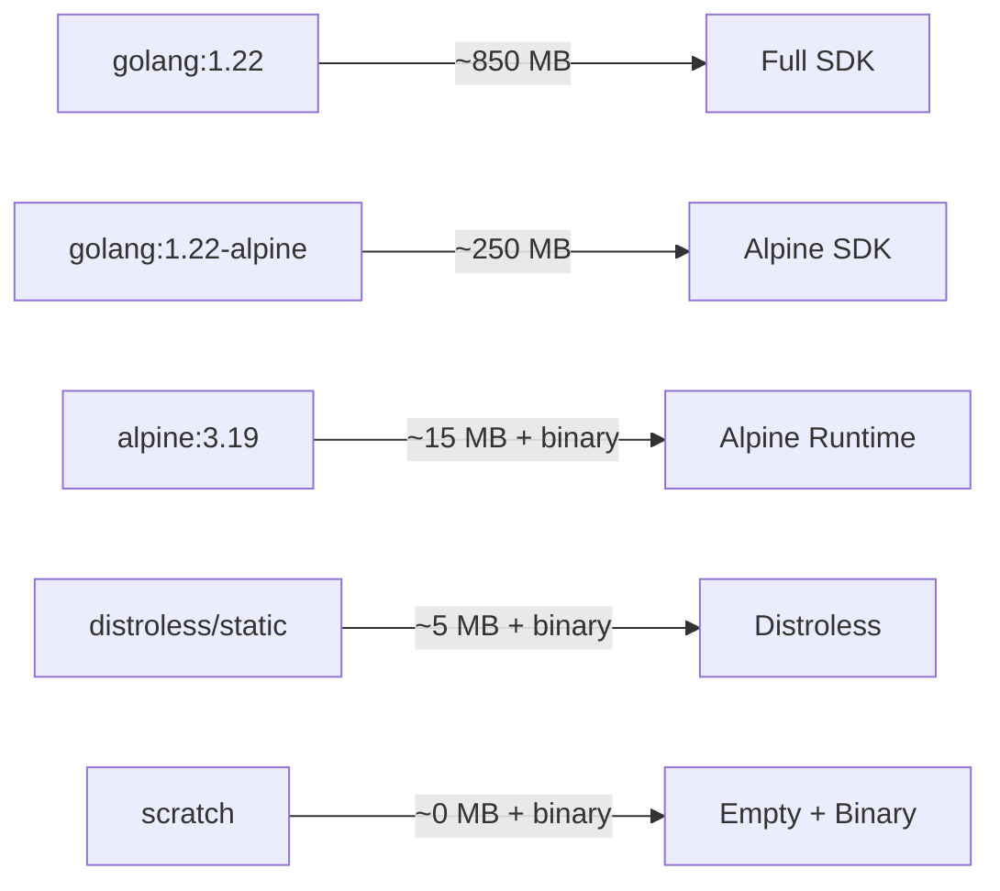
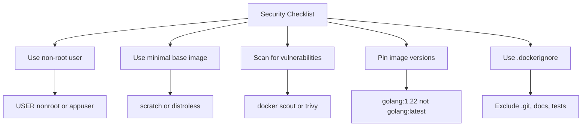

# How to Create Minimal Docker Images for Go Applications

Author: [nawazdhandala](https://www.github.com/nawazdhandala)

Tags: Go, Docker, Minimal Images, Scratch, Production

Description: Learn how to build minimal Docker images for Go applications using scratch and distroless base images.

---

Go compiles to a single static binary with no runtime dependencies. This makes it one of the best languages for creating extremely small Docker images. A typical Go API image can be under 10 MB when built correctly, compared to hundreds of megabytes with a standard base image.

In this guide, we will walk through multiple strategies for building minimal Go Docker images, from basic multi-stage builds to scratch and distroless images.

## Why Image Size Matters

Smaller images lead to:

- Faster pull times during deployments
- Reduced attack surface for security
- Lower storage costs in container registries
- Quicker container startup in orchestrators like Kubernetes

## The Naive Approach

Here is what a typical first attempt looks like:

```dockerfile
# Bad example - produces an image over 800 MB
FROM golang:1.22

WORKDIR /app
COPY . .

# Build the binary inside the full Go SDK image
RUN go build -o server ./cmd/server

# The final image includes the entire Go toolchain
CMD ["./server"]
```

This image includes the full Go compiler, standard library sources, and an entire Linux distribution. We can do much better.

## Multi-Stage Build

A multi-stage build separates the build environment from the runtime environment:

```dockerfile
# Stage 1: Build the binary
FROM golang:1.22-alpine AS builder

WORKDIR /app

# Copy dependency files first for better layer caching
COPY go.mod go.sum ./
RUN go mod download

# Copy source code and build a statically linked binary
COPY . .
RUN CGO_ENABLED=0 GOOS=linux GOARCH=amd64 \
    go build -ldflags="-s -w" -o server ./cmd/server

# Stage 2: Create the minimal runtime image
FROM alpine:3.19

# Add ca-certificates for HTTPS and a non-root user
RUN apk --no-cache add ca-certificates && \
    adduser -D -g '' appuser

WORKDIR /app
COPY --from=builder /app/server .

# Run as non-root
USER appuser

EXPOSE 8080
CMD ["./server"]
```

## Build Flag Explanation

The build flags are critical for producing a minimal binary:



## Scratch Image: The Absolute Minimum

The scratch image is an empty filesystem. Nothing is included - no shell, no libc, no utilities:

```dockerfile
# Stage 1: Build
FROM golang:1.22-alpine AS builder

WORKDIR /app

COPY go.mod go.sum ./
RUN go mod download

COPY . .

# Build a fully static binary
RUN CGO_ENABLED=0 GOOS=linux GOARCH=amd64 \
    go build -ldflags="-s -w" -o server ./cmd/server

# Stage 2: Scratch - completely empty base
FROM scratch

# Copy CA certificates so the binary can make HTTPS requests
COPY --from=builder /etc/ssl/certs/ca-certificates.crt /etc/ssl/certs/

# Copy timezone data for time.LoadLocation
COPY --from=builder /usr/share/zoneinfo /usr/share/zoneinfo

# Copy the binary
COPY --from=builder /app/server /server

# Expose the application port
EXPOSE 8080

# Set the entrypoint to the binary
ENTRYPOINT ["/server"]
```

This produces an image that is often under 10 MB.

## Google Distroless: A Middle Ground

Distroless images include just enough to run an application - CA certificates, timezone data, and a non-root user - but no shell or package manager:

```dockerfile
# Stage 1: Build
FROM golang:1.22-alpine AS builder

WORKDIR /app

COPY go.mod go.sum ./
RUN go mod download

COPY . .
RUN CGO_ENABLED=0 GOOS=linux GOARCH=amd64 \
    go build -ldflags="-s -w" -o server ./cmd/server

# Stage 2: Distroless static image
FROM gcr.io/distroless/static-debian12:nonroot

# Copy the binary from the builder stage
COPY --from=builder /app/server /server

# Distroless images include a nonroot user by default
USER nonroot:nonroot

EXPOSE 8080
ENTRYPOINT ["/server"]
```

## Image Size Comparison



## A Complete Example Application

Here is a simple Go HTTP server we can containerize:

```go
package main

import (
    "encoding/json"
    "log"
    "net/http"
    "os"
    "time"
)

// HealthResponse represents the JSON response for health checks
type HealthResponse struct {
    Status    string `json:"status"`
    Timestamp string `json:"timestamp"`
    Version   string `json:"version"`
}

func main() {
    // Read the version from an environment variable
    version := os.Getenv("APP_VERSION")
    if version == "" {
        version = "dev"
    }

    // Register the health check endpoint
    http.HandleFunc("/health", func(w http.ResponseWriter, r *http.Request) {
        resp := HealthResponse{
            Status:    "healthy",
            Timestamp: time.Now().UTC().Format(time.RFC3339),
            Version:   version,
        }
        w.Header().Set("Content-Type", "application/json")
        json.NewEncoder(w).Encode(resp)
    })

    // Start the HTTP server on the configured port
    port := os.Getenv("PORT")
    if port == "" {
        port = "8080"
    }
    log.Printf("Starting server on :%s (version %s)", port, version)
    log.Fatal(http.ListenAndServe(":"+port, nil))
}
```

## Adding Health Checks to Docker

You can add health checks even in minimal images by using the binary itself:

```dockerfile
FROM gcr.io/distroless/static-debian12:nonroot

COPY --from=builder /app/server /server

USER nonroot:nonroot
EXPOSE 8080

# Health check using the /health endpoint
HEALTHCHECK --interval=30s --timeout=3s --start-period=5s --retries=3 \
    CMD ["/server", "-healthcheck"]

ENTRYPOINT ["/server"]
```

## Security Best Practices



Create a proper .dockerignore file:

```text
# Exclude version control
.git
.gitignore

# Exclude documentation and tests
README.md
docs/
*_test.go

# Exclude CI/CD configuration
.github/
.gitlab-ci.yml

# Exclude local environment files
.env
.env.local
```

## Build and Verify

```bash
# Build the image with a version tag
docker build -t myapp:1.0.0 .

# Check the final image size
docker images myapp:1.0.0

# Run the container
docker run -p 8080:8080 -e APP_VERSION=1.0.0 myapp:1.0.0

# Verify the health endpoint
curl http://localhost:8080/health
```

## Choosing the Right Base Image

| Base Image | Size | Shell | CA Certs | Use Case |
|---|---|---|---|---|
| golang:1.22 | ~850 MB | Yes | Yes | Development only |
| alpine:3.19 | ~15 MB | Yes | Add manually | Need debugging shell |
| distroless/static | ~5 MB | No | Yes | Recommended for production |
| scratch | 0 MB | No | Copy manually | Absolute minimum size |

## Conclusion

Go's static binary compilation is a perfect match for minimal container images. By using multi-stage builds and choosing the right base image, you can shrink your production images from hundreds of megabytes to under 10 MB, improving security, deployment speed, and resource usage.

If you are deploying Go services in containers and want to monitor their health, performance, and uptime, [OneUptime](https://oneuptime.com) provides container-aware monitoring with health check tracking, alerting, and status pages that help your team stay on top of production deployments.
