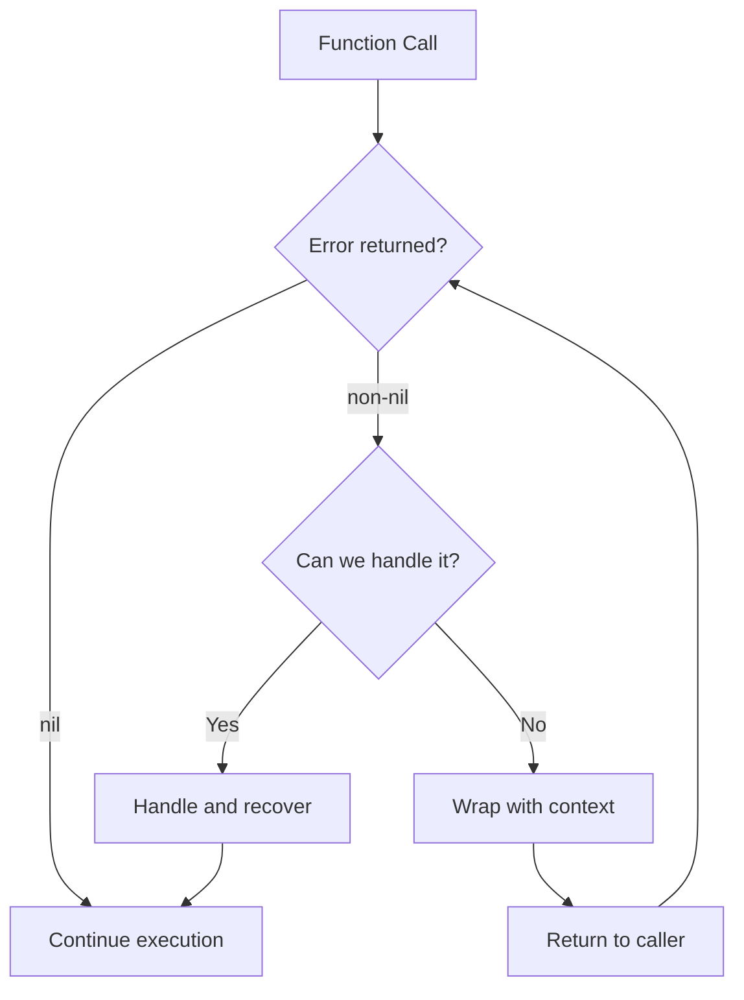
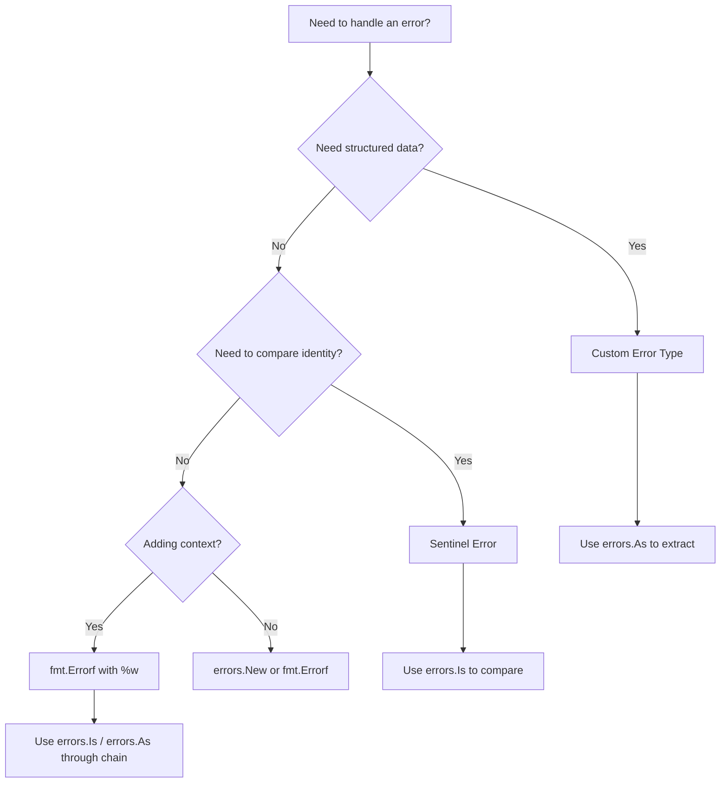

# How to Handle Errors in Go: Patterns and Best Practices

Author: [nawazdhandala](https://www.github.com/nawazdhandala)

Tags: Go, Error Handling, Patterns, Best Practices, Programming

Description: Learn Go error handling patterns including sentinel errors, custom error types, wrapping, and the errors package.

---

Go takes a unique approach to error handling compared to languages that use exceptions. In Go, errors are values - plain interface types returned from functions. This design forces you to handle errors explicitly, making your code more predictable and easier to reason about.

In this guide, we will explore the most common error handling patterns in Go and when to use each one.

## The Error Interface

At its core, Go errors implement a simple interface:

```go
// The built-in error interface in Go
// Any type that implements Error() string satisfies this interface
type error interface {
    Error() string
}
```

Every function that can fail returns an error as its last return value. The caller must check and handle it.

## Pattern 1: Simple Error Checking

The most basic pattern is checking if an error is nil:

```go
package main

import (
    "fmt"
    "os"
)

func main() {
    // Open a file and check for errors immediately
    file, err := os.Open("config.yaml")
    if err != nil {
        // Handle the error - here we just log and exit
        fmt.Fprintf(os.Stderr, "failed to open config: %v\n", err)
        os.Exit(1)
    }
    // Always defer Close after a successful open
    defer file.Close()

    fmt.Println("File opened successfully")
}
```

## Pattern 2: Sentinel Errors

Sentinel errors are predefined error values you can compare against:

```go
package main

import (
    "errors"
    "fmt"
    "io"
    "strings"
)

// Define sentinel errors at the package level
// Use the Err prefix convention for sentinel errors
var (
    ErrNotFound     = errors.New("resource not found")
    ErrUnauthorized = errors.New("unauthorized access")
    ErrRateLimit    = errors.New("rate limit exceeded")
)

func findUser(id string) (string, error) {
    // Simulate a lookup that fails
    if id == "" {
        return "", ErrNotFound
    }
    return "Alice", nil
}

func main() {
    _, err := findUser("")
    // Use errors.Is to compare against sentinel errors
    if errors.Is(err, ErrNotFound) {
        fmt.Println("User was not found in the database")
    }

    // Sentinel errors from the standard library work the same way
    reader := strings.NewReader("hello")
    buf := make([]byte, 10)
    _, err = reader.Read(buf)
    if errors.Is(err, io.EOF) {
        fmt.Println("Reached end of input")
    }
}
```

## Pattern 3: Custom Error Types

When you need to attach structured data to an error, create a custom type:

```go
package main

import (
    "errors"
    "fmt"
    "net/http"
)

// APIError carries an HTTP status code and a human-readable message
type APIError struct {
    StatusCode int
    Message    string
    Endpoint   string
}

// Error satisfies the error interface
func (e *APIError) Error() string {
    return fmt.Sprintf(
        "API error %d at %s: %s",
        e.StatusCode, e.Endpoint, e.Message,
    )
}

func callExternalAPI(url string) error {
    // Simulate a failed API call
    return &APIError{
        StatusCode: http.StatusServiceUnavailable,
        Message:    "service is down",
        Endpoint:   url,
    }
}

func main() {
    err := callExternalAPI("https://api.example.com/data")

    // Use errors.As to extract the concrete error type
    var apiErr *APIError
    if errors.As(err, &apiErr) {
        fmt.Printf("Status: %d\n", apiErr.StatusCode)
        fmt.Printf("Endpoint: %s\n", apiErr.Endpoint)
        fmt.Printf("Message: %s\n", apiErr.Message)
    }
}
```

## Pattern 4: Error Wrapping

Wrapping adds context as errors propagate up the call stack:

```go
package main

import (
    "errors"
    "fmt"
    "os"
)

// loadConfig reads and parses a configuration file
func loadConfig(path string) ([]byte, error) {
    // Wrap the original error with context using %w
    data, err := os.ReadFile(path)
    if err != nil {
        return nil, fmt.Errorf("loadConfig(%s): %w", path, err)
    }
    return data, nil
}

// initApp calls loadConfig and wraps any error with its own context
func initApp() error {
    _, err := loadConfig("/etc/app/config.yaml")
    if err != nil {
        return fmt.Errorf("initApp failed: %w", err)
    }
    return nil
}

func main() {
    err := initApp()
    if err != nil {
        // The full chain of context is visible
        fmt.Println(err)
        // Output: initApp failed: loadConfig(/etc/app/config.yaml): open ...

        // errors.Is still works through wrapped errors
        if errors.Is(err, os.ErrNotExist) {
            fmt.Println("The config file does not exist")
        }
    }
}
```

## How Error Propagation Works

Here is how errors flow through a Go application:



## Pattern 5: Multiple Errors with errors.Join

Go 1.20 introduced errors.Join for combining multiple errors:

```go
package main

import (
    "errors"
    "fmt"
)

// validateRequest checks multiple fields and collects all errors
func validateRequest(name, email string, age int) error {
    var errs []error

    if name == "" {
        errs = append(errs, fmt.Errorf("name is required"))
    }
    if email == "" {
        errs = append(errs, fmt.Errorf("email is required"))
    }
    if age < 0 || age > 150 {
        errs = append(errs, fmt.Errorf("age must be between 0 and 150"))
    }

    // Join returns nil if the slice is empty
    return errors.Join(errs...)
}

func main() {
    err := validateRequest("", "", -1)
    if err != nil {
        // All validation errors are printed together
        fmt.Println("Validation failed:")
        fmt.Println(err)
    }
}
```

## Pattern 6: Error Handling in HTTP Handlers

A clean pattern for web services maps errors to HTTP responses:

```go
package main

import (
    "encoding/json"
    "errors"
    "log"
    "net/http"
)

// AppError represents an application-level error with an HTTP status
type AppError struct {
    Code    int    `json:"code"`
    Message string `json:"message"`
}

func (e *AppError) Error() string {
    return e.Message
}

// appHandler is a function type that returns an error
type appHandler func(w http.ResponseWriter, r *http.Request) error

// wrapHandler converts an appHandler into a standard http.HandlerFunc
func wrapHandler(h appHandler) http.HandlerFunc {
    return func(w http.ResponseWriter, r *http.Request) {
        err := h(w, r)
        if err == nil {
            return
        }

        // Check if it is a known application error
        var appErr *AppError
        if errors.As(err, &appErr) {
            w.Header().Set("Content-Type", "application/json")
            w.WriteHeader(appErr.Code)
            json.NewEncoder(w).Encode(appErr)
            return
        }

        // Unknown error - return 500
        log.Printf("unhandled error: %v", err)
        http.Error(w, "internal server error", http.StatusInternalServerError)
    }
}
```

## Decision Guide: Which Pattern to Use



## Best Practices Summary

1. Always check returned errors. Never use the blank identifier to discard them in production code.
2. Add context when wrapping with fmt.Errorf and the %w verb.
3. Use sentinel errors for well-known conditions that callers need to match on.
4. Use custom error types when callers need structured information from the error.
5. Use errors.Is and errors.As instead of direct comparison or type assertion.
6. Keep error messages lowercase and without trailing punctuation per Go convention.
7. Return errors rather than logging and continuing - let the caller decide.

## Conclusion

Go's explicit error handling may feel verbose at first, but it produces code that is straightforward to follow and debug. By choosing the right pattern for each situation - sentinel errors for identity checks, custom types for structured data, and wrapping for context - you can build robust, maintainable applications.

If you are building Go services and want to monitor how errors propagate across your distributed system, [OneUptime](https://oneuptime.com) provides distributed tracing and log management that helps you track errors from origin to impact, giving your team full visibility into production issues.
