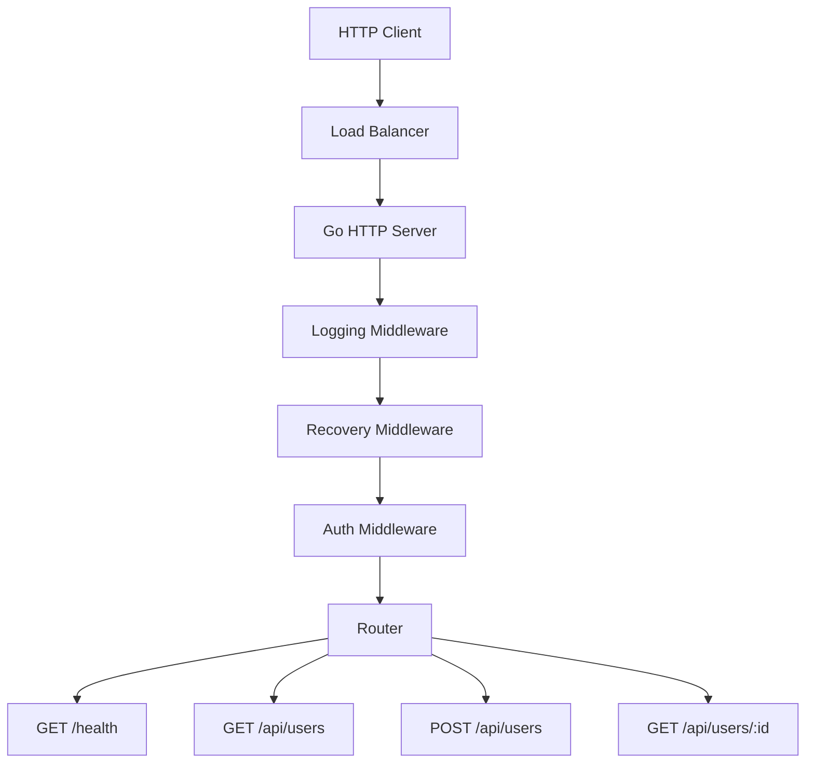
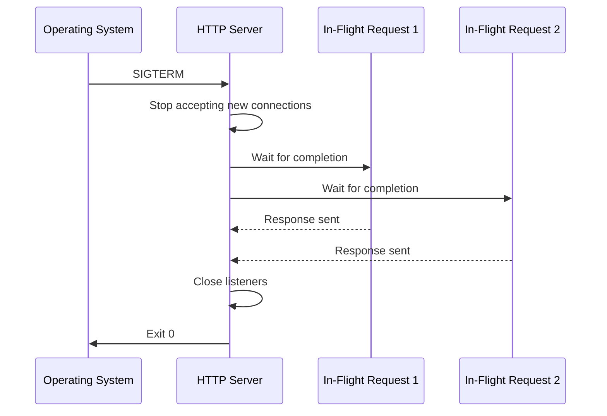

# How to Build a Production-Ready HTTP Server in Go

Author: [nawazdhandala](https://www.github.com/nawazdhandala)

Tags: Go, HTTP Server, Production, Middleware, API

Description: Learn how to build a production-ready HTTP server in Go with routing, middleware, graceful shutdown, and error handling.

---

Go's standard library includes a powerful HTTP server that is production-ready out of the box. Unlike many languages where you need a framework, Go's `net/http` package gives you everything you need. This guide shows you how to build a well-structured HTTP server with middleware, graceful shutdown, and proper error handling.

## Architecture Overview



## Project Structure

```
server/
  main.go          # Entry point and server configuration
  handler/
    health.go      # Health check handler
    user.go        # User handlers
  middleware/
    logging.go     # Request logging
    recovery.go    # Panic recovery
    auth.go        # Authentication
  model/
    user.go        # Data models
```

## Step 1: Define the Server

```go
// main.go
// Entry point for the production HTTP server
package main

import (
	"context"
	"log/slog"
	"net/http"
	"os"
	"os/signal"
	"syscall"
	"time"
)

func main() {
	// Set up structured logging
	logger := slog.New(slog.NewJSONHandler(os.Stdout, &slog.HandlerOptions{
		Level: slog.LevelInfo,
	}))
	slog.SetDefault(logger)

	// Create the router and register routes
	mux := http.NewServeMux()
	registerRoutes(mux)

	// Wrap with middleware (applied in reverse order)
	handler := recoveryMiddleware(
		loggingMiddleware(
			mux,
		),
	)

	// Configure the server with production-ready timeouts
	server := &http.Server{
		Addr:         ":8080",
		Handler:      handler,
		ReadTimeout:  5 * time.Second,   // Max time to read the request
		WriteTimeout: 10 * time.Second,  // Max time to write the response
		IdleTimeout:  120 * time.Second, // Max time for keep-alive connections
	}

	// Start the server in a goroutine
	go func() {
		slog.Info("server starting", "addr", server.Addr)
		if err := server.ListenAndServe(); err != nil && err != http.ErrServerClosed {
			slog.Error("server failed to start", "error", err)
			os.Exit(1)
		}
	}()

	// Wait for interrupt signal for graceful shutdown
	gracefulShutdown(server)
}

func gracefulShutdown(server *http.Server) {
	// Create a channel to listen for OS signals
	quit := make(chan os.Signal, 1)
	signal.Notify(quit, syscall.SIGINT, syscall.SIGTERM)

	// Block until a signal is received
	sig := <-quit
	slog.Info("shutting down server", "signal", sig.String())

	// Give in-flight requests 30 seconds to complete
	ctx, cancel := context.WithTimeout(context.Background(), 30*time.Second)
	defer cancel()

	if err := server.Shutdown(ctx); err != nil {
		slog.Error("server forced to shutdown", "error", err)
		os.Exit(1)
	}

	slog.Info("server stopped gracefully")
}
```

## Step 2: Register Routes

```go
// routes.go
// Registers all HTTP routes
package main

import "net/http"

func registerRoutes(mux *http.ServeMux) {
	// Health check endpoint for load balancers and Kubernetes probes
	mux.HandleFunc("GET /health", handleHealth)
	mux.HandleFunc("GET /ready", handleReady)

	// User API endpoints using Go 1.22+ pattern matching
	mux.HandleFunc("GET /api/users", handleListUsers)
	mux.HandleFunc("POST /api/users", handleCreateUser)
	mux.HandleFunc("GET /api/users/{id}", handleGetUser)
	mux.HandleFunc("PUT /api/users/{id}", handleUpdateUser)
	mux.HandleFunc("DELETE /api/users/{id}", handleDeleteUser)
}
```

## Step 3: Build Middleware

```go
// middleware.go
// HTTP middleware for logging, recovery, and request handling
package main

import (
	"log/slog"
	"net/http"
	"runtime/debug"
	"time"
)

// responseWriter wraps http.ResponseWriter to capture the status code
type responseWriter struct {
	http.ResponseWriter
	statusCode int
}

func (rw *responseWriter) WriteHeader(code int) {
	rw.statusCode = code
	rw.ResponseWriter.WriteHeader(code)
}

// loggingMiddleware logs every request with method, path, status, and duration
func loggingMiddleware(next http.Handler) http.Handler {
	return http.HandlerFunc(func(w http.ResponseWriter, r *http.Request) {
		start := time.Now()

		// Wrap the response writer to capture the status code
		wrapped := &responseWriter{ResponseWriter: w, statusCode: http.StatusOK}

		// Call the next handler
		next.ServeHTTP(wrapped, r)

		// Log the request details
		slog.Info("http request",
			"method", r.Method,
			"path", r.URL.Path,
			"status", wrapped.statusCode,
			"duration_ms", time.Since(start).Milliseconds(),
			"remote_addr", r.RemoteAddr,
			"user_agent", r.UserAgent(),
		)
	})
}

// recoveryMiddleware catches panics and returns a 500 error
func recoveryMiddleware(next http.Handler) http.Handler {
	return http.HandlerFunc(func(w http.ResponseWriter, r *http.Request) {
		defer func() {
			if err := recover(); err != nil {
				// Log the panic with a stack trace
				slog.Error("panic recovered",
					"error", err,
					"stack", string(debug.Stack()),
					"path", r.URL.Path,
				)
				http.Error(w, `{"error": "internal server error"}`, http.StatusInternalServerError)
			}
		}()
		next.ServeHTTP(wrapped, r)
	})
}
```

## Step 4: Implement Handlers

```go
// handlers.go
// HTTP handlers for the user API
package main

import (
	"encoding/json"
	"log/slog"
	"net/http"
	"time"
)

// User represents a user in the system
type User struct {
	ID        string    `json:"id"`
	Name      string    `json:"name"`
	Email     string    `json:"email"`
	CreatedAt time.Time `json:"created_at"`
}

// APIError represents a structured error response
type APIError struct {
	Error   string `json:"error"`
	Message string `json:"message"`
	Code    int    `json:"code"`
}

// handleHealth returns the server health status
func handleHealth(w http.ResponseWriter, r *http.Request) {
	writeJSON(w, http.StatusOK, map[string]string{
		"status": "healthy",
		"time":   time.Now().UTC().Format(time.RFC3339),
	})
}

// handleReady checks if the server is ready to accept traffic
func handleReady(w http.ResponseWriter, r *http.Request) {
	// Check database connectivity, cache, etc.
	writeJSON(w, http.StatusOK, map[string]string{"status": "ready"})
}

// handleListUsers returns a list of all users
func handleListUsers(w http.ResponseWriter, r *http.Request) {
	users := []User{
		{ID: "1", Name: "Alice", Email: "alice@example.com", CreatedAt: time.Now()},
		{ID: "2", Name: "Bob", Email: "bob@example.com", CreatedAt: time.Now()},
	}
	writeJSON(w, http.StatusOK, users)
}

// handleCreateUser creates a new user from the request body
func handleCreateUser(w http.ResponseWriter, r *http.Request) {
	var user User

	// Decode the request body
	if err := json.NewDecoder(r.Body).Decode(&user); err != nil {
		writeError(w, http.StatusBadRequest, "invalid request body")
		return
	}

	// Validate required fields
	if user.Name == "" || user.Email == "" {
		writeError(w, http.StatusBadRequest, "name and email are required")
		return
	}

	// Set server-generated fields
	user.ID = generateID()
	user.CreatedAt = time.Now().UTC()

	slog.Info("user created", "user_id", user.ID, "email", user.Email)
	writeJSON(w, http.StatusCreated, user)
}

// handleGetUser returns a single user by ID
func handleGetUser(w http.ResponseWriter, r *http.Request) {
	// Extract the path parameter using Go 1.22+ syntax
	id := r.PathValue("id")
	if id == "" {
		writeError(w, http.StatusBadRequest, "user ID is required")
		return
	}

	// Look up the user (simplified for this example)
	user := User{ID: id, Name: "Alice", Email: "alice@example.com", CreatedAt: time.Now()}
	writeJSON(w, http.StatusOK, user)
}

// writeJSON sends a JSON response with the given status code
func writeJSON(w http.ResponseWriter, status int, data interface{}) {
	w.Header().Set("Content-Type", "application/json")
	w.WriteHeader(status)
	if err := json.NewEncoder(w).Encode(data); err != nil {
		slog.Error("failed to encode response", "error", err)
	}
}

// writeError sends a structured error response
func writeError(w http.ResponseWriter, status int, message string) {
	writeJSON(w, status, APIError{
		Error:   http.StatusText(status),
		Message: message,
		Code:    status,
	})
}
```

## Graceful Shutdown Flow



## Step 5: Add Request Validation

```go
// validate.go
// Input validation helpers
package main

import (
	"fmt"
	"regexp"
)

// emailRegex validates email format
var emailRegex = regexp.MustCompile(`^[a-zA-Z0-9._%+-]+@[a-zA-Z0-9.-]+\.[a-zA-Z]{2,}$`)

// validateUser checks if a user struct has valid data
func validateUser(u User) error {
	if len(u.Name) < 2 {
		return fmt.Errorf("name must be at least 2 characters")
	}
	if len(u.Name) > 100 {
		return fmt.Errorf("name must be under 100 characters")
	}
	if !emailRegex.MatchString(u.Email) {
		return fmt.Errorf("invalid email format")
	}
	return nil
}
```

## Production Checklist

| Item | Implementation |
|------|---------------|
| Timeouts | ReadTimeout, WriteTimeout, IdleTimeout |
| Graceful shutdown | Signal handling with context deadline |
| Structured logging | slog with JSON output |
| Panic recovery | Middleware that catches panics |
| Health checks | /health and /ready endpoints |
| Input validation | Validate all user input |
| Error responses | Consistent JSON error format |
| CORS headers | Set appropriate headers |

## Monitoring Your Go HTTP Server

A production server needs observability. [OneUptime](https://oneuptime.com) can monitor your Go HTTP server's uptime, track response times, and alert your team when error rates spike. With OpenTelemetry instrumentation, you can send traces and metrics from your Go server directly to OneUptime for full-stack visibility into your application's performance.
