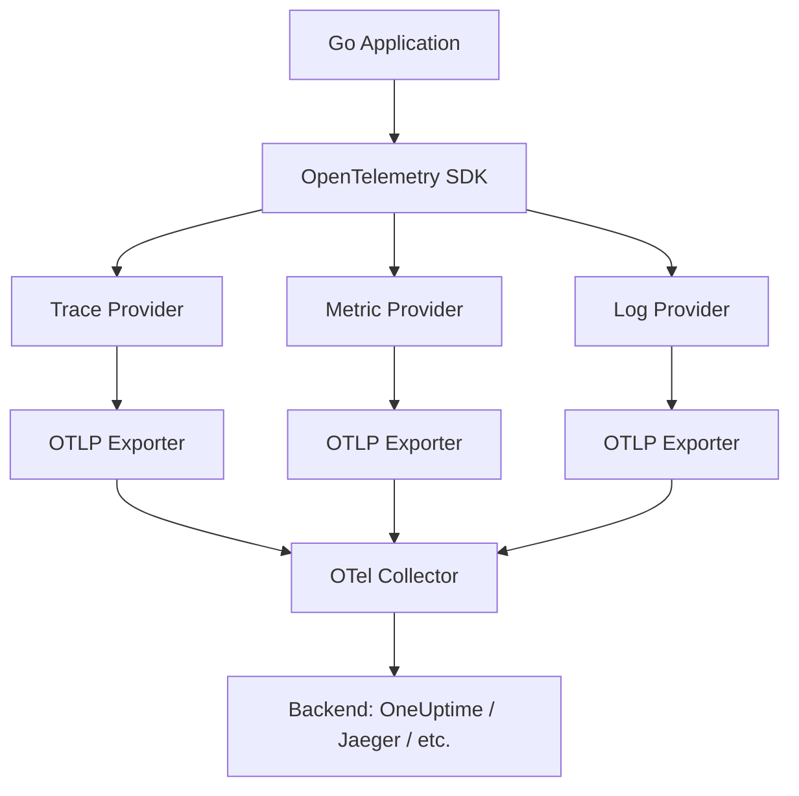
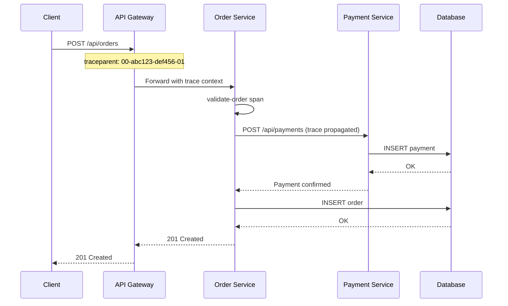

# How to Instrument Go Applications with OpenTelemetry

Author: [nawazdhandala](https://www.github.com/nawazdhandala)

Tags: Go, OpenTelemetry, Instrumentation, Tracing, Observability

Description: Learn how to instrument Go applications with OpenTelemetry for distributed tracing, metrics, and logging.

---

OpenTelemetry is the industry standard for collecting traces, metrics, and logs from your applications. Go has excellent OpenTelemetry support through official SDK packages. This guide shows you how to add full observability to a Go application, from basic tracing to custom metrics and context propagation.

## What OpenTelemetry Gives You



## Step 1: Install Dependencies

```bash
# Core OpenTelemetry packages
go get go.opentelemetry.io/otel
go get go.opentelemetry.io/otel/sdk
go get go.opentelemetry.io/otel/sdk/metric

# OTLP exporters (gRPC-based)
go get go.opentelemetry.io/otel/exporters/otlp/otlptrace/otlptracegrpc
go get go.opentelemetry.io/otel/exporters/otlp/otlpmetric/otlpmetricgrpc

# HTTP instrumentation
go get go.opentelemetry.io/contrib/instrumentation/net/http/otelhttp
```

## Step 2: Initialize the SDK

```go
// otel.go
// Configures the OpenTelemetry SDK with trace and metric providers
package main

import (
	"context"
	"log"
	"time"

	"go.opentelemetry.io/otel"
	"go.opentelemetry.io/otel/exporters/otlp/otlpmetric/otlpmetricgrpc"
	"go.opentelemetry.io/otel/exporters/otlp/otlptrace/otlptracegrpc"
	"go.opentelemetry.io/otel/propagation"
	sdkmetric "go.opentelemetry.io/otel/sdk/metric"
	"go.opentelemetry.io/otel/sdk/resource"
	sdktrace "go.opentelemetry.io/otel/sdk/trace"
	semconv "go.opentelemetry.io/otel/semconv/v1.24.0"
)

// initTracer sets up the OpenTelemetry trace provider
func initTracer(ctx context.Context) (*sdktrace.TracerProvider, error) {
	// Create the OTLP trace exporter that sends data to the collector
	exporter, err := otlptracegrpc.New(ctx,
		otlptracegrpc.WithEndpoint("localhost:4317"),
		otlptracegrpc.WithInsecure(), // Use TLS in production
	)
	if err != nil {
		return nil, err
	}

	// Define the resource (identifies this service)
	res, err := resource.Merge(
		resource.Default(),
		resource.NewWithAttributes(
			semconv.SchemaURL,
			semconv.ServiceName("order-service"),
			semconv.ServiceVersion("1.0.0"),
			semconv.DeploymentEnvironment("production"),
		),
	)
	if err != nil {
		return nil, err
	}

	// Create the trace provider with batching for efficiency
	tp := sdktrace.NewTracerProvider(
		sdktrace.WithBatcher(exporter,
			sdktrace.WithBatchTimeout(5*time.Second),
			sdktrace.WithMaxExportBatchSize(512),
		),
		sdktrace.WithResource(res),
		// Sample 100% of traces in development, reduce in production
		sdktrace.WithSampler(sdktrace.AlwaysSample()),
	)

	// Register the trace provider globally
	otel.SetTracerProvider(tp)

	// Set up context propagation (W3C Trace Context)
	otel.SetTextMapPropagator(propagation.NewCompositeTextMapPropagator(
		propagation.TraceContext{},
		propagation.Baggage{},
	))

	return tp, nil
}

// initMeter sets up the OpenTelemetry metric provider
func initMeter(ctx context.Context) (*sdkmetric.MeterProvider, error) {
	// Create the OTLP metric exporter
	exporter, err := otlpmetricgrpc.New(ctx,
		otlpmetricgrpc.WithEndpoint("localhost:4317"),
		otlpmetricgrpc.WithInsecure(),
	)
	if err != nil {
		return nil, err
	}

	// Create the meter provider with periodic reading
	mp := sdkmetric.NewMeterProvider(
		sdkmetric.WithReader(
			sdkmetric.NewPeriodicReader(exporter,
				sdkmetric.WithInterval(30*time.Second),
			),
		),
	)

	// Register globally
	otel.SetMeterProvider(mp)

	return mp, nil
}
```

## Step 3: Instrument Your HTTP Server

```go
// server.go
// HTTP server instrumented with OpenTelemetry
package main

import (
	"context"
	"encoding/json"
	"log"
	"net/http"
	"os"
	"os/signal"
	"time"

	"go.opentelemetry.io/contrib/instrumentation/net/http/otelhttp"
	"go.opentelemetry.io/otel"
	"go.opentelemetry.io/otel/attribute"
	"go.opentelemetry.io/otel/codes"
	"go.opentelemetry.io/otel/metric"
	"go.opentelemetry.io/otel/trace"
)

// Package-level tracer and meter for this service
var (
	tracer       = otel.Tracer("order-service")
	meter        = otel.Meter("order-service")
	orderCounter metric.Int64Counter
)

func main() {
	ctx := context.Background()

	// Initialize tracing
	tp, err := initTracer(ctx)
	if err != nil {
		log.Fatalf("failed to initialize tracer: %v", err)
	}
	defer func() {
		// Flush all pending spans on shutdown
		if err := tp.Shutdown(ctx); err != nil {
			log.Printf("error shutting down tracer: %v", err)
		}
	}()

	// Initialize metrics
	mp, err := initMeter(ctx)
	if err != nil {
		log.Fatalf("failed to initialize meter: %v", err)
	}
	defer func() {
		if err := mp.Shutdown(ctx); err != nil {
			log.Printf("error shutting down meter: %v", err)
		}
	}()

	// Create a custom counter metric
	orderCounter, _ = meter.Int64Counter("orders.created",
		metric.WithDescription("Total number of orders created"),
		metric.WithUnit("{order}"),
	)

	// Set up routes with automatic HTTP instrumentation
	mux := http.NewServeMux()
	mux.HandleFunc("/api/orders", handleCreateOrder)
	mux.HandleFunc("/api/orders/{id}", handleGetOrder)

	// Wrap the mux with OpenTelemetry HTTP middleware
	// This automatically creates spans for every HTTP request
	handler := otelhttp.NewHandler(mux, "http-server")

	server := &http.Server{
		Addr:    ":8080",
		Handler: handler,
	}

	go func() {
		log.Println("Server starting on :8080")
		if err := server.ListenAndServe(); err != http.ErrServerClosed {
			log.Fatalf("server error: %v", err)
		}
	}()

	// Graceful shutdown
	quit := make(chan os.Signal, 1)
	signal.Notify(quit, os.Interrupt)
	<-quit
	server.Shutdown(ctx)
}
```

## Step 4: Add Custom Spans

```go
// handlers.go
// HTTP handlers with custom OpenTelemetry spans
package main

import (
	"context"
	"encoding/json"
	"fmt"
	"net/http"
	"time"

	"go.opentelemetry.io/otel/attribute"
	"go.opentelemetry.io/otel/codes"
)

// handleCreateOrder processes a new order with detailed tracing
func handleCreateOrder(w http.ResponseWriter, r *http.Request) {
	// The parent span is created automatically by otelhttp
	ctx := r.Context()

	// Parse the request body
	var order Order
	if err := json.NewDecoder(r.Body).Decode(&order); err != nil {
		http.Error(w, "invalid request", http.StatusBadRequest)
		return
	}

	// Validate the order in its own span
	if err := validateOrder(ctx, order); err != nil {
		http.Error(w, err.Error(), http.StatusBadRequest)
		return
	}

	// Save to database with tracing
	if err := saveOrder(ctx, order); err != nil {
		http.Error(w, "failed to save order", http.StatusInternalServerError)
		return
	}

	// Increment the custom counter metric
	orderCounter.Add(ctx, 1,
		metric.WithAttributes(
			attribute.String("order.type", order.Type),
			attribute.String("order.region", order.Region),
		),
	)

	w.WriteHeader(http.StatusCreated)
	json.NewEncoder(w).Encode(order)
}

// validateOrder creates a child span for validation logic
func validateOrder(ctx context.Context, order Order) error {
	// Start a new span as a child of the current span
	ctx, span := tracer.Start(ctx, "validate-order",
		trace.WithAttributes(
			attribute.String("order.id", order.ID),
			attribute.Float64("order.total", order.Total),
		),
	)
	defer span.End()

	if order.Total <= 0 {
		// Record the error on the span
		err := fmt.Errorf("order total must be positive, got %.2f", order.Total)
		span.RecordError(err)
		span.SetStatus(codes.Error, err.Error())
		return err
	}

	span.SetStatus(codes.Ok, "validation passed")
	return nil
}

// saveOrder creates a span for the database operation
func saveOrder(ctx context.Context, order Order) error {
	ctx, span := tracer.Start(ctx, "db.save-order",
		trace.WithAttributes(
			attribute.String("db.system", "postgresql"),
			attribute.String("db.operation", "INSERT"),
			attribute.String("db.table", "orders"),
		),
	)
	defer span.End()

	// Simulate a database write
	time.Sleep(50 * time.Millisecond)

	span.SetStatus(codes.Ok, "order saved")
	return nil
}
```

## Trace Propagation Across Services



## Step 5: Instrument HTTP Clients

```go
// client.go
// HTTP client instrumented with OpenTelemetry for outgoing requests
package main

import (
	"context"
	"net/http"
	"time"

	"go.opentelemetry.io/contrib/instrumentation/net/http/otelhttp"
)

// newInstrumentedClient creates an HTTP client with automatic tracing
func newInstrumentedClient() *http.Client {
	return &http.Client{
		// Wrap the default transport with OpenTelemetry instrumentation
		Transport: otelhttp.NewTransport(http.DefaultTransport),
		Timeout:   10 * time.Second,
	}
}

// callPaymentService makes an instrumented HTTP call
func callPaymentService(ctx context.Context, orderID string) error {
	client := newInstrumentedClient()

	// Create the request with context so the trace propagates
	req, err := http.NewRequestWithContext(ctx, "POST",
		"http://payment-service:8081/api/payments",
		nil,
	)
	if err != nil {
		return err
	}

	// The otelhttp transport automatically:
	// 1. Creates a span for this outgoing request
	// 2. Injects the traceparent header for propagation
	resp, err := client.Do(req)
	if err != nil {
		return err
	}
	defer resp.Body.Close()

	return nil
}
```

## Step 6: Custom Metrics

```go
// metrics.go
// Custom application metrics using OpenTelemetry
package main

import (
	"context"

	"go.opentelemetry.io/otel"
	"go.opentelemetry.io/otel/attribute"
	"go.opentelemetry.io/otel/metric"
)

var appMeter = otel.Meter("order-service")

// initCustomMetrics registers application-specific metrics
func initCustomMetrics() {
	// Histogram for order processing duration
	processingDuration, _ := appMeter.Float64Histogram(
		"order.processing.duration",
		metric.WithDescription("Time taken to process an order"),
		metric.WithUnit("ms"),
	)

	// Gauge for active orders being processed
	activeOrders, _ := appMeter.Int64UpDownCounter(
		"order.active",
		metric.WithDescription("Number of orders currently being processed"),
	)

	// Use these metrics in your handlers
	_ = processingDuration
	_ = activeOrders
}

// recordOrderMetrics records metrics for a processed order
func recordOrderMetrics(ctx context.Context, durationMs float64, orderType string) {
	processingDuration, _ := appMeter.Float64Histogram("order.processing.duration")
	processingDuration.Record(ctx, durationMs,
		metric.WithAttributes(
			attribute.String("order.type", orderType),
		),
	)
}
```

## OpenTelemetry Collector Configuration

```yaml
# otel-collector-config.yaml
# Collector configuration to receive, process, and export telemetry
receivers:
  otlp:
    protocols:
      grpc:
        endpoint: 0.0.0.0:4317
      http:
        endpoint: 0.0.0.0:4318

processors:
  batch:
    timeout: 5s
    send_batch_size: 1024

exporters:
  # Send to OneUptime
  otlphttp:
    endpoint: "https://otlp.oneuptime.com"
    headers:
      x-oneuptime-token: "your-token-here"

service:
  pipelines:
    traces:
      receivers: [otlp]
      processors: [batch]
      exporters: [otlphttp]
    metrics:
      receivers: [otlp]
      processors: [batch]
      exporters: [otlphttp]
```

## Key Instrumentation Checklist

| Layer | What to Instrument |
|-------|-------------------|
| HTTP server | Use otelhttp.NewHandler for automatic spans |
| HTTP client | Use otelhttp.NewTransport for outgoing calls |
| Database | Add spans with db.system, db.operation attributes |
| Message queue | Propagate context through message headers |
| Business logic | Add custom spans for important operations |
| Metrics | Track counters, histograms, and gauges |

## Full-Stack Observability with OneUptime

OpenTelemetry generates the telemetry data, but you need a backend to store and analyze it. [OneUptime](https://oneuptime.com) accepts OpenTelemetry data natively via OTLP, giving you distributed traces, metrics dashboards, and log correlation in a single platform. Combine it with uptime monitoring, incident management, and status pages to get complete visibility into your Go applications from code to customer.
