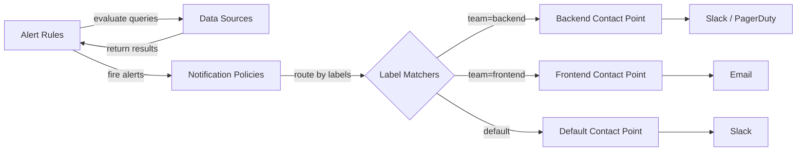
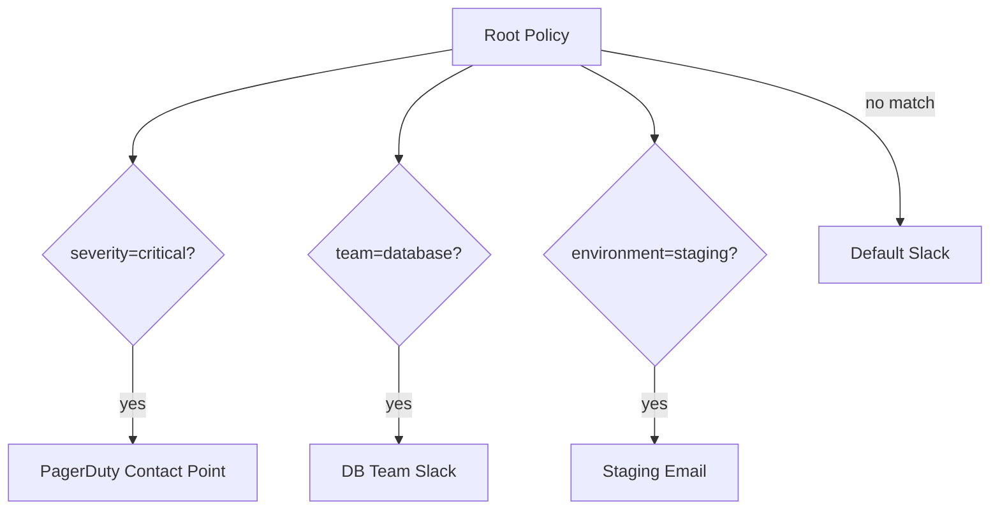
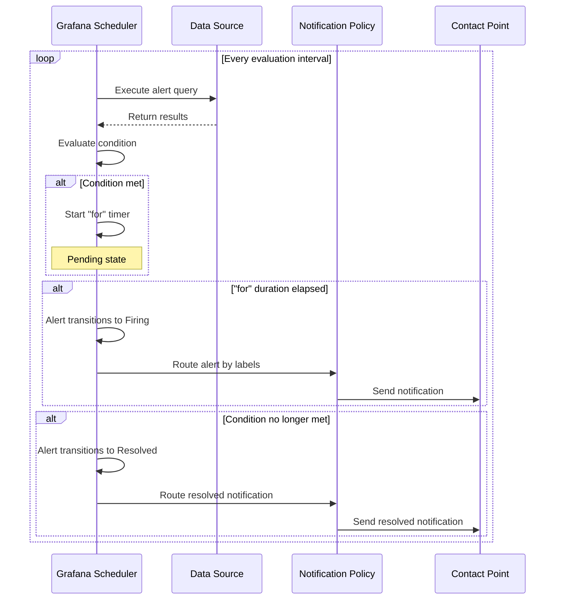

# How to Set Up Grafana Alerting with Contact Points and Policies

Author: [nawazdhandala](https://www.github.com/nawazdhandala)

Tags: Grafana, Alerting, Contact Points, Notification Policies, Monitoring

Description: Learn how to configure Grafana Alerting with contact points, notification policies, and alert rules for proactive monitoring.

---

Grafana Alerting lets you define alert rules directly in Grafana, evaluate them against your data sources, and send notifications through contact points. Since Grafana 9, the unified alerting system replaces legacy dashboard alerts with a centralized approach. This guide walks through setting up alert rules, contact points, and notification policies.

## Grafana Alerting Architecture



The flow works in three stages:

1. **Alert rules** evaluate PromQL or other data source queries at regular intervals
2. **Notification policies** route fired alerts based on labels
3. **Contact points** define where and how notifications are sent

## Creating a Contact Point

A contact point is a notification destination. Grafana supports many integrations:

| Integration | Type |
|-------------|------|
| Slack | Webhook |
| PagerDuty | API Key |
| Email | SMTP |
| Microsoft Teams | Webhook |
| Opsgenie | API Key |
| Webhook | Generic HTTP |
| Telegram | Bot Token |
| Discord | Webhook |

### Slack Contact Point

Navigate to Alerting > Contact Points > New Contact Point.

```yaml
# Contact Point Configuration (shown as YAML for clarity)
name: "backend-slack"
type: slack
settings:
  # Slack incoming webhook URL
  url: "https://hooks.slack.com/services/T00/B00/XXXX"
  # Channel to post to
  recipient: "#backend-alerts"
  # Message title using Go template syntax
  title: |
    [{{ .Status | toUpper }}] {{ .CommonLabels.alertname }}
  # Message body
  text: |
    *Summary:* {{ .CommonAnnotations.summary }}
    *Namespace:* {{ .CommonLabels.namespace }}
    *Severity:* {{ .CommonLabels.severity }}
    {{ if gt (len .Alerts.Firing) 0 }}
    *Firing:*
    {{ range .Alerts.Firing }}
    - {{ .Labels.alertname }}: {{ .Annotations.description }}
    {{ end }}
    {{ end }}
```

### PagerDuty Contact Point

```yaml
name: "critical-pagerduty"
type: pagerduty
settings:
  # PagerDuty integration key
  integrationKey: "your-integration-key-here"
  severity: "critical"
  # Custom details included in the incident
  details:
    namespace: "{{ .CommonLabels.namespace }}"
    service: "{{ .CommonLabels.service }}"
```

### Email Contact Point

```yaml
name: "team-email"
type: email
settings:
  addresses: "team@example.com;oncall@example.com"
  singleEmail: true
  subject: "[{{ .Status | toUpper }}] {{ .CommonLabels.alertname }}"
```

## Notification Policies

Notification policies form a routing tree that determines which contact point receives each alert. The structure is similar to Prometheus Alertmanager routing.



### Default Policy

The root policy catches all alerts that do not match a child policy:

```yaml
# Root notification policy
contact_point: "default-slack"
group_by:
  - alertname
  - namespace
group_wait: 30s
group_interval: 5m
repeat_interval: 4h
```

### Child Policies

```yaml
# Child policies for specific routing
policies:
  # Critical alerts go to PagerDuty
  - matchers:
      - severity = critical
    contact_point: "critical-pagerduty"
    group_wait: 10s
    repeat_interval: 1h
    # Do not continue to other policies
    continue: false

  # Database team alerts
  - matchers:
      - team = database
    contact_point: "db-team-slack"
    group_by:
      - alertname
      - database

  # Staging environment - lower urgency
  - matchers:
      - environment = staging
    contact_point: "staging-email"
    repeat_interval: 12h

  # Frontend team
  - matchers:
      - team = frontend
    contact_point: "frontend-slack"
```

## Creating Alert Rules

### Alert Rule Components

Every Grafana alert rule has these parts:

1. **Query** - the data source query to evaluate
2. **Condition** - the threshold or comparison that triggers the alert
3. **Evaluation group** - how often to check and how long to wait before firing
4. **Labels** - labels attached to the alert for routing
5. **Annotations** - human-readable summary and description

### High CPU Alert Rule

```yaml
# Alert rule configuration
name: "High CPU Usage"
folder: "Infrastructure"
group: "resource-alerts"
# Evaluate every 1 minute
interval: 1m

# Query section
queries:
  # Query A: get CPU usage
  - refId: A
    datasource: Prometheus
    expr: >
      sum by (pod, namespace) (
        rate(container_cpu_usage_seconds_total{image!=""}[5m])
      )

  # Query B: get CPU requests
  - refId: B
    datasource: Prometheus
    expr: >
      sum by (pod, namespace) (
        kube_pod_container_resource_requests{resource="cpu"}
      )

  # Expression C: calculate percentage
  - refId: C
    type: math
    expression: "$A / $B * 100"

  # Expression D: set threshold condition
  - refId: D
    type: threshold
    expression: C
    conditions:
      - evaluator:
          type: gt
          params: [80]

# Wait 5 minutes before firing
for: 5m

# Labels for routing
labels:
  severity: warning
  team: backend

# Annotations for notifications
annotations:
  summary: "High CPU usage on {{ $labels.pod }}"
  description: >
    Pod {{ $labels.pod }} in namespace {{ $labels.namespace }}
    is using {{ $values.C }}% of its CPU request.
```

### Error Rate Alert Rule

```yaml
name: "High Error Rate"
folder: "Application"
group: "http-alerts"
interval: 1m

queries:
  # Total request rate
  - refId: A
    datasource: Prometheus
    expr: >
      sum by (service) (
        rate(http_requests_total[5m])
      )

  # Error request rate
  - refId: B
    datasource: Prometheus
    expr: >
      sum by (service) (
        rate(http_requests_total{status_code=~"5.."}[5m])
      )

  # Error percentage
  - refId: C
    type: math
    expression: "$B / $A * 100"

  # Condition: error rate above 5%
  - refId: D
    type: threshold
    expression: C
    conditions:
      - evaluator:
          type: gt
          params: [5]

for: 3m

labels:
  severity: critical
  team: backend

annotations:
  summary: "High error rate on {{ $labels.service }}"
  description: >
    Service {{ $labels.service }} has a {{ $values.C }}% error rate.
```

## Alert Evaluation Flow



## Silences and Mute Timings

### Creating a Silence

Silences temporarily suppress notifications for matching alerts:

Navigate to Alerting > Silences > New Silence.

```yaml
# Silence configuration
matchers:
  - namespace = staging
  - severity = warning
starts_at: "2026-02-20T08:00:00Z"
ends_at: "2026-02-20T12:00:00Z"
comment: "Deploying new version to staging"
created_by: "admin"
```

### Mute Timings

Mute timings define recurring windows when notifications are suppressed:

```yaml
# Mute timing for weekends
name: "weekends"
time_intervals:
  - weekdays: ["saturday", "sunday"]

# Mute timing for maintenance window
name: "maintenance-window"
time_intervals:
  - weekdays: ["wednesday"]
    times:
      - start_time: "02:00"
        end_time: "04:00"
```

Apply mute timings to notification policies to suppress alerts during these windows.

## Conclusion

Grafana Alerting provides a complete alerting pipeline built into your dashboard tool. Define alert rules with multi-step queries, route them through notification policies using label matchers, and deliver them to the right team through contact points. Add silences for deployments and mute timings for maintenance windows to reduce noise.

For a monitoring platform that combines alerting, on-call schedules, incident management, and status pages in one tool, check out [OneUptime](https://oneuptime.com). OneUptime provides built-in alert routing and escalation policies without the need to configure multiple tools.
