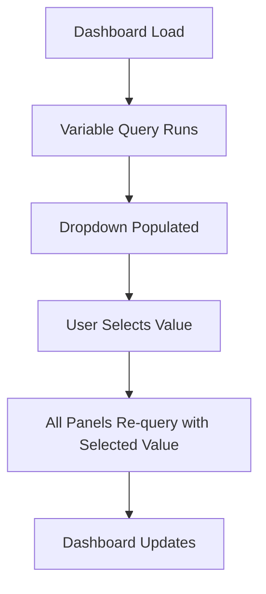
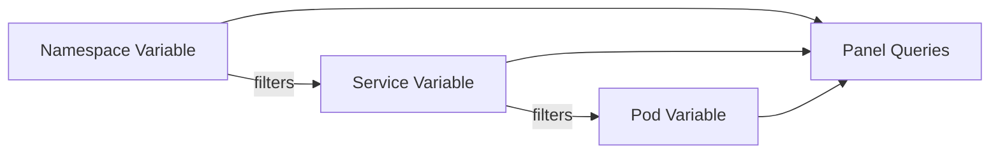
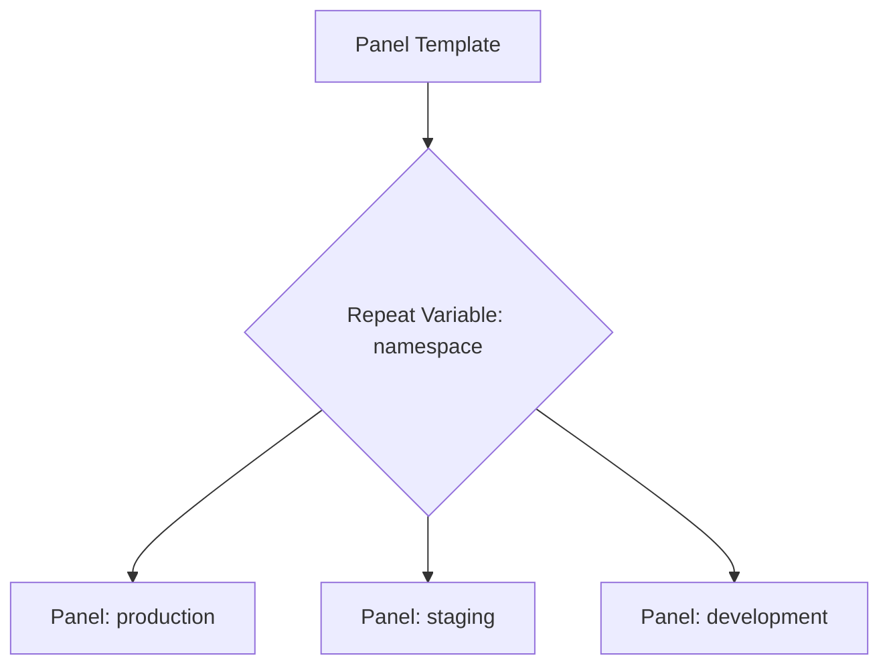

# How to Use Grafana Variables and Templating for Dynamic Dashboards

Author: [nawazdhandala](https://www.github.com/nawazdhandala)

Tags: Grafana, Variables, Templating, Dashboards, Dynamic

Description: Learn how to use Grafana template variables to create dynamic, reusable dashboards with dropdown selectors and chained queries.

---

Static Grafana dashboards break when you add new services, namespaces, or environments. Template variables make dashboards dynamic. Instead of hardcoding values like `namespace="production"`, you use a dropdown that populates from your data. This guide covers how to create and use Grafana template variables.

## What Are Template Variables?

Template variables are placeholders in your dashboard queries. They appear as dropdown selectors at the top of the dashboard. When a user selects a value, all panels using that variable update automatically.



## Variable Types

Grafana supports several variable types:

| Type | Source | Use Case |
|------|--------|----------|
| Query | Data source query | Dynamic values from metrics |
| Custom | Comma-separated list | Fixed set of choices |
| Constant | Single fixed value | Shared value across queries |
| Text box | User input | Free-form filtering |
| Interval | Time intervals | Adjustable rate windows |
| Data source | Data source list | Switch between Prometheus instances |
| Ad hoc filters | Label-based filters | Exploratory filtering |

## Creating a Query Variable

### Step 1: Open Variable Settings

Navigate to Dashboard Settings > Variables > New Variable.

### Step 2: Configure a Namespace Variable

```
Name: namespace
Label: Namespace
Type: Query
Data source: Prometheus

# This query returns all unique namespace label values
Query: label_values(kube_pod_info, namespace)

# Sort alphabetically
Sort: Alphabetical (asc)

# Optional: include an "All" option
Include All option: Yes
Custom all value: .*
```

The `label_values()` function is specific to the Prometheus data source. It returns all unique values for a given label.

### Step 3: Use the Variable in a Panel Query

```promql
# Reference the variable with $variable_name
sum by (pod) (
    rate(container_cpu_usage_seconds_total{namespace="$namespace"}[5m])
)
```

When the user selects "production" from the dropdown, the query becomes:

```promql
sum by (pod) (
    rate(container_cpu_usage_seconds_total{namespace="production"}[5m])
)
```

## Chained Variables

Variables can depend on other variables. This creates cascading dropdowns where the second variable's options depend on the first variable's selection.



### Namespace Variable

```
Name: namespace
Query: label_values(kube_pod_info, namespace)
```

### Service Variable (depends on namespace)

```
Name: service
Query: label_values(kube_pod_info{namespace="$namespace"}, created_by_name)
```

### Pod Variable (depends on namespace and service)

```
Name: pod
Query: label_values(kube_pod_info{namespace="$namespace", created_by_name="$service"}, pod)
Multi-value: Yes
Include All option: Yes
```

## Multi-Value Variables

When a variable allows multiple selections, Grafana joins the values with a pipe for regex matching:

```promql
# When pod variable has multi-value enabled
# and user selects pod-1 and pod-2
# Grafana generates: {pod=~"pod-1|pod-2"}
sum by (pod) (
    rate(container_cpu_usage_seconds_total{
        namespace="$namespace",
        pod=~"$pod"
    }[5m])
)
```

Use `=~` (regex match) instead of `=` (exact match) for multi-value variables.

## Interval Variable

An interval variable lets users control the rate window:

```
Name: interval
Type: Interval
Values: 1m, 5m, 15m, 30m, 1h
Auto option: Yes
```

Use it in queries:

```promql
# The rate window adjusts based on user selection
sum by (pod) (
    rate(container_cpu_usage_seconds_total{namespace="$namespace"}[$interval])
)
```

## Custom Variable

A custom variable provides a fixed list of choices:

```
Name: environment
Type: Custom
Values: production, staging, development
Default: production
```

## Data Source Variable

A data source variable lets users switch between Prometheus instances:

```
Name: datasource
Type: Data source
Data source type: Prometheus
```

Then set each panel's data source to `$datasource`.

## Variable Syntax Options

Grafana supports multiple syntax formats for variables:

| Syntax | Usage |
|--------|-------|
| `$variable` | Simple substitution |
| `${variable}` | When variable is adjacent to other text |
| `${variable:regex}` | Escape value for regex use |
| `${variable:pipe}` | Join multi-values with pipe |
| `${variable:csv}` | Join multi-values with comma |
| `${variable:raw}` | No escaping or quoting |

## Repeating Panels and Rows

Variables can drive panel repetition. A single panel definition repeats for each selected value:



To configure repeating:

1. Edit the panel
2. Open Panel Options
3. Set Repeat by variable to your variable name
4. Set the repeat direction (horizontal or vertical)
5. Set max per row for horizontal repeats

## Using Variables in Panel Titles

You can reference variables in panel titles:

```
Panel title: CPU Usage - $namespace / $service
```

This dynamically updates the title based on the selected values.

## Common label_values Queries

```
# All namespaces
label_values(kube_pod_info, namespace)

# All pods in a namespace
label_values(kube_pod_info{namespace="$namespace"}, pod)

# All nodes
label_values(node_uname_info, nodename)

# All jobs
label_values(up, job)

# All instances for a job
label_values(up{job="$job"}, instance)

# All HTTP status codes
label_values(http_requests_total, status_code)
```

## Query-Based Variable with Regex Extraction

Sometimes you need to extract part of a label value:

```
Name: deployment
Query: label_values(kube_deployment_status_replicas, deployment)
Regex: /(.+)/
```

Or extract a prefix:

```
Name: service_group
Query: label_values(http_requests_total, service)
# Extract everything before the first hyphen
Regex: /^([^-]+)/
```

## Practical Dashboard Example

Here is a complete dashboard configuration using multiple variables:

```promql
# Panel 1: CPU Usage by Pod
sum by (pod) (
    rate(container_cpu_usage_seconds_total{
        namespace="$namespace",
        pod=~"$pod"
    }[$interval])
)

# Panel 2: Memory Usage by Pod
sum by (pod) (
    container_memory_working_set_bytes{
        namespace="$namespace",
        pod=~"$pod"
    }
)

# Panel 3: Request Rate
sum by (status_code) (
    rate(http_requests_total{
        namespace="$namespace",
        service="$service"
    }[$interval])
)

# Panel 4: Error Rate Percentage
sum(rate(http_requests_total{
    namespace="$namespace",
    service="$service",
    status_code=~"5.."
}[$interval]))
/
sum(rate(http_requests_total{
    namespace="$namespace",
    service="$service"
}[$interval]))
* 100
```

## Conclusion

Template variables transform Grafana dashboards from static views into interactive tools. Start with a namespace variable, chain service and pod variables for drill-down, and add an interval variable for flexible time windows. Well-designed variable hierarchies let a single dashboard serve every team and environment.

For a monitoring platform with built-in dynamic dashboards and no manual templating setup, check out [OneUptime](https://oneuptime.com). OneUptime provides dashboards, alerting, incident management, and status pages in one platform.
