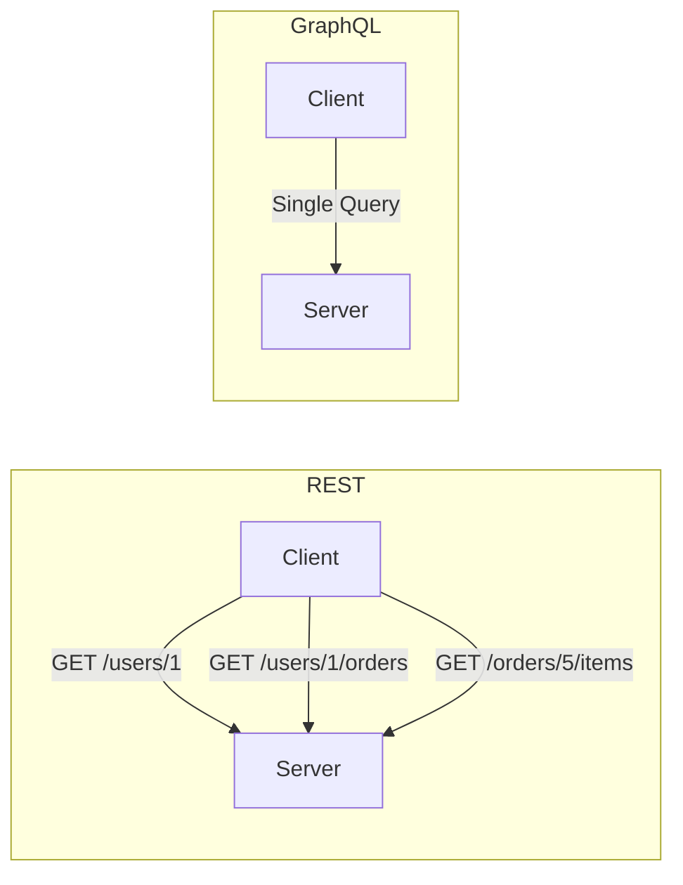
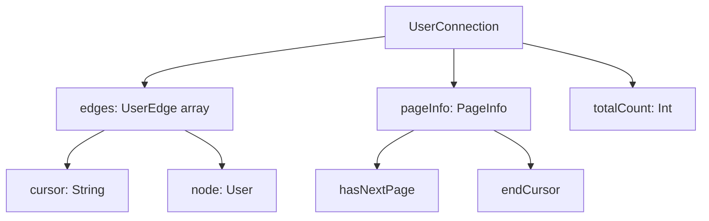
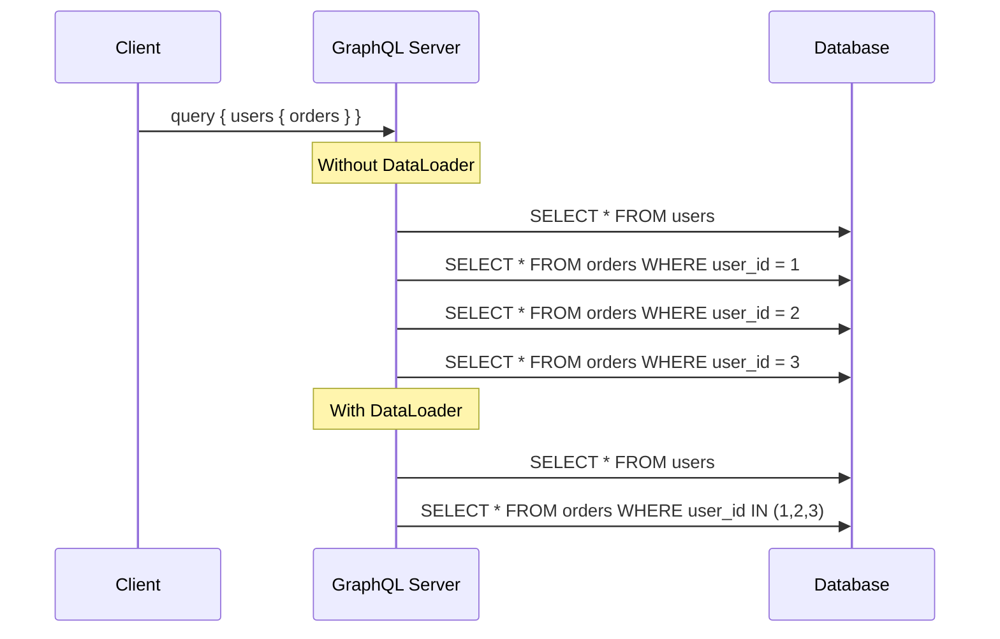

# How to Design and Build GraphQL APIs

Author: [nawazdhandala](https://www.github.com/nawazdhandala)

Tags: GraphQL, API Design, Schema, Resolvers, Backend

Description: Learn how to design and build GraphQL APIs including schema design, resolvers, pagination, and error handling.

---

GraphQL lets clients ask for exactly the data they need. Instead of multiple REST endpoints, you expose a single endpoint with a typed schema. This guide walks through designing, building, and running a GraphQL API in production.

## How GraphQL Differs from REST

In REST, the server decides what data each endpoint returns. In GraphQL, the client specifies the exact shape of the response.



A single GraphQL query can replace multiple REST calls:

```graphql
# One query fetches user, their orders, and order items
query {
  user(id: "1") {
    name
    email
    orders {
      id
      total
      items {
        name
        quantity
      }
    }
  }
}
```

## Designing the Schema

The schema is the contract between client and server. Define your types carefully because they are hard to change later.

```graphql
# schema.graphql

# Custom scalar for date-time values
scalar DateTime

# The User type represents an account in the system
type User {
  id: ID!
  name: String!
  email: String!
  role: UserRole!
  createdAt: DateTime!
  orders(first: Int, after: String): OrderConnection!
}

# Enum for user roles
enum UserRole {
  ADMIN
  MEMBER
  VIEWER
}

# Order type with a relationship back to the user
type Order {
  id: ID!
  total: Float!
  status: OrderStatus!
  items: [OrderItem!]!
  createdAt: DateTime!
}

enum OrderStatus {
  PENDING
  PROCESSING
  SHIPPED
  DELIVERED
  CANCELLED
}

type OrderItem {
  id: ID!
  name: String!
  quantity: Int!
  price: Float!
}
```

## Queries and Mutations

Queries read data. Mutations write data. Keep them separate and name them clearly.

```graphql
# Define the root query and mutation types

type Query {
  # Fetch a single user by ID
  user(id: ID!): User

  # Fetch a paginated list of users
  users(first: Int, after: String, filter: UserFilter): UserConnection!
}

# Input types let you group mutation parameters
input CreateUserInput {
  name: String!
  email: String!
  role: UserRole = MEMBER
}

input UpdateUserInput {
  name: String
  email: String
  role: UserRole
}

type Mutation {
  # Create a new user and return it
  createUser(input: CreateUserInput!): User!

  # Update an existing user
  updateUser(id: ID!, input: UpdateUserInput!): User!

  # Delete a user, returns true on success
  deleteUser(id: ID!): Boolean!
}
```

## Cursor-Based Pagination with Connections

The Relay connection specification is the standard pattern for pagination in GraphQL.

```graphql
# Connection types for cursor-based pagination

type UserConnection {
  edges: [UserEdge!]!
  pageInfo: PageInfo!
  totalCount: Int!
}

type UserEdge {
  cursor: String!
  node: User!
}

type PageInfo {
  hasNextPage: Boolean!
  hasPreviousPage: Boolean!
  startCursor: String
  endCursor: String
}

# Filter input for querying users
input UserFilter {
  role: UserRole
  search: String
}
```



## Implementing Resolvers

Resolvers are functions that fetch the data for each field in your schema.

```typescript
// resolvers.ts
// Each resolver receives parent, args, context, and info

import { prisma } from "./db";

const resolvers = {
  Query: {
    // Resolver for fetching a single user by ID
    user: async (_parent: unknown, args: { id: string }) => {
      const user = await prisma.user.findUnique({
        where: { id: args.id },
      });
      return user;
    },

    // Resolver for paginated user list with cursor-based pagination
    users: async (
      _parent: unknown,
      args: { first?: number; after?: string; filter?: { role?: string; search?: string } }
    ) => {
      const take = args.first || 20;
      const where: Record<string, unknown> = {};

      // Apply filters if provided
      if (args.filter?.role) {
        where.role = args.filter.role;
      }
      if (args.filter?.search) {
        where.name = { contains: args.filter.search };
      }

      // Build cursor-based pagination query
      const queryArgs: Record<string, unknown> = {
        take: take + 1, // Fetch one extra to check for next page
        where,
        orderBy: { createdAt: "desc" },
      };

      if (args.after) {
        queryArgs.cursor = { id: args.after };
        queryArgs.skip = 1; // Skip the cursor itself
      }

      const users = await prisma.user.findMany(queryArgs);

      // Determine if there are more results
      const hasNextPage = users.length > take;
      const edges = users.slice(0, take).map((user) => ({
        cursor: user.id,
        node: user,
      }));

      return {
        edges,
        pageInfo: {
          hasNextPage,
          hasPreviousPage: !!args.after,
          startCursor: edges[0]?.cursor || null,
          endCursor: edges[edges.length - 1]?.cursor || null,
        },
        totalCount: await prisma.user.count({ where }),
      };
    },
  },

  Mutation: {
    // Create a new user with validated input
    createUser: async (
      _parent: unknown,
      args: { input: { name: string; email: string; role?: string } }
    ) => {
      return prisma.user.create({
        data: {
          name: args.input.name,
          email: args.input.email,
          role: args.input.role || "MEMBER",
        },
      });
    },

    // Update specific fields on an existing user
    updateUser: async (
      _parent: unknown,
      args: { id: string; input: Record<string, unknown> }
    ) => {
      return prisma.user.update({
        where: { id: args.id },
        data: args.input,
      });
    },
  },

  // Field-level resolver for nested data
  // Only runs when the client requests the orders field
  User: {
    orders: async (parent: { id: string }, args: { first?: number; after?: string }) => {
      const take = args.first || 10;
      const orders = await prisma.order.findMany({
        where: { userId: parent.id },
        take,
        orderBy: { createdAt: "desc" },
      });
      return orders;
    },
  },
};

export default resolvers;
```

## Error Handling

GraphQL returns errors alongside data. Use custom error codes so clients can handle them programmatically.

```typescript
// errors.ts
import { GraphQLError } from "graphql";

// Custom error class with an error code for client-side handling
export function notFoundError(resource: string, id: string): GraphQLError {
  return new GraphQLError(`${resource} with id ${id} not found`, {
    extensions: {
      code: "NOT_FOUND",
      resource,
      id,
    },
  });
}

export function validationError(
  message: string,
  field: string
): GraphQLError {
  return new GraphQLError(message, {
    extensions: {
      code: "VALIDATION_ERROR",
      field,
    },
  });
}

// Usage in a resolver
const resolvers = {
  Query: {
    user: async (_parent: unknown, args: { id: string }) => {
      const user = await prisma.user.findUnique({ where: { id: args.id } });
      if (!user) {
        throw notFoundError("User", args.id);
      }
      return user;
    },
  },
};
```

## Preventing N+1 Queries with DataLoader

Without DataLoader, fetching a list of users and their orders leads to one query per user. DataLoader batches these into a single query.



```typescript
// dataloader.ts
import DataLoader from "dataloader";
import { prisma } from "./db";

// Create a DataLoader that batches order lookups by user ID
export function createOrderLoader() {
  return new DataLoader(async (userIds: readonly string[]) => {
    // Single query fetches all orders for all requested user IDs
    const orders = await prisma.order.findMany({
      where: { userId: { in: [...userIds] } },
    });

    // Group orders by user ID to match the input order
    const ordersByUser = new Map<string, typeof orders>();
    for (const order of orders) {
      const existing = ordersByUser.get(order.userId) || [];
      existing.push(order);
      ordersByUser.set(order.userId, existing);
    }

    // Return results in the same order as the input keys
    return userIds.map((id) => ordersByUser.get(id) || []);
  });
}
```

## Summary

GraphQL gives clients the power to request exactly the data they need, reducing over-fetching and under-fetching. Design your schema with clear types, use cursor-based pagination, implement DataLoader to prevent N+1 queries, and return structured errors.

To keep your GraphQL API running smoothly in production, [OneUptime](https://oneuptime.com) provides monitoring, alerting, and performance tracking so you can catch slow resolvers and errors before your users do.
