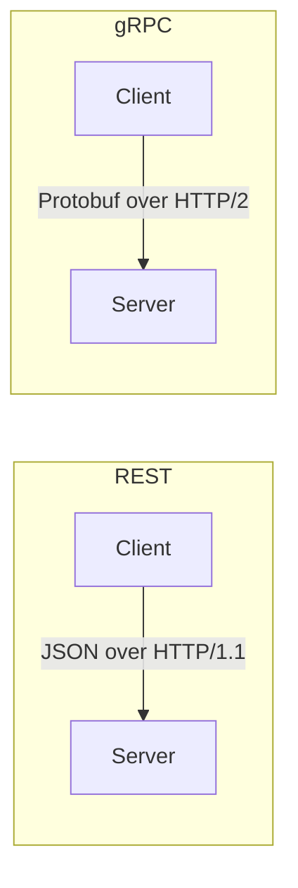
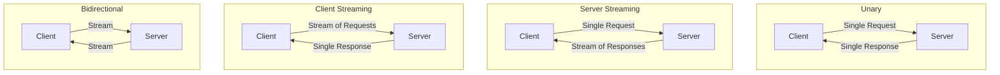
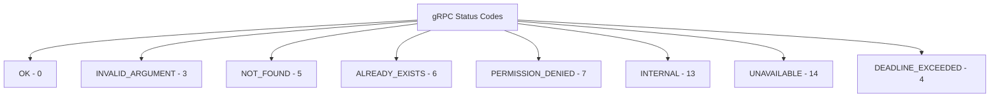

# How to Get Started with gRPC for Microservices Communication

Author: [nawazdhandala](https://www.github.com/nawazdhandala)

Tags: gRPC, Microservices, Protocol Buffers, RPC, Communication

Description: A beginner's guide to gRPC for microservices communication including Protocol Buffers, service definitions, and streaming.

---

gRPC is a high-performance RPC framework built on HTTP/2 and Protocol Buffers. It is well suited for microservices that need low-latency, strongly-typed communication. This guide walks you through the fundamentals and shows you how to build your first gRPC service.

## Why gRPC Over REST

REST uses JSON over HTTP/1.1, which is human-readable but comes with overhead. gRPC uses binary serialization (Protocol Buffers) over HTTP/2, which is faster and more compact.



Key differences:

- **Serialization**: JSON (text) vs Protocol Buffers (binary)
- **Transport**: HTTP/1.1 vs HTTP/2 with multiplexing
- **Contract**: OpenAPI spec (optional) vs .proto files (required)
- **Streaming**: Not native in REST vs built-in bidirectional streaming
- **Code generation**: Optional in REST vs first-class in gRPC

## Protocol Buffers Basics

Protocol Buffers (protobuf) is the interface definition language used by gRPC. You define your data structures and services in `.proto` files.

```protobuf
// user.proto
// Define the syntax version - proto3 is the current standard
syntax = "proto3";

// Package prevents naming conflicts between projects
package user.v1;

// Go-specific option for generated code package path
option go_package = "github.com/myorg/userservice/proto/user/v1";

// Message defines a data structure with typed fields
// Each field has a unique number used in binary encoding
message User {
  string id = 1;
  string name = 2;
  string email = 3;
  UserRole role = 4;
  int64 created_at = 5;  // Unix timestamp in seconds
}

// Enums provide a fixed set of values
enum UserRole {
  USER_ROLE_UNSPECIFIED = 0;  // Default value, always include
  USER_ROLE_ADMIN = 1;
  USER_ROLE_MEMBER = 2;
  USER_ROLE_VIEWER = 3;
}

// Request and response messages for each RPC method
message GetUserRequest {
  string id = 1;
}

message GetUserResponse {
  User user = 1;
}

message ListUsersRequest {
  int32 page_size = 1;   // Maximum number of users to return
  string page_token = 2; // Token for fetching the next page
}

message ListUsersResponse {
  repeated User users = 1;       // List of users
  string next_page_token = 2;    // Empty if no more pages
}
```

## Defining a gRPC Service

Services declare the RPC methods that clients can call.

```protobuf
// user_service.proto
syntax = "proto3";

package user.v1;

import "user.proto";

// The UserService defines all RPC methods for user management
service UserService {
  // Unary RPC - single request, single response
  rpc GetUser(GetUserRequest) returns (GetUserResponse);

  // Unary RPC for creating a user
  rpc CreateUser(CreateUserRequest) returns (CreateUserResponse);

  // Server streaming - client sends one request, server streams responses
  rpc ListUsers(ListUsersRequest) returns (stream User);

  // Client streaming - client streams requests, server sends one response
  rpc UploadUsers(stream CreateUserRequest) returns (UploadUsersResponse);

  // Bidirectional streaming - both sides stream simultaneously
  rpc SyncUsers(stream SyncRequest) returns (stream SyncResponse);
}
```

## gRPC Communication Patterns



## Implementing the Server in Go

```go
// server.go
package main

import (
	"context"
	"log"
	"net"

	pb "github.com/myorg/userservice/proto/user/v1"
	"google.golang.org/grpc"
	"google.golang.org/grpc/codes"
	"google.golang.org/grpc/status"
)

// userServer implements the UserServiceServer interface
// generated by protoc from our .proto files
type userServer struct {
	pb.UnimplementedUserServiceServer
	users map[string]*pb.User // In-memory store for demo purposes
}

// GetUser handles unary requests to fetch a single user by ID
func (s *userServer) GetUser(
	ctx context.Context,
	req *pb.GetUserRequest,
) (*pb.GetUserResponse, error) {
	// Validate the request
	if req.GetId() == "" {
		return nil, status.Error(codes.InvalidArgument, "user id is required")
	}

	// Look up the user in our store
	user, exists := s.users[req.GetId()]
	if !exists {
		// Return a gRPC-standard NOT_FOUND error
		return nil, status.Errorf(codes.NotFound, "user %s not found", req.GetId())
	}

	return &pb.GetUserResponse{User: user}, nil
}

// ListUsers demonstrates server-side streaming
// The server sends each user as a separate message in the stream
func (s *userServer) ListUsers(
	req *pb.ListUsersRequest,
	stream pb.UserService_ListUsersServer,
) error {
	for _, user := range s.users {
		// Send each user individually over the stream
		if err := stream.Send(user); err != nil {
			return status.Errorf(codes.Internal, "failed to send user: %v", err)
		}
	}
	return nil
}

func main() {
	// Listen on TCP port 50051
	listener, err := net.Listen("tcp", ":50051")
	if err != nil {
		log.Fatalf("failed to listen: %v", err)
	}

	// Create a new gRPC server instance
	grpcServer := grpc.NewServer()

	// Register our service implementation
	pb.RegisterUserServiceServer(grpcServer, &userServer{
		users: make(map[string]*pb.User),
	})

	log.Println("gRPC server listening on :50051")
	if err := grpcServer.Serve(listener); err != nil {
		log.Fatalf("failed to serve: %v", err)
	}
}
```

## Implementing the Client in Go

```go
// client.go
package main

import (
	"context"
	"io"
	"log"
	"time"

	pb "github.com/myorg/userservice/proto/user/v1"
	"google.golang.org/grpc"
	"google.golang.org/grpc/credentials/insecure"
)

func main() {
	// Establish a connection to the gRPC server
	conn, err := grpc.Dial(
		"localhost:50051",
		grpc.WithTransportCredentials(insecure.NewCredentials()),
	)
	if err != nil {
		log.Fatalf("failed to connect: %v", err)
	}
	defer conn.Close()

	// Create a client stub from the connection
	client := pb.NewUserServiceClient(conn)

	// Set a timeout for the request
	ctx, cancel := context.WithTimeout(context.Background(), 5*time.Second)
	defer cancel()

	// Make a unary RPC call
	resp, err := client.GetUser(ctx, &pb.GetUserRequest{Id: "user-123"})
	if err != nil {
		log.Fatalf("GetUser failed: %v", err)
	}
	log.Printf("User: %v", resp.GetUser())

	// Make a server-streaming RPC call
	stream, err := client.ListUsers(ctx, &pb.ListUsersRequest{PageSize: 10})
	if err != nil {
		log.Fatalf("ListUsers failed: %v", err)
	}

	// Read messages from the stream until it closes
	for {
		user, err := stream.Recv()
		if err == io.EOF {
			break // Stream finished
		}
		if err != nil {
			log.Fatalf("stream error: %v", err)
		}
		log.Printf("Received user: %v", user)
	}
}
```

## Error Handling in gRPC

gRPC uses status codes that map to well-defined error conditions.



```go
// Returning rich error details from a gRPC server

import (
	"google.golang.org/genproto/googleapis/rpc/errdetails"
	"google.golang.org/grpc/codes"
	"google.golang.org/grpc/status"
)

func validateCreateUser(req *pb.CreateUserRequest) error {
	// Build a status with detailed field violations
	st := status.New(codes.InvalidArgument, "invalid user data")

	// Attach specific field-level error details
	details, err := st.WithDetails(&errdetails.BadRequest{
		FieldViolations: []*errdetails.BadRequest_FieldViolation{
			{
				Field:       "email",
				Description: "email format is invalid",
			},
		},
	})
	if err != nil {
		return st.Err()
	}

	return details.Err()
}
```

## Interceptors for Cross-Cutting Concerns

Interceptors in gRPC are like middleware in HTTP. Use them for logging, authentication, and metrics.

```go
// Unary server interceptor for logging request duration

func loggingInterceptor(
	ctx context.Context,
	req interface{},
	info *grpc.UnaryServerInfo,
	handler grpc.UnaryHandler,
) (interface{}, error) {
	start := time.Now()

	// Call the actual handler
	resp, err := handler(ctx, req)

	// Log the method name, duration, and any error
	duration := time.Since(start)
	log.Printf(
		"method=%s duration=%s error=%v",
		info.FullMethod,
		duration,
		err,
	)

	return resp, err
}

// Apply the interceptor when creating the server
grpcServer := grpc.NewServer(
	grpc.UnaryInterceptor(loggingInterceptor),
)
```

## Generating Code from Proto Files

```bash
# Install the protoc compiler and Go plugins
# Then generate Go code from your .proto files

protoc \
  --go_out=. \
  --go_opt=paths=source_relative \
  --go-grpc_out=. \
  --go-grpc_opt=paths=source_relative \
  proto/user/v1/*.proto
```

## Summary

gRPC gives you strongly-typed contracts, efficient binary serialization, and built-in streaming. Start by defining your services in `.proto` files, generate client and server code, and use interceptors for logging, auth, and metrics.

When running gRPC services in production, use [OneUptime](https://oneuptime.com) to monitor service health, track latency across your microservices, and get alerted when communication between services degrades.
