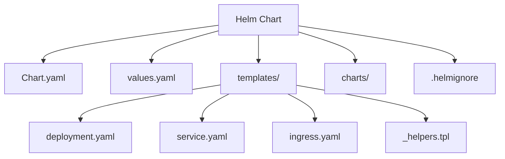
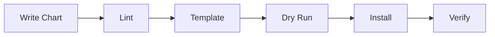

# How to Create Your First Helm Chart from Scratch

Author: [nawazdhandala](https://www.github.com/nawazdhandala)

Tags: Helm, Kubernetes, Charts, Packaging, Deployment

Description: Step-by-step guide to creating a Helm chart from scratch including templates, values, helpers, and best practices.

---

Helm is the package manager for Kubernetes. If you have ever struggled with managing dozens of YAML files for a single application, Helm charts solve that problem by bundling everything into a versioned, reusable package.

This guide walks you through creating a Helm chart from scratch, covering every file and concept you need to understand.

## What Is a Helm Chart?

A Helm chart is a collection of files that describe a set of Kubernetes resources. Think of it as a blueprint for your application deployment.



## Prerequisites

Before starting, make sure you have the following installed:

```bash
# Install Helm (macOS)
brew install helm

# Verify installation
helm version
# Output: version.BuildInfo{Version:"v3.14.0", ...}

# Make sure kubectl is configured
kubectl cluster-info
```

## Step 1: Scaffold a New Chart

Helm provides a built-in command to generate the chart structure:

```bash
# Create a new chart called "myapp"
helm create myapp

# Examine the generated structure
tree myapp/
```

The generated structure looks like this:

```
myapp/
  Chart.yaml          # Metadata about the chart
  values.yaml         # Default configuration values
  .helmignore         # Patterns to ignore when packaging
  templates/
    deployment.yaml   # Deployment template
    service.yaml      # Service template
    ingress.yaml      # Ingress template
    hpa.yaml          # HorizontalPodAutoscaler template
    serviceaccount.yaml
    _helpers.tpl      # Template helper functions
    NOTES.txt         # Post-install notes shown to users
    tests/
      test-connection.yaml
  charts/             # Directory for chart dependencies
```

## Step 2: Define Chart Metadata

Edit `Chart.yaml` to describe your chart:

```yaml
# Chart.yaml - Required metadata for every Helm chart
apiVersion: v2                    # Helm 3 uses apiVersion v2
name: myapp                       # Name of the chart
description: A web application    # Short description
type: application                 # "application" or "library"
version: 0.1.0                    # Chart version (SemVer)
appVersion: "1.0.0"               # Version of the app being deployed

# Optional but recommended fields
maintainers:
  - name: Your Name
    email: you@example.com
keywords:
  - web
  - api
home: https://example.com
sources:
  - https://github.com/example/myapp
```

## Step 3: Configure Default Values

The `values.yaml` file holds all configurable parameters:

```yaml
# values.yaml - Default configuration values

# Number of pod replicas
replicaCount: 2

# Container image configuration
image:
  repository: myapp
  tag: "1.0.0"
  pullPolicy: IfNotPresent

# Service configuration
service:
  type: ClusterIP
  port: 80
  targetPort: 8080

# Ingress configuration
ingress:
  enabled: false
  className: nginx
  host: myapp.example.com

# Resource limits and requests
resources:
  limits:
    cpu: 500m
    memory: 256Mi
  requests:
    cpu: 100m
    memory: 128Mi

# Environment variables
env:
  LOG_LEVEL: info
  NODE_ENV: production

# Health check configuration
healthCheck:
  enabled: true
  path: /health
  initialDelaySeconds: 10
  periodSeconds: 15
```

## Step 4: Create the Deployment Template

Write the deployment template using Go templating:

```yaml
# templates/deployment.yaml
apiVersion: apps/v1
kind: Deployment
metadata:
  # Use the helper function for consistent naming
  name: {{ include "myapp.fullname" . }}
  labels:
    {{- include "myapp.labels" . | nindent 4 }}
spec:
  replicas: {{ .Values.replicaCount }}
  selector:
    matchLabels:
      {{- include "myapp.selectorLabels" . | nindent 6 }}
  template:
    metadata:
      labels:
        {{- include "myapp.selectorLabels" . | nindent 8 }}
    spec:
      containers:
        - name: {{ .Chart.Name }}
          image: "{{ .Values.image.repository }}:{{ .Values.image.tag }}"
          imagePullPolicy: {{ .Values.image.pullPolicy }}
          ports:
            - containerPort: {{ .Values.service.targetPort }}
              protocol: TCP
          {{- if .Values.healthCheck.enabled }}
          # Liveness probe restarts unhealthy containers
          livenessProbe:
            httpGet:
              path: {{ .Values.healthCheck.path }}
              port: {{ .Values.service.targetPort }}
            initialDelaySeconds: {{ .Values.healthCheck.initialDelaySeconds }}
            periodSeconds: {{ .Values.healthCheck.periodSeconds }}
          # Readiness probe controls traffic routing
          readinessProbe:
            httpGet:
              path: {{ .Values.healthCheck.path }}
              port: {{ .Values.service.targetPort }}
            initialDelaySeconds: 5
            periodSeconds: 10
          {{- end }}
          # Inject environment variables from values
          env:
            {{- range $key, $value := .Values.env }}
            - name: {{ $key }}
              value: {{ $value | quote }}
            {{- end }}
          resources:
            {{- toYaml .Values.resources | nindent 12 }}
```

## Step 5: Create the Service Template

```yaml
# templates/service.yaml
apiVersion: v1
kind: Service
metadata:
  name: {{ include "myapp.fullname" . }}
  labels:
    {{- include "myapp.labels" . | nindent 4 }}
spec:
  type: {{ .Values.service.type }}
  ports:
    - port: {{ .Values.service.port }}
      targetPort: {{ .Values.service.targetPort }}
      protocol: TCP
      name: http
  selector:
    {{- include "myapp.selectorLabels" . | nindent 4 }}
```

## Step 6: Define Helper Functions

```yaml
# templates/_helpers.tpl

# Generate the full name (release-chartname)
{{- define "myapp.fullname" -}}
{{- printf "%s-%s" .Release.Name .Chart.Name | trunc 63 | trimSuffix "-" }}
{{- end }}

# Standard labels applied to all resources
{{- define "myapp.labels" -}}
helm.sh/chart: {{ .Chart.Name }}-{{ .Chart.Version }}
app.kubernetes.io/managed-by: {{ .Release.Service }}
{{- include "myapp.selectorLabels" . }}
{{- end }}

# Selector labels used for matching pods
{{- define "myapp.selectorLabels" -}}
app.kubernetes.io/name: {{ .Chart.Name }}
app.kubernetes.io/instance: {{ .Release.Name }}
{{- end }}
```

## Step 7: Validate and Install



Run these commands to validate and deploy:

```bash
# Lint the chart for errors
helm lint myapp/

# Render templates locally to inspect output
helm template my-release myapp/

# Dry run to check against the cluster
helm install my-release myapp/ --dry-run --debug

# Install the chart
helm install my-release myapp/

# Verify the deployment
kubectl get pods -l app.kubernetes.io/instance=my-release
helm status my-release
```

## Step 8: Override Values at Install Time

```bash
# Override values via command line
helm install my-release myapp/ \
  --set replicaCount=3 \
  --set image.tag="2.0.0"

# Override values via a file
helm install my-release myapp/ -f production-values.yaml
```

Create a `production-values.yaml`:

```yaml
# production-values.yaml - Production overrides
replicaCount: 5

image:
  tag: "2.0.0"

resources:
  limits:
    cpu: "1"
    memory: 512Mi

ingress:
  enabled: true
  host: myapp.production.com
```

## Step 9: Package and Share

```bash
# Package the chart into a .tgz file
helm package myapp/
# Output: myapp-0.1.0.tgz

# Push to a chart repository (OCI registry)
helm push myapp-0.1.0.tgz oci://registry.example.com/charts
```

## Common Mistakes to Avoid

1. **Hardcoding values** - Always use `values.yaml` for anything configurable
2. **Missing labels** - Every resource needs consistent labels for selection
3. **Ignoring resource limits** - Always set CPU and memory limits
4. **Skipping linting** - Run `helm lint` before every install
5. **Not using helpers** - Use `_helpers.tpl` to keep templates DRY

## Conclusion

You now have a complete Helm chart that packages a Kubernetes application with configurable values, health checks, and proper labeling. Helm charts make deployments repeatable and version-controlled.

If you are deploying applications to Kubernetes and need to monitor their health, [OneUptime](https://oneuptime.com) provides comprehensive monitoring for your Kubernetes workloads, including uptime monitoring, alerting, and incident management - all from a single platform.
