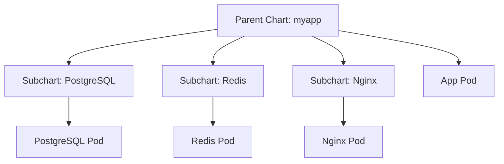
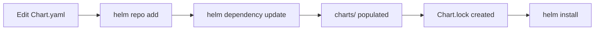
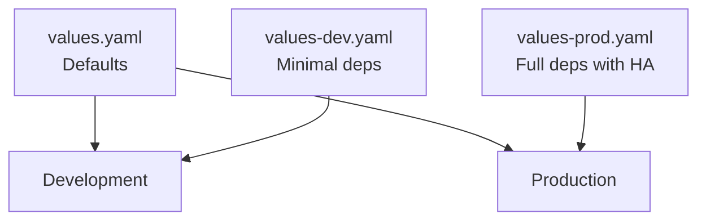

# How to Manage Helm Chart Dependencies and Subcharts

Author: [nawazdhandala](https://www.github.com/nawazdhandala)

Tags: Helm, Dependencies, Subcharts, Chart Repository, Kubernetes

Description: Learn how to manage Helm chart dependencies, use subcharts, and override subchart values for complex deployments.

---

Most real-world applications do not run in isolation. Your app needs a database, a cache, a message broker, and maybe a reverse proxy. Helm dependencies let you bundle all of these into a single chart, making deployments consistent and reproducible.

This guide covers how to declare, manage, and configure Helm chart dependencies.

## How Dependencies Work



A parent chart declares dependencies in `Chart.yaml`. When you run `helm dependency update`, Helm downloads the subcharts into the `charts/` directory.

## Declaring Dependencies

Add dependencies to your `Chart.yaml`:

```yaml
# Chart.yaml
apiVersion: v2
name: myapp
description: Full-stack application with database and cache
version: 1.0.0
appVersion: "2.0.0"

# Declare all dependencies here
dependencies:
  # PostgreSQL database
  - name: postgresql
    version: "15.5.0"
    repository: "https://charts.bitnami.com/bitnami"
    # Only install if database.enabled is true
    condition: postgresql.enabled

  # Redis cache
  - name: redis
    version: "19.0.0"
    repository: "https://charts.bitnami.com/bitnami"
    condition: redis.enabled

  # Optional monitoring stack
  - name: prometheus
    version: "25.0.0"
    repository: "https://prometheus-community.github.io/helm-charts"
    condition: monitoring.enabled
    # Use an alias to avoid naming conflicts
    alias: metrics
```

## Downloading Dependencies

```bash
# Add the required repositories first
helm repo add bitnami https://charts.bitnami.com/bitnami
helm repo add prometheus-community https://prometheus-community.github.io/helm-charts
helm repo update

# Download all dependencies into charts/ directory
helm dependency update ./myapp

# List current dependencies and their status
helm dependency list ./myapp
```

The output of `helm dependency list` shows:

```
NAME          VERSION   REPOSITORY                                      STATUS
postgresql    15.5.0    https://charts.bitnami.com/bitnami              ok
redis         19.0.0    https://charts.bitnami.com/bitnami              ok
prometheus    25.0.0    https://prometheus-community.github.io/helm...  ok
```

## Dependency Lifecycle



The `Chart.lock` file records the exact versions resolved:

```yaml
# Chart.lock - Auto-generated, do not edit
dependencies:
  - name: postgresql
    repository: https://charts.bitnami.com/bitnami
    version: 15.5.7    # Resolved version
  - name: redis
    repository: https://charts.bitnami.com/bitnami
    version: 19.0.2
digest: sha256:abc123...
generated: "2026-02-20T10:00:00Z"
```

```bash
# Rebuild from lock file (reproducible builds)
helm dependency build ./myapp

# Update to get latest matching versions
helm dependency update ./myapp
```

## Overriding Subchart Values

Pass values to subcharts by nesting them under the dependency name:

```yaml
# values.yaml of the parent chart

# Enable/disable dependencies
postgresql:
  enabled: true
  # All keys below are passed to the PostgreSQL subchart
  auth:
    username: myapp
    password: secret123
    database: myapp_db
  primary:
    persistence:
      enabled: true
      size: 10Gi
    resources:
      limits:
        cpu: "1"
        memory: 1Gi
      requests:
        cpu: 250m
        memory: 256Mi

redis:
  enabled: true
  # Override Redis subchart values
  architecture: standalone
  auth:
    enabled: true
    password: redis-secret
  master:
    persistence:
      enabled: true
      size: 5Gi
    resources:
      limits:
        cpu: 500m
        memory: 512Mi

# Alias-based override (using "metrics" alias for prometheus)
metrics:
  enabled: false
  server:
    retention: 7d
```

## Using the Condition Field

Conditions let you toggle entire subcharts on or off:

```yaml
# Chart.yaml
dependencies:
  - name: postgresql
    version: "15.5.0"
    repository: "https://charts.bitnami.com/bitnami"
    # Single condition
    condition: postgresql.enabled

  - name: redis
    version: "19.0.0"
    repository: "https://charts.bitnami.com/bitnami"
    # Multiple conditions (first match wins)
    condition: redis.enabled,cache.enabled
```

```bash
# Install without Redis
helm install myapp ./myapp --set redis.enabled=false

# Install without any optional dependencies
helm install myapp ./myapp \
  --set postgresql.enabled=false \
  --set redis.enabled=false
```

## Using Tags for Grouping

Tags let you enable or disable groups of dependencies:

```yaml
# Chart.yaml
dependencies:
  - name: postgresql
    version: "15.5.0"
    repository: "https://charts.bitnami.com/bitnami"
    tags:
      - backend
      - database

  - name: redis
    version: "19.0.0"
    repository: "https://charts.bitnami.com/bitnami"
    tags:
      - backend
      - cache

  - name: prometheus
    version: "25.0.0"
    repository: "https://prometheus-community.github.io/helm-charts"
    tags:
      - monitoring
```

```yaml
# values.yaml
tags:
  backend: true       # Enables postgresql and redis
  monitoring: false    # Disables prometheus
```

## Local Subcharts

You can also include charts from your local filesystem:

```yaml
# Chart.yaml - Using a local chart
dependencies:
  - name: common-lib
    version: "1.0.0"
    repository: "file://../common-lib"
```

```
project/
  myapp/
    Chart.yaml
    values.yaml
    templates/
  common-lib/
    Chart.yaml
    templates/
      _helpers.tpl
```

This pattern is useful for shared library charts that provide common helper templates.

## Importing Values from Subcharts

Pull values from subcharts into the parent:

```yaml
# Chart.yaml
dependencies:
  - name: postgresql
    version: "15.5.0"
    repository: "https://charts.bitnami.com/bitnami"
    import-values:
      # Import the "exports.connection" block from subchart
      - child: exports.connection
        parent: db
```

Then in your parent templates:

```yaml
# templates/configmap.yaml
apiVersion: v1
kind: ConfigMap
metadata:
  name: {{ include "myapp.fullname" . }}-config
data:
  # These values were imported from the PostgreSQL subchart
  DB_HOST: {{ .Values.db.host }}
  DB_PORT: {{ .Values.db.port | quote }}
```

## Environment-Specific Dependency Configuration



```yaml
# values-dev.yaml - Minimal for local development
postgresql:
  enabled: true
  primary:
    persistence:
      enabled: false    # No persistence in dev
    resources:
      limits:
        cpu: 250m
        memory: 256Mi

redis:
  enabled: false         # Skip Redis in dev
```

```yaml
# values-prod.yaml - Full production setup
postgresql:
  enabled: true
  architecture: replication
  primary:
    persistence:
      enabled: true
      size: 100Gi
  readReplicas:
    replicaCount: 2

redis:
  enabled: true
  architecture: replication
  replica:
    replicaCount: 3
```

## Verifying Dependencies

```bash
# Check all dependencies are satisfied
helm dependency list ./myapp

# Render templates to verify subchart values are applied
helm template myapp ./myapp -f values-prod.yaml | grep -A5 "kind: StatefulSet"

# Dry run against the cluster
helm install myapp ./myapp -f values-prod.yaml --dry-run
```

## Conclusion

Helm dependencies let you compose complex application stacks from proven, community-maintained charts. By using conditions, tags, and value overrides, you keep a single chart that adapts from local development to production.

For monitoring your Helm-deployed applications and their dependencies, [OneUptime](https://oneuptime.com) provides a unified observability platform with uptime monitoring, logs, traces, and incident management for your entire Kubernetes stack.
