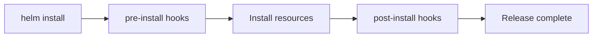
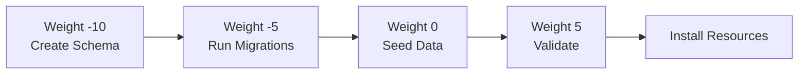

# How to Use Helm Hooks for Pre and Post Deployment Tasks

Author: [nawazdhandala](https://www.github.com/nawazdhandala)

Tags: Helm, Hooks, Lifecycle, Deployment, Kubernetes

Description: Learn how to use Helm hooks for database migrations, cleanup, testing, and other pre/post deployment automation.

---

Deployments are rarely just "apply the new YAML." You need to run database migrations before the new version starts, clean up temporary resources afterward, or validate that the deployment actually works. Helm hooks give you control over what happens at each stage of the release lifecycle.

This guide covers every hook type, practical examples, and patterns for production use.

## What Are Helm Hooks?

Helm hooks are regular Kubernetes resources (usually Jobs or Pods) annotated with special metadata. They run at specific points in the release lifecycle instead of being installed with the rest of the chart.



## Hook Types

Helm supports the following hook annotations:

```yaml
# Available hook types and when they fire
# pre-install     - Before any resources are installed
# post-install    - After all resources are installed
# pre-delete      - Before any resources are deleted
# post-delete     - After all resources are deleted
# pre-upgrade     - Before any resources are upgraded
# post-upgrade    - After all resources are upgraded
# pre-rollback    - Before any resources are rolled back
# post-rollback   - After all resources are rolled back
# test            - When "helm test" is run
```



```mermaid
graph TD
    subgraph "Install Lifecycle"
        A1[pre-install] --> A2[Install Resources] --> A3[post-install]
    end
    subgraph "Upgrade Lifecycle"
        B1[pre-upgrade] --> B2[Upgrade Resources] --> B3[post-upgrade]
    end
    subgraph "Delete Lifecycle"
        C1[pre-delete] --> C2[Delete Resources] --> C3[post-delete]
    end
    subgraph "Rollback Lifecycle"
        D1[pre-rollback] --> D2[Rollback Resources] --> D3[post-rollback]
    end
```

## Database Migration Hook

The most common use case is running database migrations before deploying new code:

```yaml
# templates/migration-job.yaml
apiVersion: batch/v1
kind: Job
metadata:
  name: {{ include "myapp.fullname" . }}-migrate
  labels:
    {{- include "myapp.labels" . | nindent 4 }}
  annotations:
    # Run before the upgrade starts
    "helm.sh/hook": pre-upgrade,pre-install
    # Run this hook before other hooks with weight -5
    "helm.sh/hook-weight": "-5"
    # Delete the previous job before creating a new one
    "helm.sh/hook-delete-policy": before-hook-creation
spec:
  # Do not retry on failure
  backoffLimit: 0
  template:
    metadata:
      labels:
        app: {{ .Chart.Name }}-migration
    spec:
      restartPolicy: Never
      containers:
        - name: migrate
          # Use the same image as the application
          image: "{{ .Values.image.repository }}:{{ .Values.image.tag }}"
          command:
            - "/bin/sh"
            - "-c"
            - |
              # Run database migrations
              echo "Starting database migration..."
              python manage.py migrate --noinput
              echo "Migration completed successfully"
          env:
            - name: DATABASE_URL
              valueFrom:
                secretKeyRef:
                  name: {{ include "myapp.fullname" . }}-db-secret
                  key: url
          resources:
            limits:
              cpu: 500m
              memory: 256Mi
            requests:
              cpu: 100m
              memory: 128Mi
```

## Hook Weights

When you have multiple hooks of the same type, weights control the execution order:



```yaml
# templates/schema-job.yaml
apiVersion: batch/v1
kind: Job
metadata:
  name: {{ include "myapp.fullname" . }}-schema
  annotations:
    "helm.sh/hook": pre-install
    # Runs first (lowest weight)
    "helm.sh/hook-weight": "-10"
    "helm.sh/hook-delete-policy": hook-succeeded
spec:
  backoffLimit: 0
  template:
    spec:
      restartPolicy: Never
      containers:
        - name: schema
          image: "{{ .Values.image.repository }}:{{ .Values.image.tag }}"
          command: ["./scripts/create-schema.sh"]
```

```yaml
# templates/seed-job.yaml
apiVersion: batch/v1
kind: Job
metadata:
  name: {{ include "myapp.fullname" . }}-seed
  annotations:
    "helm.sh/hook": pre-install
    # Runs after schema creation
    "helm.sh/hook-weight": "0"
    "helm.sh/hook-delete-policy": hook-succeeded
spec:
  backoffLimit: 0
  template:
    spec:
      restartPolicy: Never
      containers:
        - name: seed
          image: "{{ .Values.image.repository }}:{{ .Values.image.tag }}"
          command: ["./scripts/seed-data.sh"]
```

## Hook Deletion Policies

Control what happens to hook resources after they complete:

```yaml
annotations:
  "helm.sh/hook": post-install
  # Choose one or more deletion policies:
  #
  # before-hook-creation - Delete the old hook resource before
  #                        the new hook is launched
  #
  # hook-succeeded       - Delete the hook resource after it
  #                        completes successfully
  #
  # hook-failed          - Delete the hook resource if it fails
  "helm.sh/hook-delete-policy": before-hook-creation,hook-succeeded
```

## Post-Install Notification Hook

Send a notification after a successful deployment:

```yaml
# templates/notify-job.yaml
apiVersion: batch/v1
kind: Job
metadata:
  name: {{ include "myapp.fullname" . }}-notify
  annotations:
    "helm.sh/hook": post-install,post-upgrade
    "helm.sh/hook-weight": "10"
    "helm.sh/hook-delete-policy": hook-succeeded
spec:
  backoffLimit: 1
  template:
    spec:
      restartPolicy: Never
      containers:
        - name: notify
          image: curlimages/curl:latest
          command:
            - "/bin/sh"
            - "-c"
            - |
              # Send deployment notification to Slack
              curl -X POST "$SLACK_WEBHOOK_URL" \
                -H "Content-Type: application/json" \
                -d "{
                  \"text\": \"Deployed {{ .Chart.Name }} v{{ .Chart.AppVersion }} to {{ .Release.Namespace }}\"
                }"
          env:
            - name: SLACK_WEBHOOK_URL
              valueFrom:
                secretKeyRef:
                  name: {{ include "myapp.fullname" . }}-slack
                  key: webhook-url
```

## Pre-Delete Cleanup Hook

Clean up external resources before deletion:

```yaml
# templates/cleanup-job.yaml
apiVersion: batch/v1
kind: Job
metadata:
  name: {{ include "myapp.fullname" . }}-cleanup
  annotations:
    "helm.sh/hook": pre-delete
    "helm.sh/hook-weight": "0"
    "helm.sh/hook-delete-policy": hook-succeeded
spec:
  backoffLimit: 0
  template:
    spec:
      restartPolicy: Never
      containers:
        - name: cleanup
          image: "{{ .Values.image.repository }}:{{ .Values.image.tag }}"
          command:
            - "/bin/sh"
            - "-c"
            - |
              # Deregister from service discovery
              echo "Deregistering from service mesh..."
              curl -X DELETE "http://consul:8500/v1/agent/service/deregister/{{ include "myapp.fullname" . }}"

              # Drain connections gracefully
              echo "Draining connections..."
              sleep 30

              echo "Cleanup complete"
```

## Test Hooks

Helm tests validate that a release works correctly:

```yaml
# templates/tests/test-connection.yaml
apiVersion: v1
kind: Pod
metadata:
  name: {{ include "myapp.fullname" . }}-test
  labels:
    {{- include "myapp.labels" . | nindent 4 }}
  annotations:
    "helm.sh/hook": test
    "helm.sh/hook-delete-policy": before-hook-creation
spec:
  restartPolicy: Never
  containers:
    - name: test-health
      image: curlimages/curl:latest
      command:
        - "/bin/sh"
        - "-c"
        - |
          # Test 1: Health endpoint responds
          echo "Testing health endpoint..."
          HTTP_CODE=$(curl -s -o /dev/null -w "%{http_code}" \
            http://{{ include "myapp.fullname" . }}:{{ .Values.service.port }}/health)

          if [ "$HTTP_CODE" != "200" ]; then
            echo "FAIL: Health check returned $HTTP_CODE"
            exit 1
          fi
          echo "PASS: Health check returned 200"

          # Test 2: API responds with valid JSON
          echo "Testing API endpoint..."
          RESPONSE=$(curl -s http://{{ include "myapp.fullname" . }}:{{ .Values.service.port }}/api/status)

          echo "$RESPONSE" | grep -q '"status":"ok"'
          if [ $? -ne 0 ]; then
            echo "FAIL: API did not return expected status"
            exit 1
          fi
          echo "PASS: API returned valid status"
```

```bash
# Run tests after deployment
helm test my-release

# Run tests with logs visible
helm test my-release --logs
```

## Conditional Hooks

Only run hooks when certain values are set:

```yaml
# templates/migration-job.yaml
{{- if .Values.migration.enabled }}
apiVersion: batch/v1
kind: Job
metadata:
  name: {{ include "myapp.fullname" . }}-migrate
  annotations:
    "helm.sh/hook": pre-upgrade
    "helm.sh/hook-delete-policy": before-hook-creation
spec:
  backoffLimit: {{ .Values.migration.retries | default 0 }}
  activeDeadlineSeconds: {{ .Values.migration.timeout | default 300 }}
  template:
    spec:
      restartPolicy: Never
      containers:
        - name: migrate
          image: "{{ .Values.image.repository }}:{{ .Values.image.tag }}"
          command: {{ toYaml .Values.migration.command | nindent 12 }}
{{- end }}
```

```yaml
# values.yaml
migration:
  enabled: true
  retries: 1
  timeout: 600
  command:
    - "/bin/sh"
    - "-c"
    - "alembic upgrade head"
```

## Debugging Hooks

```bash
# See hook execution status
kubectl get jobs -l app=myapp-migration

# Check hook pod logs
kubectl logs job/myapp-migrate

# List all hooks in a release
helm get hooks my-release

# If a hook fails, the release will be stuck
# Check the hook job status
kubectl describe job myapp-migrate
```

## Conclusion

Helm hooks give you precise control over the deployment lifecycle. Use pre-install hooks for schema setup, pre-upgrade hooks for migrations, post-hooks for notifications, and test hooks for validation. The combination of weights and deletion policies lets you orchestrate complex deployment workflows.

To monitor your Helm deployments and get alerted when hooks fail or deployments degrade performance, [OneUptime](https://oneuptime.com) provides end-to-end monitoring, alerting, and incident response for Kubernetes applications.
