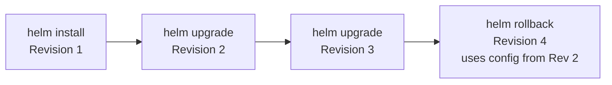
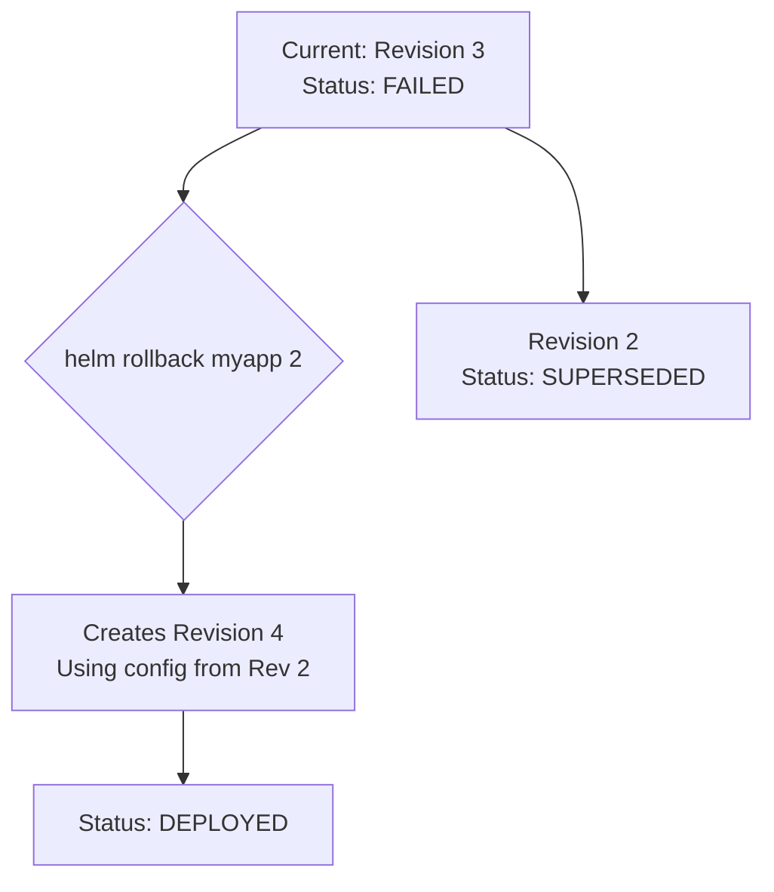
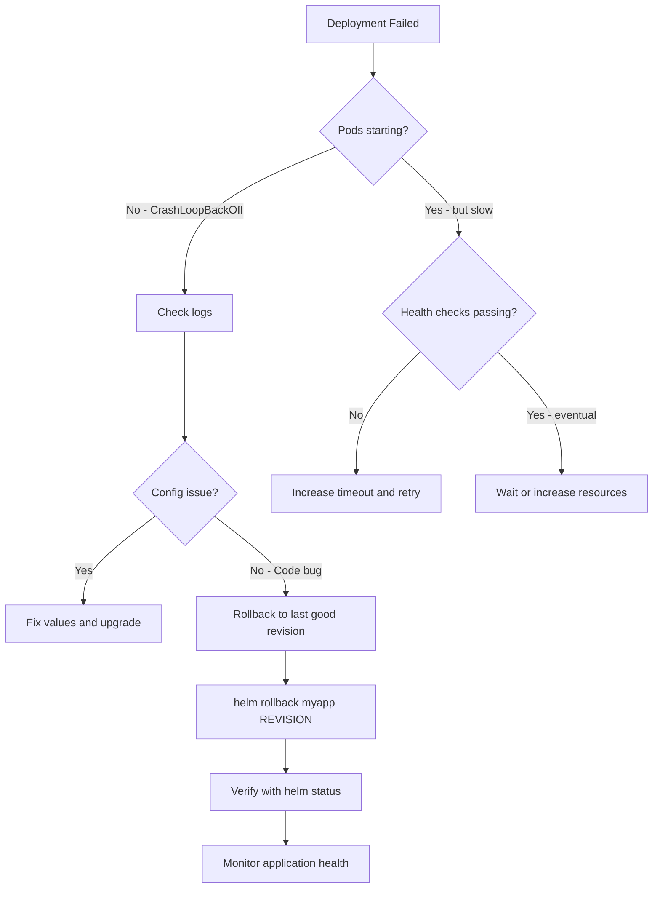

# How to Roll Back and Manage Helm Release History

Author: [nawazdhandala](https://www.github.com/nawazdhandala)

Tags: Helm, Rollback, Release History, Version Control, Kubernetes

Description: Learn how to view release history, roll back failed deployments, and manage Helm release versions effectively.

---

Deployments fail. Images have bugs, configurations have typos, and migrations break schemas. When things go wrong, you need a fast and reliable way to revert to a known-good state. Helm's built-in rollback and history features make this possible with a single command.

This guide covers how to use Helm's release management to inspect, compare, and roll back deployments.

## How Helm Stores Release History

Every time you install or upgrade a release, Helm creates a new revision and stores it as a Kubernetes Secret in the release namespace.



```bash
# Helm stores release data as Kubernetes secrets
kubectl get secrets -l owner=helm
# Output:
# sh.helm.release.v1.myapp.v1   helm.sh/release.v1   1   10d
# sh.helm.release.v1.myapp.v2   helm.sh/release.v1   1   5d
# sh.helm.release.v1.myapp.v3   helm.sh/release.v1   1   1d
```

## Viewing Release History

```bash
# View the full history of a release
helm history myapp

# Output:
# REVISION  UPDATED                   STATUS      CHART         APP VERSION  DESCRIPTION
# 1         Mon Feb 10 09:00:00 2026  superseded  myapp-1.0.0   1.0.0       Install complete
# 2         Wed Feb 12 14:30:00 2026  superseded  myapp-1.1.0   1.1.0       Upgrade complete
# 3         Fri Feb 14 11:00:00 2026  deployed    myapp-1.2.0   1.2.0       Upgrade complete

# View history in JSON format for scripting
helm history myapp -o json

# Limit the number of revisions shown
helm history myapp --max 5
```

## Inspecting a Specific Revision

```bash
# Get the values used in a specific revision
helm get values myapp --revision 2

# Get all computed values (including defaults)
helm get values myapp --revision 2 --all

# Get the rendered manifests of a specific revision
helm get manifest myapp --revision 2

# Get the release notes for a specific revision
helm get notes myapp --revision 2

# Get everything about a revision
helm get all myapp --revision 2
```

## Comparing Revisions

Use `helm get` with `diff` to compare what changed between revisions:

```bash
# Compare values between two revisions
diff <(helm get values myapp --revision 2 --all) \
     <(helm get values myapp --revision 3 --all)

# Compare rendered manifests between two revisions
diff <(helm get manifest myapp --revision 2) \
     <(helm get manifest myapp --revision 3)
```

For a better experience, install the `helm-diff` plugin:

```bash
# Install the diff plugin
helm plugin install https://github.com/databus23/helm-diff

# Compare two revisions visually
helm diff revision myapp 2 3

# Preview what an upgrade would change
helm diff upgrade myapp ./myapp -f new-values.yaml
```

## Performing a Rollback



```bash
# Roll back to a specific revision
helm rollback myapp 2

# Roll back to the previous revision
helm rollback myapp

# Roll back with a timeout
helm rollback myapp 2 --timeout 5m

# Roll back and wait for pods to be ready
helm rollback myapp 2 --wait

# Dry run to see what would happen
helm rollback myapp 2 --dry-run
```

After rolling back, check the history:

```bash
helm history myapp

# Output:
# REVISION  UPDATED                   STATUS      CHART         APP VERSION  DESCRIPTION
# 1         Mon Feb 10 09:00:00 2026  superseded  myapp-1.0.0   1.0.0       Install complete
# 2         Wed Feb 12 14:30:00 2026  superseded  myapp-1.1.0   1.1.0       Upgrade complete
# 3         Fri Feb 14 11:00:00 2026  superseded  myapp-1.2.0   1.2.0       Upgrade complete
# 4         Fri Feb 14 11:30:00 2026  deployed    myapp-1.1.0   1.1.0       Rollback to 2
```

Notice that rollback creates a new revision (4) rather than removing revision 3.

## Automatic Rollback on Failure

Use the `--atomic` flag to automatically roll back if an upgrade fails:

```bash
# Atomic upgrade: automatically rolls back on failure
helm upgrade myapp ./myapp \
  --atomic \
  --timeout 5m \
  -f production-values.yaml

# This is equivalent to:
# 1. helm upgrade myapp ./myapp
# 2. Wait for pods to be ready
# 3. If timeout or failure, helm rollback myapp
```

```bash
# The --wait flag makes Helm wait for readiness
# but does not automatically roll back
helm upgrade myapp ./myapp \
  --wait \
  --timeout 5m

# Combine --install for first-time deployments
helm upgrade --install myapp ./myapp \
  --atomic \
  --timeout 5m
```

## Managing History Size

By default, Helm keeps 10 revisions. Too many revisions waste cluster storage. Too few make rollbacks impossible.

```bash
# Set maximum history during upgrade
helm upgrade myapp ./myapp --history-max 5

# Check current revision count
helm history myapp | wc -l
```

```yaml
# Set history-max in a CI/CD pipeline
# .gitlab-ci.yml
deploy:
  script:
    - helm upgrade --install myapp ./myapp
        --atomic
        --timeout 5m
        --history-max 10
        -f values-production.yaml
```

## Rollback Strategy Decision Tree



## CI/CD Integration

A robust deployment script with automatic rollback:

```bash
#!/bin/bash
# deploy.sh - Production deployment with rollback safety

set -euo pipefail

# Configuration
RELEASE_NAME="myapp"
CHART_PATH="./myapp"
NAMESPACE="production"
TIMEOUT="5m"
VALUES_FILE="values-production.yaml"

# Record the current revision before upgrading
CURRENT_REVISION=$(helm history "$RELEASE_NAME" \
  -n "$NAMESPACE" \
  -o json | jq -r '.[-1].revision')

echo "Current revision: $CURRENT_REVISION"
echo "Starting upgrade..."

# Attempt the upgrade with atomic rollback
if helm upgrade --install "$RELEASE_NAME" "$CHART_PATH" \
  -n "$NAMESPACE" \
  --atomic \
  --timeout "$TIMEOUT" \
  --history-max 10 \
  -f "$VALUES_FILE" \
  --set image.tag="$IMAGE_TAG"; then

  echo "Upgrade successful"
  helm status "$RELEASE_NAME" -n "$NAMESPACE"
else
  echo "Upgrade failed, atomic flag handled rollback"
  echo "Current status:"
  helm status "$RELEASE_NAME" -n "$NAMESPACE"
  exit 1
fi

# Run post-deployment tests
echo "Running Helm tests..."
if helm test "$RELEASE_NAME" -n "$NAMESPACE" --timeout 2m; then
  echo "All tests passed"
else
  echo "Tests failed, rolling back to revision $CURRENT_REVISION"
  helm rollback "$RELEASE_NAME" "$CURRENT_REVISION" -n "$NAMESPACE" --wait
  exit 1
fi
```

## Troubleshooting Failed Rollbacks

```bash
# If rollback itself fails, check the release status
helm status myapp

# Check pod status for the release
kubectl get pods -l app.kubernetes.io/instance=myapp

# Check events for error details
kubectl get events --sort-by='.lastTimestamp' | tail -20

# Force replace resources if stuck
helm upgrade myapp ./myapp --force

# As a last resort, delete and reinstall
helm uninstall myapp
helm install myapp ./myapp -f values-production.yaml
```

## Best Practices

1. **Always use --atomic in production** to get automatic rollback on failure
2. **Set --timeout appropriately** based on your application's startup time
3. **Keep 5-10 revisions** of history for rollback capability
4. **Run helm test after deployment** to catch issues early
5. **Record revision numbers** in your CI/CD logs for auditability
6. **Use helm diff** before upgrading to preview changes

## Conclusion

Helm's release history and rollback features give you a safety net for every deployment. Combined with atomic upgrades, automated tests, and CI/CD integration, you can deploy with confidence knowing that any failure will be quickly reverted.

For comprehensive monitoring of your Helm deployments, [OneUptime](https://oneuptime.com) provides real-time alerts, uptime monitoring, and incident management so you know immediately when a deployment impacts your users.
