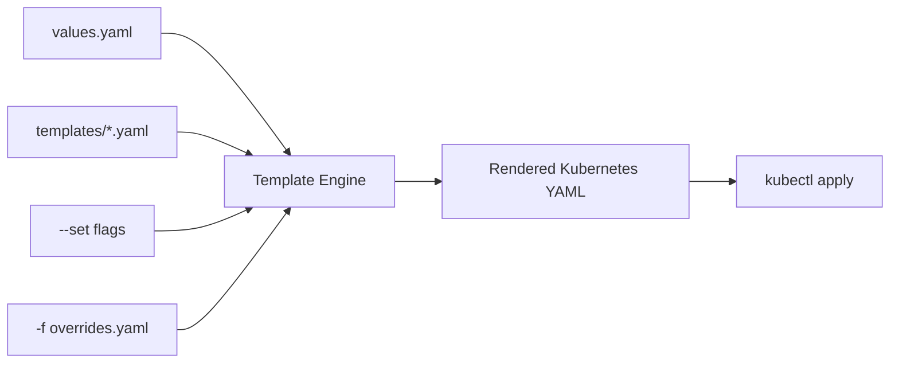
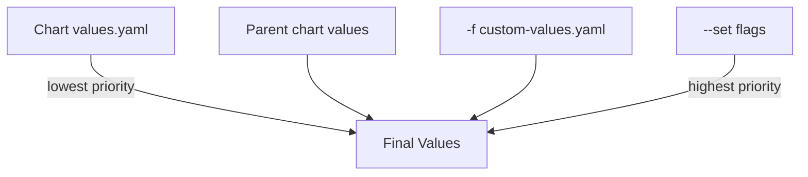
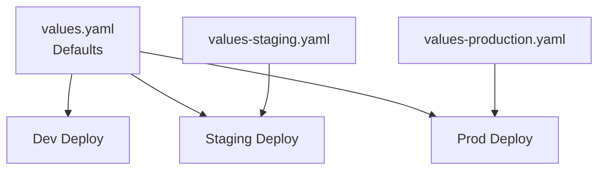

# How to Use Helm Values and Go Templating Effectively

Author: [nawazdhandala](https://www.github.com/nawazdhandala)

Tags: Helm, Templating, Go Templates, Values, Configuration

Description: Learn advanced Helm templating techniques including conditionals, loops, helper functions, and values file management.

---

Helm templates use Go's text/template engine with extra functions from the Sprig library. Mastering these templating features lets you write flexible, reusable charts that adapt to any environment.

This guide covers the most important Helm templating patterns you will use every day.

## How Helm Templating Works



When you run `helm install`, the template engine merges your values with the templates to produce valid Kubernetes manifests.

## Values Hierarchy and Merging

Helm merges values from multiple sources. Later sources override earlier ones:



```bash
# Values priority from lowest to highest:
# 1. values.yaml in the chart
# 2. Parent chart's values.yaml
# 3. Values file passed with -f
# 4. Individual parameters with --set

# Example: combining multiple sources
helm install myapp ./myapp \
  -f base-values.yaml \
  -f production-values.yaml \
  --set image.tag="v2.5.0"
```

## Basic Value Access

Access values using the `.Values` object:

```yaml
# values.yaml
appName: my-service
replicaCount: 3

database:
  host: postgres.default.svc
  port: 5432
  name: mydb
```

```yaml
# templates/configmap.yaml
apiVersion: v1
kind: ConfigMap
metadata:
  # Simple value access
  name: {{ .Values.appName }}-config
data:
  # Nested value access using dot notation
  DB_HOST: {{ .Values.database.host }}
  DB_PORT: {{ .Values.database.port | quote }}
  DB_NAME: {{ .Values.database.name }}
```

## Conditionals with if/else

Control which resources get created based on values:

```yaml
# values.yaml
ingress:
  enabled: true
  className: nginx
  host: app.example.com
  tls:
    enabled: false
```

```yaml
# templates/ingress.yaml
# Only create this resource if ingress is enabled
{{- if .Values.ingress.enabled }}
apiVersion: networking.k8s.io/v1
kind: Ingress
metadata:
  name: {{ include "myapp.fullname" . }}
  annotations:
    {{- if eq .Values.ingress.className "nginx" }}
    # Nginx-specific annotations
    nginx.ingress.kubernetes.io/ssl-redirect: "true"
    nginx.ingress.kubernetes.io/proxy-body-size: "50m"
    {{- else if eq .Values.ingress.className "traefik" }}
    # Traefik-specific annotations
    traefik.ingress.kubernetes.io/router.tls: "true"
    {{- end }}
spec:
  ingressClassName: {{ .Values.ingress.className }}
  rules:
    - host: {{ .Values.ingress.host }}
      http:
        paths:
          - path: /
            pathType: Prefix
            backend:
              service:
                name: {{ include "myapp.fullname" . }}
                port:
                  number: 80
  {{- if .Values.ingress.tls.enabled }}
  tls:
    - hosts:
        - {{ .Values.ingress.host }}
      secretName: {{ include "myapp.fullname" . }}-tls
  {{- end }}
{{- end }}
```

## Loops with range

Iterate over lists and maps:

```yaml
# values.yaml
env:
  - name: LOG_LEVEL
    value: info
  - name: PORT
    value: "8080"
  - name: NODE_ENV
    value: production

# Map-style environment variables
envMap:
  API_KEY: secret-key-123
  CACHE_TTL: "300"
  FEATURE_FLAG: "true"

# Multiple ports
ports:
  - name: http
    containerPort: 8080
  - name: metrics
    containerPort: 9090
  - name: health
    containerPort: 8081
```

```yaml
# templates/deployment.yaml (partial)
containers:
  - name: {{ .Chart.Name }}
    image: "{{ .Values.image.repository }}:{{ .Values.image.tag }}"
    ports:
      # Loop over the ports list
      {{- range .Values.ports }}
      - name: {{ .name }}
        containerPort: {{ .containerPort }}
        protocol: TCP
      {{- end }}
    env:
      # Loop over list-style env vars
      {{- range .Values.env }}
      - name: {{ .name }}
        value: {{ .value | quote }}
      {{- end }}
      # Loop over map-style env vars
      {{- range $key, $value := .Values.envMap }}
      - name: {{ $key }}
        value: {{ $value | quote }}
      {{- end }}
```

## Template Functions and Pipelines

Helm includes the Sprig function library with over 70 useful functions:

```yaml
# String functions
metadata:
  name: {{ .Values.appName | lower | trunc 63 | trimSuffix "-" }}
  labels:
    # Quote values that might be interpreted as numbers
    version: {{ .Values.image.tag | quote }}
    # Default values for optional fields
    team: {{ .Values.team | default "platform" }}

# Indentation control with nindent and indent
spec:
  template:
    metadata:
      annotations:
        # nindent adds a newline then indents
        {{- toYaml .Values.podAnnotations | nindent 8 }}

# Type conversion
data:
  # Convert to JSON string
  config.json: {{ .Values.config | toJson | quote }}
  # Convert to YAML string
  config.yaml: |
    {{- toYaml .Values.config | nindent 4 }}
```

## Named Templates with define and include

Create reusable template snippets:

```yaml
# templates/_helpers.tpl

# Generate consistent resource names
{{- define "myapp.fullname" -}}
{{- if .Values.fullnameOverride }}
{{- .Values.fullnameOverride | trunc 63 | trimSuffix "-" }}
{{- else }}
{{- $name := default .Chart.Name .Values.nameOverride }}
{{- printf "%s-%s" .Release.Name $name | trunc 63 | trimSuffix "-" }}
{{- end }}
{{- end }}

# Standard Kubernetes labels
{{- define "myapp.labels" -}}
helm.sh/chart: {{ .Chart.Name }}-{{ .Chart.Version | replace "+" "_" }}
app.kubernetes.io/name: {{ .Chart.Name }}
app.kubernetes.io/instance: {{ .Release.Name }}
app.kubernetes.io/version: {{ .Chart.AppVersion | quote }}
app.kubernetes.io/managed-by: {{ .Release.Service }}
{{- end }}

# Pod security context template
{{- define "myapp.securityContext" -}}
runAsNonRoot: true
runAsUser: 1000
fsGroup: 2000
seccompProfile:
  type: RuntimeDefault
{{- end }}
```

```yaml
# templates/deployment.yaml - Using named templates
apiVersion: apps/v1
kind: Deployment
metadata:
  name: {{ include "myapp.fullname" . }}
  labels:
    {{- include "myapp.labels" . | nindent 4 }}
spec:
  template:
    spec:
      securityContext:
        {{- include "myapp.securityContext" . | nindent 8 }}
```

## Working with with Blocks

Change the scope of the dot (`.`) to reduce repetition:

```yaml
# Without "with" - lots of repetition
env:
  - name: DB_HOST
    value: {{ .Values.database.host }}
  - name: DB_PORT
    value: {{ .Values.database.port | quote }}
  - name: DB_NAME
    value: {{ .Values.database.name }}

# With "with" - cleaner and shorter
{{- with .Values.database }}
env:
  - name: DB_HOST
    value: {{ .host }}
  - name: DB_PORT
    value: {{ .port | quote }}
  - name: DB_NAME
    value: {{ .name }}
  - name: DB_CONNECTION
    # Access parent scope with $
    value: "postgresql://{{ .host }}:{{ .port }}/{{ .name }}?app={{ $.Values.appName }}"
{{- end }}
```

## Whitespace Control

The `-` in `{{-` and `-}}` trims whitespace:

```yaml
# Without whitespace control (extra blank lines)
metadata:
  annotations:
    {{ if .Values.monitoring.enabled }}
    prometheus.io/scrape: "true"
    {{ end }}

# With whitespace control (clean output)
metadata:
  annotations:
    {{- if .Values.monitoring.enabled }}
    prometheus.io/scrape: "true"
    prometheus.io/port: {{ .Values.monitoring.port | quote }}
    {{- end }}
```

## Multi-Environment Values Strategy



```bash
# Deploy to different environments
helm install myapp ./myapp -f values-staging.yaml
helm install myapp ./myapp -f values-production.yaml

# Use multiple value files for layered config
helm install myapp ./myapp \
  -f values-base.yaml \
  -f values-production.yaml \
  -f values-secrets.yaml
```

## Debugging Templates

```bash
# Render templates without installing
helm template my-release ./myapp

# Render a specific template
helm template my-release ./myapp -s templates/deployment.yaml

# Debug mode shows computed values
helm install my-release ./myapp --dry-run --debug

# Lint for common errors
helm lint ./myapp
helm lint ./myapp -f values-production.yaml
```

## Conclusion

Helm templating gives you the power to write charts that adapt to any environment without duplicating YAML files. Start with simple value substitution, then gradually adopt conditionals, loops, and named templates as your charts grow in complexity.

If you deploy Helm-managed applications and need observability into their health and performance, [OneUptime](https://oneuptime.com) offers monitoring, alerting, and incident management that integrates seamlessly with Kubernetes workloads.
